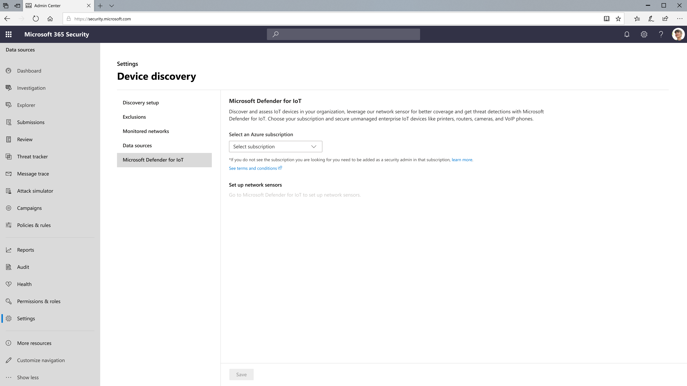

# Microsoft Defender for IoT 統合を有効にする

[!INCLUDE [Microsoft 365 Defender rebranding](../../includes/microsoft-defender.md)]

**適用対象:**

- [Microsoft Defender for Endpoint](https://go.microsoft.com/fwlink/?linkid=2154037)
- [Microsoft 365 Defender](https://go.microsoft.com/fwlink/?linkid=2118804)

[!include[Prerelease information](../../includes/prerelease.md)]

> Microsoft Defender ATP を試してみたいですか? [無料試用版にサインアップしてください。](https://signup.microsoft.com/create-account/signup?products=7f379fee-c4f9-4278-b0a1-e4c8c2fcdf7e&ru=https://aka.ms/MDEp2OpenTrial?ocid=docs-wdatp-enablesiem-abovefoldlink)

Microsoft Defender for Endpoint は、Microsoft Defender for IoT と統合できます。 この統合により、Microsoft Defender for IoT が提供するエージェントレス監視機能を使用して、デバイスの検出機能が拡張されます。 これにより、音声インターネット プロトコル (VoIP) デバイス、プリンター、カメラなどの IT ネットワークに接続されているエンタープライズ IoT デバイスをセキュリティで保護できます。 これにより、組織は、すべての IoT および運用テクノロジ (OT) インフラストラクチャをセキュリティで保護する単一の統合ソリューションを利用できます。 詳細については [、「Microsoft Defender for IoT」を参照してください](/azure/defender-for-iot/organizations/overview)。

この統合が有効になると、Microsoft Defender for Endpoint は可視性を高め、ネットワーク内の IoT デバイスを見つけ、特定し、セキュリティ保護できます。 Microsoft Defender for IoT または Microsoft Defender for Endpoint によって検出された IoT デバイスは、両方のポータル間で自動的に同期されます。 これにより、他の IT デバイス (ワークステーション、サーバー、モバイル) と共に、完全な OT/IoT インベントリの単一の統合ビューが提供されます。

Microsoft Defender for IoT には、追加のデータ ソースを提供する展開可能なネットワーク センサーも含まれています。 統合の一環としてネットワーク センサーをセットアップすると、IoT デバイスと OT デバイス、特に Microsoft Defender for Endpoint センサーが存在しないネットワーク セグメント、および従業員がリモートで情報にアクセスしている場合に、最も完全なビューを提供します。

## 前提条件

Microsoft Defender for IoT を有効にするには、ユーザーに次の役割が必要です。

- テナント グローバル管理者 (Azure Active Directory
- Microsoft Defender for IoT 統合に使用される Azure サブスクリプションのセキュリティ管理者

## Microsoft Defender for IoT 統合の有効化

1. ポータルのナビゲーション ウィンドウで、[デバイス検出設定 [https://security.microsoft.com](https://security.microsoft.com/)  \>  \> **Microsoft Defender for IoT] を選択します**。

    

2. **テナント内の利用可能な** サブスクリプションのドロップダウン リストから Azure サブスクリプションを選択し、[保存Azure Active Directory選択 **します**。

## ネットワーク センサーのセットアップ

Azure サブスクリプションを選択すると、ネットワーク センサーを追加できます。

ネットワーク センサーを追加するには、[ネットワーク センサーの **セットアップ** ] で **[Microsoft Defender for IoT] リンクを選択** します。 これにより、Azure portal のオンボード センサーセットアップ プロセスにアクセスできます。 詳細については、「Azure portal で Defender for IoT を使用してセンサーを [管理する」を参照してください](/azure/defender-for-iot/organizations/how-to-manage-sensors-on-the-cloud)。

## サブスクリプションの統合をオフにする

Azure サブスクリプションの統合は、ポータルの Microsoft Defender for IoT 設定ページからオフ [https://security.microsoft.com](https://security.microsoft.com/) にできます。 サブスクリプションをオフにした後、Microsoft Defender for Endpoint デバイス インベントリに Microsoft Defender for IoT によって検出された IoT デバイスが表示されなくなりました。

## 関連項目

- [デバイス検出の概要](configure-device-discovery.md)
- [デバイス検出に関する FAQ](device-discovery-faq.md)
