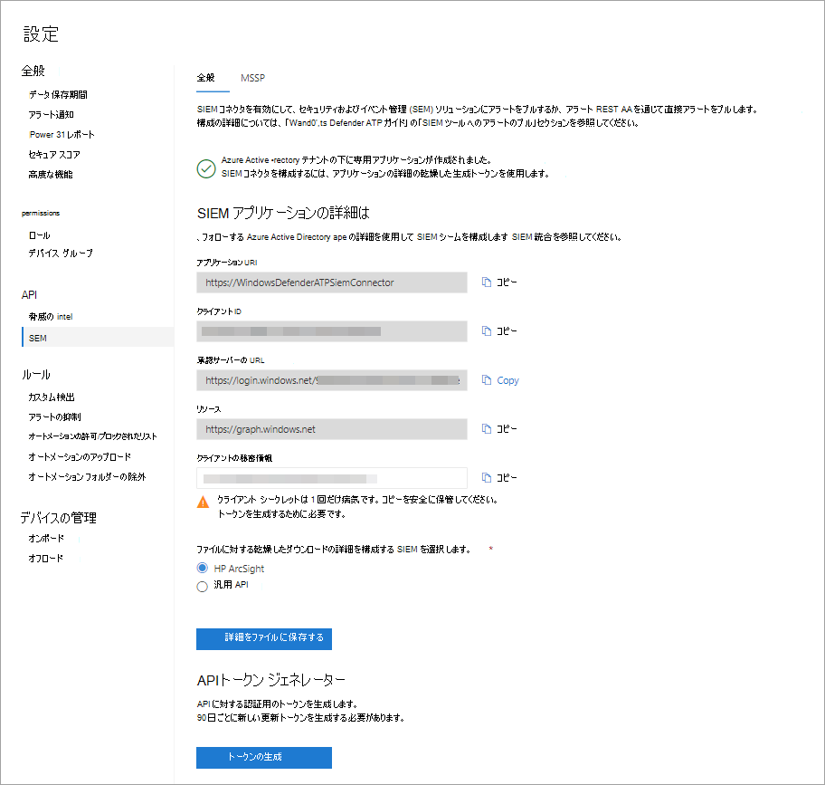

# エンドポイント向け Microsoft Defender で SIEM 統合を有効にする

[!INCLUDE [Microsoft 365 Defender rebranding](../../includes/microsoft-defender.md)]

**適用対象:**
- [Microsoft Defender for Endpoint](https://go.microsoft.com/fwlink/?linkid=2154037)

> Microsoft Defender ATP を試してみたいですか? [無料試用版にサインアップしてください。](https://signup.microsoft.com/create-account/signup?products=7f379fee-c4f9-4278-b0a1-e4c8c2fcdf7e&ru=https://aka.ms/MDEp2OpenTrial?ocid=docs-wdatp-enablesiem-abovefoldlink)

セキュリティ情報とイベント管理 (SIEM) の統合を有効にして、セキュリティ情報から検出を取得Microsoft 365 Defender。 SIEM ソリューションを使用するか、検出 REST API に直接接続して検出をプルします。

> [!NOTE]
>
> - [Microsoft Defender for Endpoint Alert は](alerts.md) 、1 つ以上の検出から構成されます。
> - [Microsoft Defender for Endpoint Detection は](api-portal-mapping.md) 、デバイスで発生した疑わしいイベントとその関連するアラートの詳細から構成されます。
> - Microsoft Defender for Endpoint Alert API は、アラートの使用に関する最新の API であり、各アラートに関連する証拠の詳細な一覧を含む。 詳細については、「Alert メソッドと[プロパティ」および「List alerts」](alerts.md)[を参照してください](get-alerts.md)。

## 前提条件

- この設定をアクティブ化するユーザーには、アプリを作成するためのアクセス許可が必要です(AAD Azure Active Directory)。 これは、次の役割を持つユーザーです。

  - セキュリティ管理者とグローバル管理者
  - クラウド アプリケーション管理者
  - アプリケーション管理者
  - サービス プリンシパルの所有者

- 最初のライセンス認証中に、資格情報を入力するためのポップアップ画面が表示されます。 このサイトのポップアップを許可してください。

## SIEM 統合の有効化

1. ナビゲーション ウィンドウで、[エンドポイント **API** SIEM \>  \> **設定] を** \> **選択します**。

   :::image type="content" source="../../media/enable-siemnew.png" alt-text="[SIEM 統合] メニュー 1 からの設定イメージ。":::

   > [!TIP]
   > SIEM コネクタ アプリケーションを有効にしようとするときにエラーが発生した場合は、ブラウザーのポップアップ ブロッカー設定を確認してください。 機能を有効にするときに開いている新しいウィンドウがブロックされている可能性があります。

2. [SIEM **統合を有効にする] を選択します**。 これにより、値が事前に入力された **SIEM** コネクタ アクセスの詳細セクションがアクティブ化され、アプリケーションが Azure Active Directory (Azure AD) テナントの下に作成されます。

    > [!WARNING]
    > クライアント シークレットは 1 回だけ表示されます。 コピーを安全な場所に保管してください。

    

3. 組織で使用する SIEM の種類を選択します。

   > [!NOTE]
   > [HP ArcSight] を選択した場合は、次の 2 つの構成ファイルを保存する必要があります。
   >
   > - WDATP-connector.jsonparser.properties
   > - WDATP-connector.properties

   プログラムによるアクセスを使用して検出 REST API に直接接続する場合は、[汎用 **API] を選択します**。

4. 個々の値をコピーするか、[詳細をファイル **に保存** ] を選択して、すべての値を含むファイルをダウンロードします。

5. [トークン **の生成] を** 選択して、アクセス トークンと更新トークンを取得します。

   > [!NOTE]
   > 90 日ごとに新しい更新トークンを生成する必要があります。

6. [Microsoft Defender for Endpoint](/microsoft-365/security/defender-endpoint/exposed-apis-create-app-webapp)の Azure ADアプリ登録を作成する手順に従い、適切なアクセス許可を割り当て、アラートを読み取ってください。

これで、SIEM ソリューションの構成またはプログラムによるアクセスを通じて検出 REST API への接続を続行できます。 SIEM ソリューションを構成するときにトークンを使用して、ユーザーからの検出を受信Microsoft 365 Defender。

## Microsoft Defender for Endpoint と IBM QRadar の統合

Microsoft Defender for Endpoint から検出を収集するために IBM QRadar を構成できます。 詳細については [、「IBM Knowledge Center」を参照してください](https://www.ibm.com/support/knowledgecenter/SS42VS_DSM/c_dsm_guide_MS_Win_Defender_ATP_overview.html?cp=SS42VS_7.3.1)。

## 関連項目

- [エンドポイント検出用の Microsoft Defender をプルする HP ArcSight の構成](configure-arcsight.md)
- [Microsoft Defender for Endpoint Detection フィールド](api-portal-mapping.md)
- [REST API を使用したエンドポイント検出用の Microsoft Defender のプル](pull-alerts-using-rest-api.md)
- [SIEM ツール統合に関する問題のトラブルシューティング](troubleshoot-siem.md)
