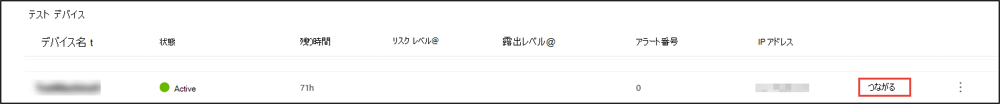
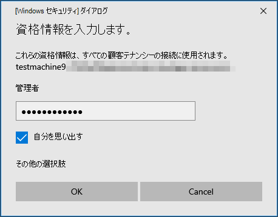

# シミュレートされた攻撃を通じて Microsoft Defender for Endpoint (MDE) を体験する

>[!TIP]
>
>- Microsoft Defender for Endpoint の最新機能拡張: Defender for Endpoint の [新機能について説明します](https://cloudblogs.microsoft.com/microsoftsecure/2018/11/15/whats-new-in-windows-defender-atp/)。
>- Defender for Endpoint は、最近の MITRE 評価で業界をリードする光学機能と検出機能を実証しました。 詳細については、「[MITRE ATT&CK ベース評価の分析](https://cloudblogs.microsoft.com/microsoftsecure/2018/12/03/insights-from-the-mitre-attack-based-evaluation-of-windows-defender-atp/)」を参照してください。

サービスに複数のデバイスをオンボードする前に、Defender for Endpoint を体験する必要がある場合があります。 これを行うには、いくつかのテスト デバイスで制御攻撃シミュレーションを実行できます。 シミュレートされた攻撃を実行した後、Defender for Endpoint が悪意のあるアクティビティを表面化する方法を確認し、効率的な対応を可能にする方法を確認できます。

## はじめに

提供されているシミュレーションのいずれかを実行するには、オンボードデバイスが少なくとも [1 つ必要です](onboard-configure.md)。

各攻撃シナリオで提供されるチュートリアル ドキュメントを読み取る。 各ドキュメントには、OS とアプリケーションの要件、および攻撃シナリオに固有の詳細な手順が含まれています。

## シミュレーションの実行

1. [**ヘルプ**  >  **シミュレーション] &で**、シミュレートする利用可能な攻撃シナリオを選択します。

   - **シナリオ 1: ドキュメントドロップバックドア** - ソーシャルエンジニアリングされたルアー ドキュメントの配信をシミュレートします。 このドキュメントは、攻撃者に制御を与える特別に細工されたバックドアを起動します。

   - **シナリオ 2: ファイル** レス攻撃の PowerShell スクリプト - PowerShell に依存するファイルレス攻撃をシミュレートし、攻撃表面の縮小と悪意のあるメモリ アクティビティのデバイス学習検出を示します。

   - **シナリオ 3: インシデント** 対応の自動化 - 自動調査がトリガーされ、侵害アーティファクトを自動的にハントして修復してインシデント対応の容量を拡張します。

2. 選択したシナリオで提供される対応するチュートリアル ドキュメントをダウンロードして読み取る。

3. シミュレーション ファイルをダウンロードするか、チュートリアルのヘルプ シミュレーションに移動してシミュレーション  >  **スクリプト&します**。 テスト デバイスでファイルまたはスクリプトをダウンロードすることもできますが、必須ではありません。

4. チュートリアル ドキュメントの指示に従って、テスト デバイスでシミュレーション ファイルまたはスクリプトを実行します。

> [!NOTE]
> シミュレーション ファイルまたはスクリプトは攻撃アクティビティを模倣しますが、実際には良性であり、テスト デバイスに害を及ぼしたり、危険にさらしたりしません。
>

## 代替トピック テキスト

## 攻撃シナリオのシミュレーション

テスト デバイスを使用して、テスト デバイスに接続して独自の攻撃シミュレーションを実行します。

攻撃シナリオは、次の方法でシミュレートできます。

- ["Do It Yourself" 攻撃のシナリオ](https://securitycenter.windows.com/tutorials)
- 脅威シミュレーター

高度な検索を使用[してデータ](advanced-hunting-overview.md)をクエリし、脅威分析を使用して、新たな脅威に関するレポートを表示することもできます。

### Do-it-yourself 攻撃のシナリオ

事前に作成されたシミュレーションを探している場合は、"Do It [Yourself" 攻撃シナリオを使用できます](https://securitycenter.windows.com/tutorials)。 これらのスクリプトは安全で文書化され、使いやすいです。 これらのシナリオは、Defender for Endpoint の機能を反映し、調査のエクスペリエンスについて説明します。

>[!NOTE]
>テスト デバイスへの接続は RDP を使用して行われます。 ファイアウォールの設定で RDP 接続が許可されている必要があります。

1. Connectを選択して、デバイスにアクセスし、攻撃シミュレーション **をConnect。**

    

2. RDP ファイルを保存し、[開く] を選択して **起動Connect。**

    

    >[!NOTE]
    >初期セットアップ中にパスワードのコピーを保存しない場合は、メニューから [パスワードのリセット] を選択してパスワードをリセットできます。パスワードのリセットの 
    >
    > デバイスは状態を "パスワードリセットの実行" に変更し、数分で新しいパスワードが表示されます。

3. デバイスの作成手順中に表示されたパスワードを入力します。

   

4. デバイスで Do-it-yourself 攻撃シミュレーションを実行します。

### 脅威シミュレーターのシナリオ

ラボのセットアップ中にサポートされている脅威シミュレーターのインストールを選択した場合は、評価ラボ デバイスで組み込みのシミュレーションを実行できます。

サード パーティプラットフォームを使用して脅威シミュレーションを実行すると、ラボ環境の範囲内で Microsoft Defender for Endpoint の機能を評価できます。

>[!NOTE]
>
>シミュレーションを実行する前に、次の要件を満たしていることを確認してください。

>- 評価ラボにデバイスを追加する必要があります
>- 脅威シミュレーターは評価ラボにインストールする必要があります

1. ポータルで [シミュレーションの作成 **] を選択します**。

2. 脅威シミュレーターを選択します。

    

3. シミュレーションを選択するか、シミュレーション ギャラリーを参照して使用可能なシミュレーションを参照します。

    シミュレーション ギャラリーは、次の場所から取得できます。
    - シミュレーションの概要タイルの主 **な** 評価ダッシュボードまたは
    - ナビゲーション ウィンドウの [評価] と **[チュートリアル]** から [シミュレーション] &をクリックし、[シミュレーション  >  カタログ]**を選択します**。

4. シミュレーションを実行するデバイスを選択します。

5. [シミュレーション **の作成] を選択します**。

6. [シミュレーション] タブを選択して、シミュレーションの進行状況 **を表示** します。シミュレーションの状態、アクティブなアラート、その他の詳細を表示します。

    ![[シミュレーション] タブのイメージ。](images/simulations-tab.png)
 

シミュレーションを実行した後、ラボの進行状況バーを表示し **、Microsoft Defender for Endpoint** を調べ、自動調査と修復をトリガーしてください。 機能によって収集および分析された証拠を確認します。

豊富なクエリ言語と生の利用統計情報を使用して高度な検索を通じて攻撃証拠を探し、Threat analytics に記載されている世界全体の脅威を確認します。
