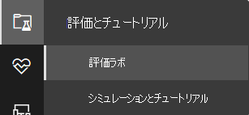
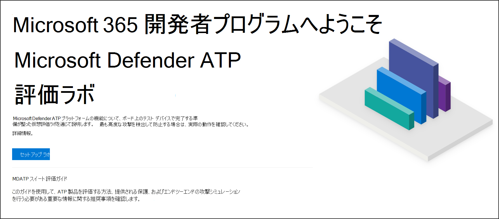
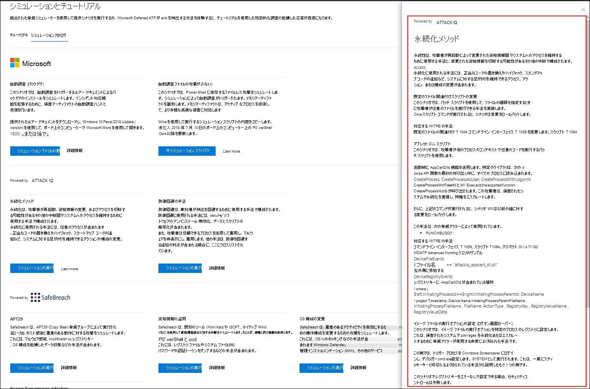
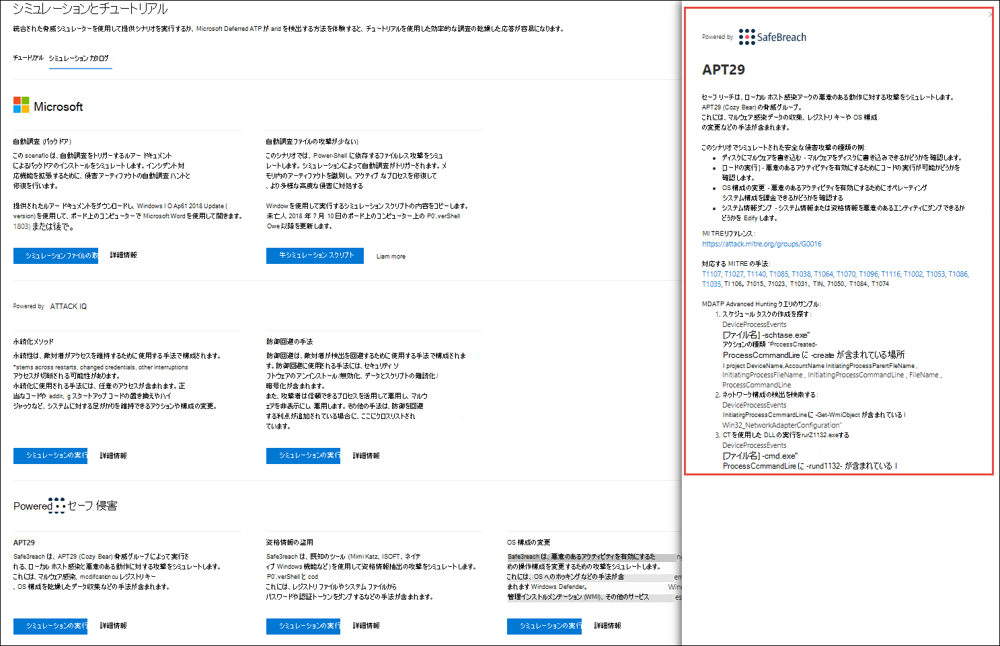
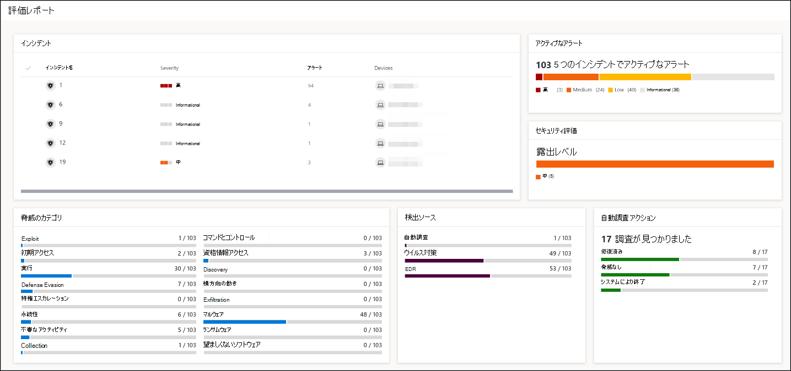
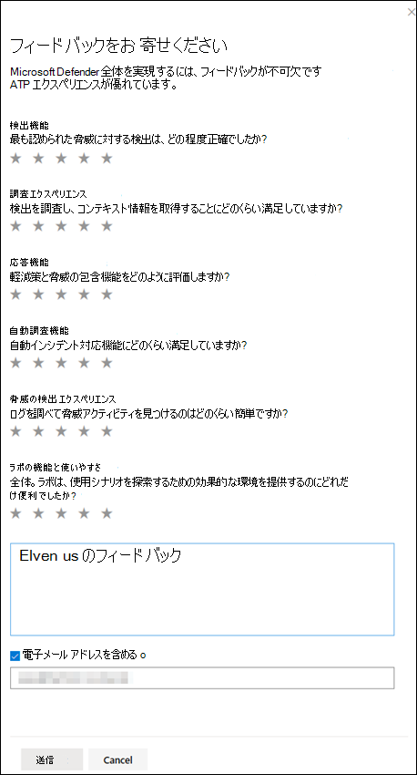

# Microsoft Defender for Endpoint 評価ラボ

[!INCLUDE [Microsoft 365 Defender rebranding](../../includes/microsoft-defender.md)]

**適用対象:**
- [Microsoft Defender for Endpoint](https://go.microsoft.com/fwlink/?linkid=2154037)
- [Microsoft 365 Defender](https://go.microsoft.com/fwlink/?linkid=2118804)

>Microsoft Defender ATP を試してみたいですか? [無料試用版にサインアップしてください。](https://www.microsoft.com/microsoft-365/windows/microsoft-defender-atp?ocid=docs-wdatp-enablesiem-abovefoldlink)

包括的なセキュリティ製品評価を行う場合、エンドツーエンドの攻撃シミュレーションを実際に実行する前に、複雑な環境とデバイス構成が必要になる複雑なプロセスになる可能性があります。 複雑さを加えるのは、シミュレーション アクティビティ、アラート、および結果が評価中に反映される場所を追跡する際の課題です。

Microsoft Defender for Endpoint 評価ラボは、プラットフォームの機能の評価、シミュレーションの実行、予防、検出、修復機能の実行に集中できるよう、デバイスと環境構成の複雑さを排除するように設計されています。

> [!VIDEO https://www.microsoft.com/en-us/videoplayer/embed/RE4qLUM]

セットアップの簡略化により、独自のテスト シナリオと事前に作成されたシミュレーションの実行に集中して、Defender for Endpoint のパフォーマンスを確認できます。 

自動調査、高度な狩猟、脅威分析など、プラットフォームの強力な機能に完全にアクセスでき、Defender for Endpoint が提供する包括的な保護スタックをテストできます。 

最新の OS バージョンと適切なセキュリティ コンポーネント、および Office 2019 Standard をインストールするように事前構成された Windows 10 または Windows Server 2019 デバイスを追加できます。

また、脅威シミュレーターをインストールできます。 Defender for Endpoint は、業界をリードする脅威シミュレーション プラットフォームと提携し、ポータルから出ることなく Defender for Endpoint の機能をテストするのに役立ちます。

 お好みのシミュレーターをインストールし、評価ラボ内でシナリオを実行し、プラットフォームのパフォーマンスを即座に確認できます。 また、さまざまなシミュレーションにアクセスして、シミュレーション カタログから実行できます。
    

## 開始する前に
評価ラボにアクセスするには、ライセンス要件を満たすか、Microsoft Defender for Endpoint への試用版アクセス権が必要です。

次のセキュリティ設定 **の管理権限** が必要です。
- ラボを作成する
- デバイスの作成
- パスワードのリセット
- シミュレーションの作成 
 
役割ベースのアクセス制御 (RBAC) を有効にし、少なくとも 1 つのコンピューター グループを作成した場合、ユーザーはすべてのコンピューター グループにアクセスできる必要があります。

詳細については、「役割の作成 [と管理」を参照してください](user-roles.md)。

Microsoft Defender ATP を試してみたいですか? [無料試用版にサインアップしてください。](https://www.microsoft.com/microsoft-365/windows/microsoft-defender-atp?ocid=docs-wdatp-main-abovefoldlink)

## ラボの使用を開始する
メニューからラボにアクセスできます。 ナビゲーション メニューで、[評価] と **[チュートリアル] を選択し、[>] を選択します**。

>[!NOTE]
>- 選択した環境構造の種類に応じて、デバイスはライセンス認証日から指定された時間数で利用できます。
>- 各環境は、制限された一連のテスト デバイスでプロビジョニングされます。 プロビジョニングされたデバイスを使いきった場合、新しいデバイスは提供されません。 削除されたデバイスでは、使用可能なテスト デバイスの数は更新されません。
>- リソースが使いきりになったときにラボを使用できなくなりました。 リセットも更新もされません。
>- リソースは慎重に使用してください。ラボ のリソースは制限されています。 リセットも更新もされません。 

ラボを既に持っていますか? 新しい脅威シミュレーターを有効にし、アクティブなデバイスを持っている必要があります。

## 評価ラボのセットアップ

1. ナビゲーション ウィンドウで、[評価とチュートリアル]**評価** ラボを  >  **選択** し、[セットアップ ラボ]**を選択します**。

    

2. 評価のニーズに応じて、より長い期間、またはより短い期間のデバイスが少ない環境をセットアップできます。 好みのラボ構成を選択し、[次へ] を **選択します**。

     

3. (省略可能)ラボに脅威シミュレーターをインストールできます。 

    

    >[!IMPORTANT]
    >最初に、条項と情報共有に関する声明に同意し、同意する必要があります。 

4. 使用する脅威シミュレーション エージェントを選択し、詳細を入力します。 また、後で脅威シミュレーターをインストールすることもできます。 ラボのセットアップ中に脅威シミュレーション エージェントをインストールする場合は、追加するデバイスに脅威シミュレーション エージェントを簡単にインストールできます。  
    
    

5.  概要を確認し、[セットアップ ラボ] **を選択します**。  

ラボのセットアップ プロセスが完了したら、デバイスを追加してシミュレーションを実行できます。 

## デバイスの追加
環境にデバイスを追加すると、Defender for Endpoint は接続の詳細を示す構成済みのデバイスをセットアップします。 Windows 10 または Windows Server 2019 デバイスを追加できます。

デバイスは、OS および Office 2019 Standard の最新バージョンと、Java、Python、SysIntenals などの他のアプリで構成されます。 

   >[!TIP]
   > ラボに追加のデバイスが必要ですか? サポート チケットを提出して、Defender for Endpoint チームが要求を確認します。 

ラボのセットアップ中に脅威シミュレーターの追加を選択した場合、すべてのデバイスに追加するデバイスに脅威シミュレーター エージェントがインストールされます。

デバイスは、推奨される Windows セキュリティ コンポーネントをオンにし、監査モードでテナントに自動的にオンボードされます。作業は不要です。 

次のセキュリティ コンポーネントは、テスト デバイスで事前に構成されています。

- [攻撃面の減少](https://docs.microsoft.com/windows/security/threat-protection/windows-defender-exploit-guard/attack-surface-reduction-exploit-guard)
- [一目でブロックする](https://docs.microsoft.com/windows/security/threat-protection/microsoft-defender-antivirus/configure-block-at-first-sight-microsoft-defender-antivirus)
- [制御されたフォルダー アクセス](https://docs.microsoft.com/windows/security/threat-protection/windows-defender-exploit-guard/controlled-folders-exploit-guard)
- [エクスプロイト保護](https://docs.microsoft.com/windows/security/threat-protection/windows-defender-exploit-guard/enable-exploit-protection)
- [ネットワーク保護](https://docs.microsoft.com/windows/security/threat-protection/windows-defender-exploit-guard/network-protection-exploit-guard)
- [望ましくない可能性のあるアプリケーションの検出](https://docs.microsoft.com/windows/security/threat-protection/microsoft-defender-antivirus/detect-block-potentially-unwanted-apps-microsoft-defender-antivirus)
- [クラウドによる保護](https://docs.microsoft.com/windows/security/threat-protection/microsoft-defender-antivirus/utilize-microsoft-cloud-protection-microsoft-defender-antivirus)
- [Microsoft Defender SmartScreen](https://docs.microsoft.com/windows/security/threat-protection/windows-defender-smartscreen/windows-defender-smartscreen-overview)

>[!NOTE]
> Microsoft Defender ウイルス対策はオンになります (監査モードではありません)。 Microsoft Defender Antivirus でシミュレーションの実行がブロックされている場合は、Windows セキュリティを使用してデバイスのリアルタイム保護を無効にできます。 詳細については、「Configure [always-on protection」を参照してください](https://docs.microsoft.com/windows/security/threat-protection/microsoft-defender-antivirus/configure-real-time-protection-microsoft-defender-antivirus)。

自動調査の設定は、テナントの設定に依存します。 既定では半自動で構成されます。 詳細については、「自動調査 [の概要」を参照してください](automated-investigations.md)。

>[!NOTE]
>テスト デバイスへの接続は RDP を使用して行われます。 ファイアウォールの設定で RDP 接続が許可されている必要があります。

1. ダッシュボードで、[デバイスの追加 **] を選択します**。 

2. 追加するデバイスの種類を選択します。 Windows 10 または Windows Server 2019 の追加を選択できます。

    

    >[!NOTE]
    >デバイスの作成プロセスで問題が発生した場合は、通知が送信され、新しい要求を送信する必要があります。 デバイスの作成に失敗した場合は、許可された全体的なクォータに対してカウントされません。 

3. 接続の詳細が表示されます。 [ **コピー] を** 選択して、デバイスのパスワードを保存します。

    >[!NOTE]
    >パスワードは 1 回だけ表示されます。 後で使用するために必ず保存してください。

    

4. デバイスのセットアップが開始されます。 これには、最大で約 30 分かかる場合があります。 

5. [デバイス] タブを選択して、テスト デバイスの状態、リスクと露出レベル、シミュレーターのインストールの状態 **を確認** します。 

    ![[デバイスのイメージ] タブ](images/machines-tab.png)
    

    >[!TIP]
    >[ **シミュレーターの状態]** 列で、情報アイコンにカーソルを合わせると、エージェントのインストール状態を確認できます。

## 攻撃シナリオのシミュレーション
テスト デバイスを使用して、テスト デバイスに接続して独自の攻撃シミュレーションを実行します。 

攻撃シナリオは、次の方法でシミュレートできます。
- ["Do It Yourself" 攻撃のシナリオ](https://securitycenter.windows.com/tutorials)
- 脅威シミュレーター

高度な検索を使用[してデータ](advanced-hunting-query-language.md)をクエリし、脅威分析を使用して、新たな脅威に関するレポートを表示することもできます。

### Do-it-yourself 攻撃のシナリオ
事前に作成されたシミュレーションを探している場合は、"Do It [Yourself" 攻撃シナリオを使用できます](https://securitycenter.windows.com/tutorials)。 これらのスクリプトは安全で文書化され、使いやすいです。 これらのシナリオは、Defender for Endpoint の機能を反映し、調査のエクスペリエンスについて説明します。

>[!NOTE]
>テスト デバイスへの接続は RDP を使用して行われます。 ファイアウォールの設定で RDP 接続が許可されている必要があります。

1. [接続] を選択して、デバイスに接続し、攻撃シミュレーションを **実行します**。 

    

2. RDP ファイルを保存し、[接続] を選択して起動 **します**。

    

    >[!NOTE]
    >初期セットアップ中に保存されたパスワードのコピーが存在しない場合は、メニューから [パスワードのリセット] を選択してパスワードをリセットできます。[パスワードのリセットの ![ イメージ]](images/reset-password-test-machine.png) 
    > デバイスは状態を "パスワードリセットの実行" に変更し、数分で新しいパスワードが表示されます。

3. デバイスの作成手順中に表示されたパスワードを入力します。 

   

4. デバイスで Do-it-yourself 攻撃シミュレーションを実行します。 

### 脅威シミュレーターのシナリオ
ラボのセットアップ中にサポートされている脅威シミュレーターのインストールを選択した場合は、評価ラボ デバイスで組み込みのシミュレーションを実行できます。 

サード パーティプラットフォームを使用して脅威シミュレーションを実行すると、ラボ環境の範囲内で Microsoft Defender for Endpoint の機能を評価できます。

>[!NOTE]
>シミュレーションを実行する前に、次の要件を満たしていることを確認してください。
>- 評価ラボにデバイスを追加する必要があります
>- 脅威シミュレーターは評価ラボにインストールする必要があります

1. ポータルで [シミュレーションの作成 **] を選択します**。

2. 脅威シミュレーターを選択します。

    

3. シミュレーションを選択するか、シミュレーション ギャラリーを参照して使用可能なシミュレーションを参照します。 

    シミュレーション ギャラリーは、次の場所から取得できます。
    - シミュレーションの概要タイルの主 **な** 評価ダッシュボードまたは
    - ナビゲーション ウィンドウの [評価] と **[チュートリアル]** から [シミュレーション] &をクリックし、[シミュレーション  >  カタログ]**を選択します**。

4. シミュレーションを実行するデバイスを選択します。

5. [シミュレーション **の作成] を選択します**。

6. [シミュレーション] タブを選択して、シミュレーションの進行状況 **を表示** します。シミュレーションの状態、アクティブなアラート、その他の詳細を表示します。 

    ![[シミュレーションのイメージ] タブ](images/simulations-tab.png)
    
シミュレーションを実行した後、ラボの進行状況バーを表示し **、Microsoft Defender for Endpoint** を調べ、自動調査と修復をトリガーしてください。 機能によって収集および分析された証拠を確認します。

豊富なクエリ言語と生の利用統計情報を使用して高度な検索を通じて攻撃証拠を探し、Threat analytics に記載されている世界全体の脅威を確認します。

## シミュレーション ギャラリー
Microsoft Defender for Endpoint は、さまざまな脅威シミュレーション プラットフォームと提携し、ポータル内からプラットフォームの機能を簡単にテストできます。 

メニューから [シミュレーションとチュートリアル]**シミュレーション** カタログに移動して、使用可能なすべての  >  **シミュレーション** を表示します。 

サポートされているサードパーティの脅威シミュレーション エージェントの一覧が一覧表示され、特定の種類のシミュレーションと詳細な説明がカタログに記載されています。 

カタログから任意の使用可能なシミュレーションを簡単に実行できます。  

各シミュレーションには、攻撃シナリオの詳細な説明と、使用する MITRE 攻撃手法や実行する高度な検索クエリのサンプルなどの参照が付属しています。

**例:** 
 

## 評価レポート
ラボ レポートは、デバイスで実施されたシミュレーションの結果を要約します。

一目でわかると、次の情報をすばやく確認できます。
- トリガーされたインシデント
- 生成されたアラート
- 露出レベルの評価 
- 検出された脅威カテゴリ
- 検出ソース
- 自動化された調査

## フィードバックの提供
フィードバックは、高度な攻撃から環境を保護する上で役立ちます。 製品の機能と評価結果からエクスペリエンスとインプレッションを共有します。

[フィードバックの提供] を選択して、ご意見 **をお寄せください**。

