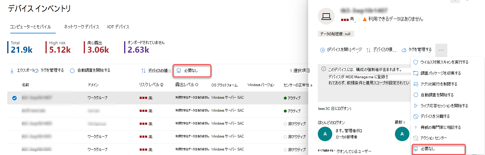
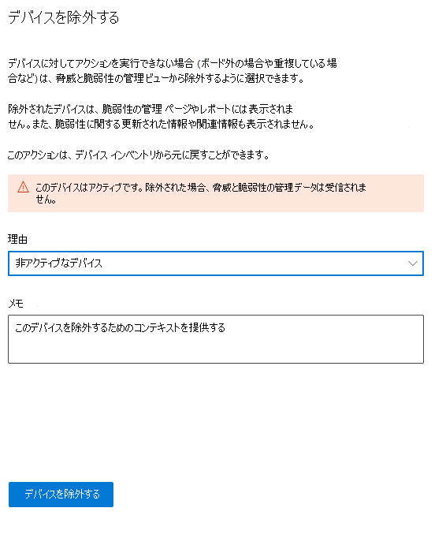
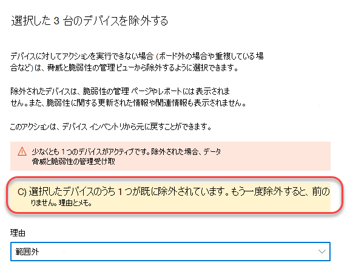
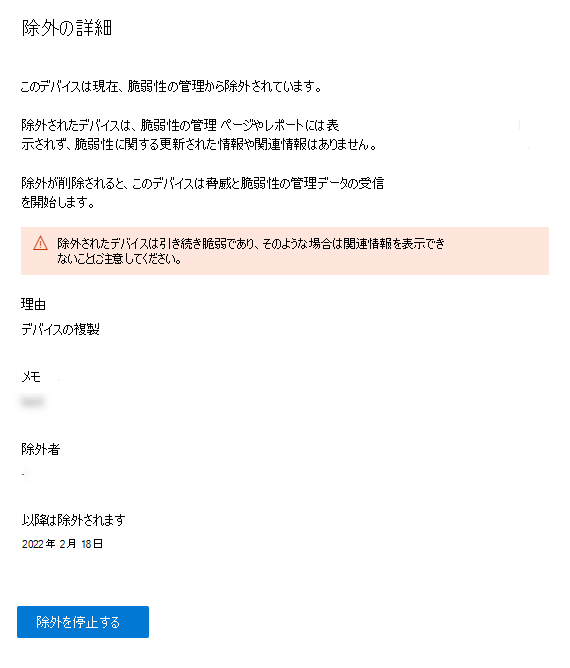

# デバイスを除外する

[!INCLUDE [Microsoft 365 Defender rebranding](../../includes/microsoft-defender.md)]

**適用対象:**

- [Microsoft Defender for Endpoint Plan 1](https://go.microsoft.com/fwlink/p/?linkid=2154037)
- [Microsoft Defender for Endpoint Plan 2](https://go.microsoft.com/fwlink/p/?linkid=2154037)
- [Microsoft 365 Defender](https://go.microsoft.com/fwlink/?linkid=2118804)

> Defender for Endpoint を試す場合は、 [無料試用版にサインアップしてください。](https://signup.microsoft.com/create-account/signup?products=7f379fee-c4f9-4278-b0a1-e4c8c2fcdf7e&ru=https://aka.ms/MDEp2OpenTrial?ocid=docs-wdatp-respondmachine-abovefoldlink)

## デバイスをデバイスから除外脅威と脆弱性の管理

非アクティブ、重複、またはスコープ外のデバイスを除外すると、アクティブなデバイスのリスクの検出と優先順位付けに集中できます。 このアクションは、除外されたデバイス脅威と脆弱性の管理レポートに表示されないので、より正確な露出スコアを反映脅威と脆弱性の管理もあります。

デバイスを除外すると、これらのデバイスに脆弱性とインストールされたソフトウェアに関する更新された情報や関連情報を表示できません。 これは、高度な脅威と脆弱性の管理のすべてのページ、レポート、および関連テーブルに影響します。

デバイス除外機能は、脆弱性の管理 ページとレポートからデバイス データを削除しますが、デバイスはネットワークに接続されたままであり、組織のリスクになる可能性があります。 デバイスの除外は、いつでもキャンセルできます。

## デバイスを除外する方法

1 つのデバイスまたは複数のデバイスを同時に除外できます。

### 1 つのデバイスを除外する

1. [デバイス インベントリ **] ページに移動** し、除外するデバイスを選択します。
2. [ **デバイス インベントリ** ] ページのアクション バーまたはデバイス フライアウトの [アクション] メニューから [除外] を選択します。

 3. 位置合わせを選択します。

    - 非アクティブなデバイス
    - 重複するデバイス
    - デバイスが存在しない
    - 対象外  
    - その他

4. メモを入力し、[デバイスの除外 **] を選択します**。

デバイスをデバイス ページから除外することもできます。

> [!NOTE]
> アクティブなデバイスを除外する場合は、特に脆弱性情報を表示しないリスクが高い場合があります。 デバイスがアクティブで、デバイスを除外する場合は、アクティブなデバイスを除外する必要がある場合に警告メッセージと確認ポップアップが表示されます。

デバイスがビューとデータから完全に除外されるには、最大脆弱性の管理 10 時間かかる場合があります。

除外されたデバイスは、[デバイス インベントリ] リストに表示されます。 除外されたデバイスのビューは、次の方法で管理できます。

- [除外状態 **] 列を** デバイス インベントリ ビューに追加します。
-  **Exclusion ステートフィルターを使用** して、関連するデバイスの一覧を表示します。

### 一括デバイスの除外

複数のデバイスを同時に除外することもできます。

1. [デバイス インベントリ **] ページに移動** し、除外するデバイスを選択します。

2. アクション バーで、[除外] を **選択します**。

3. 位置合わせを選択し、[デバイスの除外 **] を選択します**。

除外状態が異なるデバイス 一覧で複数のデバイスを選択した場合、選択したデバイスを除外するフライアウトによって、既に除外されている選択したデバイスの数の詳細が表示されます。 もう一度デバイスを除外できますが、位置合わせとメモは上書きされます。

デバイスが除外された後、除外されたデバイスのデバイス ページに移動すると、検出された脆弱性、ソフトウェア インベントリ、またはセキュリティに関する推奨事項のデータを表示することは可能です。 また、データは、ページ、関連する高度な脆弱性の管理、脆弱なデバイス レポートにも表示されません。

## デバイスの除外を停止する

デバイスの除外をいつでも停止できます。 デバイスが除外されなくなったら、その脆弱性データは、脆弱性の管理、レポート、高度な検索に表示されます。 変更を有効にするには、最大 8 時間かかる場合があります。

1. [デバイス インベントリ] に移動し、除外されたデバイスを選択してフライアウトを開き、[除外の詳細] **を選択します。**
2. [除外 **の停止] を選択します。**

## 関連項目

- [デバイス一覧](machines-view-overview.md)
