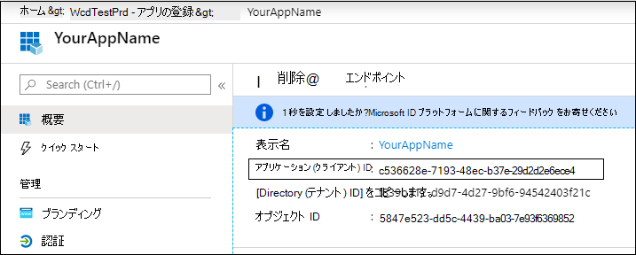
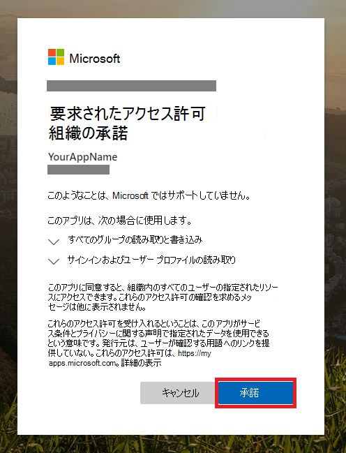
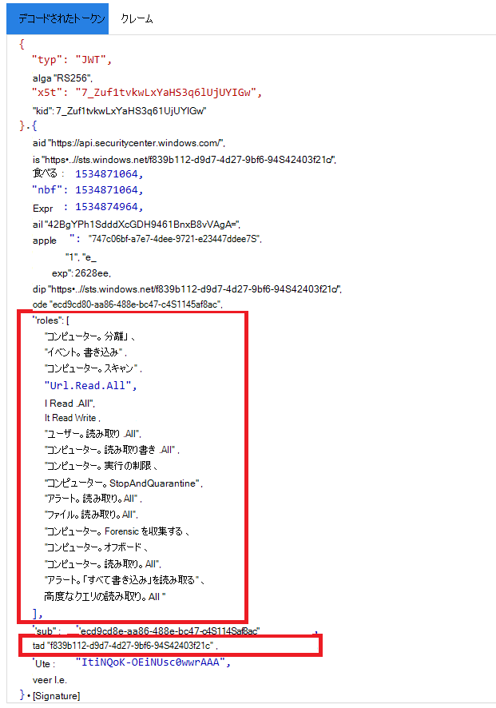

# <a name="partner-access-through-microsoft-defender-for-endpoint-apis"></a>Microsoft Defender for Endpoint API を介したパートナー アクセス

[!INCLUDE [Microsoft 365 Defender rebranding](../../includes/microsoft-defender.md)]


**適用対象:** [Microsoft Defender for Endpoint](https://go.microsoft.com/fwlink/?linkid=2154037)

> Microsoft Defender ATP を試してみたいですか? [無料試用版にサインアップしてください。](https://signup.microsoft.com/create-account/signup?products=7f379fee-c4f9-4278-b0a1-e4c8c2fcdf7e&ru=https://aka.ms/MDEp2OpenTrial?ocid=docs-wdatp-exposedapis-abovefoldlink)

[!include[Microsoft Defender for Endpoint API URIs for US Government](../../includes/microsoft-defender-api-usgov.md)]

[!include[Improve request performance](../../includes/improve-request-performance.md)]

このページでは、顧客に代わって Microsoft Defender for Endpoint へのプログラムによるアクセスをAzure Active Directory (Azure AD) アプリケーションを作成する方法について説明します。


Microsoft Defender for Endpoint は、一連のプログラム API を通じて、そのデータとアクションの多くを公開します。 これらの API は、Microsoft Defender for Endpoint の機能に基づいてワークフローを自動化し、革新するのに役立ちます。 API アクセスには、OAuth2.0 認証が必要です。 詳細については[、「OAuth 2.0 Authorization Code Flow」 を参照してください](/azure/active-directory/develop/active-directory-v2-protocols-oauth-code)。

一般に、API を使用するには、次の手順を実行する必要があります。
- マルチテナント **Azure AD** 作成します。
- アプリケーションが必要とする Defender for Endpoint リソースにアクセスするために、お客様の管理者によって承認 (同意) を受け取る。
- このアプリケーションを使用してアクセス トークンを取得します。
- トークンを使用して、Microsoft Defender for Endpoint API にアクセスします。

次の手順では、Azure AD アプリケーションを作成し、Microsoft Defender for Endpoint へのアクセス トークンを取得し、トークンを検証する方法について説明します。

## <a name="create-the-multi-tenant-app"></a>マルチテナント アプリの作成

1. グローバル管理者の役割 [を持つユーザーを](https://portal.azure.com) 使用して Azure **テナントにサインイン** します。

2. [アプリの **登録Azure Active Directory**  >  **新しい登録]**  >  **に移動します**。 

   

3. 登録フォームで次の情報を入力します。

   - アプリケーションの名前を選択します。

   - サポートされているアカウントの種類 - 任意の組織ディレクトリ内のアカウント。

   - リダイレクト URI - タイプ: Web、URI: https://portal.azure.com

   


4. アプリケーションが Microsoft Defender for Endpoint にアクセスし、統合を完了するために必要な最小限のアクセス許可セットで割り当て許可を付与します。

   - アプリケーション ページで **、[API アクセス** 許可の追加] アクセス許可 API を選択します。組織で  >    >  WindowsDefenderATP >を使用し **、WindowsDefenderATP** で選択します。 

   - **注**: *WindowsDefenderATP* は元のリストには表示されません。 テキスト ボックスに名前を書き始め、表示を確認します。

   
   
   ### <a name="request-api-permissions"></a>API のアクセス許可を要求する

   必要なアクセス許可を確認するには、呼び出す API の [アクセス許可] セクションを確認します。 例:

   - 高度 [なクエリを実行するには、[](run-advanced-query-api.md)高度なクエリの実行] アクセス許可を選択します。
   
   - デバイス [を分離するには、[](isolate-machine.md)コンピューターの分離] アクセス許可を選択します。

   次の例では、[すべてのアラートの読み取 **り] アクセス許可を使用** します。

   [**アプリケーションのアクセス許可**  >  **] Alert.Read.All >** アクセス許可 **の追加] で選択します。**

   


5. [同意 **の付与] を選択します。**

   - **注**: アクセス許可を追加する度に、新しいアクセス許可を有効にするための同意の付与で選択する必要があります。

   

6. アプリケーションにシークレットを追加します。

   - [ **証明書とシークレット&選択し、** シークレットに説明を追加し、[追加] を **選択します**。

    **重要**: [追加] をクリックした後 **、生成されたシークレット値をコピーします**。 退出後に取得できない!

    

7. アプリケーション ID を書き下ろします。

   - アプリケーション ページで、[概要] に移動 **し** 、次の情報をコピーします。

   

8. アプリケーションを顧客のテナントに追加します。

   アプリケーションを使用する予定の各顧客テナントでアプリケーションを承認する必要があります。 これは、お客様の代わりにアプリケーションが Microsoft Defender for Endpoint アプリケーションとやり取りする場合です。

   顧客のテナント **からグローバル管理者** を持つユーザーは、同意リンクを選択してアプリケーションを承認する必要があります。

   同意リンクは次の形式です。

   ```http
   https://login.microsoftonline.com/common/oauth2/authorize?prompt=consent&client_id=00000000-0000-0000-0000-000000000000&response_type=code&sso_reload=true
   ```

   00000000-00000-0000-0000-00000000000 をアプリケーション ID に置き換える必要がある場合

   同意リンクをクリックした後、お客様のテナントのグローバル管理者にサインインし、アプリケーションに同意します。

   

   さらに、トークンを取得する際には、顧客にテナント ID を要求し、将来使用するために保存する必要があります。

- **完成です！** アプリケーションの登録に成功しました!
- トークンの取得と検証については、以下の例を参照してください。

## <a name="get-an-access-token-example"></a>アクセス トークンの例を取得する

**注:** 顧客に代わってアクセス トークンを取得するには、次のトークン取得で顧客のテナント ID を使用します。

AAD トークンの詳細については [、「AAD チュートリアル」を参照してください。](/azure/active-directory/develop/active-directory-v2-protocols-oauth-client-creds)

### <a name="using-powershell"></a>PowerShell の使用

```powershell
# That code gets the App Context Token and save it to a file named "Latest-token.txt" under the current directory
# Paste below your Tenant ID, App ID and App Secret (App key).

$tenantId = '' ### Paste your tenant ID here
$appId = '' ### Paste your Application ID here
$appSecret = '' ### Paste your Application key here

$resourceAppIdUri = 'https://api.securitycenter.microsoft.com'
$oAuthUri = "https://login.microsoftonline.com/$TenantId/oauth2/token"
$authBody = [Ordered] @{
    resource = "$resourceAppIdUri"
    client_id = "$appId"
    client_secret = "$appSecret"
    grant_type = 'client_credentials'
}
$authResponse = Invoke-RestMethod -Method Post -Uri $oAuthUri -Body $authBody -ErrorAction Stop
$token = $authResponse.access_token
Out-File -FilePath "./Latest-token.txt" -InputObject $token
return $token
```

### <a name="using-c"></a>C の使用#

> 以下のコードは、Nuget Microsoft.IdentityModel.Clients.ActiveDirectory でテストされました

- 新しいコンソール アプリケーションの作成
- [Microsoft.IdentityModel.clients.ActiveDirectory](https://www.nuget.org/packages/Microsoft.IdentityModel.Clients.ActiveDirectory/) NuGetインストールする
- 以下を使用して追加する

    ```console
    using Microsoft.IdentityModel.Clients.ActiveDirectory;
    ```

- 以下のコードをアプリケーションにコピー/貼り付けます (3 つの変数を更新することを忘 `tenantId` れないでください。 `appId` `appSecret`

    ```console
    string tenantId = "00000000-0000-0000-0000-000000000000"; // Paste your own tenant ID here
    string appId = "11111111-1111-1111-1111-111111111111"; // Paste your own app ID here
    string appSecret = "22222222-2222-2222-2222-222222222222"; // Paste your own app secret here for a test, and then store it in a safe place! 

    const string authority = "https://login.microsoftonline.com";
    const string wdatpResourceId = "https://api.securitycenter.microsoft.com";

    AuthenticationContext auth = new AuthenticationContext($"{authority}/{tenantId}/");
    ClientCredential clientCredential = new ClientCredential(appId, appSecret);
    AuthenticationResult authenticationResult = auth.AcquireTokenAsync(wdatpResourceId, clientCredential).GetAwaiter().GetResult();
    string token = authenticationResult.AccessToken;
    ```

### <a name="using-python"></a>Python の使用

「Python を [使用してトークンを取得する」を参照してください。](run-advanced-query-sample-python.md#get-token)

### <a name="using-curl"></a>Curl の使用

> [!NOTE]
> 以下の手順では、コンピューターにWindowsの Curl が既にインストールされていることを想定しています

- コマンド ウィンドウを開く
- Azure CLIENT_ID ID に設定する
- Azure CLIENT_SECRETシークレットに設定する
- アプリケーションTENANT_IDを使用して Microsoft Defender for Endpoint アプリケーションにアクセスする顧客の Azure テナント ID に設定します。
- 次のコマンドを実行します。

```curl
curl -i -X POST -H "Content-Type:application/x-www-form-urlencoded" -d "grant_type=client_credentials" -d "client_id=%CLIENT_ID%" -d "scope=https://securitycenter.onmicrosoft.com/windowsatpservice/.default" -d "client_secret=%CLIENT_SECRET%" "https://login.microsoftonline.com/%TENANT_ID%/oauth2/v2.0/token" -k
```

フォームの回答が表示されます。

```console
{"token_type":"Bearer","expires_in":3599,"ext_expires_in":0,"access_token":"eyJ0eXAiOiJKV1QiLCJhbGciOiJSUzI1NiIsIn <truncated> aWReH7P0s0tjTBX8wGWqJUdDA"}
```

## <a name="validate-the-token"></a>トークンを検証する

正気チェックを実行して、正しいトークンを取得していることを確認します。

- 前の手順で [取得した](https://jwt.ms) トークンを JWT にコピー/貼り付けしてデコードする
- 必要なアクセス許可を持つ 'roles' クレームを取得する検証
- 次のスクリーンショットでは、Microsoft Defender for Endpoint への複数のアクセス許可を持つアプリケーションから取得したデコードされたトークンを確認できます。
- "tid" クレームは、トークンが属するテナント ID です。



## <a name="use-the-token-to-access-microsoft-defender-for-endpoint-api"></a>トークンを使用して Microsoft Defender for Endpoint API にアクセスする

- 使用する API の選択、詳細については、「サポートされている[Microsoft Defender for Endpoint API」を参照してください](exposed-apis-list.md)。
- 送信する Http 要求の Authorization ヘッダーを "Bearer {token}" に設定します (ベアラーは承認スキームです)
- トークンの有効期限は 1 時間です (同じトークンで複数の要求を送信できます)

- メッセージを使用してアラートの一覧を取得する要求を送信 **するC#**

    ```csharp
    var httpClient = new HttpClient();

    var request = new HttpRequestMessage(HttpMethod.Get, "https://api.securitycenter.microsoft.com/api/alerts");

    request.Headers.Authorization = new AuthenticationHeaderValue("Bearer", token);

    var response = httpClient.SendAsync(request).GetAwaiter().GetResult();

    // Do something useful with the response
    ```

## <a name="see-also"></a>関連項目

- [サポート対象 Microsoft Defender for Endpoint API](exposed-apis-list.md)
- [ユーザーに代わって Microsoft Defender for Endpoint にアクセスする](exposed-apis-create-app-nativeapp.md)
