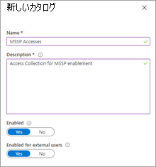
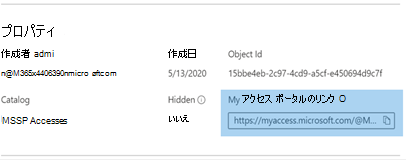

# 管理セキュリティ サービス プロバイダー (MSSP) アクセス権の付与 (プレビュー)

[!INCLUDE [Microsoft 365 Defender rebranding](../../includes/microsoft-defender.md)]

**適用対象:**
- [Microsoft Defender for Endpoint](https://go.microsoft.com/fwlink/p/?linkid=2154037)
- [Microsoft 365 Defender](https://go.microsoft.com/fwlink/?linkid=2118804)

> Defender for Endpoint を試す場合は、 [無料試用版にサインアップしてください。](https://signup.microsoft.com/create-account/signup?products=7f379fee-c4f9-4278-b0a1-e4c8c2fcdf7e&ru=https://aka.ms/MDEp2OpenTrial?ocid=docs-mssp-support-abovefoldlink)

> [!IMPORTANT]
> 一部の情報は、市販される前に大幅に変更される可能性があるプレリリース製品に関するものです。 Microsoft は、ここに記載された情報に関して、明示または黙示を問わず、いかなる保証も行いません。

マルチテナント委任アクセス ソリューションを実装するには、次の手順を実行します。

1. Defender for Endpoint [で役割ベースのアクセス制御](rbac.md) を有効にし、Active Directory (AD) グループに接続します。

2. アクセス [要求とプロビジョニング用にガバナンス](/azure/active-directory/governance/identity-governance-overview) アクセス パッケージを構成します。

3. Microsoft Myaccess でアクセス要求と監査 [を管理します](/azure/active-directory/governance/entitlement-management-request-approve)。

## Microsoft Defender for Endpoint で役割ベースのアクセス制御を有効にする

1. **顧客 AAD で MSSP リソースのアクセス グループを作成する: グループ**

    これらのグループは、Defender for Endpoint で作成したロールにリンクされます。 これを行うには、テナントの顧客AD 3 つのグループを作成します。 この例のアプローチでは、次のグループを作成します。

    - Tier 1 Analyst
    - Tier 2 Analyst
    - MSSP アナリスト承認者

2. エンドポイントの Customer Defender で適切なアクセス レベルの Defender for Endpoint ロールを作成します。

    カスタマー Microsoft Defender セキュリティ センター で RBAC を有効にするには、グローバル管理者またはセキュリティ管理者の権限を持つユーザー アカウントから 設定 > アクセス許可 **>** ロールと "ロールを有効にする" にアクセスします。

    

    次に、MSSP SOC Tier のニーズを満たす RBAC ロールを作成します。 [割り当てられたユーザー グループ] を使用して、作成されたユーザー グループにこれらの役割をリンクします。

    2 つの可能な役割:

    - **Tier 1 Analysts**

      ライブ応答以外のすべてのアクションを実行し、セキュリティ設定を管理します。

    - **Tier 2 Analysts**

      ライブ応答に追加された Tier 1 [の機能](live-response.md)

    詳細については、「役割ベースの [アクセス制御を使用する」を参照してください](rbac.md)。

## ガバナンス アクセス パッケージの構成

1. **顧客 AAD の接続組織として MSSP を追加する: ID ガバナンス**

    接続された組織として MSSP を追加すると、MSSP は要求し、アクセスが準備されます。

    これを行うには、テナントの顧客AD、Identity Governance: Connected organization にアクセスします。 新しい組織を追加し、テナント ID またはドメインを使用して MSSP Analyst テナントを検索します。 MSSP Analysts 用に個別のADテナントを作成する方法をお勧めします。

2. **顧客 AAD でリソース カタログを作成する: ID ガバナンス**

    リソース カタログは、テナントの顧客に作成されたアクセス パッケージADです。

    これを行うには、テナントの顧客AD、Identity Governance: Catalogs にアクセスし、新しいカタログ **を追加します**。 この例では **、MSSP Accesses を呼び出します**。

    

    詳細については、「リソースのカタログ [を作成する」を参照してください](/azure/active-directory/governance/entitlement-management-catalog-create)。

3. **MSSP リソースのアクセス パッケージを作成する 顧客 AAD: Identity Governance**

    アクセス パッケージは、承認時に要求者に付与される権限とアクセスのコレクションです。

    これを行うには、テナントの顧客AD、Identity Governance: Access Package にアクセスし、新しいアクセス パッケージ **を追加します**。 MSSP 承認者と各アナリスト層のアクセス パッケージを作成します。 たとえば、次の Tier 1 Analyst 構成によって、次のようなアクセス パッケージが作成されます。

    - 新しい要求を承認するには、AD **MSSP アナリスト承認者** のメンバーが必要です。
    - SOC アナリストがアクセス拡張機能を要求できる年次アクセス レビューがある
    - MSSP SOC テナント内のユーザーだけが要求できる
    - 365 日後に自動アクセスが期限切れになる

    > [!div class="mx-imgBorder"]
    > 

    詳細については、「新しいアクセス [パッケージを作成する」を参照してください](/azure/active-directory/governance/entitlement-management-access-package-create)。

4. **顧客 AAD から MSSP リソースへのアクセス要求リンクを提供する: ID ガバナンス**

    [マイ アクセス ポータル] リンクは、MSSP SOC アナリストが作成したアクセス パッケージを介してアクセスを要求するために使用されます。 リンクは永続的です。つまり、同じリンクが新しいアナリストのために時間の間に使用される可能性があります。 アナリスト要求は、MSSP アナリスト承認者による承認のためにキュー **に入ります**。

    > [!div class="mx-imgBorder"]
    > 

    リンクは、各アクセス パッケージの概要ページに表示されます。

## アクセスを管理する

1. Customer または MSSP myaccess のアクセス要求を確認および承認します。

    アクセス要求は、MSSP Analyst Approvers グループのメンバーによって、お客様の My Access で管理されます。

    これを行うには、次を使用して顧客の myaccess にアクセスします `https://myaccess.microsoft.com/@<Customer Domain>` 。

    例: `https://myaccess.microsoft.com/@M365x440XXX.onmicrosoft.com#/`

2. UI の [承認] セクション **で要求を** 承認または拒否します。

    この時点で、アナリスト アクセスが準備され、各アナリストが顧客のサービスにアクセスMicrosoft Defender セキュリティ センター。`https://securitycenter.Microsoft.com/?tid=<CustomerTenantId>`

## 関連項目

- [MSSP カスタマー ポータルにアクセスする](access-mssp-portal.md)
- [アラート通知を構成する](configure-mssp-notifications.md)
- [顧客テナントからアラートを取得する](fetch-alerts-mssp.md)
