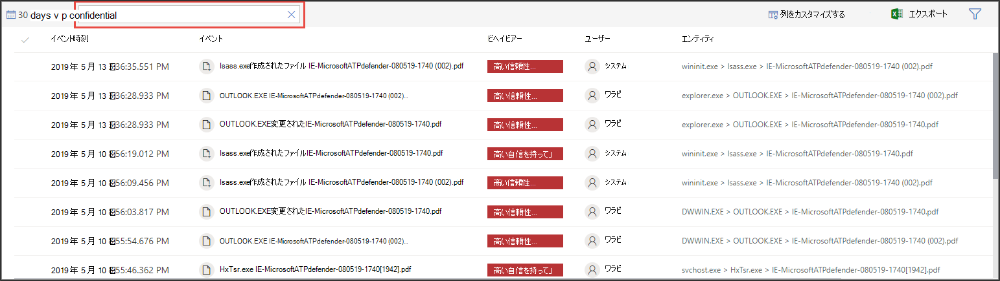

# 秘密度ラベルを使用してインシデント対応に優先順位を付ける  

[!INCLUDE [Microsoft 365 Defender rebranding](../../includes/microsoft-defender.md)]

**適用対象:**
- [Microsoft Defender for Endpoint](https://go.microsoft.com/fwlink/p/?linkid=2154037)
- [Microsoft 365 Defender](https://go.microsoft.com/fwlink/?linkid=2118804)

> Defender for Endpoint を体験してみませんか? [無料試用版にサインアップしてください。](https://www.microsoft.com/microsoft-365/windows/microsoft-defender-atp?ocid=docs-wdatp-exposedapis-abovefoldlink) 

一般的な高度な永続的な脅威ライフサイクルには、データの取り込みが含まれる。 セキュリティ インシデントでは、機密ファイルが危険にさらされる可能性がある調査に優先順位を付け、企業のデータと情報を保護することが重要です。

Defender for Endpoint は、セキュリティ インシデントの事前設定を、感度ラベルを使用して、はるかに簡単に行うのに役立ちます。 機密ラベルは、機密情報などの機密情報を持つデバイスに関連する可能性のあるインシデントをすばやく識別します。 

## 機密データを含むインシデントを調査する
データの感度ラベルを使用してインシデント調査の優先順位を設定する方法について学習します。

>[!NOTE]
>ラベルは、1 つ以上のWindows 10 Version 1809検出されます。

1. [Microsoft 365 Defender] ポータルで、[インシデント]**を選択&インシデント**  >  **を通知します**。

2. 右にスクロールすると、[データの感度 **] 列が表示** されます。 この列は、インシデントに関連するデバイスで観察された機密ラベルを反映し、機密ファイルがインシデントの影響を受ける可能性があるかどうかを示します。

    ![[データの感度] 列の画像](images/data-sensitivity-column.png)

    また、データの感度に基 **づいてフィルター処理を実行できます。** 

    

3. インシデント ページを開き、さらに調査します。

    

4. [デバイス] **タブを** 選択して、感度ラベル付きファイルを格納するデバイスを識別します。

    ![[デバイス] タブのイメージ](images/investigate-devices-tab.png)
   

5. 機密データを格納するデバイスを選択し、タイムラインを検索して、影響を受ける可能性のあるファイルを特定し、データが保護される適切なアクションを実行します。 

   デバイスのタイムラインに表示されるイベントを絞り込むには、データの感度ラベルを検索します。 これにより、ラベル名が指定されたファイルに関連付けられたイベントだけが表示されます。

    

>[!TIP]
>これらのデータ ポイントは、高度な検索で 'DeviceFileEvents' を通じて公開され、高度なクエリとスケジュール検出で、感度ラベルとファイル保護の状態を考慮に入れることができるようになりました。 
