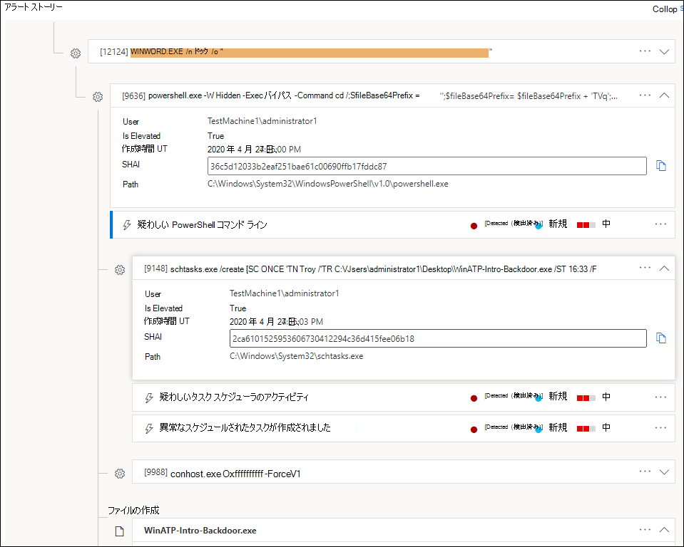

# Microsoft Defender for Endpoint のアラートを調査するInvestigate alerts in Microsoft Defender for Endpoint

[!INCLUDE [Microsoft 365 Defender rebranding](../../includes/microsoft-defender.md)]

**適用対象:****Applies to:**
- [Microsoft Defender for EndpointMicrosoft Defender for Endpoint](https://go.microsoft.com/fwlink/p/?linkid=2154037)
- [Microsoft 365 DefenderMicrosoft 365 Defender](https://go.microsoft.com/fwlink/?linkid=2118804)

>Defender for Endpoint を体験してみませんか?Want to experience Defender for Endpoint? [無料試用版にサインアップしてください。Sign up for a free trial.](https://www.microsoft.com/microsoft-365/windows/microsoft-defender-atp?ocid=docs-wdatp-investigatealerts-abovefoldlink) 

ネットワークに影響を与えるアラートを調査し、その意味と解決方法を理解します。Investigate alerts that are affecting your network, understand what they mean, and how to resolve them.

アラート キューからアラートを選択して、アラート ページに移動します。Select an alert from the alerts queue to go to alert page. このビューには、アラート タイトル、影響を受けるアセット、詳細サイド ウィンドウ、およびアラート ストーリーが含まれる。This view contains the alert title, the affected assets, the details side pane, and the alert story.

アラート ページから、影響を受けるアセットまたはアラート ストーリー ツリー ビューのエンティティを選択して調査を開始します。From the alert page, begin your investigation by selecting the affected assets or any of the entities under the alert story tree view. 詳細ウィンドウには、選択した内容に関する詳細情報が自動的に表示されます。The details pane automatically populates with further information about what you selected. ここで表示できる情報の種類を確認するには、「エンドポイント用 Microsoft Defender でアラートを確認 [する」を参照してください](https://docs.microsoft.com/microsoft-365/security/defender-endpoint/review-alerts)。To see what kind of information you can view here, read [Review alerts in Microsoft Defender for Endpoint](https://docs.microsoft.com/microsoft-365/security/defender-endpoint/review-alerts).

## アラート ストーリーを使用して調査するInvestigate using the alert story

アラート ストーリーは、アラートがトリガーされた理由、その前と後で発生した関連イベント、および他の関連エンティティの詳細を示します。The alert story details why the alert was triggered, related events that happened before and after, as well as other related entities.

エンティティはクリック可能で、アラートではないすべてのエンティティは、そのエンティティのカードの右側にある展開アイコンを使用して展開できます。Entities are clickable and every entity that isn't an alert is expandable using the expand icon on the right side of that entity's card. フォーカスのエンティティは、そのエンティティのカードの左側に青いストライプで示され、最初はタイトルのアラートがフォーカスされます。The entity in focus will be indicated by a blue stripe to the left side of that entity's card, with the alert in the title being in focus at first.

エンティティを展開して詳細を一目で確認します。Expand entities to view details at a glance. エンティティを選択すると、詳細ウィンドウのコンテキストがこのエンティティに切り替わるので、詳細情報を確認し、そのエンティティを管理できます。Selecting an entity will switch the context of the details pane to this entity, and will allow you to review further information, as well as manage that entity. エンティティ カード *の右側にある ...* を選択すると、そのエンティティで使用可能なすべてのアクションが表示されます。Selecting *...* to the right of the entity card will reveal all actions available for that entity. これらの同じアクションは、エンティティにフォーカスがある場合に詳細ウィンドウに表示されます。These same actions appear in the details pane when that entity is in focus.

> [!NOTE]
> [アラート ストーリー] セクションには複数のアラートが含まれている場合があります。選択したアラートの前または後に、同じ実行ツリーに関連する追加のアラートが表示されます。The alert story section may contain more than one alert, with additional alerts related to the same execution tree appearing before or after the alert you've selected.

## 詳細ウィンドウからアクションを実行するTake action from the details pane

目的のエンティティを選択すると、詳細ウィンドウが変更され、選択したエンティティの種類に関する情報、利用可能な場合の歴史的な情報が表示され、アラート ページから直接このエンティティに対してアクションを実行するコントロールが提供されます。Once you've selected an entity of interest, the details pane will change to display information about the selected entity type, historic information when it's available, and offer controls to **take action** on this entity directly from the alert page.

調査が完了したら、開始したアラートに戻り、アラートの状態を **[** 解決済み] としてマークし、False アラートまたはTrue アラートとして **分類します**。Once you're done investigating, go back to the alert you started with, mark the alert's status as **Resolved** and classify it as either **False alert** or **True alert**. アラートを分類すると、この機能を調整して、より真のアラートと誤ったアラートを減らします。Classifying alerts helps tune this capability to provide more true alerts and less false alerts.

真のアラートとして分類する場合は、下の図に示すように、決定を選択できます。If you classify it as a true alert, you can also select a determination, as shown in the image below.

業務用アプリケーションで誤ったアラートが発生している場合は、この種類のアラートを今後回避するために抑制ルールを作成します。If you are experiencing a false alert with a line-of-business application, create a suppression rule to avoid this type of alert in the future.

> [!TIP]
> 上記に記載されていない問題が発生した場合は、ボタンを使用してフィードバックを提供するか、サポート 🙂 チケットを開きます。If you're experiencing any issues not described above, use the 🙂 button to provide feedback or open a support ticket.

## 関連項目Related topics
- [Microsoft Defender for Endpoint Alerts キューの表示と整理View and organize the Microsoft Defender for Endpoint Alerts queue](alerts-queue.md)
- [エンドポイント通知の Microsoft Defender の管理Manage Microsoft Defender for Endpoint alerts](manage-alerts.md)
- [Defender for Endpoint アラートに関連付けられたファイルを調査するInvestigate a file associated with a Defender for Endpoint alert](investigate-files.md)
- [Defender for Endpoint Devices リストのデバイスを調査するInvestigate devices in the Defender for Endpoint Devices list](investigate-machines.md)
- [Defender for Endpoint アラートに関連付けられている IP アドレスを調査するInvestigate an IP address associated with a Defender for Endpoint alert](investigate-ip.md)
- [Defender for Endpoint アラートに関連付けられているドメインを調査するInvestigate a domain associated with a Defender for Endpoint alert](investigate-domain.md)
- [Defender for Endpoint のユーザー アカウントを調査するInvestigate a user account in Defender for Endpoint](investigate-user.md)

