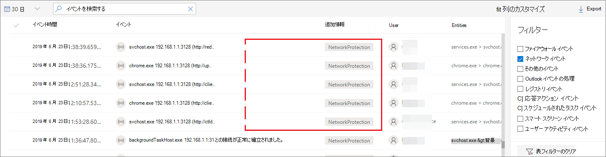
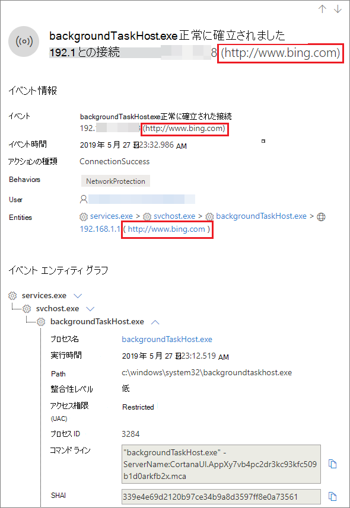

# <a name="investigate-connection-events-that-occur-behind-forward-proxies"></a>転送プロキシの背後で発生する接続イベントの調査

[!INCLUDE [Microsoft 365 Defender rebranding](../../includes/microsoft-defender.md)]

**適用対象:**
- [Microsoft Defender for Endpoint](https://go.microsoft.com/fwlink/p/?linkid=2154037)
- [Microsoft 365 Defender](https://go.microsoft.com/fwlink/?linkid=2118804)

> Defender for Endpoint を試す場合は、 [無料試用版にサインアップしてください。](https://signup.microsoft.com/create-account/signup?products=7f379fee-c4f9-4278-b0a1-e4c8c2fcdf7e&ru=https://aka.ms/MDEp2OpenTrial?ocid=docs-wdatp-investigatemachines-abovefoldlink)

Defender for Endpoint は、ネットワーク スタックの異なるレベルからのネットワーク接続監視をサポートします。 難しいケースは、ネットワークがインターネットへのゲートウェイとして転送プロキシを使用する場合です。

プロキシは、ターゲット エンドポイントである場合と同様に動作します。  このような場合、単純なネットワーク接続モニターはプロキシとの接続を監査します。これは正しいが調査値は低くなります。 

Defender for Endpoint は、ネットワーク保護による高度な HTTP レベルの監視をサポートします。 オンにすると、実際のターゲット ドメイン名を公開する新しい種類のイベントが表示されます。

## <a name="use-network-protection-to-monitor-network-connection-behind-a-firewall"></a>ネットワーク保護を使用してファイアウォールの背後にあるネットワーク接続を監視する
転送プロキシの背後にあるネットワーク接続の監視は、ネットワーク保護から発生する追加のネットワーク イベントが原因で可能です。 デバイスのタイムラインで表示するには、ネットワーク保護を有効にします (最小監査モード)。 

ネットワーク保護は、次のモードを使用して制御できます。

- **Block** <br> ユーザーまたはアプリは、危険なドメインへの接続をブロックされます。 このアクティビティは、次のページでMicrosoft Defender セキュリティ センター。
- **Audit** <br> ユーザーまたはアプリは、危険なドメインへの接続をブロックされません。 ただし、このアクティビティは引き続き [Microsoft Defender セキュリティ センター] に表示されます。


ネットワーク保護をオフにした場合、ユーザーまたはアプリは危険なドメインへの接続をブロックされません。 [ネットワーク アクティビティ] にはネットワーク アクティビティMicrosoft Defender セキュリティ センター。

構成しない場合、ネットワークブロックは既定で無効になります。

詳細については、「ネットワーク保護を有効 [にする」を参照してください](enable-network-protection.md)。

## <a name="investigation-impact"></a>調査への影響
ネットワーク保護を有効にすると、デバイスのタイムラインで IP アドレスがプロキシを表し続け、実際のターゲット アドレスが表示されます。



ネットワーク保護層によってトリガーされる追加のイベントは、プロキシの背後でも実際のドメイン名を表示できます。

イベントの情報:




## <a name="hunt-for-connection-events-using-advanced-hunting"></a>高度な検索を使用した接続イベントのハント 
すべての新しい接続イベントは、高度な狩猟を通じて狩りを行うのにも利用できます。 これらのイベントは接続イベントですから、アクションの種類の下にある DeviceNetworkEvents テーブルの下に `ConnecionSuccess` イベントを検索できます。

この単純なクエリを使用すると、関連するすべてのイベントが表示されます。

```
DeviceNetworkEvents
| where ActionType == "ConnectionSuccess" 
| take 10
```


プロキシ自体への接続に関連するイベントをフィルター処理することもできます。 

プロキシへの接続をフィルター処理するには、次のクエリを使用します。

```
DeviceNetworkEvents
| where ActionType == "ConnectionSuccess" and RemoteIP != "ProxyIP"  
| take 10
```


## <a name="related-topics"></a>関連項目
- [GP によるネットワーク保護の適用 - ポリシー CSP](/windows/client-management/mdm/policy-csp-defender#defender-enablenetworkprotection)
