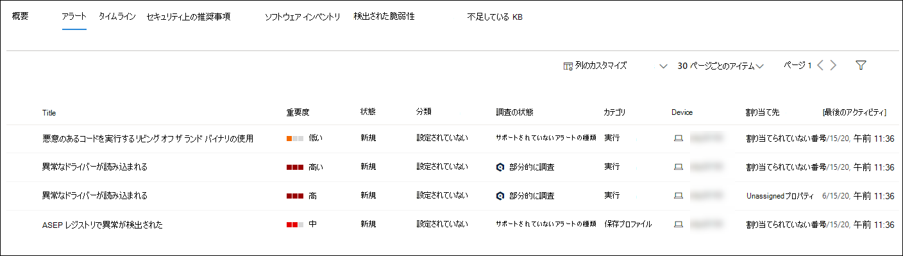
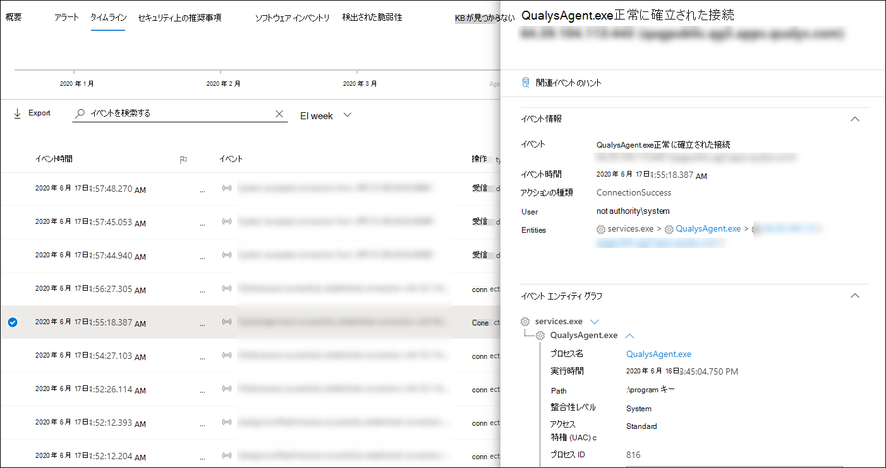
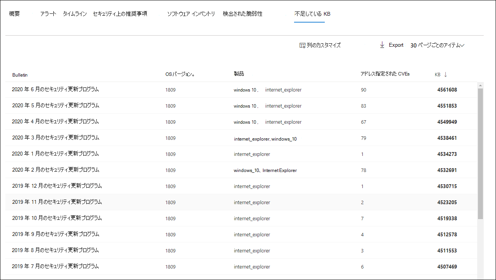
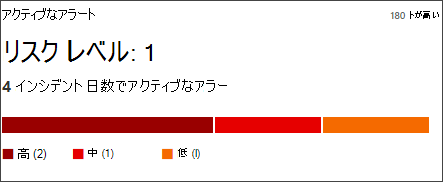
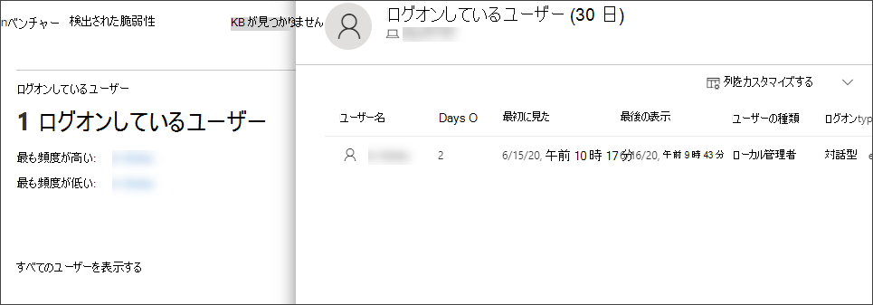

# Microsoft Defender for Endpoint Devices リストのデバイスを調査する

[!INCLUDE [Microsoft 365 Defender rebranding](../../includes/microsoft-defender.md)]

**適用対象:**
- [Microsoft Defender for Endpoint Plan 2](https://go.microsoft.com/fwlink/p/?linkid=2154037)
- [Microsoft 365 Defender](https://go.microsoft.com/fwlink/?linkid=2118804)

> Defender for Endpoint を試す場合は、 [無料試用版にサインアップしてください。](https://signup.microsoft.com/create-account/signup?products=7f379fee-c4f9-4278-b0a1-e4c8c2fcdf7e&ru=https://aka.ms/MDEp2OpenTrial?ocid=docs-wdatp-investigatemachines-abovefoldlink)

特定のデバイスで発生したアラートの詳細を調べて、アラートまたは侵害の潜在的な範囲に関連する可能性のある他の動作またはイベントを特定します。

> [!NOTE]
> 調査または対応プロセスの一環として、デバイスから調査パッケージを収集できます。 次の方法: デバイスから [調査パッケージを収集します](/microsoft-365/security/defender-endpoint/respond-machine-alerts#collect-investigation-package-from-devices)。

影響を受けるデバイスをポータルに表示するたびにクリックすると、そのデバイスに関する詳細なレポートを開きます。 影響を受けるデバイスは、次の領域で識別されます。

- [デバイスの一覧](investigate-machines.md)
- [アラート キュー](alerts-queue.md)
- [セキュリティ運用ダッシュボード](security-operations-dashboard.md)
- 個々のアラート
- 個々のファイルの詳細ビュー
- 任意の IP アドレスまたはドメインの詳細ビュー

特定のデバイスを調査すると、次の情報が表示されます。

- デバイスの詳細
- 応答アクション
- タブ (概要、アラート、タイムライン、セキュリティ推奨事項、ソフトウェア インベントリ、検出された脆弱性、不足している KB)
- カード (アクティブなアラート、ログオンしているユーザー、セキュリティ評価)

> [!NOTE]
> 製品の制約により、デバイス プロファイルは 、(デバイス ページにも見られる) 'Last Seen' 時間枠を決定する際に、すべてのサイバー証拠を考慮する必要があります。
> たとえば、[デバイス] ページの [最後に見た] 値は、コンピューターのタイムラインで最新のアラートやデータを使用できる場合でも、古い時間枠を表示する場合があります。

## デバイスの詳細

[デバイスの詳細] セクションには、デバイスのドメイン、OS、正常性状態などの情報が表示されます。 デバイスで利用可能な調査パッケージがある場合は、パッケージをダウンロードできるリンクが表示されます。

## 応答アクション

応答アクションは、特定のデバイス ページの上部に沿って実行され、次のものが含まれます。

- タグの管理
- デバイスの分離
- アプリの実行を制限する
- ウイルス対策スキャンの実行
- 調査パッケージの収集
- ライブ応答セッションの開始
- 自動調査の開始
- 脅威のエキスパートに相談する
- アクション センター

アクション センター、特定のデバイス ページ、または特定のファイル ページで応答アクションを実行できます。

デバイスでアクションを実行する方法の詳細については、「デバイスで応答アクションを実行 [する」を参照してください](respond-machine-alerts.md)。

詳細については、「ユーザー エンティティの [調査」を参照してください](investigate-user.md)。

## タブ

タブには、デバイスに関連する関連するセキュリティと脅威防止情報が表示されます。 各タブで、列ヘッダーの上のバーから [列のカスタマイズ] を選択して、表示される列をカスタマイズできます。

### 概要

[ **概要]** タブには、アクティブ [なアラート](#cards) 、ログオンしているユーザー、およびセキュリティ評価のカードが表示されます。

![デバイス ページの [概要] タブのイメージ。](images/overview-device.png)

### アラート

[ **アラート]** タブには、デバイスに関連付けられているアラートの一覧が表示されます。 このリストは、アラート キューのフィルター処理されたバージョンで、アラート、重大度 (高、中、低、情報)、キュー内の状態 (新規、進行中、解決済み)、分類 (設定されていない、誤ったアラート、真のアラート)、調査状態、アラートのカテゴリ、アラートに対処しているユーザー、および最後のアクティビティの短い説明を示します。 アラートをフィルター処理することもできます。

アラートの左側にある円のアイコンが選択されている場合は、フライアウトが表示されます。 このパネルでは、アラートを管理し、インシデント番号や関連デバイスなどの詳細を表示できます。 一度に複数のアラートを選択できます。

インシデント グラフやプロセス ツリーを含むアラートの完全なページ ビューを表示するには、アラートのタイトルを選択します。

### タイムライン

[ **タイムライン]** タブには、デバイスで観測されたイベントと関連するアラートの時系列ビューが表示されます。 これにより、デバイスに関連するイベント、ファイル、IP アドレスを関連付けるのに役立ちます。

タイムラインでは、特定の期間に発生したイベントを選択的にドリルダウンすることもできます。 選択した期間にデバイスで発生したイベントの一時的なシーケンスを表示できます。 ビューをさらに制御するには、イベント グループでフィルター処理するか、列をカスタマイズできます。

> [!NOTE]
> ファイアウォール イベントを表示するには、監査ポリシーを有効にする必要があります。「Audit [Filtering Platform 接続」を参照してください](/windows/security/threat-protection/auditing/audit-filtering-platform-connection)。
>
> ファイアウォールでは、次のイベントについて説明します。
>
> - [5025](/windows/security/threat-protection/auditing/event-5025) - ファイアウォール サービスが停止しました
> - [5031](/windows/security/threat-protection/auditing/event-5031) - アプリケーションがネットワーク上の受信接続を受け入れるのをブロックする
> - [5157](/windows/security/threat-protection/auditing/event-5157) - ブロックされた接続

一部の機能には、次の機能が含まれます。

- 特定のイベントを検索する
  - 検索バーを使用して、特定のタイムライン イベントを検索します。
- 特定の日付からイベントをフィルター処理する
  - 表の左上にあるカレンダー アイコンを選択して、過去の日、週、30 日、またはカスタム範囲のイベントを表示します。 既定では、デバイスタイムラインは過去 30 日間のイベントを表示するために設定されています。
  - タイムラインを使用して、セクションを強調表示して特定の時間にジャンプします。 タイムライン上の矢印は、自動化された調査を特定します
- デバイスの詳細なタイムライン イベントをエクスポートする
  - 現在の日付または指定した日付範囲のデバイス タイムラインを最大 7 日間エクスポートします。

特定のイベントの詳細については、「追加情報」 **セクションを参照** してください。 これらの詳細は、次に示すイベントの種類によって異なります。

- Application Guard に含まれる - Web ブラウザー イベントは、分離されたコンテナーによって制限されました
- アクティブな脅威が検出されました - 脅威の実行中に脅威の検出が発生しました
- 修復に失敗しました - 検出された脅威を修復しようとしたが、失敗しました
- 修復が成功しました - 検出された脅威が停止してクリーンアップされました
- ユーザーによってバイパスされた警告 - SmartScreen Windows Defenderが無視され、ユーザーによって上書きされた場合
- 疑わしいスクリプトが検出されました - 悪意のある可能性のあるスクリプトが実行されているのが見つかりました
- アラート カテゴリ - イベントがアラートの生成につながった場合、アラート カテゴリ (たとえば"横方向の移動") が提供されます。

#### イベントの詳細

イベントを選択して、そのイベントに関する関連する詳細を表示します。 一般的なイベント情報を表示するパネルが表示されます。 適用可能なデータが使用可能な場合は、関連するエンティティとその関係を示すグラフも表示されます。

イベントと関連イベントをさらに調するには、[関連イベントのハント]を選択して高度な検索クエリ **をすばやく実行できます**。 クエリは、選択したイベントと、同じエンドポイントで同時に発生した他のイベントの一覧を返します。

### セキュリティ上の推奨事項

**セキュリティに関する推奨事項** は、Microsoft Defender for Endpoint の Threat & [管理機能から生成](tvm-dashboard-insights.md) されます。 推奨事項を選択すると、推奨事項の説明や、推奨事項の制定に関連する潜在的なリスクなどの関連する詳細を表示できるパネルが表示されます。 詳細については [、「セキュリティに関する推奨事項](tvm-security-recommendation.md) 」を参照してください。

![[セキュリティの推奨事項] タブのイメージ。](images/security-recommendations-device.png)

### ソフトウェア インベントリ

[ **ソフトウェア インベントリ]** タブでは、デバイス上のソフトウェアと、弱点や脅威を表示できます。 ソフトウェアの名前を選択すると、ソフトウェアの詳細ページに移動し、セキュリティの推奨事項、検出された脆弱性、インストールされているデバイス、およびバージョン配布を表示できます。 詳細については [、「ソフトウェア インベントリ」](tvm-software-inventory.md) を参照してください。

![[ソフトウェア インベントリ] タブのイメージ。](images/software-inventory-device.png)

### 検出された脆弱性

[ **検出された脆弱性]** タブには、デバイスで検出された脆弱性の名前、重大度、および脅威の分析情報が表示されます。 特定の脆弱性を選択すると、説明と詳細が表示されます。

![[検出された脆弱性] タブの画像。](images/discovered-vulnerabilities-device.png)

### 不足している KB
[ **不足している KB]** タブには、デバイスの不足しているセキュリティ更新プログラムが一覧表示されます。

## カード

### アクティブなアラート

Microsoft Defender for Identity 機能を有効にし、アクティブなアラートがある場合、Azure Advanced **Threat Protection** カードには、デバイスとそのリスク レベルに関連するアラートの概要が表示されます。 詳細については、「アラート」ドリルダウンで確認できます。

> [!NOTE]
> この機能を使用するには、Microsoft Defender for Identity と Defender for Endpoint の両方で統合を有効にする必要があります。 Defender for Endpoint では、高度な機能でこの機能を有効にできます。 高度な機能を有効にする方法の詳細については、「高度な機能を有効 [にする」を参照してください](advanced-features.md)。

### ログオンしているユーザー

[ **ログオンユーザー] カード** には、過去 30 日間にログオンしたユーザーの数と、最も頻度の少ないユーザーが表示されます。 [すべてのユーザーを表示する] リンクを選択すると、詳細ウィンドウが開き、ユーザーの種類、ログオンの種類、ユーザーが最初と最後に表示された時間などの情報が表示されます。 詳細については、「ユーザー エンティティの [調査」を参照してください](investigate-user.md)。

> [!NOTE]
> 「最も頻繁に」ユーザー値は、対話的に正常にログオンしたユーザーの証拠にのみ基づいて計算されます。
> ただし、[すべてのユーザー] サイド ウィンドウでは、すべての種類のユーザー ログオンが計算されます。そのため、ユーザーが対話型ではない可能性がある場合に、サイド ウィンドウでユーザーが頻繁に表示される可能性があります。

### セキュリティ評価

セキュリティ **評価カードには** 、全体的な露出レベル、セキュリティ推奨事項、インストール済みソフトウェア、および検出された脆弱性が表示されます。 デバイスの露出レベルは、保留中のセキュリティ推奨事項の累積的な影響によって決まります。

## 関連トピック

- [Microsoft Defender for Endpoint アラート キューを表示して整理する](alerts-queue.md)
- [エンドポイント通知の Microsoft Defender の管理](manage-alerts.md)
- [Microsoft Defender for Endpoint アラートの調査](investigate-alerts.md)
- [Defender for Endpoint アラートに関連付けられたファイルを調査する](investigate-files.md)
- [Defender for Endpoint アラートに関連付けられている IP アドレスを調査する](investigate-ip.md)
- [Defender for Endpoint アラートに関連付けられているドメインを調査する](investigate-domain.md)
- [Defender for Endpoint のユーザー アカウントを調査する](investigate-user.md)
- [セキュリティに関する推奨事項](tvm-security-recommendation.md)
- [ソフトウェア インベントリ](tvm-software-inventory.md)
