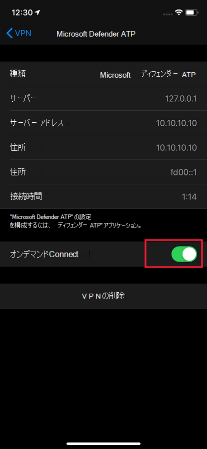
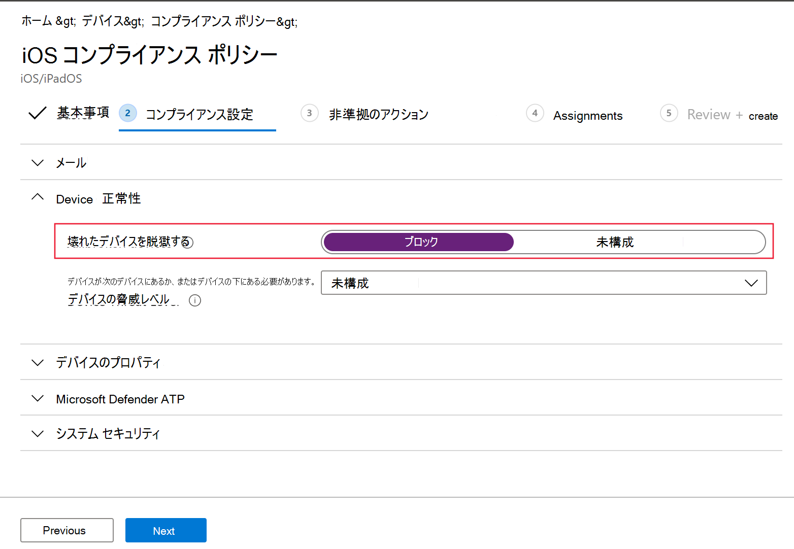
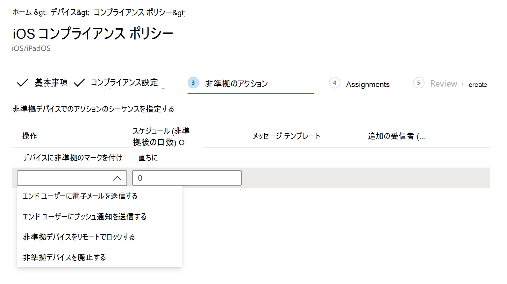

# iOS の機能で Microsoft Defender for Endpoint を構成する

[!INCLUDE [Microsoft 365 Defender rebranding](../../includes/microsoft-defender.md)]

**適用対象:**
- [Microsoft Defender for Endpoint](https://go.microsoft.com/fwlink/p/?linkid=2154037)
- [Microsoft 365 Defender](https://go.microsoft.com/fwlink/?linkid=2118804)

> Defender for Endpoint を試す場合は、 [無料試用版にサインアップしてください。](https://signup.microsoft.com/create-account/signup?products=7f379fee-c4f9-4278-b0a1-e4c8c2fcdf7e&ru=https://aka.ms/MDEp2OpenTrial?ocid=docs-wdatp-exposedapis-abovefoldlink)

> [!NOTE]
> iOS 上のエンドポイントの Defender は、Web 保護機能を提供するために VPN を使用します。 これは通常の VPN ではなく、デバイス外のトラフィックを受け取らないローカル/自己ループ VPN です。

## iOS 上のエンドポイント用 Defender を使用した条件付きアクセス

Microsoft Defender for Endpoint on iOS および Microsoft Intune および Azure Active Directory を使用すると、デバイス のリスク スコアに基づいてデバイスコンプライアンスと条件付きアクセス ポリシーを適用できます。 Defender for Endpoint は、Intune を介してこの機能を活用するために展開できるモバイル脅威防御 (MTD) ソリューションです。

iOS 上の Defender for Endpoint で条件付きアクセスを設定する方法の詳細については [、「Defender for Endpoint and Intune」を参照してください](/mem/intune/protect/advanced-threat-protection)。

### Microsoft Defender for Endpoint による脱獄の検出

Microsoft Defender for Endpoint には、脱獄された管理されていないデバイスと管理対象デバイスを検出する機能があります。 デバイスが脱獄されたと検出された場合、危険度の高いアラートがセキュリティ センターに報告され、条件付きアクセスがデバイス リスク スコアに基づいてセットアップされている場合、デバイスは企業データへのアクセスをブロックされます。

## Web 保護と VPN

既定では、Defender for Endpoint on iOS には Web 保護機能が含まれています。 [Web 保護は](web-protection-overview.md) 、Web の脅威からデバイスを保護し、ユーザーをフィッシング攻撃から保護するのに役立ちます。 iOS のエンドポイントの Defender は、この保護を提供するために VPN を使用します。 これはローカル VPN であり、従来の VPN とは異なり、ネットワーク トラフィックはデバイスの外部に送信されません。

既定で有効になっている場合は、VPN を無効にする必要がある場合があります。 たとえば、VPN が構成されているときに動作しないアプリを実行する場合です。 このような場合は、次の手順に従って、デバイス上のアプリから VPN を無効にできます。

1. iOS デバイスで、アプリを開き **設定[全般**] をクリック **またはタップ** し **、[VPN] をタップします**。
1. Microsoft Defender for Endpoint の "i" ボタンをクリックまたはタップします。
1. VPN を無効 **にするにはConnectをオフ** にします。

    > [!div class="mx-imgBorder"]
    > 

> [!NOTE]
> VPN が無効になっている場合、Web 保護は使用できません。 Web Protection を再び有効にするには、デバイスで Microsoft Defender for Endpoint アプリを開き、[VPN の開始] をクリックまたは **タップします**。

## 複数の VPN プロファイルの共存在

Apple iOS では、同時にアクティブになる複数のデバイス全体の VPN はサポートされていません。 デバイスに複数の VPN プロファイルを存在することができますが、一度にアクティブにできる VPN は 1 つのみです。

## アプリ保護ポリシー (MAM) で Microsoft Defender for Endpoint リスクシグナルを構成する

Microsoft Defender for Endpoint は、iOS/iPadOS のアプリ保護ポリシー (APP、 MAM とも呼ばれる) で使用される脅威信号を送信するように構成できます。 この機能を使用すると、Microsoft Defender for Endpoint を使用して、登録されていないデバイスから企業データへのアクセスを保護することもできます。

Microsoft Defender for Endpoint を使用してアプリ保護ポリシーをセットアップする手順は次のとおりです。

1. Microsoft Defender for Endpoint への Microsoft エンドポイント マネージャーテナントからの接続を設定します。 [Microsoft Endpoint](https://go.microsoft.com/fwlink/?linkid=2109431)Manager 管理センターで、[テナント管理コネクタとトークン Microsoft Defender for Endpoint (クロス プラットフォーム) またはエンドポイント セキュリティ Microsoft Defender for Endpoint (セットアップ] の下) に移動し、[アプリ保護ポリシー 設定 for \>  \>   \>  **iOS]** のトグルをオンにします。
1. [保存] を選択します。 [接続の状態 **] が [有効]** に設定されている必要 **があります**。
1. アプリ保護ポリシーの作成: Microsoft Defender for Endpoint Connector のセットアップが完了したら、[アプリアプリ保護ポリシー] ([ポリシー] の下) に移動して、新しいポリシーを作成するか、既存のポリシー \> を更新します。
1. 組織がポリシーに必要とするプラットフォーム、 **アプリ、データ** 保護、アクセス要件の設定を選択します。
1. [ **条件付き起動** \> **デバイスの条件**] で、[最大許可デバイスの脅威レベル **] という設定が表示されます**。 これは、Low、Medium、High、または Secured のどちらかに構成する必要があります。 使用できるアクションは、[アクセスのブロック] **または [** データの **ワイプ] になります**。 この設定を有効にする前にコネクタをセットアップする情報ダイアログが表示される場合があります。 コネクタが既にセットアップされている場合は、このダイアログは無視できます。
1. [割り当て] で終了し、ポリシーを保存します。

MAM またはアプリ保護ポリシーの詳細については [、「iOS アプリ保護ポリシー設定」を参照してください](/mem/intune/apps/app-protection-policy-settings-ios)。

### MAM または登録されていないデバイスでの Microsoft Defender for Endpoint の展開

Microsoft Defender for Endpoint on iOS では、アプリ保護ポリシーのシナリオを有効にし、Apple アプリ ストアで利用できます。

エンド ユーザーは、Apple アプリ ストアからアプリの最新バージョンを直接インストールする必要があります。

## 脱獄されたデバイスに対するコンプライアンス ポリシーの構成

企業データが脱獄された iOS デバイスでアクセスされるのを保護するには、Intune で次のコンプライアンス ポリシーを設定することをお勧めします。

> [!NOTE]
> 脱獄検出は、iOS 上の Microsoft Defender for Endpoint によって提供される機能です。 ただし、脱獄シナリオに対する追加の防御層としてこのポリシーをセットアップすることをお勧めします。

以下の手順に従って、脱獄されたデバイスに対するコンプライアンス ポリシーを作成します。

1. 管理 [Microsoft エンドポイント マネージャーで、デバイス コンプライアンス ポリシー  ->  **の作成ポリシー**]  ->  **に移動します**。 プラットフォームとして [iOS/iPadOS] を選択し、[作成] を **クリックします**。

    > [!div class="mx-imgBorder"]
    > 

2. ポリシーの名前を指定します 。たとえば、「脱獄のコンプライアンス ポリシー」などです。
3. [コンプライアンス設定] ページで、[デバイスの正常性] セクションをクリック **し、[脱** 獄デバイスのブロック **] フィールドをクリック** します。

    > [!div class="mx-imgBorder"]
    > 

4. [非 **準拠のアクション] セクションで** 、要件に従ってアクションを選択し、[次へ] を選択 **します**。

    > [!div class="mx-imgBorder"]
    > 

5. [割 **り当て** ] セクションで、このポリシーに含めるユーザー グループを選択し、[次へ] を **選択します**。
6. [レビュー **+ 作成] セクション** で、入力した情報が正しいか確認し、[作成] を **選択します**。

## カスタム インジケーターの構成

iOS のエンドポイントの Defender を使用すると、管理者は iOS デバイス上のカスタム インジケーターも構成できます。 カスタム インジケーターを構成する方法の詳細については、「指標の管理」 [を参照してください](/microsoft-365/security/defender-endpoint/manage-indicators)。

> [!NOTE]
> IOS のエンドポイントの Defender は、IP アドレスと URL/ドメインのカスタム インジケーターの作成のみをサポートしています。

## 安全でないサイトを報告する

フィッシング Web サイトは、お客様の個人情報または財務情報を取得する目的で信頼できる Web サイトになりすます。 フィッシング サイト [の可能性がある Web サイトを報告](https://www.microsoft.com/wdsi/filesubmission/exploitguard/networkprotection) する場合は、[ネットワーク保護に関するフィードバックを提供する] ページをご覧ください。
