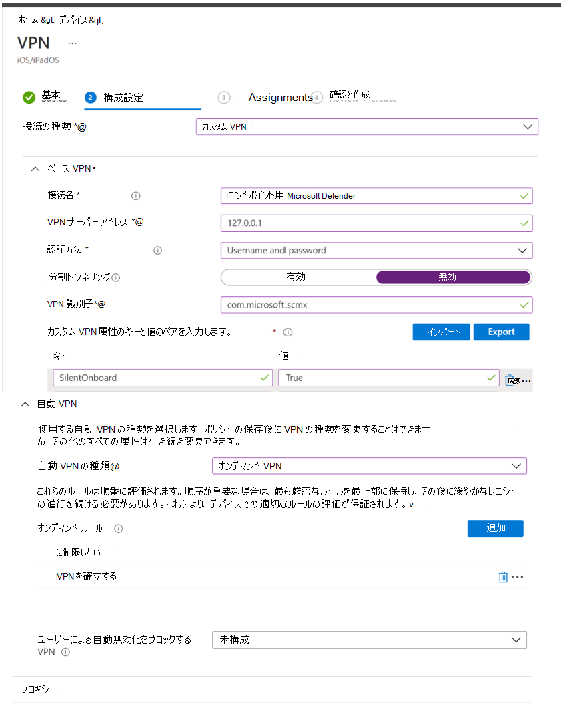
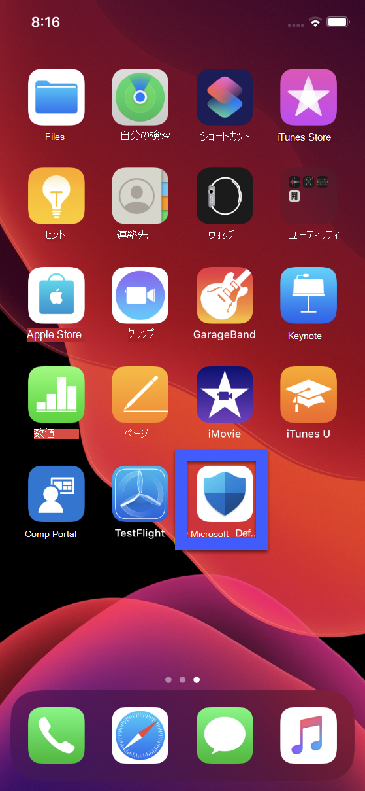
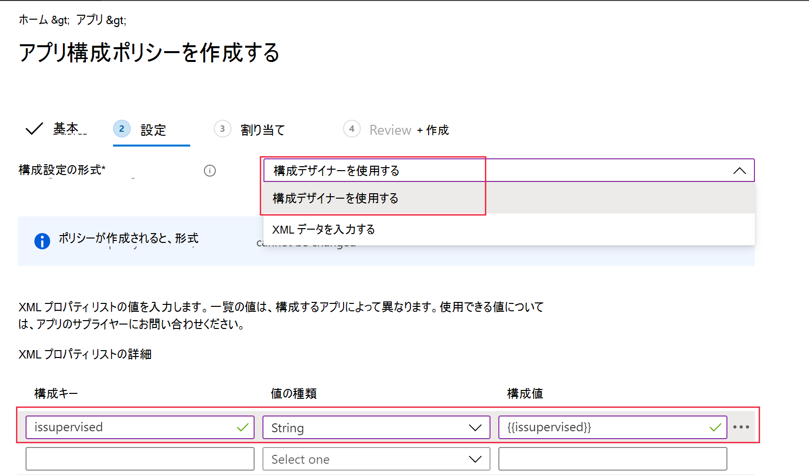

# iOS での Microsoft Defender for Endpoint の展開

[!INCLUDE [Microsoft 365 Defender rebranding](../../includes/microsoft-defender.md)]

**適用対象:**
- [Microsoft Defender for Endpoint Plan 1](https://go.microsoft.com/fwlink/p/?linkid=2154037)
- [Microsoft Defender for Endpoint Plan 2](https://go.microsoft.com/fwlink/p/?linkid=2154037)
- [Microsoft 365 Defender](https://go.microsoft.com/fwlink/?linkid=2118804)

> Defender for Endpoint を試す場合は、 [無料試用版にサインアップしてください。](https://signup.microsoft.com/create-account/signup?products=7f379fee-c4f9-4278-b0a1-e4c8c2fcdf7e&ru=https://aka.ms/MDEp2OpenTrial?ocid=docs-wdatp-investigateip-abovefoldlink)

このトピックでは、登録されているデバイス上の iOS での Defender for Endpoint の展開Intune ポータル サイト説明します。 Intune デバイスの登録の詳細については、「Intune に [iOS/iPadOS デバイスを登録する」を参照してください](/mem/intune/enrollment/ios-enroll)。

## 始める前に

- Microsoft Endpoint Manager 管理センター [へのアクセス権を持っている必要があります](https://go.microsoft.com/fwlink/?linkid=2109431)。

- ユーザーに対して iOS 登録が行われたことを確認します。 iOS で Defender for Endpoint を使用するには、Defender for Endpoint ライセンスが割り当てられている必要があります。 ライセンスの割 [り当て方法については、「ユーザー](/azure/active-directory/users-groups-roles/licensing-groups-assign) にライセンスを割り当てる」を参照してください。

> [!NOTE]
> Microsoft Defender for Endpoint on iOS は [、Apple App Store で利用できます](https://aka.ms/mdatpiosappstore)。

## 展開手順

iOS 上の Defender for Endpoint を展開するには、Intune ポータル サイト。

### iOS ストア アプリの追加

1. [Microsoft Endpoint manager 管理センターで、  ->  **アプリ] iOS/iPadOS [iOS** ストア アプリの追加] に移動し、[  ->    ->  選択] を **クリックします**。

    > [!div class="mx-imgBorder"]
    > 

1. [アプリの **追加] ページで** 、[アプリ ストアの検索] をクリック **し** 、検索バーに **「Microsoft Defender for Endpoint」** と入力します。 [検索結果] セクションで *、[Microsoft Defender for Endpoint]* をクリックし、[選択] を **クリックします**。

1. [ **最小オペレーティング システム] として [iOS 11.0]** を選択します。 アプリに関する残りの情報を確認し、[次へ] を **クリックします**。

1. [割り **当て] セクションで** 、[必須] **セクションに** 移動し、[グループの追加] **を選択します**。 その後、iOS アプリで Defender for Endpoint をターゲットとするユーザー グループを選択できます。 [選択 **] をクリック** し、[次へ] **をクリックします**。

    > [!NOTE]
    > 選択したユーザー グループは、Intune に登録されたユーザーで構成する必要があります。

    > [!div class="mx-imgBorder"]
    > 

1. [確認 *と作成] セクション* で、入力された情報が正しいか確認し、[作成] を **選択します**。 しばらくすると、Defender for Endpoint アプリが正常に作成され、ページの右上隅に通知が表示されます。

1. 表示されるアプリ情報ページの [モニター]セクションで、[デバイスのインストール状態] を選択して、デバイスのインストールが正常に完了したと確認します。

    > [!div class="mx-imgBorder"]
    > 

## VPN プロファイルの自動オンボーディング (簡易オンボーディング)

管理者は VPN プロファイルの自動セットアップを構成できます。 これにより、オンボーディング中にユーザーに設定せずに Defender for Endpoint VPN プロファイルが自動的にセットアップされます。 Web Protection 機能を提供するために VPN が使用されます。 これは通常の VPN ではなく、デバイス外のトラフィックを受け取らないローカル/自己ループ VPN です。

この手順では、VPN プロファイルを設定することでオンボーディング プロセスを簡略化します。 ゼロタッチまたはサイレント オンボーディング エクスペリエンスについては、「次のセクション:ゼロタッチ [オンボード」を参照してください](ios-install.md#zero-touch-onboarding-of-microsoft-defender-for-endpoint)。

1. [Microsoft Endpoint manager 管理センターで、[デバイス](https://go.microsoft.com/fwlink/?linkid=2109431)構成プロファイル  ->  **の作成プロファイル**]  ->  **に移動します**。
1. **[iOS/iPadOS としてプラットフォーム] を選択し、[VPN** **としてプロファイルの種類**] を **選択します**。 **[作成]** をクリックします。
1. プロファイルの名前を入力し、[次へ] を **クリックします**。
1. [ **接続の種類]** で [カスタム VPN] を選択し、[ **基本 VPN]** セクションで、次の値を入力します。
    - 接続名 = エンドポイント用 Microsoft Defender
    - VPN サーバー のアドレス = 127.0.0.1
    - Auth メソッド = "ユーザー名とパスワード"
    - スプリット トンネリング = 無効
    - VPN 識別子 = com.microsoft.scmx
    - キーと値のペアで、キー **AutoOnboard を入力し** 、値を True に設定 **します**。
    - 自動 VPN の種類 = オンデマンド VPN
    - [ **オンデマンド ルール** の **追加]** をクリックし、[次の操作を行う] **= [VPN** の確立] を選択します。[すべてのドメイン **] に制限します**。

    

1. [次へ] をクリックし、対象ユーザーにプロファイルを割り当てる。
1. [確認 *と作成] セクション* で、入力された情報が正しいか確認し、[作成] を **選択します**。

## エンドポイント向け Microsoft Defender のゼロタッチ オンボーディング

管理者は、Microsoft Defender for Endpoint を構成して、サイレント モードで展開およびアクティブ化できます。 このフローでは、ユーザーにインストールの通知が送信されます。 Defender for Endpoint は、ユーザーがアプリを開く必要なしに自動的にインストールされます。 登録された iOS デバイスで Defender for Endpoint のゼロタッチまたはサイレント展開をセットアップするには、以下の手順に従います。

1. [Microsoft Endpoint manager 管理センターで、[デバイス](https://go.microsoft.com/fwlink/?linkid=2109431)構成プロファイル  >  **の作成プロファイル**]  >  **に移動します**。
1. **[iOS/iPadOS としてプラットフォーム] を選択し、[VPN** **としてプロファイルの種類**] を **選択します**。 **[作成]** を選択します。
1. プロファイルの名前を入力し、[次へ] を **選択します**。
1. [ **接続の種類]** で [カスタム VPN] を選択し、[ **基本 VPN]** セクションで、次の値を入力します。
    - 接続名 = エンドポイント用 Microsoft Defender
    - VPN サーバー のアドレス = 127.0.0.1
    - Auth メソッド = "ユーザー名とパスワード"
    - スプリット トンネリング = 無効
    - VPN 識別子 = com.microsoft.scmx
    - キーと値のペアで **、SilentOnboard** キーを入力し、値を True に **設定します**。
    - 自動 VPN の種類 = オンデマンド VPN
    - [ **オンデマンド ルール** の **追加] を選択** し、[次の操作を行う] **= [VPN** の確立] を選択します。[すべてのドメイン **] に制限します**。

    

1. [次 **へ] を** 選択し、対象ユーザーにプロファイルを割り当てる。
1. [確認 *と作成] セクション* で、入力された情報が正しいか確認し、[作成] を **選択します**。

上記の構成が完了し、デバイスと同期すると、対象となる iOS デバイスで次のアクションが実行されます。
    - Microsoft Defender for Endpoint は展開され、サイレント オンボードされ、デバイスは Defender for Endpoint ポータルに表示されます。
    - 暫定通知がユーザー デバイスに送信されます。
    - Web Protection などの機能がアクティブ化されます。

## オンボーディングとチェックの状態を完了する

1. iOS の Defender for Endpoint がデバイスにインストールされた後、アプリ アイコンが表示されます。

    

2. [Defender for Endpoint] アプリ アイコン (MSDefender) をタップし、画面の指示に従ってオンボーディングの手順を完了します。 詳細には、iOS 上の Defender for Endpoint で必要な iOS アクセス許可のエンド ユーザーによる承諾が含まれます。

3. オンボードが成功すると、デバイスはポータルの [デバイス] リストに表示Microsoft 365 Defenderされます。

    > [!div class="mx-imgBorder"]
    > 

## 監視モード用に Microsoft Defender for Endpoint を構成する

Microsoft Defender for Endpoint on iOS アプリは、これらの種類のデバイスでプラットフォームによって提供される管理機能の強化を考えると、監視対象の iOS/iPadOS デバイスに特化した機能を備えます。 これらの機能を利用するには、Defender for Endpoint アプリがデバイスが監視モードにあるかどうかが知る必要があります。

### Intune 経由で監視モードを構成する

Intune を使用すると、アプリ構成ポリシーを使用して Defender for iOS アプリを構成できます。

   > [!NOTE]
   > 監視対象デバイスのこのアプリ構成ポリシーは、管理対象デバイスにのみ適用され、ベスト プラクティスとしてすべての管理対象 iOS デバイスを対象とする必要があります。

1. 管理センターにサインインし [Microsoft エンドポイント マネージャーアプリ](https://go.microsoft.com/fwlink/?linkid=2109431)の構成ポリシー **[** 追加] \> **に** \> **移動します**。 [管理対象デバイス **] をクリックします**。

    > [!div class="mx-imgBorder"]
    > 

1. [アプリ構成 *ポリシーの作成] ページ* で、次の情報を入力します。
    - ポリシー名
    - プラットフォーム: iOS/iPadOS を選択する
    - 対象アプリ: リスト **から [エンドポイント用 Microsoft Defender]** を選択します。

    > [!div class="mx-imgBorder"]
    > 

1. 次の画面で、[構成デザイナー **を形式として使用** する] を選択します。 次のプロパティを指定します。
    - 構成キー: issupervised
    - 値の型:String
    - 構成値: {{issupervised}}

    > [!div class="mx-imgBorder"]
    > 

1. [次 **へ] を** クリックして [スコープ タグ **] ページを** 開きます。 スコープ タグは省略可能です。 続行するには、**[次へ]** をクリックします。

1. **[割り当て]** ページで、このプロファイルを受け取るグループを選択します。 このシナリオでは、すべてのデバイスをターゲットに設定するベスト **プラクティスです**。 プロファイルの割り当ての詳細については、[ユーザーおよびデバイス プロファイルの割り当て](/mem/intune/configuration/device-profile-assign)に関するページを参照してください。

   ユーザー グループに展開する場合、ユーザーはポリシーが適用される前にデバイスにサインインする必要があります。

   **[次へ]** をクリックします。

1. **[確認および作成]** ページで、完了したら、**[作成]** を選択します。 構成プロファイルの一覧に新しいプロファイルが表示されます。

## 次の手順

- [Defender for Endpoint リスクシグナル (MAM) を含めるアプリ保護ポリシーを構成する](ios-install-unmanaged.md)
- [iOS の機能でエンドポイント用 Defender を構成する](ios-configure-features.md)
