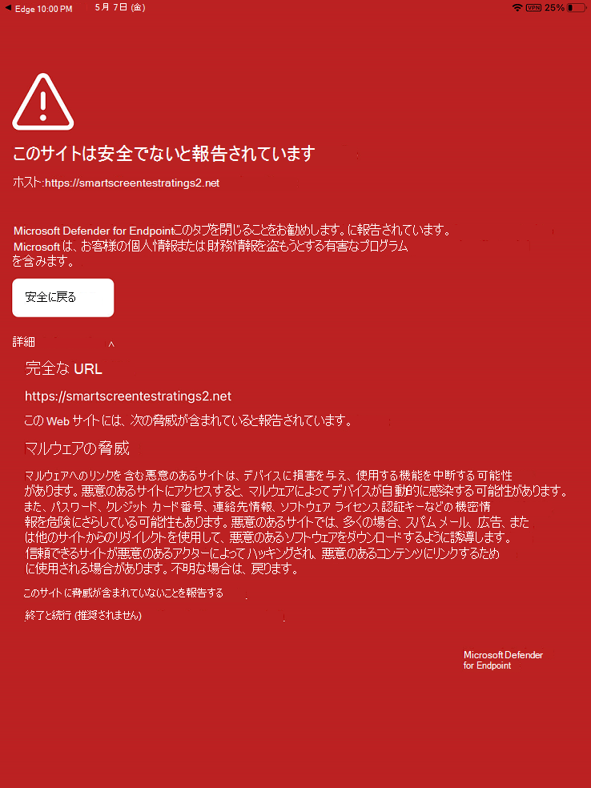

# iOS 上の Microsoft Defender for Endpoint で問題のトラブルシューティングを行い、FAQ に対する回答を見つける

[!INCLUDE [Microsoft 365 Defender rebranding](../../includes/microsoft-defender.md)]

**適用対象:**
- [Microsoft Defender for Endpoint](https://go.microsoft.com/fwlink/p/?linkid=2154037)
- [Microsoft 365 Defender](https://go.microsoft.com/fwlink/?linkid=2118804)

> Defender for Endpoint を試す場合は、 [無料試用版にサインアップしてください。](https://signup.microsoft.com/create-account/signup?products=7f379fee-c4f9-4278-b0a1-e4c8c2fcdf7e&ru=https://aka.ms/MDEp2OpenTrial?ocid=docs-wdatp-exposedapis-abovefoldlink)

このトピックでは、iOS で Microsoft Defender for Endpoint を使用する際に発生する可能性のある問題に対処するためのトラブルシューティング情報を提供します。

> [!NOTE]
> iOS 上のエンドポイントの Defender は、Web 保護機能を提供するために VPN を使用します。 これは通常の VPN ではなく、デバイス外のトラフィックを受け取らないローカル/自己ループ VPN です。

## VPN が有効になっているとアプリが動作しない
アクティブな VPN が検出されると、機能を停止するアプリがあります。 このようなアプリを使用している間は、VPN を無効にできます。 

既定では、Defender for Endpoint on iOS には Web 保護機能が含まれています。 [Web 保護は](web-protection-overview.md) 、Web の脅威からデバイスを保護し、ユーザーをフィッシング攻撃から保護するのに役立ちます。 iOS のエンドポイントの Defender は、この保護を提供するために VPN を使用します。 これはローカル VPN であり、従来の VPN とは異なり、ネットワーク トラフィックはデバイスの外部に送信されません。

既定で有効になっている場合は、VPN を無効にする必要がある場合があります。 たとえば、VPN が構成されているときに動作しないアプリを実行する場合です。 このような場合は、Defender for Endpoint アプリから直接 VPN を無効にするか、次の手順を使用して無効にできます。

1. iOS デバイスで、アプリを開き **設定[全般**] をクリック **またはタップ** し **、[VPN] をタップします**。
1. Microsoft Defender for Endpoint の "i" ボタンをクリックまたはタップします。
1. VPN を無効 **にするにはConnectをオフ** にします。

    > [!div class="mx-imgBorder"]
    > 

> [!NOTE]
> VPN が無効になっている場合、Web 保護は使用できません。 Web 保護を再び有効にするには、デバイスで Microsoft Defender for Endpoint アプリを開き、[Web 保護を有効にする] をクリックします。

## 複数の VPN プロファイルとの共存在

Apple iOS では、同時にアクティブになる複数のデバイス全体の **VPN** はサポートされていません。 デバイスに複数の VPN プロファイルを存在することができますが、一度にアクティブにできる VPN は 1 つのみです。

Microsoft Defender for Endpoint VPN は、アプリ単位または "個人用" として構成されている他の VPN と *共に存在できます*。

## バッテリー消費

アプリでは設定 iOS は、特定の期間、ユーザーに表示されるアプリのバッテリー使用量のみを表示します。 画面に表示されるアプリのバッテリー使用量は、その期間のみであり、CPU やネットワークの使用状況などの多数の要因に基づいて iOS によって計算されます。 Microsoft Defender for Endpoint では、バックグラウンドでローカル/ループバック VPN を使用して、悪意のある Web サイトや接続の Web トラフィックを確認します。 任意のアプリからのネットワーク パケットは、このチェックを通過し、Microsoft Defender for Endpoint のバッテリー使用量が不正確に計算される原因になります。 Microsoft Defender for Endpoint の実際のバッテリー消費量は、デバイスの [バッテリー] ページに表示される設定はるかに少ない値です。

バックグラウンドで実行されている Microsoft Defender for Endpoint による 1 日あたりの平均バッテリー使用量は、その日に消費されたバッテリー全体の約 **8.81% です**。 この指標は、エンド ユーザー デバイスでの Microsoft Defender for Endpoint の実際の使用状況に基づいて Apple によって報告され、上記の理由により、ネットワーク アクティビティを持つ他のアプリも考慮できます。

また、使用される VPN はローカル VPN であり、従来の VPN とは異なり、ネットワーク トラフィックはデバイスの外部に送信されません。

## データの使用状況

Microsoft Defender for Endpoint では、ローカル/ループバック VPN を使用して、悪意のある Web サイトや接続の Web トラフィックを確認します。 このため、Microsoft Defender for Endpoint データの使用状況が不正確に説明される可能性があります。 また、デバイスが携帯電話ネットワーク上にある場合、サービス プロバイダーによって報告されるデータ使用量は実際の使用量に非常に近いのに対し、設定 アプリでは、Apple は実際に使用されるデータの約 1.5 倍から 2 倍を示しています。

他の VPN サービスと同様の観測を行い、これを Apple に報告しています。

さらに、より良い保護を提供するには、Microsoft Defender for Endpoint がバックエンド サービスを最新の状態に更新する必要があります。 ただし、Microsoft Defender for Endpoint によるデータ使用量の最適化に取り組む必要があります。

## 安全でないサイトを報告する

フィッシング Web サイトは、お客様の個人情報または財務情報を取得する目的で信頼できる Web サイトになりすます。 [ネットワーク [保護に関するフィードバックを提供する](https://www.microsoft.com/wdsi/support/report-unsafe-site) ] ページにアクセスして、フィッシング サイトになる可能性のある Web サイトを報告します。

## 悪意のあるサイトが検出されました

Microsoft Defender for Endpoint は、フィッシングなどの Web ベースの攻撃からユーザーを保護します。 悪意のあるサイトが検出されると、接続がブロックされ、組織のセキュリティ センター ポータルにアラートが送信されます。 アラートには、接続のドメイン名、リモート IP アドレス、デバイスの詳細が含まれます。

さらに、iOS デバイスに通知が表示されます。 通知をタップすると、ユーザーが詳細を確認する次の画面が開きます。

> [!div class="mx-imgBorder"]
> 

## オンボード後に Defender for Endpoint コンソールにデバイスが表示されない。

オンボード後、Defender for Endpoint セキュリティ コンソールのデバイス インベントリにデバイスが表示されるのに数時間かかります。 また、デバイスがインターネット接続を持つデバイスAzure Active Directoryに正しく登録されていることを確認します。 オンボードを成功するには、デバイスを Microsoft Authenticator または Intune ポータル サイト 経由で登録する必要があります。ユーザーは、Azure AD に登録されているデバイスと同じアカウントを使用してサインインする必要があります。

> [!NOTE]
> デバイス名が Intune (Intune) コンソールMicrosoft エンドポイント マネージャー一致しない場合があります。 Defender for Endpoint コンソールのデバイス名は、モデルの<username_iPhone/iPad形式>。 Azure AD ID を使用して、Defender for Endpoint コンソールでデバイスを識別することもできます。

## データとプライバシー

収集されたデータとプライバシーの詳細については、「プライバシー情報 [- Microsoft Defender for Endpoint on iOS」を参照してください](ios-privacy.md)。

## アプリ ストアからのアプリの更新中の問題

アプリがアプリ ストア (自動更新または手動更新) を介して更新される際に問題が発生した場合は、デバイスの再起動が必要になる場合があります。 それでも問題が解決しない場合は、Defender VPN を無効にしてアプリの更新を実行できます。 アプリ内フィードバックを提供して、この問題を報告することもできます。

