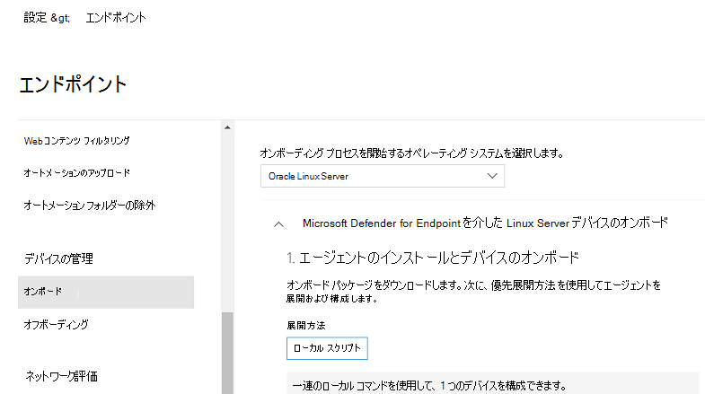

# <a name="deploy-microsoft-defender-for-endpoint-on-linux-manually"></a>Linux 用 Microsoft Defender for Endpoint を手動で展開する

[!INCLUDE [Microsoft 365 Defender rebranding](../../includes/microsoft-defender.md)]


**適用対象:**
- [Microsoft Defender for Endpoint](https://go.microsoft.com/fwlink/p/?linkid=2154037)
- [Microsoft 365 Defender](https://go.microsoft.com/fwlink/?linkid=2118804)

> Defender for Endpoint を試す場合は、 [無料試用版にサインアップしてください。](https://signup.microsoft.com/create-account/signup?products=7f379fee-c4f9-4278-b0a1-e4c8c2fcdf7e&ru=https://aka.ms/MDEp2OpenTrial?ocid=docs-wdatp-investigateip-abovefoldlink)

この記事では、Linux 用 Microsoft Defender for Endpoint を手動で展開する方法について説明します。 展開を成功させるには、次のすべてのタスクを完了する必要があります。

- [Linux 用 Microsoft Defender for Endpoint を手動で展開する](#deploy-microsoft-defender-for-endpoint-on-linux-manually)
  - [前提条件とシステム要件](#prerequisites-and-system-requirements)
  - [Linux ソフトウェア リポジトリを構成する](#configure-the-linux-software-repository)
    - [RHEL とバリアント (CentOS、Fedora、Oracle Linux、Amazon Linux 2)](#rhel-and-variants-centos-fedora-oracle-linux-and-amazon-linux-2)
    - [SLES とバリエーション](#sles-and-variants)
    - [Ubuntu および Debian システム](#ubuntu-and-debian-systems)
  - [アプリケーションのインストール](#application-installation)
  - [オンボーディング パッケージをダウンロードする](#download-the-onboarding-package)
  - [クライアント構成](#client-configuration)
  - [インストーラー スクリプト](#installer-script)
  - [インストールの問題をログする](#log-installation-issues)
  - [オペレーティング システムのアップグレード](#operating-system-upgrades)
  - [アンインストール](#uninstallation)

## <a name="prerequisites-and-system-requirements"></a>前提条件とシステム要件

開始する前に、現在のソフトウェア バージョンの前提条件とシステム要件の説明について、「[Linux 用 Microsoft Defender for Endpoint](microsoft-defender-endpoint-linux.md)」を参照してください。

## <a name="configure-the-linux-software-repository"></a>Linux ソフトウェア リポジトリを構成する

Linux 用 Defender for Endpoint は、次のチャネル (以下、*[チャネル]* と表記) のいずれかから展開できます: *insiders-fast*、*insiders-slow*、または *prod*。これらの各チャネルは、Linux ソフトウェア リポジトリに対応しています。 これらのリポジトリのいずれかを使用するようにデバイスを構成する手順を以下に示します。

チャネルの選択により、デバイスに提供される更新プログラムの種類と頻度が決まります。 *insiders-fast* のデバイスが最初に更新プログラムと新機能を受け取り、その後に *insiders-slow*、最後に *prod* が続きます。

新機能をプレビューし、早期のフィードバックを提供するために、企業内の一部のデバイスを *insiders-fast* または *insiders-slow* のいずれかを使用するように構成することをお勧めします。

> [!WARNING]
> 初期インストール後にチャネルを切り替えるには、製品を再インストールする必要があります。製品チャネルを切り替えるには: 既存のパッケージをアンインストールし、新しいチャネルを使用するようにデバイスを再構成し、このドキュメントの手順に従って新しい場所からパッケージをインストールします。

### <a name="rhel-and-variants-centos-fedora-oracle-linux-and-amazon-linux-2"></a>RHEL とバリアント (CentOS、Fedora、Oracle Linux、Amazon Linux 2)

- まだインストールされていない場合は、`yum-utils` をインストールします。

    ```bash
    sudo yum install yum-utils
    ```

- ディストリビューションとバージョンをメモし、`https://packages.microsoft.com/config/rhel/` の下でそれに最も近いエントリ (メジャー、マイナーの順に) を特定します。

    次の表を使用して、パッケージを見つけるのに役立ててください。

    <br>

    ****

    |ディストリビューションとバージョン|パッケージ|
    |---|---|
    |RHEL/Centos/Oracle 8.0-8.5 の場合|<https://packages.microsoft.com/config/rhel/8/[channel].repo>|
    |RHEL/Centos/Oracle 7.2-7.9 & Linux 2 の場合 |<https://packages.microsoft.com/config/rhel/7/[channel].repo>|
    |RHEL/Centos 6.7-6.10 の場合|<https://packages.microsoft.com/config/rhel/6/[channel].repo>|
    |Fedora 33 の場合|<https://packages.microsoft.com/config/fedora/33/prod.repo>|
    |Fedora 34 の場合|<https://packages.microsoft.com/config/fedora/34/prod.repo>|

    次のコマンドで、*[バージョン]* と *[チャネル]* を特定した情報に置き換えます。


    ```bash
    sudo yum-config-manager --add-repo=https://packages.microsoft.com/config/rhel/[version]/[channel].repo
    ```

    たとえば、CentOS 7 を実行していて、*prod* チャネルから Linux 用 Defender for Endpoint を展開する場合は次のようになります。

    ```bash
    sudo yum-config-manager --add-repo=https://packages.microsoft.com/config/rhel/7/prod.repo
    ```

    または、選択したデバイスの新機能を検討したい場合は、Linux 用 Microsoft Defender for Endpoint を *insiders-fast* チャネルに展開することをお勧めします。

    ```bash
    sudo yum-config-manager --add-repo=https://packages.microsoft.com/config/rhel/7/insiders-fast.repo
    ```

- Microsoft GPG 公開キーをインストールします。

    ```bash
    sudo rpm --import http://packages.microsoft.com/keys/microsoft.asc
    ```

- 現在有効になっている yum リポジトリのすべてのメタデータをダウンロードして使用できるようにします。

    ```bash
    yum makecache
    ```

### <a name="sles-and-variants"></a>SLES とバリエーション

- ディストリビューションとバージョンをメモし、`https://packages.microsoft.com/config/sles/` の下でそれに最も近いエントリ (メジャー、マイナーの順に) を特定します。

    次のコマンドで、*[ディストリビューション]* と *[バージョン]* を特定した情報に置き換えます。

    ```bash
    sudo zypper addrepo -c -f -n microsoft-[channel] https://packages.microsoft.com/config/[distro]/[version]/[channel].repo
    ```

    たとえば、SLES 12 を実行していて、*prod* チャネルから Linux 用 Microsoft Defender for Endpoint を展開する場合は次のようになります。

    ```bash
    sudo zypper addrepo -c -f -n microsoft-prod https://packages.microsoft.com/config/sles/12/prod.repo
    ```

- Microsoft GPG 公開キーをインストールします。

    ```bash
    sudo rpm --import http://packages.microsoft.com/keys/microsoft.asc
    ```

### <a name="ubuntu-and-debian-systems"></a>Ubuntu および Debian システム

- まだインストールされていない場合は、`curl` をインストールします。

    ```bash
    sudo apt-get install curl
    ```

- まだインストールされていない場合は、`libplist-utils` をインストールします。

    ```bash
    sudo apt-get install libplist-utils
    ```

- ディストリビューションとバージョンをメモし、`https://packages.microsoft.com/config/[distro]/` の下でそれに最も近いエントリ (メジャー、マイナーの順に) を特定します。

    以下のコマンドで、*[ディストリビューション]* と *[バージョン]* を特定した情報に置き換えます。

    ```bash
    curl -o microsoft.list https://packages.microsoft.com/config/[distro]/[version]/[channel].list
    ```

    たとえば、Ubuntu 18.04 を実行していて、*prod* チャネルから Linux 用 Microsoft Defender for Endpoint を展開する場合は次のようになります。

    ```bash
    curl -o microsoft.list https://packages.microsoft.com/config/ubuntu/18.04/prod.list
    ```

- リポジトリ構成をインストールします。

    ```bash
    sudo mv ./microsoft.list /etc/apt/sources.list.d/microsoft-[channel].list
    ```

    たとえば、*prod* チャネルを選択した場合:

    ```bash
    sudo mv ./microsoft.list /etc/apt/sources.list.d/microsoft-prod.list
    ```

- まだインストールされていない場合は、`gpg` パッケージをインストールします。

    ```bash
    sudo apt-get install gpg
    ```

  `gpg` が利用できない場合は、`gnupg` をインストールします。

- Microsoft GPG 公開キーをインストールします。

    ```bash
    curl https://packages.microsoft.com/keys/microsoft.asc | sudo apt-key add -
    ```

- https ドライバーがまだ存在しない場合は、インストールします。

    ```bash
    sudo apt-get install apt-transport-https
    ```

- リポジトリ メタデータを更新します。

    ```bash
    sudo apt-get update
    ```

## <a name="application-installation"></a>アプリケーションのインストール

- RHEL とバリエーション (CentOS および Oracle Linux):

    ```bash
    sudo yum install mdatp
    ```

    デバイスに複数の Microsoft リポジトリが構成されている場合は、パッケージのインストール元のリポジトリを指定できます。 次の例は、このデバイスで `insiders-fast` リポジトリ チャネルも構成されている場合に、`production` チャネルからパッケージをインストールする方法を示しています。 この状況は、デバイスで複数の Microsoft 製品を使用している場合に発生する可能性があります。 サーバーのディストリビューションとバージョンによっては、リポジトリ エイリアスが次の例のものと異なる場合があります。

    ```bash
    # list all repositories
    yum repolist
    ```

    ```Output
    ...
    packages-microsoft-com-prod               packages-microsoft-com-prod        316
    packages-microsoft-com-prod-insiders-fast packages-microsoft-com-prod-ins      2
    ...
    ```

    ```bash
    # install the package from the production repository
    sudo yum --enablerepo=packages-microsoft-com-prod install mdatp
    ```

- SLES とバリエーション:

    ```bash
    sudo zypper install mdatp
    ```

    デバイスに複数の Microsoft リポジトリが構成されている場合は、パッケージのインストール元のリポジトリを指定できます。 次の例は、このデバイスで `insiders-fast` リポジトリ チャネルも構成されている場合に、`production` チャネルからパッケージをインストールする方法を示しています。 この状況は、デバイスで複数の Microsoft 製品を使用している場合に発生する可能性があります。

    ```bash
    zypper repos
    ```

    ```Output
    ...
    #  | Alias | Name | ...
    XX | packages-microsoft-com-insiders-fast | microsoft-insiders-fast | ...
    XX | packages-microsoft-com-prod | microsoft-prod | ...
    ...

    ```

    ```bash
    sudo zypper install packages-microsoft-com-prod:mdatp
    ```

- Ubuntu および Debian システム:

    ```bash
    sudo apt-get install mdatp
    ```

    デバイスに複数の Microsoft リポジトリが構成されている場合は、パッケージのインストール元のリポジトリを指定できます。 次の例は、このデバイスで `insiders-fast` リポジトリ チャネルも構成されている場合に、`production` チャネルからパッケージをインストールする方法を示しています。 この状況は、デバイスで複数の Microsoft 製品を使用している場合に発生する可能性があります。

    ```bash
    cat /etc/apt/sources.list.d/*
    ```

    ```Output
    deb [arch=arm64,armhf,amd64] https://packages.microsoft.com/config/ubuntu/18.04/prod insiders-fast main
    deb [arch=amd64] https://packages.microsoft.com/config/ubuntu/18.04/prod bionic main
    ```

    ```bash
    sudo apt -t bionic install mdatp
    ```

## <a name="download-the-onboarding-package"></a>オンボーディング パッケージをダウンロードする

Microsoft 365 Defender ポータルからオンボーディング パッケージをダウンロードします。

1. Microsoft 365 Defender ポータルで、**[設定] > [エンドポイント] > [デバイス管理] > [オンボーディング]** に移動します。
2. 最初のドロップダウン メニューで、オペレーティング システムとして **[Linux サーバー]** を選択します。 2 番目のドロップダウン メニューで、展開方法として **[ローカル スクリプト]** を選択します。
3. **[オンボーディング パッケージをダウンロードする]** を選択します。 ファイルを WindowsDefenderATPOnboardingPackage.zip として保存します。

    

4. コマンド プロンプトから、ファイルがあることを確認します。
    アーカイブの内容を抽出します。

    ```bash
    ls -l
    ```

    ```Output
    total 8
    -rw-r--r-- 1 test  staff  5752 Feb 18 11:22 WindowsDefenderATPOnboardingPackage.zip
    ```

    ```bash
    unzip WindowsDefenderATPOnboardingPackage.zip
    ```

    ```Output
    Archive:  WindowsDefenderATPOnboardingPackage.zip
    inflating: MicrosoftDefenderATPOnboardingLinuxServer.py
    ```

## <a name="client-configuration"></a>クライアントの構成

1. MicrosoftDefenderATPOnboardingLinuxServer.py をターゲット デバイスにコピーします。

    最初は、クライアント デバイスは組織に関連付けられていません。 *orgId* 属性が空白であることに注意してください。

    ```bash
    mdatp health --field org_id
    ```

2. MicrosoftDefenderATPOnboardingLinuxServer.py を実行します。

    > [!NOTE]
    > このコマンドを実行するには、デバイスに `python` がインストールされている必要があります。 RHEL 8.x または Ubuntu 20.04 以降を実行している場合は、Python の代わりに Python 3 を使用する必要があります。

    ```bash
    python MicrosoftDefenderATPOnboardingLinuxServer.py
    ```

3. デバイスが組織に関連付けられていることを確認し、有効な組織 ID を報告します。

    ```bash
    mdatp health --field org_id
    ```

4. インストールが完了してから数分後、次のコマンドを実行して状態を確認できます。 `1` の戻り値は、製品が期待どおりに機能していることを示します。

    ```bash
    mdatp health --field healthy
    ```

    > [!IMPORTANT]
    > 製品が初めて起動すると、最新のウイルス対策定義がダウンロードされます。 インターネット接続によっては、これには数分かかる場合があります。 この間、上記のコマンドは `false` の値を返します。 次のコマンドを使用して、定義の更新の状態を確認できます。
    >
    > ```bash
    > mdatp health --field definitions_status
    > ```
    >
    > 初期インストールの完了後にプロキシの構成が必要な場合もあることに注意してください。 「[静的プロキシ検出のための Linux 用 Defender for Endpoint の構成: インストール後の構成](linux-static-proxy-configuration.md#post-installation-configuration)」を参照してください。

5. 検出テストを実行して、デバイスが適切にオンボードされ、サービスに報告されていることを確認します。 新しくオンボードされたデバイスで次の手順を実行します。

    - リアルタイム保護が有効になっていることを確認します (`1` が次のコマンドを実行した結果として示されます)。

        ```bash
        mdatp health --field real_time_protection_enabled
        ```

    - [ターミナル] ウィンドウを開きます。 次のコマンドをコピーして実行します。

        ``` bash
        curl -o /tmp/eicar.com.txt https://www.eicar.org/download/eicar.com.txt
        ```

    - ファイルは、Linux 用 Defender for Endpoint によって検疫されている必要があります。 次のコマンドを使用して、検出されたすべての脅威を一覧表示します。

        ```bash
        mdatp threat list
        ```

## <a name="experience-linux-endpoint-detection-and-response-edr-capabilities-with-simulated-attacks"></a>シミュレートされた攻撃で Linux エンドポイントの検出と応答 (EDR) 機能を体験する

Linux 用 EDR の機能をテストするには、以下の手順に従って Linux サーバーでの検出をシミュレートし、ケースを調査します。

1. オンボードされた Linux サーバーが Microsoft 365 Defender に表示されることを確認します。 これがマシンの最初のオンボーディングである場合、表示されるまで最大 20 分かかります。

2. [スクリプト ファイル](https://aka.ms/LinuxDIY)をダウンロードしてオンボードされた Linux サーバーに抽出し、次のコマンドを実行します: `./mde_linux_edr_diy.sh`

3. 数分後、Microsoft 365 Defender で検出が行われるはずです。

4. アラートの詳細、マシンのタイムラインを確認し、一般的な調査手順を実行します。

## <a name="installer-script"></a>インストーラー スクリプト

または、[公開 GitHub リポジトリ](https://github.com/microsoft/mdatp-xplat/)で提供されている自動[インストーラー bash スクリプト](https://github.com/microsoft/mdatp-xplat/blob/master/linux/installation/mde_installer.sh)を使用することもできます。
スクリプトは、ディストリビューションとバージョンを識別し、最新のパッケージをプルしてインストールするようにデバイスを設定します。
提供されているスクリプトを使用してオンボードすることもできます。

```bash
❯ ./mde_installer.sh --help
usage: basename ./mde_installer.sh [OPTIONS]
Options:
-c|--channel      specify the channel from which you want to install. Default: insiders-fast
-i|--install      install the product
-r|--remove       remove the product
-u|--upgrade      upgrade the existing product
-o|--onboard      onboard/offboard the product with <onboarding_script>
-p|--passive-mode set EPP to passive mode
-t|--tag          set a tag by declaring <name> and <value>. ex: -t GROUP Coders
-m|--min_req      enforce minimum requirements
-w|--clean        remove repo from package manager for a specific channel
-v|--version      print out script version
-h|--help         display help
```

詳細については[こちら](https://github.com/microsoft/mdatp-xplat/tree/master/linux/installation)をご覧ください。

## <a name="log-installation-issues"></a>インストールの問題をログする

エラーが発生したときにインストーラーによって作成される自動生成されたログを見つける方法の詳細については、「[インストールの問題をログする](linux-resources.md#log-installation-issues)」を参照してください。

## <a name="operating-system-upgrades"></a>オペレーティング システムのアップグレード

オペレーティング システムを新しいメジャー バージョンにアップグレードするときは、最初に Linux 用 Defender for Endpoint をアンインストールし、アップグレードをインストールしてから、最後にデバイスの Linux 用 Defender for Endpoint を再構成する必要があります。

## <a name="how-to-migrate-from-insiders-fast-to-production-channel"></a>Insiders-Fast から Production チャネルに移行する方法

1. Linux 用 Defender for Endpoint の "Insiders-Fast チャネル" バージョンをアンインストールします。

    ```bash
    sudo yum remove mdatp
    ```

1. Linux 用 Defender for Endpoint の Insiders-Fast リポジトリを無効にする

    ```bash
    sudo yum repolist
    ```

    > [!NOTE]
    > 出力には "packages-microsoft-com-fast-prod" と表示されます。

    ```bash
    sudo yum-config-manager --disable packages-microsoft-com-fast-prod
    ```

1. "Production チャネル" を使用して、Linux 用 Microsoft Defender for Endpoint を再展開します。

## <a name="uninstallation"></a>アンインストール

Linux 用 Defender for Endpoint をクライアント デバイスから削除する方法の詳細については、「[アンインストール](linux-resources.md#uninstall)」を参照してください。

## <a name="see-also"></a>関連項目

- [エージェントの正常性に関する問題の調査](health-status.md)
