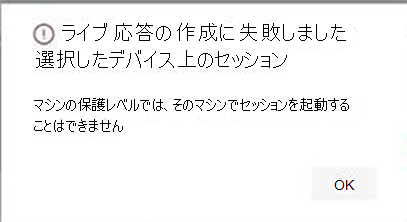

# <a name="investigate-entities-on-devices-using-live-response"></a>ライブ応答を使用してデバイス上のエンティティを調査する

[!INCLUDE [Microsoft 365 Defender rebranding](../../includes/microsoft-defender.md)]

**適用対象:**
- [Microsoft Defender for Endpoint](https://go.microsoft.com/fwlink/p/?linkid=2154037)
- [Microsoft 365 Defender](https://go.microsoft.com/fwlink/?linkid=2118804)


> Defender for Endpoint を体験してみませんか? [無料試用版にサインアップしてください。](https://www.microsoft.com/microsoft-365/windows/microsoft-defender-atp?ocid=docs-wdatp-investigateip-abovefoldlink)

ライブ応答により、セキュリティ運用チームはリモート シェル接続を使用してデバイス (コンピューターとも呼ばれます) に瞬時にアクセスできます。 これにより、詳細な調査作業を行い、迅速に特定された脅威をリアルタイムに含める即時対応アクションを実行できます。

ライブ応答は、セキュリティ運用チームが法医学データを収集し、スクリプトを実行し、分析のために疑わしいエンティティを送信し、脅威を修復し、新たな脅威を積極的に捜し出して調査を強化するように設計されています。

> [!VIDEO https://www.microsoft.com/videoplayer/embed/RE4qLUW]

ライブ応答を使用すると、アナリストは次のすべてのタスクを実行できます。

- 基本的なコマンドと高度なコマンドを実行して、デバイスで調査作業を実行します。
- PowerShell スクリプトのマルウェア サンプルや結果などのファイルをダウンロードします。
- バックグラウンドでファイルをダウンロードする (new!)。
- アップロード PowerShell スクリプトまたは実行可能ファイルをライブラリに追加し、テナント レベルからデバイスで実行します。
- 修復アクションを実行または元に戻します。

## <a name="before-you-begin"></a>はじめに

デバイスでセッションを開始する前に、次の要件を満たしていることを確認してください。

- **サポートされているバージョンのファイルを** 実行Windows。

  デバイスは、次のいずれかのバージョンのデバイスを実行している必要Windows

  - **Windows 10**
    - [バージョン 1909](/windows/whats-new/whats-new-windows-10-version-1909) 以降
    - [バージョン 1903](/windows/whats-new/whats-new-windows-10-version-1903) [(KB4515384)](https://support.microsoft.com/help/4515384/windows-10-update-kb4515384)
    - [KB4537818](https://support.microsoft.com/help/4537818/windows-10-update-kb4537818)のバージョン[1809 (RS 5)](/windows/whats-new/whats-new-windows-10-version-1809)
    - [バージョン 1803 (RS 4)](/windows/whats-new/whats-new-windows-10-version-1803) [KB4537795](https://support.microsoft.com/help/4537795/windows-10-update-kb4537795)
    - [バージョン 1709 (RS 3)](/windows/whats-new/whats-new-windows-10-version-1709) [KB4537816](https://support.microsoft.com/help/4537816/windows-10-update-kb4537816)

  - **WindowsServer 2019 - パブリック プレビューにのみ適用**
    - バージョン 1903 以降 [(KB4515384](https://support.microsoft.com/help/4515384/windows-10-update-kb4515384)を使用)
    - バージョン 1809 [(KB4537818 付](https://support.microsoft.com/help/4537818/windows-10-update-kb4537818)き)

- **[詳細設定] ページからライブ応答を有効にします**。

  [高度な機能の設定] ページでライブ応答機能 [を有効にする必要](advanced-features.md) があります。

  > [!NOTE]
  > これらの設定を編集できるのは、セキュリティまたはグローバル管理者の役割を管理するユーザーのみです。

- **[詳細設定] ページ (推奨) からサーバーのライブ応答を有効** にします。

  > [!NOTE]
  > これらの設定を編集できるのは、セキュリティまたはグローバル管理者の役割を管理するユーザーのみです。

- **デバイスにオートメーション修復レベルが割り当てられているか確認します**。

  少なくとも、特定のデバイス グループの最小修復レベルを有効にする必要があります。 それ以外の場合は、そのグループのメンバーに対してライブ応答セッションを確立できません。

  次のエラーが表示されます。

  

- **ライブ応答の署名されていないスクリプトの実行を有効** にする (オプション)。

  > [!WARNING]
  > 署名されていないスクリプトの使用を許可すると、脅威にさらされる可能性があります。

  署名されていないスクリプトを実行すると、脅威にさらされる可能性が高くなされるため、お勧めできません。 ただし、それらを使用する必要がある場合は、[高度な機能の設定] ページで設定 [を有効にする必要](advanced-features.md) があります。

- **適切なアクセス許可を持っている必要があります**。

  適切なアクセス許可を持つプロビジョニングされたユーザーだけがセッションを開始できます。 役割の割り当ての詳細については、「役割の作成と [管理」を参照してください](user-roles.md)。

  > [!IMPORTANT]
  > ファイルをライブラリにアップロードするオプションは、"Manage Security 設定" アクセス許可を持つユーザーにのみ使用できます。
  > 委任されたアクセス許可のみを持つユーザーの場合、ボタンはグレー表示されます。

  付与されている役割に応じて、基本的なライブ応答コマンドまたは高度なライブ応答コマンドを実行できます。 ユーザーのアクセス許可は、RBAC カスタム ロールによって制御されます。

## <a name="live-response-dashboard-overview"></a>ライブ応答ダッシュボードの概要

デバイスでライブ応答セッションを開始すると、ダッシュボードが開きます。 ダッシュボードには、次のようなセッションに関する情報が表示されます。

- Who作成されたセッション
- セッションが開始された場合
- セッションの期間

ダッシュボードでは、次の情報にアクセスすることもできます。

- セッションを切断する
- アップロードライブラリにファイルを追加する
- コマンド コンソール
- コマンド ログ

## <a name="initiate-a-live-response-session-on-a-device"></a>デバイスでライブ応答セッションを開始する

1. ポータルにサインインMicrosoft 365 Defenderします。

2. [デバイス インベントリ **>エンドポイント] に移動し、** 調査するデバイスを選択します。 [デバイス] ページが開きます。

3. [ライブ応答セッションの開始] を選択して、ライブ **応答セッションを起動します**。 コマンド コンソールが表示されます。 セッションがデバイスに接続するまで待ちます。

4. 組み込みのコマンドを使用して調査作業を行います。 詳細については、「ライブ応答コマンド [」を参照してください](#live-response-commands)。

5. 調査が完了したら、[セッションの切断] **を選択し**、[確認] を **選択します**。

## <a name="live-response-commands"></a>ライブ応答コマンド

付与されている役割に応じて、基本的なライブ応答コマンドまたは高度なライブ応答コマンドを実行できます。 ユーザーのアクセス許可は、RBAC カスタム ロールによって制御されます。 役割の割り当ての詳細については、「役割の作成と [管理」を参照してください](user-roles.md)。

> [!NOTE]
> ライブ応答はクラウドベースの対話型シェルであり、エンド ユーザーとターゲット デバイスの間のネットワーク品質とシステム負荷に応じて、特定のコマンド エクスペリエンスが応答時間によって異なる場合があります。

### <a name="basic-commands"></a>基本コマンド

次のコマンドは、基本的なライブ応答コマンドを実行する機能が付与されたユーザー **ロールで** 使用できます。 役割の割り当ての詳細については、「役割の作成と [管理」を参照してください](user-roles.md)。

|コマンド|説明|
|---|---|---|
|`cd`|現在のディレクトリを変更します。|
|`cls`|コンソール画面をクリアします。|
|`connect`|デバイスへのライブ応答セッションを開始します。|
|`connections`|すべてのアクティブな接続を表示します。|
|`dir`|ディレクトリ内のファイルとサブディレクトリの一覧を表示します。|
|`drivers`|デバイスにインストールされているすべてのドライバーを表示します。|
|`fg <command ID>`|指定したジョブをフォアグラウンドのフォアグラウンドに配置し、現在のジョブに設定します。 <br> メモ: fg は、PID ではなくジョブから使用できる "コマンド ID" を受け取る|
|`fileinfo`|ファイルに関する情報を取得します。|
|`findfile`|デバイス上の特定の名前でファイルを検索します。|
|`getfile <file_path>`|ファイルをダウンロードします。|
|`help`|ライブ応答コマンドのヘルプ情報を提供します。|
|`jobs`|現在実行中のジョブ、その ID、状態を表示します。|
|`persistence`|デバイス上のすべての既知の永続化メソッドを表示します。|
|`processes`|デバイスで実行しているすべてのプロセスを表示します。|
|`registry`|レジストリ値を表示します。|
|`scheduledtasks`|デバイス上のすべてのスケジュールされたタスクを表示します。|
|`services`|デバイス上のすべてのサービスを表示します。|
|`trace`|ターミナルのログ モードをデバッグに設定します。|

### <a name="advanced-commands"></a>高度なコマンド

次のコマンドは、高度なライブ応答コマンドを実行する機能が付与されたユーザー **ロールで** 使用できます。 役割の割り当ての詳細については、「役割の作成と [管理」を参照してください](user-roles.md)。

|コマンド|説明|
|---|---|
|`analyze`|さまざまな犯罪エンジンを使用してエンティティを分析し、評決に達します。|
|`run`|デバイス上のライブラリから PowerShell スクリプトを実行します。|
|`library`|ライブ応答ライブラリにアップロードされたファイルを一覧表示します。|
|`putfile`|ライブラリからデバイスにファイルを置く。 ファイルは作業フォルダーに保存され、デバイスが既定で再起動すると削除されます。|
|`remediate`|デバイス上のエンティティを修復します。 修復アクションは、エンティティの種類によって異なります。<br>- ファイル: 削除<br>- プロセス: イメージ ファイルを停止、削除する<br>- サービス: イメージ ファイルの停止、削除<br>- レジストリ エントリ: 削除<br>- スケジュールされたタスク: 削除<br>- スタートアップ フォルダーアイテム: ファイルの削除 <br> 注: このコマンドには、前提条件のコマンドがあります。 このコマンドを組み `-auto` 合わせて使用すると `remediate` 、前提条件コマンドを自動的に実行できます。
|`undo`|修復されたエンティティを復元します。|

## <a name="use-live-response-commands"></a>ライブ応答コマンドの使用

コンソールで使用できるコマンドは、「コマンド」と同様の原則[Windows従います](/windows-server/administration/windows-commands/windows-commands#BKMK_c)。

高度なコマンドは、ファイルのダウンロードとアップロード、デバイスでのスクリプトの実行、エンティティに対する修復アクションの実行など、より強力なアクションを実行できる、より堅牢なアクションセットを提供します。

### <a name="get-a-file-from-the-device"></a>デバイスからファイルを取得する

調査中のデバイスからファイルを取得するシナリオでは、このコマンドを使用 `getfile` できます。 これにより、詳細な調査のためにデバイスからファイルを保存できます。

> [!NOTE]
> 次のファイル サイズの制限が適用されます。
>
> - `getfile` limit: 3 GB
> - `fileinfo` limit: 10 GB
> - `library` limit: 250 MB

### <a name="download-a-file-in-the-background"></a>バックグラウンドでファイルをダウンロードする

セキュリティ運用チームが影響を受けるデバイスの調査を続行するために、ファイルをバックグラウンドでダウンロードできます。

- バックグラウンドでファイルをダウンロードするには、ライブ応答コマンド コンソールに「. `download <file_path> &`
- ファイルのダウンロードを待っている場合は、Ctrl + Z を使用してバックグラウンドに移動できます。
- ファイルのダウンロードをフォアグラウンドに移動するには、ライブ応答コマンド コンソールに `fg <command_id>` 「.

次に、いくつかの例を示します:

|コマンド|機能|
|---|---|
|`getfile "C:\windows\some_file.exe" &`|バックグラウンドで *some_file.exeダウンロードを* 開始します。|
|`fg 1234`|コマンド ID *1234* のダウンロードをフォアグラウンドに返します。|

### <a name="put-a-file-in-the-library"></a>ライブラリにファイルを置く

ライブ応答には、ファイルを挿入できるライブラリがあります。 ライブラリには、テナント レベルでライブ応答セッションで実行できるファイル (スクリプトなど) が格納されます。

ライブ応答を使用すると、PowerShell スクリプトを実行することができますが、ファイルを実行する前に、まずファイルをライブラリに挿入する必要があります。

ライブ応答セッションを開始するデバイスで実行できる PowerShell スクリプトのコレクションを使用できます。

#### <a name="to-upload-a-file-in-the-library"></a>ライブラリ内のファイルをアップロードするには

1. [ファイル **アップロードライブラリ] をクリックします**。

2. [参照 **] をクリック** し、ファイルを選択します。

3. 簡単な説明を入力します。

4. 同じ名前のファイルを上書きするかどうかを指定します。

5. スクリプトに必要なパラメーターを知りたい場合は、[スクリプト パラメーター] チェック ボックスをオンにします。 テキスト フィールドに例と説明を入力します。

6. [確認 **] をクリックします**。

7. (省略可能)ファイルがライブラリにアップロードされたと確認するには、コマンドを実行 `library` します。

### <a name="cancel-a-command"></a>コマンドの取り消し

セッション中は、Ctrl + C キーを押してコマンドをキャンセルできます。

> [!WARNING]
> このショートカットを使用すると、エージェント側でコマンドが停止しない。 このコマンドは、ポータル内のコマンドのみを取り消します。 したがって、"修復" などの操作を変更すると、コマンドが取り消される間、続行される場合があります。

## <a name="run-a-powershell-script"></a>PowerShell スクリプトを実行する

PowerShell スクリプトを実行する前に、まずライブラリにアップロードする必要があります。

スクリプトをライブラリにアップロードした後、コマンド `run` を使用してスクリプトを実行します。

セッションで署名されていないスクリプトを使用する場合は、[高度な機能の設定] ページで設定 [を有効にする必要](advanced-features.md) があります。

> [!WARNING]
> 署名されていないスクリプトの使用を許可すると、脅威にさらされる可能性があります。

## <a name="apply-command-parameters"></a>コマンド パラメーターの適用

- コマンド パラメーターの詳細については、コンソール のヘルプを参照してください。 個々のコマンドの詳細については、次のコマンドを実行します。

  ```powershell
  help <command name>
  ```

- コマンドにパラメーターを適用する場合、パラメーターは固定順序に基づいて処理されます。

  ```powershell
  <command name> param1 param2
  ```

- 固定順序以外のパラメーターを指定する場合は、値を指定する前に、パラメーターの名前をハイフンで指定します。

  ```powershell
  <command name> -param2_name param2
  ```

- 必須コマンドがあるコマンドを使用する場合は、フラグを使用できます。

  ```powershell
  <command name> -type file -id <file path> - auto
  ```

  または

  ```powershell
  remediate file <file path> - auto`
  ```

## <a name="supported-output-types"></a>サポートされている出力の種類

ライブ応答は、テーブルと JSON 形式の出力の種類をサポートします。 コマンドごとに、既定の出力動作があります。 次のコマンドを使用して、出力を好みの出力形式で変更できます。

- `-output json`
- `-output table`

> [!NOTE]
> スペースが限られているので、テーブル形式で表示されるフィールドは少なめになります。 出力の詳細を表示するには、JSON 出力コマンドを使用して詳細を表示できます。

## <a name="supported-output-pipes"></a>サポートされている出力パイプ

ライブ応答は、CLI とファイルへの出力パイプをサポートします。 CLI は既定の出力動作です。 [command] コマンドと [filename]コマンドを使用して、出力をファイル>パイプ.txt。

例:

```console
processes > output.txt
```

## <a name="view-the-command-log"></a>コマンド ログの表示

[コマンド **ログ] タブを** 選択すると、セッション中にデバイスで使用されるコマンドが表示されます。 各コマンドは、次のような完全な詳細で追跡されます。

- ID
- コマンド ライン
- 期間
- 状態と入力または出力のサイド バー

## <a name="limitations"></a>制限事項

- ライブ応答セッションは、一度に 25 のライブ応答セッションに制限されます。
- ライブ応答セッションの非アクティブタイムアウト値は 30 分です。
- ユーザーは最大 10 の同時セッションを開始できます。
- デバイスは、一度に 1 つのセッションでのみ使用できます。
- 次のファイル サイズの制限が適用されます。
  - `getfile` limit: 3 GB
  - `fileinfo` limit: 10 GB
  - `library` limit: 250 MB

## <a name="related-article"></a>関連記事

- [ライブ応答コマンドの例](live-response-command-examples.md)
