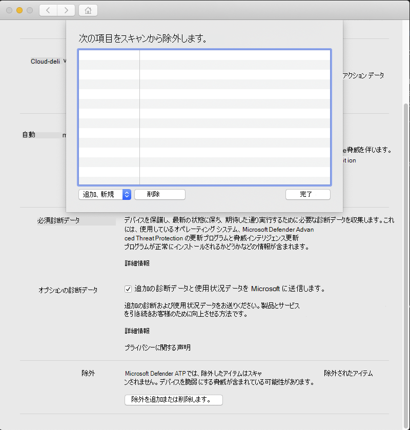

# <a name="configure-and-validate-exclusions-for-microsoft-defender-for-endpoint-on-macos"></a>macOS 上のエンドポイント用 Microsoft Defender の除外を構成および検証する

[!INCLUDE [Microsoft 365 Defender rebranding](../../includes/microsoft-defender.md)]


**適用対象:**
- [Microsoft Defender for Endpoint Plan 1](https://go.microsoft.com/fwlink/p/?linkid=2154037)
- [Microsoft Defender for Endpoint Plan 2](https://go.microsoft.com/fwlink/p/?linkid=2154037)
- [Microsoft 365 Defender](https://go.microsoft.com/fwlink/?linkid=2118804)

> Defender for Endpoint を試す場合は、 [無料試用版にサインアップしてください。](https://signup.microsoft.com/create-account/signup?products=7f379fee-c4f9-4278-b0a1-e4c8c2fcdf7e&ru=https://aka.ms/MDEp2OpenTrial?ocid=docs-wdatp-investigateip-abovefoldlink)

この記事では、オンデマンド スキャンに適用される除外を定義する方法、およびリアルタイムの保護と監視について情報を提供します。

> [!IMPORTANT]
> この記事で説明する除外は、エンドポイントの検出と応答 (エンドポイントの検出など) を含む、他の Defender for Endpoint on Mac 機能にはEDR。 この記事で説明する方法を使用して除外するファイルは、アラートや他の検出EDRトリガーできます。

特定のファイル、フォルダー、プロセス、およびプロセスで開いたファイルは、Defender for Endpoint on Mac スキャンから除外できます。

除外は、組織に固有またはカスタマイズされたファイルまたはソフトウェアで誤った検出を回避するために役立ちます。 また、Defender for Endpoint on Mac によるパフォーマンスの問題を軽減する場合にも役立ちます。

> [!WARNING]
> 除外を定義すると、Defender for Endpoint on Mac によって提供される保護が低下します。 除外の実装に関連付けられているリスクは常に評価する必要があります。悪意がないと確信しているファイルのみを除外する必要があります。

## <a name="supported-exclusion-types"></a>サポートされる除外の種類

次の表に、Defender for Endpoint on Mac でサポートされる除外の種類を示します。

除外|定義|例
---|---|---
ファイル拡張子|拡張機能を持つすべてのファイル (コンピューター上の任意の場所)|`.test`
File|完全パスで識別される特定のファイル|`/var/log/test.log` <p> `/var/log/*.log` <p> `/var/log/install.?.log`
フォルダー|指定したフォルダーの下のすべてのファイル (再帰的)|`/var/log/` <p> `/var/*/`
プロセス|特定のプロセス (完全なパスまたはファイル名で指定) と、そのプロセスで開くすべてのファイル|`/bin/cat` <p> `cat` <p> `c?t`

ファイル、フォルダー、およびプロセスの除外は、次のワイルドカードをサポートします。

ワイルドカード|説明|例|一致|一致しない
---|---|---|---|---
\*|none を含む任意の数の文字と一致します (パス内でこのワイルドカードを使用すると、1 つのフォルダーのみを置き換える点に注意してください)|`/var/*/*.log`|`/var/log/system.log`|`/var/log/nested/system.log`
?|任意の 1 文字に一致する|`file?.log`|`file1.log` <p> `file2.log`|`file123.log`

> [!NOTE]
> 除外を評価するときに、製品は firmlinks の解決を試みる。 除外にワイルドカードが含まれているか、ターゲット ファイル ( `Data` ボリューム上) が存在しない場合、Firmlink 解決は機能しません。

## <a name="how-to-configure-the-list-of-exclusions"></a>除外の一覧を構成する方法

### <a name="from-the-management-console"></a>管理コンソールから

JAMF、Intune、または別の管理コンソールから除外を構成する方法の詳細については、「 [Defender for Endpoint on Mac の設定」を参照してください](mac-preferences.md)。

### <a name="from-the-user-interface"></a>ユーザー インターフェイスから

次のスクリーンショットに示すように、Defender for  Endpoint \> アプリケーションを開き、[設定の追加と削除の除外 **..** を管理する] に移動します。



追加する除外の種類を選択し、プロンプトに従います。

## <a name="validate-exclusions-lists-with-the-eicar-test-file"></a>EICAR テスト ファイルを使用して除外リストを検証する

除外リストが機能している場合は、テスト ファイル `curl` をダウンロードして検証できます。

次の Bash スニペットで、除外 `test.txt` ルールに準拠したファイルに置き換えます。 たとえば、拡張機能を除外した場合は `.testing` 、 に置き換 `test.txt` える `test.testing`。 パスをテストする場合は、そのパス内でコマンドを実行してください。

```bash
curl -o test.txt https://www.eicar.org/download/eicar.com.txt
```

Defender for Endpoint on Mac でマルウェアが報告された場合、ルールは機能していません。 マルウェアの報告がない場合、ダウンロードしたファイルが存在する場合は、除外が機能しています。 ファイルを開き、EICAR テスト ファイル Web サイトで説明されている内容と内容が同じ [ことを確認できます](http://2016.eicar.org/86-0-Intended-use.html)。

インターネット にアクセスできない場合は、独自の EICAR テスト ファイルを作成できます。 次の Bash コマンドを使用して、EICAR 文字列を新しいテキスト ファイルに書き込む。

```bash
echo 'X5O!P%@AP[4\PZX54(P^)7CC)7}$EICAR-STANDARD-ANTIVIRUS-TEST-FILE!$H+H*' > test.txt
```

文字列を空白のテキスト ファイルにコピーして、ファイル名または除外するフォルダーに保存することもできます。

## <a name="allow-threats"></a>脅威を許可する

特定のコンテンツをスキャン対象から除外する以外に、脅威の一部のクラス (脅威名で識別される) を検出しない製品を構成することもできます。 この機能を使用する場合は、デバイスの保護が解除される可能性があります。注意が必要です。

許可リストに脅威名を追加するには、次のコマンドを実行します。

```bash
mdatp threat allowed add --name [threat-name]
```

デバイス上の検出に関連付けられた脅威名は、次のコマンドを使用して取得できます。

```bash
mdatp threat list
```

たとえば、許可リスト `EICAR-Test-File (not a virus)` に (EICAR 検出に関連付けられている脅威名) を追加するには、次のコマンドを実行します。

```bash
mdatp threat allowed add --name "EICAR-Test-File (not a virus)"
```
