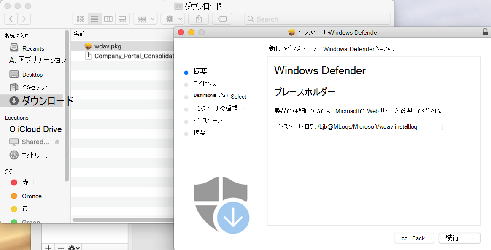
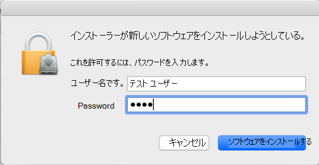
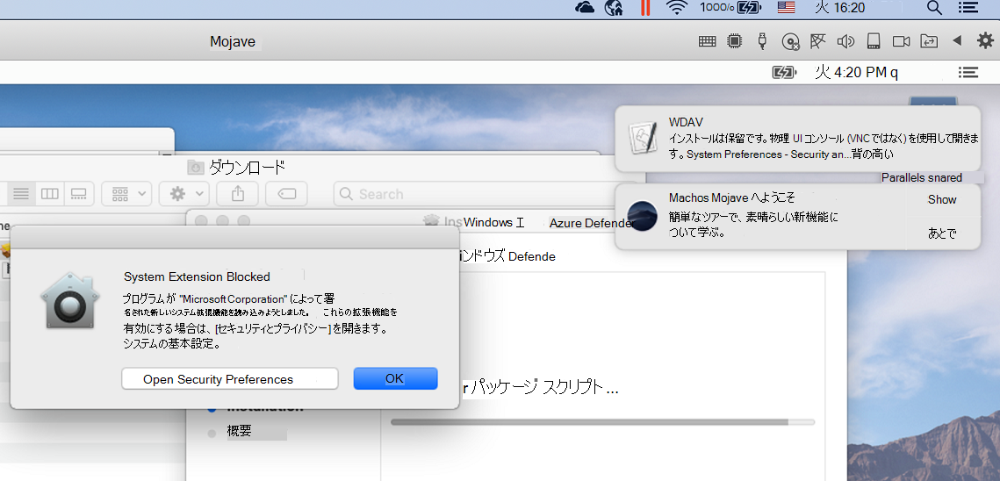
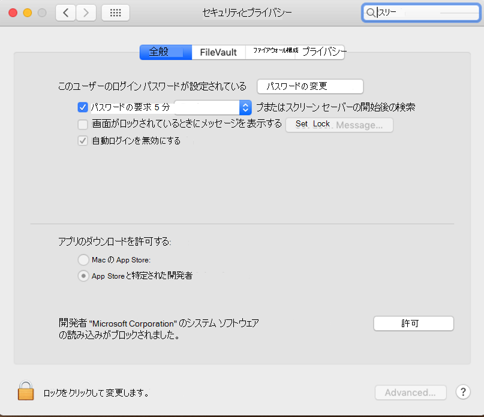
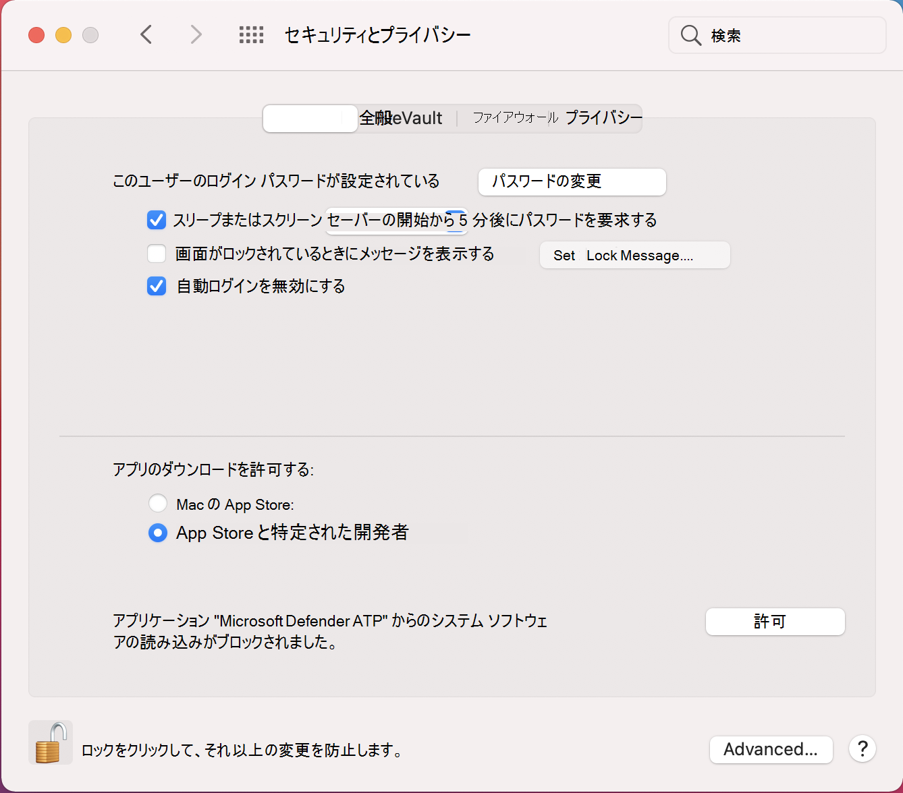

# <a name="manual-deployment-for-microsoft-defender-for-endpoint-for-macos"></a>microsoft Defender for Endpoint for macOS の手動展開

[!INCLUDE [Microsoft 365 Defender rebranding](../../includes/microsoft-defender.md)]

**適用対象:**
- [Microsoft Defender for Endpoint](https://go.microsoft.com/fwlink/p/?linkid=2154037)
- [Microsoft 365 Defender](https://go.microsoft.com/fwlink/?linkid=2118804)

> Defender for Endpoint を体験してみませんか? [無料試用版にサインアップします。](https://www.microsoft.com/microsoft-365/windows/microsoft-defender-atp?ocid=docs-wdatp-investigateip-abovefoldlink)

このトピックでは、Microsoft Defender for Endpoint for macOS を手動で展開する方法について説明します。 展開が成功するには、次のすべての手順を完了する必要があります。
- [インストール パッケージとオンボーディング パッケージのダウンロード](#download-installation-and-onboarding-packages)
- [アプリケーションのインストール (macOS 10.15 以前のバージョン)](#application-installation-macos-1015-and-older-versions)
- [アプリケーションのインストール (macOS 11 以降のバージョン)](#application-installation-macos-11-and-newer-versions)
- [クライアント構成](#client-configuration)

## <a name="prerequisites-and-system-requirements"></a>前提条件とシステム要件

開始する前に、現在のソフトウェア バージョンの前提条件とシステム要件の説明については、 [メインの Microsoft Defender for Endpoint for macOS](microsoft-defender-endpoint-mac.md) ページを参照してください。

## <a name="download-installation-and-onboarding-packages"></a>インストール パッケージとオンボーディング パッケージのダウンロード

Microsoft Defender セキュリティ センターからインストールパッケージとオンボーディング パッケージをダウンロードします。

1. Microsoft Defender セキュリティ センターで、[デバイス管理とオンボード **>設定>移動します**。
2. ページのセクション 1 で、オペレーティング システムを **macOS** に設定し、Deployment メソッドをローカル スクリプト **に設定します**。
3. ページのセクション 2 で、[インストール パッケージのダウンロード **] を選択します**。 wdav.pkg としてローカル ディレクトリに保存します。
4. ページのセクション 2 で、[オンボーディング パッケージの **ダウンロード] を選択します**。 同じディレクトリWindowsDefenderATPOnboardingPackage.zipとして保存します。

    

5. コマンド プロンプトから、2 つのファイルが存在するように確認します。
    
## <a name="application-installation-macos-1015-and-older-versions"></a>アプリケーションのインストール (macOS 10.15 以前のバージョン)

このプロセスを完了するには、デバイスに対する管理者権限が必要です。

1. Finder でダウンロードした wdav.pkg に移動し、開きます。

    

2. [ **続行] を** 選択し、ライセンス条項に同意し、メッセージが表示されたらパスワードを入力します。

    

   > [!IMPORTANT]
   > Microsoft のドライバーのインストールを許可するように求めるメッセージが表示されます ("System Extension Blocked" または "Installation is on hold" のいずれかまたは両方)。 ドライバーのインストールを許可する必要があります。

   

3. [ **セキュリティの基本設定を開く]** または [システム環境設定を開く **] >[セキュリティ] &選択します**。 [許可 **] を選択します**。

    

   インストールが続行されます。

   > [!CAUTION]
   > [許可] を選択しない **場合**、インストールは 5 分後に続行されます。 Microsoft Defender for Endpoint が読み込まれますが、リアルタイム保護などの一部の機能は無効になります。 これを解決 [する方法については、「カーネル拡張機能の問題](mac-support-kext.md) のトラブルシューティング」を参照してください。

> [!NOTE]
> macOS は、Microsoft Defender for Endpoint の最初のインストール時にデバイスの再起動を要求する場合があります。 デバイスが再起動されるまで、リアルタイム保護は利用できません。

## <a name="application-installation-macos-11-and-newer-versions"></a>アプリケーションのインストール (macOS 11 以降のバージョン)

このプロセスを完了するには、デバイスに対する管理者権限が必要です。

1. Finder でダウンロードした wdav.pkg に移動し、開きます。

    

2. [ **続行] を** 選択し、ライセンス条項に同意し、メッセージが表示されたらパスワードを入力します。

3. インストール プロセスの最後に、製品で使用されるシステム拡張機能を承認するように昇格されます。 [Open **Security Preferences] を選択します**。

    

4. [セキュリティ] **ウィンドウの [&] ウィンドウで** 、[許可] を **選択します**。

    

5. Microsoft Defender for Endpoint for Mac で配布&すべてのシステム拡張機能について、手順 3 から 4 を繰り返します。

6. エンドポイント検出と応答機能の一環として、Microsoft Defender for Endpoint for Mac はソケット トラフィックを検査し、この情報を Microsoft Defender セキュリティ センター ポータルに報告します。 ネットワーク トラフィックをフィルター処理するための Microsoft Defender for Endpoint アクセス許可の付与を求めるメッセージが表示されたら、[許可] を **選択します**。

    

7. [System **Preferences** Security & プライバシー] を開き、[プライバシー] タブに移動します。Microsoft Defender ATP および Microsoft Defender ATP Endpoint Security Extension にフル ディスク アクセスのアクセス許可を  >  **付与します**。   

    

## <a name="client-configuration"></a>クライアント構成

1. wdav.pkg と MicrosoftDefenderATPOnboardingMacOs.py microsoft Defender for Endpoint for macOS を展開するデバイスにコピーします。

    クライアント デバイスが orgId に関連付けされていない。 *orgId 属性は* 空白です。

    ```bash
    mdatp health --field org_id
    ```

2. Python スクリプトを実行して構成ファイルをインストールします。

    ```bash
    /usr/bin/python MicrosoftDefenderATPOnboardingMacOs.py
    ```

3. デバイスが組織に関連付けられると、有効な *orgId* が報告されます。

    ```bash
    mdatp health --field org_id
    ```

インストール後、右上隅の macOS ステータス バーに Microsoft Defender アイコンが表示されます。

   
   

## <a name="how-to-allow-full-disk-access"></a>フル ディスク アクセスを許可する方法

> [!CAUTION]
> macOS 10.15 (Catalina) には、新しいセキュリティとプライバシーの強化が含まれている。 このバージョンでは、既定では、アプリケーションは明示的な同意なしにディスク上の特定の場所 (ドキュメント、ダウンロード、デスクトップなど) にアクセスできません。 この同意がない場合、Microsoft Defender for Endpoint はデバイスを完全に保護できません。

同意を許可するには、System Preferences -> セキュリティ & プライバシー -> プライバシー -> フル ディスク アクセスを開きます。 ロック アイコンをクリックして変更します (ダイアログ ボックスの下部)。 [エンドポイント用 Microsoft Defender] を選択します。

## <a name="logging-installation-issues"></a>インストールの問題をログに記録する

エラー [が発生した場合に](mac-resources.md#logging-installation-issues) インストーラーによって作成される自動的に生成されたログを検索する方法の詳細については、「インストールの問題のログ記録」を参照してください。

## <a name="uninstallation"></a>アンインストール

クライアント デバイス [から](mac-resources.md#uninstalling) macOS 用 Microsoft Defender for Endpoint を削除する方法の詳細については、「アンインストール」を参照してください。
