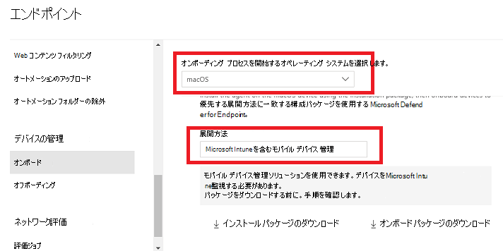
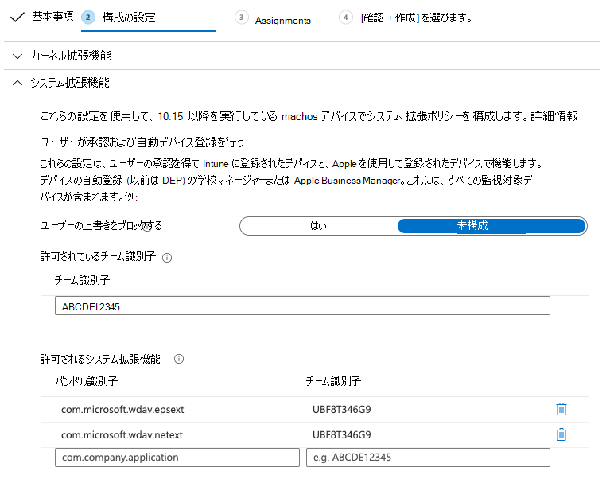
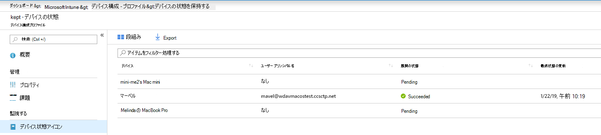
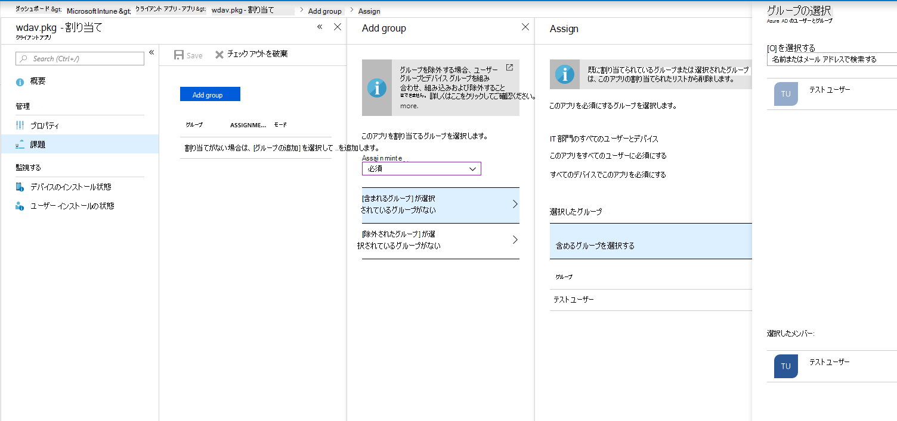
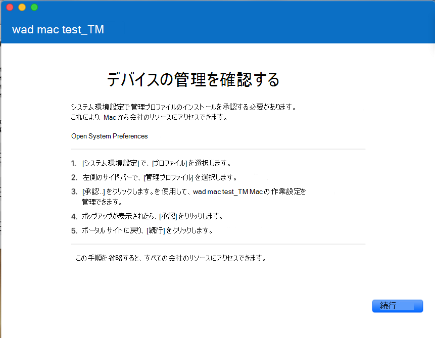
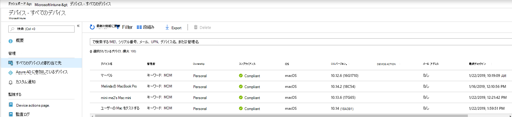
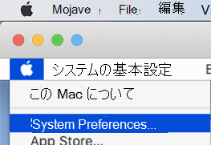
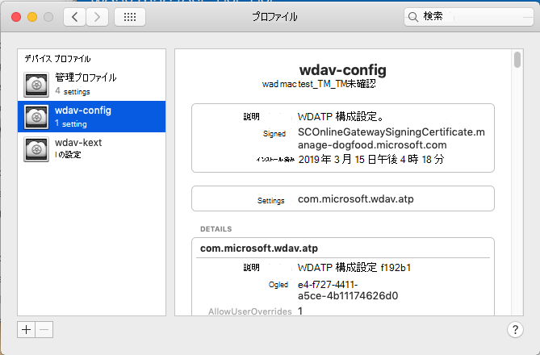

# <a name="intune-based-deployment-for-microsoft-defender-for-endpoint-on-macos"></a>MacOS での Microsoft Defender for Endpoint の Intune ベースの展開

[!INCLUDE [Microsoft 365 Defender rebranding](../../includes/microsoft-defender.md)]

**適用対象:**

- [macOS 用 Microsoft Defender for Endpoint](microsoft-defender-endpoint-mac.md)

このトピックでは、Intune を介して macOS に Microsoft Defender for Endpoint を展開する方法について説明します。 展開が成功するには、次のすべての手順を完了する必要があります。

1. [オンボーディング パッケージをダウンロードする](#download-the-onboarding-package)
1. [クライアント デバイスのセットアップ](#client-device-setup)
1. [システム拡張機能の承認](#approve-system-extensions)
1. [システム構成プロファイルの作成](#create-system-configuration-profiles)
1. [アプリケーションの発行](#publish-application)

## <a name="prerequisites-and-system-requirements"></a>前提条件とシステム要件

開始する前に、現在のソフトウェア バージョンの前提条件とシステム要件の説明については、メインの [Microsoft Defender for Endpoint on macOS](microsoft-defender-endpoint-mac.md) ページを参照してください。

## <a name="overview"></a>概要

次の表は、Intune 経由で Microsoft Defender for Endpoint on Mac を展開および管理するために必要な手順の概要を示しています。 詳細な手順については、以下をご覧ください。

| 手順 | サンプル ファイル名 | BundleIdentifier |
|-|-|-|
| [オンボーディング パッケージをダウンロードする](#download-the-onboarding-package) | WindowsDefenderATPOnboarding__MDATP_wdav.atp.xml | com.microsoft.wdav.atp |
| [エンドポイント用 Microsoft Defender のシステム拡張機能を承認する](#approve-system-extensions) | MDATP_SysExt.xml | 該当なし |
| [Microsoft Defender for Endpoint のカーネル拡張機能の承認](#download-the-onboarding-package) | MDATP_KExt.xml | 該当なし |
| [Microsoft Defender for Endpoint へのフル ディスク アクセスを許可する](#full-disk-access) | MDATP_tcc_Catalina_or_newer.xml | com.microsoft.wdav.tcc |
| [ネットワーク拡張ポリシー](#network-filter) | MDATP_NetExt.xml | 該当なし |
| [Microsoft AutoUpdate (MAU) の構成](mac-updates.md#intune) | MDATP_Microsoft_AutoUpdate.xml | com.microsoft.autoupdate2 |
| [Microsoft Defender for Endpoint 構成設定](mac-preferences.md#intune-profile-1)<br/><br/> **注:** macOS 用のサード パーティ製 AV の実行を計画している場合は、 に設定 `passiveMode` します `true` 。 | MDATP_WDAV_and_exclusion_settings_Preferences.xml | com.microsoft.wdav |
| [エンドポイントおよび MS AutoUpdate (MAU) 通知の Microsoft Defender の構成](mac-updates.md) | MDATP_MDAV_Tray_and_AutoUpdate2.mobileconfig | com.microsoft.autoupdate2 または com.microsoft.wdav.tray |


## <a name="download-the-onboarding-package"></a>オンボーディング パッケージをダウンロードする

オンボーディング パッケージを次のポータルからMicrosoft 365 Defenderします。

1. [Microsoft 365 Defender] ポータルで、[エンドポイントデバイス設定  >  **オン** ボーディング  >  **] に**  >  **移動します**。

2. オペレーティング システムを **macOS** に設定し、展開方法を [Mobile Device Management / Microsoft Intune]**に設定します**。

    

3. [オンボード **パッケージのダウンロード] を選択します**。 同 _じディレクトリWindowsDefenderATPOnboardingPackage.zip_ として保存します。

4. ファイルの内容を.zipします。

    ```bash
    unzip WindowsDefenderATPOnboardingPackage.zip
    ```
    ```Output
    Archive:  WindowsDefenderATPOnboardingPackage.zip
    warning:  WindowsDefenderATPOnboardingPackage.zip appears to use backslashes as path separators
      inflating: intune/kext.xml
      inflating: intune/WindowsDefenderATPOnboarding.xml
      inflating: jamf/WindowsDefenderATPOnboarding.plist
    ```

## <a name="create-system-configuration-profiles"></a>システム構成プロファイルの作成

次の手順では、Microsoft Defender for Endpoint が必要とするシステム構成プロファイルを作成します。
管理センター [でMicrosoft エンドポイント マネージャーデバイス](https://endpoint.microsoft.com/)構成 **プロファイル**  >  **を開きます**。

### <a name="onboarding-blob"></a>BLOB のオンボーディング

このプロファイルには、Microsoft Defender for Endpoint のライセンス情報が含まれているので、ライセンスされていないと報告されます。

1. [構成 **プロファイル] で [****プロファイルの作成] を選択します**。
1. [**プラットフォーム** = **macOS]**[**プロファイルの種類** = **テンプレート] を選択します**。 **テンプレート名** =**カスタム**. **[作成]** をクリックします。

    > [!div class="mx-imgBorder"]
    > 

1. プロファイルの名前を選択します。たとえば、「Defender または Endpoint onboarding for macOS」。 **[次へ]** をクリックします。

    > [!div class="mx-imgBorder"]
    > 

1. 構成プロファイル名の名前 (たとえば、「Defender for Endpoint onboarding for macOS」) を選択します。
1. 構成プロファイル ファイルとしてWindowsDefenderATPOnboarding.xmlオンボーディング パッケージから抽出した intune/WindowsDefenderATPOnboarding.xmlを選択します。

    > [!div class="mx-imgBorder"]
    > 

1. **[次へ]** をクリックします。
1. [割り当て] タブでデバイス **を割り当** てる。[次へ] を **クリックします**。

    > [!div class="mx-imgBorder"]
    > 

1. レビューと **作成**.
1. [**デバイス**  >  **構成プロファイル] を開** きます。作成したプロファイルを確認できます。

    > [!div class="mx-imgBorder"]
    > 

### <a name="approve-system-extensions"></a>システム拡張機能の承認

このプロファイルは、macOS 10.15 (Catalina) 以降に必要です。 古い macOS では無視されます。

1. [構成 **プロファイル] で [****プロファイルの作成] を選択します**。
1. [**プラットフォーム** = **macOS]**[**プロファイルの種類** = **テンプレート] を選択します**。 **テンプレート名** =**拡張機能**. **[作成]** をクリックします。
1. [基本 **] タブ** で、この新しいプロファイルに名前を付きます。
1. [構成 **設定] タブで** 、[システム拡張機能] **を展開し、[** 許可されたシステム拡張機能] セクションに次 **のエントリを追加** します。

    バンドル識別子         | チーム識別子
    --------------------------|----------------
    com.microsoft.wdav.epsext | UBF8T346G9
    com.microsoft.wdav.netext | UBF8T346G9

    > [!div class="mx-imgBorder"]
    > 

1. [割り **当て] タブ** で、このプロファイルを [すべてのユーザー] または **[すべての&に割り当てる] をクリックします**。
1. この構成プロファイルを確認して作成します。

### <a name="kernel-extensions"></a>カーネル拡張機能

このプロファイルは、macOS 10.15 (Catalina) 以上で必要です。 新しい macOS では無視されます。

> [!CAUTION]
> Apple Silicon (M1) デバイスは KEXT をサポートしていない。 KEXT ポリシーからなる構成プロファイルのインストールは、これらのデバイスで失敗します。

1. [構成 **プロファイル] で [****プロファイルの作成] を選択します**。
1. [**プラットフォーム** = **macOS]**[**プロファイルの種類** = **テンプレート] を選択します**。 **テンプレート名** =**拡張機能**. **[作成]** をクリックします。
1. [基本 **] タブ** で、この新しいプロファイルに名前を付きます。
1. [構成設定 **] タブで** 、[カーネル拡張機能 **] を展開します**。
1. チーム **識別子を** **UBF8T346G9** に設定し、[次へ] を **クリックします**。

    > [!div class="mx-imgBorder"]
    > 

1. [割り **当て] タブ** で、このプロファイルを [すべてのユーザー] または **[すべての&に割り当てる] をクリックします**。
1. この構成プロファイルを確認して作成します。

### <a name="full-disk-access"></a>フル ディスク アクセス

   > [!CAUTION]
   > macOS 10.15 (Catalina) には、新しいセキュリティとプライバシーの強化が含まれている。 このバージョンでは、既定では、アプリケーションは明示的な同意なしにディスク上の特定の場所 (ドキュメント、ダウンロード、デスクトップなど) にアクセスできません。 この同意がない場合、Microsoft Defender for Endpoint はデバイスを完全に保護できません。
   >
   > この構成プロファイルは、エンドポイント用 Microsoft Defender へのフル ディスク アクセスを許可します。 以前に Intune を使用して Microsoft Defender for Endpoint を構成した場合は、この構成プロファイルを使用して展開を更新することをお勧めします。

[**fulldisk.mobileconfig**](https://raw.githubusercontent.com/microsoft/mdatp-xplat/master/macos/mobileconfig/profiles/fulldisk.mobileconfig)を [、GitHubリポジトリからダウンロードします](https://github.com/microsoft/mdatp-xplat/tree/master/macos/mobileconfig/profiles)。

プロファイル名として "Defender for [Endpoint](#onboarding-blob) Full Disk Access" を使用し **、fulldisk.mobileconfig** を構成プロファイル名としてダウンロードして、上記の 「オンボード BLOB」の手順に従います。

### <a name="network-filter"></a>ネットワーク フィルター

エンドポイント検出および応答機能の一環として、macOS 上の Microsoft Defender for Endpoint はソケット トラフィックを検査し、この情報を Microsoft 365 Defenderします。 次のポリシーでは、ネットワーク拡張機能でこの機能を実行できます。

[**netfilter.mobileconfig**](https://raw.githubusercontent.com/microsoft/mdatp-xplat/master/macos/mobileconfig/profiles/netfilter.mobileconfig)を [、GitHubリポジトリからダウンロードします](https://github.com/microsoft/mdatp-xplat/tree/master/macos/mobileconfig/profiles)。

プロファイル名として "Defender for [Endpoint](#onboarding-blob) Network Filter" を使用し、構成プロファイル名としてダウンロードした **netfilter.mobileconfig** を使用して、上記の 「オンボード BLOB」の手順に従います。

### <a name="notifications"></a>通知

このプロファイルは、macOS 上の Microsoft Defender for Endpoint と Microsoft Auto Update が macOS 10.15 (Catalina) 以降の UI で通知を表示するために使用されます。

ダウンロード [**notif.mobileconfig**](https://raw.githubusercontent.com/microsoft/mdatp-xplat/master/macos/mobileconfig/profiles/notif.mobileconfig) from [our GitHub リポジトリ](https://github.com/microsoft/mdatp-xplat/tree/master/macos/mobileconfig/profiles).

プロファイル名として "Defender for Endpoint Notifications" を使用し、構成プロファイル名として **notif.mobileconfig** をダウンロードして、上記の 「オンボード BLOB」の手順に従います。 [](#onboarding-blob)

### <a name="view-status"></a>状態の表示

Intune の変更が登録済みデバイスに反映された後は、[デバイスの状態の監視]の下に表示  >  **されます**。

> [!div class="mx-imgBorder"]
> 

## <a name="publish-application"></a>アプリケーションの発行

この手順では、登録済みコンピューターに Microsoft Defender for Endpoint を展開できます。

1. 管理センター [でMicrosoft エンドポイント マネージャーを](https://endpoint.microsoft.com/)開 **きます**。

    > [!div class="mx-imgBorder"]
    > 

1. [プラットフォーム別] を> macOS >追加します。
1. [アプリ **の種類** = **] macOS を選択し、[** 選択]**をクリックします**。

    > [!div class="mx-imgBorder"]
    > 

1. 既定値を保持し、[次へ] を **クリックします**。

    > [!div class="mx-imgBorder"]
    > 

1. 割り当てを追加し、[次へ] を **クリックします**。

    > [!div class="mx-imgBorder"]
    > 

1. レビューと **作成**.
1. App By   >  platform macOS **に**  >  **アクセスして**、すべてのアプリケーションの一覧に表示できます。

    > [!div class="mx-imgBorder"]
    > 

(詳細については、Intune の Defender 展開用ページ [をご覧ください](/mem/intune/apps/apps-advanced-threat-protection-macos)。)

   > [!CAUTION]
   > 上記で説明したように、必要なすべての構成プロファイルを作成し、すべてのコンピューターにプッシュする必要があります。

## <a name="client-device-setup"></a>クライアント デバイスのセットアップ

標準インストール以外の Mac デバイスに対する特別なプロビジョニング[はポータル サイト必要ない](/intune-user-help/enroll-your-device-in-intune-macos-cp)。

1. デバイスの管理を確認します。

    > [!div class="mx-imgBorder"]
    > 

    [ **システム環境設定を開く]** を選択し、一 **覧で [管理プロファイル** ] を探し、[ **承認...] を選択します**。管理プロファイルが [確認済み] **と表示されます**。

    

2. [続行 **] を** 選択し、登録を完了します。

   これで、より多くのデバイスを登録できます。 システム構成とアプリケーション パッケージのプロビジョニングが完了したら、後で登録することもできます。

3. Intune で、[デバイスの管理 **] [**  >  **すべての**  >  **デバイス] を開きます**。 ここにリストされているデバイスの中からデバイスを確認できます。

   > [!div class="mx-imgBorder"]
   > 

## <a name="verify-client-device-state"></a>クライアント デバイスの状態を確認する

1. 構成プロファイルをデバイスに展開した後、Mac デバイス **で [System Preferences**  >  **Profiles]** を開きます。

    > [!div class="mx-imgBorder"]
    > 

    

2. 次の構成プロファイルが存在し、インストールされていることを確認します。 管理 **プロファイルは** Intune システム プロファイルである必要があります。 _Wdav-config_ と _wdav-kext_ は、Intune で追加されたシステム構成プロファイルです。

    

3. 右上隅には、Microsoft Defender for Endpoint アイコンも表示されます。

    > [!div class="mx-imgBorder"]
    > 

## <a name="troubleshooting"></a>トラブルシューティング

問題: ライセンスが見つかりません。

解決策: 上記の手順に従って、デバイス プロファイルを作成するには、WindowsDefenderATPOnboarding.xml。

## <a name="logging-installation-issues"></a>インストールの問題をログに記録する

エラーが発生した場合にインストーラーによって作成される自動的に生成されたログを検索する方法の詳細については、「Logging [installation issues」を参照してください](mac-resources.md#logging-installation-issues)。

## <a name="uninstallation"></a>アンインストール

クライアント デバイス [から](mac-resources.md#uninstalling) macOS 上の Microsoft Defender for Endpoint を削除する方法の詳細については、「アンインストール」を参照してください。
