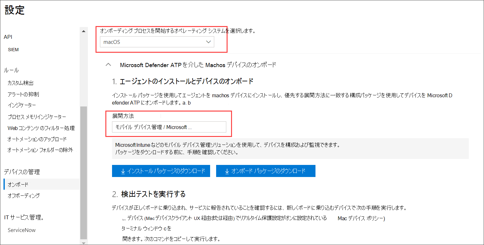
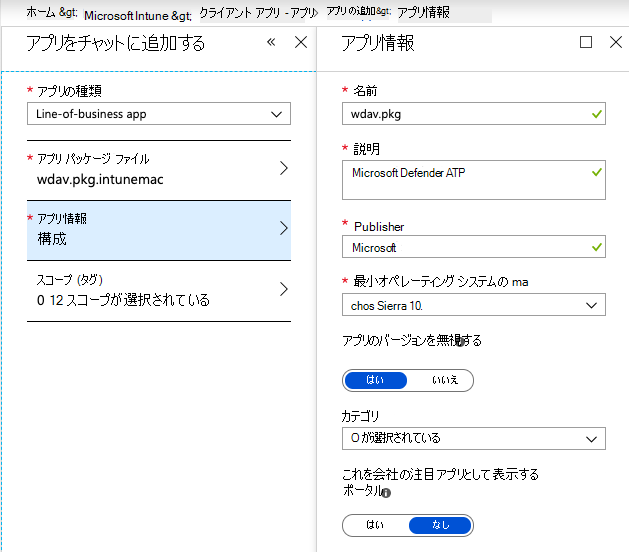
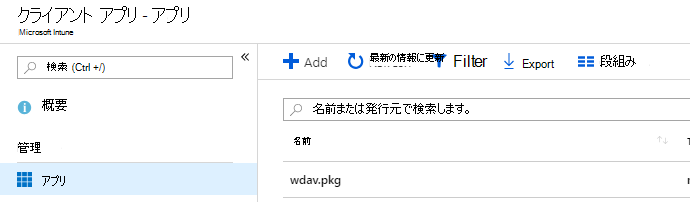

# <a name="intune-based-deployment-for-microsoft-defender-for-endpoint-for-mac"></a>Microsoft Defender for Endpoint for Mac の Intune ベースの展開

[!INCLUDE [Microsoft 365 Defender rebranding](../../includes/microsoft-defender.md)]


> [!NOTE]
> このドキュメントでは、macOS デバイスで Microsoft Defender for Endpoint を展開および構成するための従来の方法について説明します。 ネイティブ エクスペリエンスは MEM コンソールで利用できます。 MEM コンソールでネイティブ UI をリリースすると、管理者はアプリケーションを構成して展開し、macOS デバイスに送信する方法がはるかに簡単になります。 <br> <br>
>ブログ投稿 [MEM は、Microsoft Defender for Endpoint for macOS](https://techcommunity.microsoft.com/t5/microsoft-endpoint-manager-blog/microsoft-endpoint-manager-simplifies-deployment-of-microsoft/ba-p/1322995) の展開を簡略化し、新機能について説明します。 アプリを構成するには [、Microsoft InTune の [Microsoft Defender for Endpoint for Mac の設定] に移動します](https://docs.microsoft.com/mem/intune/protect/antivirus-microsoft-defender-settings-macos)。 アプリを展開するには、「Microsoft Intune を使用して [Microsoft Defender for Endpoint を macOS デバイスに追加する」に移動します](https://docs.microsoft.com/mem/intune/apps/apps-advanced-threat-protection-macos)。

**適用対象:**

- [Microsoft Defender for Endpoint for Mac](microsoft-defender-endpoint-mac.md)

このトピックでは、Intune を介して Microsoft Defender for Endpoint for Mac を展開する方法について説明します。 展開が成功するには、次のすべての手順を完了する必要があります。

1. [インストール パッケージとオンボーディング パッケージのダウンロード](#download-installation-and-onboarding-packages)
1. [クライアント デバイスのセットアップ](#client-device-setup)
1. [システム拡張機能の承認](#approve-system-extensions)
1. [システム構成プロファイルの作成](#create-system-configuration-profiles)
1. [アプリケーションの発行](#publish-application)

## <a name="prerequisites-and-system-requirements"></a>前提条件とシステム要件

開始する前に、現在のソフトウェア バージョンの前提条件とシステム要件の説明については、 [メインの Microsoft Defender for Endpoint for Mac](microsoft-defender-endpoint-mac.md) ページを参照してください。

## <a name="overview"></a>概要

次の表に、Intune 経由で Microsoft Defender for Endpoint for Mac を展開および管理するために必要な手順を示します。 詳細な手順については、以下をご覧ください。

| 手順 | サンプル ファイル名 | BundleIdentifier |
|-|-|-|
| [インストール パッケージとオンボーディング パッケージのダウンロード](#download-installation-and-onboarding-packages) | WindowsDefenderATPOnboarding__MDATP_wdav.atp.xml | com.microsoft.wdav.atp |
| [エンドポイント用 Microsoft Defender のシステム拡張機能を承認する](#approve-system-extensions) | MDATP_SysExt.xml | 該当なし |
| [Microsoft Defender for Endpoint のカーネル拡張機能の承認](#download-installation-and-onboarding-packages) | MDATP_KExt.xml | 該当なし |
| [Microsoft Defender for Endpoint へのフル ディスク アクセスを許可する](#create-system-configuration-profiles-step-8) | MDATP_tcc_Catalina_or_newer.xml | com.microsoft.wdav.tcc |
| [ネットワーク拡張ポリシー](#create-system-configuration-profiles-step-9) | MDATP_NetExt.xml | 該当なし |
| [Microsoft AutoUpdate (MAU) の構成](https://docs.microsoft.com/microsoft-365/security/defender-endpoint/mac-updates#intune) | MDATP_Microsoft_AutoUpdate.xml | com.microsoft.autoupdate2 |
| [Microsoft Defender for Endpoint 構成設定](https://docs.microsoft.com/microsoft-365/security/defender-endpoint/mac-preferences#intune-profile-1)<br/><br/> **注:** macOS 用のサード パーティ製 AV の実行を計画している場合は、 に設定 `passiveMode` します `true` 。 | MDATP_WDAV_and_exclusion_settings_Preferences.xml | com.microsoft.wdav |
| [エンドポイントおよび MS AutoUpdate (MAU) 通知の Microsoft Defender の構成](#create-system-configuration-profiles-step-10) | MDATP_MDAV_Tray_and_AutoUpdate2.mobileconfig | com.microsoft.autoupdate2 または com.microsoft.wdav.tray |

## <a name="download-installation-and-onboarding-packages"></a>インストール パッケージとオンボーディング パッケージのダウンロード

Microsoft Defender セキュリティ センターからインストールパッケージとオンボーディング パッケージをダウンロードします。

1. Microsoft Defender セキュリティ センターで、[設定] **[デバイス** 管理  >  **オンボーディング]**  >  **に移動します**。

2. オペレーティング システムを **macOS** に設定し、展開方法を **[モバイル デバイス管理] / [Microsoft Intune] に設定します**。

    

3. [インストール **パッケージのダウンロード] を選択します**。 _wdav.pkg としてローカル ディレクトリ_ に保存します。

4. [オンボード **パッケージのダウンロード] を選択します**。 同 _じディレクトリWindowsDefenderATPOnboardingPackage.zip_ として保存します。

5. **IntuneAppUtil を** ダウンロードします [https://docs.microsoft.com/intune/lob-apps-macos](https://docs.microsoft.com/intune/lob-apps-macos) 。

6. コマンド プロンプトから、3 つのファイルが存在するように確認します。
  

    ```bash
    ls -l
    ```

    ```Output
    total 721688
    -rw-r--r--  1 test  staff     269280 Mar 15 11:25 IntuneAppUtil
    -rw-r--r--  1 test  staff      11821 Mar 15 09:23 WindowsDefenderATPOnboardingPackage.zip
    -rw-r--r--  1 test  staff  354531845 Mar 13 08:57 wdav.pkg
    ```
7. .zip ファイルの内容を抽出します。

    ```bash
    unzip WindowsDefenderATPOnboardingPackage.zip
    ```
    ```Output
    Archive:  WindowsDefenderATPOnboardingPackage.zip
    warning:  WindowsDefenderATPOnboardingPackage.zip appears to use backslashes as path separators
      inflating: intune/kext.xml
      inflating: intune/WindowsDefenderATPOnboarding.xml
      inflating: jamf/WindowsDefenderATPOnboarding.plist
    ```

8. IntuneAppUtil を実行可能にする:

    ```bash
    chmod +x IntuneAppUtil
    ```

9. wdav.pkg から wdav.pkg.intunemac パッケージを作成します。

    ```bash
    ./IntuneAppUtil -c wdav.pkg -o . -i "com.microsoft.wdav" -n "1.0.0"
    ```
    ```Output
    Microsoft Intune Application Utility for Mac OS X
    Version: 1.0.0.0
    Copyright 2018 Microsoft Corporation

    Creating intunemac file for /Users/test/Downloads/wdav.pkg
    Composing the intunemac file output
    Output written to ./wdav.pkg.intunemac.

    IntuneAppUtil successfully processed "wdav.pkg",
    to deploy refer to the product documentation.
    ```

## <a name="client-device-setup"></a>クライアント デバイスのセットアップ

標準のポータル サイトインストールを超えて Mac デバイスに対する特別なプロビジョニング [は必要ない](https://docs.microsoft.com/intune-user-help/enroll-your-device-in-intune-macos-cp)。

1. デバイスの管理を確認します。

   

    [ **システム環境設定を開く]** を選択し、一 **覧で [管理プロファイル** ] を探し、[ **承認...] を選択します**。管理プロファイルが [確認済み] **と表示されます**。

    

2. [続行 **] を** 選択し、登録を完了します。

   これで、より多くのデバイスを登録できます。 システム構成とアプリケーション パッケージのプロビジョニングが完了したら、後で登録することもできます。

3. Intune で、[デバイスの管理 **] [**  >  **すべての**  >  **デバイス] を開きます**。 ここにリストされているデバイスの中からデバイスを確認できます。

   > [!div class="mx-imgBorder"]
   > 

## <a name="approve-system-extensions"></a>システム拡張機能の承認

システム拡張機能を承認するには、次の方法を実行します。

1. Intune で、[デバイス構成の **管理**  >  **] を開きます**。 [プロファイル **の**  >  **管理] [プロファイルの**  >  **作成] を選択します**。

2. プロファイルの名前を選択します。 **Platform=macOS を Profile** **type=Extensions に変更します**。 **[作成]** を選択します。

3. [基本 **] タブ** で、この新しいプロファイルに名前を付きます。

4. [構成 **設定] タブ** で、[許可されたシステム拡張機能] セクションに次 **のエントリを追加** します。

    バンドル識別子         | チーム識別子
    --------------------------|----------------
    com.microsoft.wdav.epsext | UBF8T346G9
    com.microsoft.wdav.netext | UBF8T346G9

    > [!div class="mx-imgBorder"]
    > ![[基本] タブの [構成設定] の拡張機能設定のスクリーンショット](images/mac-system-extension-intune2.png)

5. [割り **当て] タブ** で、このプロファイルを [すべてのユーザー] または **[すべての&に割り当てる] をクリックします**。

6. この構成プロファイルを確認して作成します。

## <a name="create-system-configuration-profiles"></a>システム構成プロファイルの作成

1. Intune で、[デバイス構成の **管理**  >  **] を開きます**。 [プロファイル **の**  >  **管理] [プロファイルの**  >  **作成] を選択します**。

2. プロファイルの名前を選択します。 **Platform=macOS をプロファイル****の種類=カスタム に変更します**。 [構成 **] を選択します**。

3. 構成プロファイルを開き、intune/kext.xml。 このファイルは、前のセクションの 1 つで作成されました。

4. [**OK**] を選択します。

    

5. [割 **り当**  >  **ての管理] を選択します**。 [含める **] タブ** で、[すべてのユーザーに割り当てる] & **を選択します**。

6. その他のプロファイルについては、手順 1 ~ 5 を繰り返します。

7. 別のプロファイルを作成し、名前を付け、intune/WindowsDefenderATPOnboarding.xmlファイルをアップロードします。

8. **GitHub リポジトリから fulldisk.mobileconfig** を [ダウンロードし](https://raw.githubusercontent.com/microsoft/mdatp-xplat/master/macos/mobileconfig/profiles/fulldisk.mobileconfig)、そのリポジトリ **としてtcc.xml。** 別のプロファイルを作成し、任意の名前を付け、このファイルをアップロードします。<a name="create-system-configuration-profiles-step-8" id = "create-system-configuration-profiles-step-8"></a>

   > [!CAUTION]
   > macOS 10.15 (Catalina) には、新しいセキュリティとプライバシーの強化が含まれている。 このバージョンでは、既定では、アプリケーションは明示的な同意なしにディスク上の特定の場所 (ドキュメント、ダウンロード、デスクトップなど) にアクセスできません。 この同意がない場合、Microsoft Defender for Endpoint はデバイスを完全に保護できません。
   >
   > この構成プロファイルは、エンドポイント用 Microsoft Defender へのフル ディスク アクセスを許可します。 以前に Intune を使用して Microsoft Defender for Endpoint を構成した場合は、この構成プロファイルを使用して展開を更新することをお勧めします。

9. エンドポイント検出と応答機能の一環として、Microsoft Defender for Endpoint for Mac はソケット トラフィックを検査し、この情報を Microsoft Defender セキュリティ センター ポータルに報告します。 次のポリシーでは、ネットワーク拡張機能でこの機能を実行できます。 [GitHub](https://raw.githubusercontent.com/microsoft/mdatp-xplat/master/macos/mobileconfig/profiles/netfilter.mobileconfig)リポジトリから **netfilter.mobileconfig** をダウンロードし、netext.xmlとして保存し、前のセクションと同じ手順で展開します。 <a name = "create-system-configuration-profiles-step-9" id = "create-system-configuration-profiles-step-9"></a>

10. Microsoft Defender for Endpoint for Mac および Microsoft Auto Update が macOS 10.15 (Catalina) の UI に通知を表示するには `notif.mobileconfig` [、GitHub](https://raw.githubusercontent.com/microsoft/mdatp-xplat/master/macos/mobileconfig/profiles/notif.mobileconfig) リポジトリからダウンロードし、カスタム ペイロードとしてインポートします。 <a name = "create-system-configuration-profiles-step-10" id = "create-system-configuration-profiles-step-10"></a>

11. [ **割り当ての>する] を選択します**。  [含める **] タブ** で、[すべてのユーザーに割り当てる] & **を選択します**。

Intune の変更が登録済みデバイスに反映された後は、[デバイスの状態の監視]の下に表示  >  **されます**。

> [!div class="mx-imgBorder"]
> 

## <a name="publish-application"></a>アプリケーションの発行

1. Intune で、[クライアント アプリの **管理] ブレード>開** きます。 [アプリ **と追加>を選択します**。

2. [ **アプリの種類]=[その他]/[Line-of-business アプリ]を選択します**。

3. **file=wdav.pkg.intunemac を選択します**。 **[OK] を選択** してアップロードします。

4. [構成 **] を** 選択し、必要な情報を追加します。

5. **最小 OS として macOS High Sierra 10.14** を使用します。

6. [アプリ *のバージョンを無視する] を* [はい] **に設定します**。 その他の設定には任意の値を指定できます。

    > [!CAUTION]
    > [ *アプリのバージョンを無視する* ] **を [いいえ** ] に設定すると、アプリケーションが Microsoft AutoUpdate を通じて更新プログラムを受け取る機能に影響します。 製品 [の更新方法の詳細については、「Deploy updates for Microsoft Defender for Endpoint for Mac」](mac-updates.md) を参照してください。
    >
    > Intune によってアップロードされたバージョンがデバイスのバージョンより低い場合は、下位バージョンがインストールされ、Microsoft Defender for Endpoint が効果的にダウングレードされます。 これにより、機能しないアプリケーションが発生する可能性があります。 製品 [の更新方法の詳細については、「Deploy updates for Microsoft Defender for Endpoint for Mac」](mac-updates.md) を参照してください。 [アプリのバージョンを無視する] が [いいえ] に設定 *されている* Microsoft Defender for Endpoint を展開した場合 **は、[は** い] に変更 **してください**。 Microsoft Defender for Endpoint がまだクライアント デバイスにインストールできない場合は、Microsoft Defender for Endpoint をアンインストールし、更新されたポリシーをプッシュします。
     
    > [!div class="mx-imgBorder"]
    > 

7. **[OK] と [** 追加]**を選択します**。

    > [!div class="mx-imgBorder"]
    > ![[通知] ウィンドウに表示されるデバイスの状態](images/mdatp-9-intunepkginfo.png)

8. パッケージのアップロードに少し時間がかかる場合があります。 完了したら、一覧からパッケージを選択し、[割り当て] と [ **グループの追加** ] **に移動します**。

    > [!div class="mx-imgBorder"]
    > 

9. [割 **り当ての種類] を [** 必須] **に変更します**。

10. [含 **まれるグループ] を選択します**。 [すべての **デバイスにこのアプリを必須にする]=[はい]を選択します**。 [ **グループの選択] を選択** して、対象とするユーザーを含むグループを追加します。 **[OK] と [** 保存]**を選択します**。

    > [!div class="mx-imgBorder"]
    > 

11. しばらくすると、アプリケーションは登録済みのすべてのデバイスに公開されます。 [デバイスの監視] の [**デバイスのインストール** 状態]  >  **に表示されます**。

    > [!div class="mx-imgBorder"]
    > 

## <a name="verify-client-device-state"></a>クライアント デバイスの状態を確認する

1. 構成プロファイルをデバイスに展開した後、Mac デバイス **で [System Preferences**  >  **Profiles]** を開きます。

    <br/>
    

2. 次の構成プロファイルが存在し、インストールされていることを確認します。 管理 **プロファイルは** Intune システム プロファイルである必要があります。 _Wdav-config_ と _wdav-kext_ は、Intune で追加されたシステム構成プロファイルです。 

3. 右上隅に Microsoft Defender アイコンも表示されます。

    > [!div class="mx-imgBorder"]
    > 

## <a name="troubleshooting"></a>トラブルシューティング

問題: ライセンスが見つかりません

解決策: 上記の手順に従って、デバイス プロファイルを作成しますWindowsDefenderATPOnboarding.xml

## <a name="logging-installation-issues"></a>インストールの問題をログに記録する

エラーが発生した場合にインストーラーによって作成される自動的に生成されたログを検索する方法の詳細については、「Logging [installation issues」を参照してください](mac-resources.md#logging-installation-issues)。

## <a name="uninstallation"></a>アンインストール

クライアント デバイス [から](mac-resources.md#uninstalling) Microsoft Defender for Endpoint for Mac を削除する方法の詳細については、「アンインストール」を参照してください。
