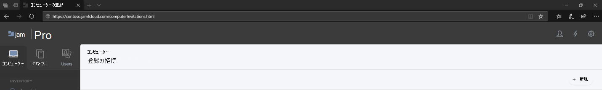
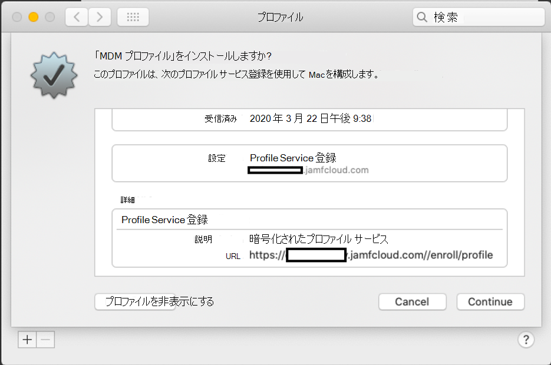

# MacOS デバイス上の Microsoft Defender for Endpoint を Jamf デバイスに登録Pro 

[!INCLUDE [Microsoft 365 Defender rebranding](../../includes/microsoft-defender.md)]

**適用対象:**
- [Microsoft Defender for Endpoint](https://go.microsoft.com/fwlink/p/?linkid=2154037)
- [Microsoft 365 Defender](https://go.microsoft.com/fwlink/?linkid=2118804)

> Defender for Endpoint を試す場合は、 [無料試用版にサインアップしてください。](https://signup.microsoft.com/create-account/signup?products=7f379fee-c4f9-4278-b0a1-e4c8c2fcdf7e&ru=https://aka.ms/MDEp2OpenTrial?ocid=docs-wdatp-investigateip-abovefoldlink)

## macOS デバイスの登録

JamF に登録するには、複数の方法があります。

この記事では、次の 2 つの方法について説明します。

- [方法 1: 登録の招待](#enrollment-method-1-enrollment-invitations)
- [方法 2: 事前登録](#enrollment-method-2-prestage-enrollments)

完全な一覧については、「コンピューターの登録 [について」を参照してください](https://docs.jamf.com/9.9/casper-suite/administrator-guide/About_Computer_Enrollment.html)。

## 登録方法 1: 登録の招待

1. Jamf Proで、[登録の招待]**に移動します**。

    

2. [+ **新規] を選択します**。

    

3. [ **招待の受信者の指定] >** **[** 電子メール アドレス] の下に、受信者の電子メール アドレスを入力します。

    

    

    たとえば、次の janedoe@contoso.com

    

4. 招待のメッセージを構成します。

    

    

    

    

## 登録方法 2: 事前登録

1. Jamf Proで **、[Prestage 登録] に移動します**。

    

2. 「Computer [PreStage 登録」の手順に従います](https://docs.jamf.com/9.9/casper-suite/administrator-guide/Computer_PreStage_Enrollments.html)。

## macOS デバイスの登録

1. [ **続行] を** 選択し、[システムの基本設定] ウィンドウから **CA 証明書をインストール** します。

    

2. CA 証明書がインストールされた後、ブラウザー ウィンドウに戻り、[続行] を **選択して** MDM プロファイルをインストールします。 

    

3. [JAMF **からの** ダウンロードを許可する] を選択します。

    

4. [続行 **] を** 選択して MDM プロファイルのインストールを続行します。 

    

5. [続行 **] を** 選択して MDM プロファイルをインストールします。

    

6. [続行 **] を**  選択して構成を完了します。 

    
