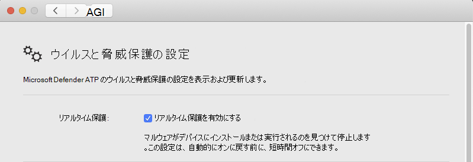

# <a name="troubleshoot-performance-issues-for-microsoft-defender-for-endpoint-on-macos"></a>macOS での Microsoft Defender for Endpoint のパフォーマンスの問題のトラブルシューティング

[!INCLUDE [Microsoft 365 Defender rebranding](../../includes/microsoft-defender.md)]


**適用対象:**

- [macOS 用 Microsoft Defender for Endpoint](microsoft-defender-endpoint-mac.md)
- [Microsoft Defender for Endpoint](https://go.microsoft.com/fwlink/p/?linkid=2154037)
- [Microsoft 365 Defender](https://go.microsoft.com/fwlink/?linkid=2118804)

> Microsoft Defender ATP を試してみたいですか? [無料試用版にサインアップしてください。](https://signup.microsoft.com/create-account/signup?products=7f379fee-c4f9-4278-b0a1-e4c8c2fcdf7e&ru=https://aka.ms/MDEp2OpenTrial?ocid=docs-wdatp-exposedapis-abovefoldlink)

このトピックでは、macOS 上の Microsoft Defender for Endpoint に関連するパフォーマンスの問題を絞り込む一般的な手順について説明します。

リアルタイム保護 (RTP) は、macOS 上の Microsoft Defender for Endpoint の機能であり、デバイスを継続的に監視し、脅威から保護します。 ファイルとプロセスの監視、その他のヒューリスティックで構成されます。

実行中のアプリケーションとデバイスの特性によっては、macOS で Microsoft Defender for Endpoint を実行するときに最適でないパフォーマンスが発生する場合があります。 特に、短い時間で多くのリソースにアクセスするアプリケーションまたはシステム プロセスは、macOS 上の Microsoft Defender for Endpoint のパフォーマンスの問題につながる可能性があります。

次の手順を使用して、これらの問題のトラブルシューティングと軽減を行います。

1. 次のいずれかの方法を使用してリアルタイム保護を無効にし、パフォーマンスが向上するかどうかを確認します。 この方法は、macOS 上の Microsoft Defender for Endpoint がパフォーマンスの問題に貢献するかどうかを絞り込むのに役立ちます。

      デバイスが組織によって管理されていない場合は、次のいずれかのオプションを使用してリアルタイム保護を無効にすることができます。

    - ユーザー インターフェイスから。 macOS で Microsoft Defender for Endpoint を開き、[設定の管理] **に移動します**。

      

    - ターミナルから。 セキュリティ上の目的で、この操作には昇格が必要です。

      ```bash
      mdatp config real-time-protection --value disabled
      ```

      デバイスが組織によって管理されている場合は [、「MacOS](mac-preferences.md)で Microsoft Defender for Endpoint の基本設定を設定する」の手順に従って、管理者がリアルタイム保護を無効にすることができます。

      リアルタイム保護がオフの間にパフォーマンスの問題が解決しない場合、問題の発生源はエンドポイント検出および応答コンポーネントである可能性があります。 この場合、詳細な手順と軽減策については、カスタマー サポートにお問い合わせください。

2. Finder を開き、[アプリケーション ユーティリティ **]** \> **に移動します**。 [ **アクティビティ モニター] を** 開き、システムでリソースを使用しているアプリケーションを分析します。 一般的な例としては、ソフトウェアアップデータとコンパイラが含まれます。

3. 最も多くのスキャンをトリガーしているアプリケーションを見つけるには、Defender for Endpoint on Mac によって収集されたリアルタイム統計を使用できます。

      > [!NOTE]
      > この機能は、バージョン 100.90.70 以降で使用できます。
      この機能は **、Dogfood** チャネルと InsiderFast チャネルで既定 **で有効** になっています。 別の更新チャネルを使用している場合は、コマンド ラインからこの機能を有効にできます。

      ```bash
      mdatp config real-time-protection-statistics  --value enabled
      ```

      この機能では、リアルタイム保護を有効にする必要があります。 リアルタイム保護の状態を確認するには、次のコマンドを実行します。

      ```bash
      mdatp health --field real_time_protection_enabled
      ```

    このエントリが **true real_time_protection_enabled** 確認します。 それ以外の場合は、次のコマンドを実行して有効にしてください。

      ```bash
      mdatp config real-time-protection --value enabled
      ```

      ```output
      Configuration property updated
      ```

      現在の統計情報を収集するには、次のコマンドを実行します。

      ```bash
      mdatp diagnostic real-time-protection-statistics --output json > real_time_protection.json
      ```

      > [!NOTE]
      > **--output json** (ダブル ダッシュ) を使用すると、出力形式が解析の準備ができていることを確認できます。
      このコマンドの出力には、すべてのプロセスと関連するスキャン アクティビティが表示されます。

4. Mac システムで、次のコマンドを使用して python パーサー high_cpu_parser.py のサンプルをダウンロードします。

    ```bash
    curl -O https://raw.githubusercontent.com/microsoft/mdatp-xplat/master/linux/diagnostic/high_cpu_parser.py
    ```

    このコマンドの出力は、次のようになります。

    ```Output
    --2020-11-14 11:27:27-- https://raw.githubusercontent.com/microsoft.
    mdatp-xplat/master/linus/diagnostic/high_cpu_parser.py
    Resolving raw.githubusercontent.com (raw.githubusercontent.com)... 151.101.xxx.xxx
    Connecting to raw.githubusercontent.com (raw.githubusercontent.com)| 151.101.xxx.xxx| :443... connected.
    HTTP request sent, awaiting response... 200 OK
    Length: 1020 [text/plain]
    Saving to: 'high_cpu_parser.py'
    100%[===========================================>] 1,020    --.-K/s   in
    0s
    ```

5. 次に、次のコマンドを入力します。

      ```bash
        chmod +x high_cpu_parser.py
      ```

      ```bash
        cat real_time_protection.json | python high_cpu_parser.py  > real_time_protection.log
      ```

      上記の出力は、パフォーマンスの問題に対する上位の投稿者の一覧です。 最初の列はプロセス識別子 (PID)、2 番目の列は te プロセス名、最後の列はスキャンされたファイルの数で、影響順に並べ替えます。

      たとえば、コマンドの出力は次のようになります。

      ```output
        ... > python ~/repo/mdatp-xplat/linux/diagnostic/high_cpu_parser.py <~Downloads/output.json | head -n 10
        27432 None 76703
        73467 actool     1249
        73914 xcodebuild 1081
        73873 bash 1050
        27475 None 836
        1    launchd    407
        73468 ibtool     344
        549  telemetryd_v1   325
        4764 None 228
        125  CrashPlanService 164
      ```

      Defender for Endpoint on Mac のパフォーマンスを向上するには、[ファイルの合計スキャン] 行の下で最も多い数値の 1 つを見つけて、除外を追加します。 詳細については、「Linux での Defender for Endpoint の除外の構成と [検証」を参照してください](linux-exclusions.md)。

      > [!NOTE]
      > アプリケーションは、統計をメモリに格納し、ファイルのアクティビティが開始され、リアルタイム保護が有効にされた後にのみ追跡します。 リアルタイム保護がオフの前または期間中に起動されたプロセスはカウントされません。 さらに、トリガーされたスキャンがカウントされるイベントのみ。
      >
6. パフォーマンスの問題に寄与するプロセスまたはディスクの場所を除外し、リアルタイム保護を再び有効にして、macOS 上の Microsoft Defender for Endpoint を構成します。

     詳細 [については、「MacOS](mac-exclusions.md) での Microsoft Defender for Endpoint の除外の構成と検証」を参照してください。
