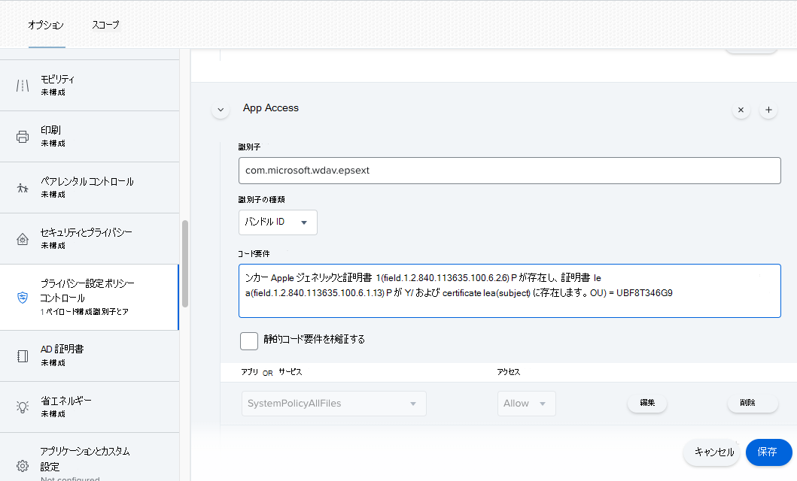

# <a name="new-configuration-profiles-for-macos-catalina-and-newer-versions-of-macos"></a>macOS Catalina および macOS の新しいバージョンの新しい構成プロファイル

[!INCLUDE [Microsoft 365 Defender rebranding](../../includes/microsoft-defender.md)]

**適用対象:**
- [Microsoft Defender for Endpoint Plan 1](https://go.microsoft.com/fwlink/p/?linkid=2154037)
- [Microsoft Defender for Endpoint Plan 2](https://go.microsoft.com/fwlink/p/?linkid=2154037)
- [Microsoft 365 Defender](https://go.microsoft.com/fwlink/?linkid=2118804)

> Microsoft Defender ATP を試してみたいですか? [無料試用版にサインアップしてください。](https://signup.microsoft.com/create-account/signup?products=7f379fee-c4f9-4278-b0a1-e4c8c2fcdf7e&ru=https://aka.ms/MDEp2OpenTrial?ocid=docs-wdatp-exposedapis-abovefoldlink)

macOS の進化に合わせ、カーネル拡張機能ではなくシステム拡張機能を活用する macOS 更新プログラムの Microsoft Defender for Endpoint を準備しています。 この更新プログラムは、macOS Catalina (10.15.4) 以降のバージョンの macOS にのみ適用されます。

管理環境 (JAMF、Intune、または別の MDM ソリューションを介して) macOS に Microsoft Defender for Endpoint を展開している場合は、新しい構成プロファイルを展開する必要があります。 これらの手順を実行しない場合、ユーザーは、これらの新しいコンポーネントを実行するための承認プロンプトを取得します。

## <a name="jamf"></a>JAMF

### <a name="jamf-system-extensions-policy"></a>JAMF システム拡張機能ポリシー

システム拡張機能を承認するには、次のペイロードを作成します。

1. [**コンピューター] >構成プロファイルで、[****システム拡張機能>オプション] を選択します**。
2. [ **システム拡張の種類] ドロップダウン リスト** から [ **許可されたシステム拡張機能** ] を選択します。
3. チーム **ID には UBF8T346G9** を使用します。
4. 次のバンドル識別子を [許可されたシステム拡張機能 **] リストに追加** します。

    - **com.microsoft.wdav.epsext**
    - **com.microsoft.wdav.netext**

    

### <a name="privacy-preferences-policy-control"></a>プライバシー設定ポリシー制御

次の JAMF ペイロードを追加して、Microsoft Defender for Endpoint Security Extension にフル ディスク アクセスを付与します。 このポリシーは、デバイスで拡張機能を実行する前提条件です。

1. [オプション **] [** \> **プライバシー設定ポリシー制御] を選択します**。
2. 識別子`com.microsoft.wdav.epsext`として、**バンドル** の`Bundle ID`**種類として使用します**。
3. コード要件をに設定する `identifier "com.microsoft.wdav.epsext" and anchor apple generic and certificate 1[field.1.2.840.113635.100.6.2.6] /* exists */ and certificate leaf[field.1.2.840.113635.100.6.1.13] /* exists */ and certificate leaf[subject.OU] = UBF8T346G9`
4. アプリ **またはサービスを** **SystemPolicyAllFiles に設定し、[** 許可] にアクセス **します**。

    

### <a name="network-extension-policy"></a>ネットワーク拡張ポリシー

エンドポイント検出および応答機能の一環として、macOS 上の Microsoft Defender for Endpoint はソケット トラフィックを検査し、この情報を Microsoft 365 Defenderします。 次のポリシーでは、ネットワーク拡張機能でこの機能を実行できます。

> [!NOTE]
> JAMF には、コンテンツ フィルター ポリシーの組み込みのサポートが用意されていません。これは、macOS 上の Microsoft Defender for Endpoint がデバイスにインストールするネットワーク拡張機能を有効にするための前提条件です。 さらに、JAMF は展開するポリシーの内容を変更する場合があります。
> そのため、次の手順では、構成プロファイルに署名する回避策を提供します。

1. テキスト エディターを使用して、次のコンテンツをデバイス `com.microsoft.network-extension.mobileconfig` に保存します。

    ```xml
    <?xml version="1.0" encoding="UTF-8"?><!DOCTYPE plist PUBLIC "-//Apple//DTD PLIST 1.0//EN" "http://www.apple.com/DTDs/PropertyList-1.0.dtd">
    <plist version="1">
        <dict>
            <key>PayloadUUID</key>
            <string>DA2CC794-488B-4AFF-89F7-6686A7E7B8AB</string>
            <key>PayloadType</key>
            <string>Configuration</string>
            <key>PayloadOrganization</key>
            <string>Microsoft Corporation</string>
            <key>PayloadIdentifier</key>
            <string>DA2CC794-488B-4AFF-89F7-6686A7E7B8AB</string>
            <key>PayloadDisplayName</key>
            <string>Microsoft Defender Network Extension</string>
            <key>PayloadDescription</key>
            <string/>
            <key>PayloadVersion</key>
            <integer>1</integer>
            <key>PayloadEnabled</key>
            <true/>
            <key>PayloadRemovalDisallowed</key>
            <true/>
            <key>PayloadScope</key>
            <string>System</string>
            <key>PayloadContent</key>
            <array>
                <dict>
                    <key>PayloadUUID</key>
                    <string>2BA070D9-2233-4827-AFC1-1F44C8C8E527</string>
                    <key>PayloadType</key>
                    <string>com.apple.webcontent-filter</string>
                    <key>PayloadOrganization</key>
                    <string>Microsoft Corporation</string>
                    <key>PayloadIdentifier</key>
                    <string>CEBF7A71-D9A1-48BD-8CCF-BD9D18EC155A</string>
                    <key>PayloadDisplayName</key>
                    <string>Approved Network Extension</string>
                    <key>PayloadDescription</key>
                    <string/>
                    <key>PayloadVersion</key>
                    <integer>1</integer>
                    <key>PayloadEnabled</key>
                    <true/>
                    <key>FilterType</key>
                    <string>Plugin</string>
                    <key>UserDefinedName</key>
                    <string>Microsoft Defender Network Extension</string>
                    <key>PluginBundleID</key>
                    <string>com.microsoft.wdav</string>
                    <key>FilterSockets</key>
                    <true/>
                    <key>FilterDataProviderBundleIdentifier</key>
                    <string>com.microsoft.wdav.netext</string>
                    <key>FilterDataProviderDesignatedRequirement</key>
                    <string>identifier "com.microsoft.wdav.netext" and anchor apple generic and certificate 1[field.1.2.840.113635.100.6.2.6] /* exists */ and certificate leaf[field.1.2.840.113635.100.6.1.13] /* exists */ and certificate leaf[subject.OU] = UBF8T346G9</string>
                </dict>
            </array>
        </dict>
    </plist>
    ```

2. ターミナルでユーティリティを実行して、上記のファイルが正 `plutil` しくコピーされていることを確認します。

    ```bash
    $ plutil -lint <PathToFile>/com.microsoft.network-extension.mobileconfig
    ```

    たとえば、ファイルが Documents に保存されている場合は、次のようになります。

    ```bash
    $ plutil -lint ~/Documents/com.microsoft.network-extension.mobileconfig
    ```

    コマンドが出力されるのを確認します `OK`。

    ```bash
    <PathToFile>/com.microsoft.network-extension.mobileconfig: OK
    ```

3. JAMF の [組み込](https://www.jamf.com/jamf-nation/articles/649/creating-a-signing-certificate-using-jamf-pro-s-built-in-certificate-authority) みの証明機関を使用して署名証明書を作成するには、このページの指示に従います。

4. 証明書を作成してデバイスにインストールしたら、ターミナルから次のコマンドを実行してファイルに署名します。

    ```bash
    $ security cms -S -N "<CertificateName>" -i <PathToFile>/com.microsoft.network-extension.mobileconfig -o <PathToSignedFile>/com.microsoft.network-extension.signed.mobileconfig
    ```

    たとえば、証明書名が **SigningCertificate** で、署名されたファイルが Documents に格納される場合は、次のようになります。

    ```bash
    $ security cms -S -N "SigningCertificate" -i ~/Documents/com.microsoft.network-extension.mobileconfig -o ~/Documents/com.microsoft.network-extension.signed.mobileconfig
    ```

5. JAMF ポータルから [構成プロファイル] に移動 **し、[** 設定] ボタン **アップロード** クリックします。 ファイル `com.microsoft.network-extension.signed.mobileconfig` の入力を求めるメッセージが表示されたら選択します。

## <a name="intune"></a>Intune

### <a name="intune-system-extensions-policy"></a>Intune システム拡張機能ポリシー

システム拡張機能を承認するには、次の方法を実行します。

1. Intune で、[デバイス構成の **管理]** \> **を開きます**。 [プロファイル **の管理** \> **] [プロファイルの作成** \> **] を選択します**。
2. プロファイルの名前を選択します。 **Platform=macOS を Profile** **type=Extensions に変更します**。 **[作成]** を選択します。
3. タブで `Basics` 、この新しいプロファイルに名前を付きます。
4. タブで `Configuration settings` 、セクションに次のエントリを追加 `Allowed system extensions` します。

   <br>

   ****

   |バンドル識別子|チーム識別子|
   |---|---|
   |com.microsoft.wdav.epsext|UBF8T346G9|
   |com.microsoft.wdav.netext|UBF8T346G9|
   |||

   

5. タブで、 `Assignments` このプロファイルを [すべてのユーザー] に割り当& **すべてのデバイスに割り当てる必要があります**。
6. この構成プロファイルを確認して作成します。

### <a name="create-and-deploy-the-custom-configuration-profile"></a>カスタム構成プロファイルの作成と展開

次の構成プロファイルは、ネットワーク拡張機能を有効にし、エンドポイント セキュリティ システム拡張機能へのフル ディスク アクセスを付与します。

次のコンテンツを次の名前の **ファイルに保存** sysext.xml。

```xml
<?xml version="1.0" encoding="UTF-8"?><!DOCTYPE plist PUBLIC "-//Apple//DTD PLIST 1.0//EN" "http://www.apple.com/DTDs/PropertyList-1.0.dtd">
<plist version="1">
    <dict>
        <key>PayloadUUID</key>
        <string>7E53AC50-B88D-4132-99B6-29F7974EAA3C</string>
        <key>PayloadType</key>
        <string>Configuration</string>
        <key>PayloadOrganization</key>
        <string>Microsoft Corporation</string>
        <key>PayloadIdentifier</key>
        <string>7E53AC50-B88D-4132-99B6-29F7974EAA3C</string>
        <key>PayloadDisplayName</key>
        <string>Microsoft Defender System Extensions</string>
        <key>PayloadDescription</key>
        <string/>
        <key>PayloadVersion</key>
        <integer>1</integer>
        <key>PayloadEnabled</key>
        <true/>
        <key>PayloadRemovalDisallowed</key>
        <true/>
        <key>PayloadScope</key>
        <string>System</string>
        <key>PayloadContent</key>
        <array>
            <dict>
                <key>PayloadUUID</key>
                <string>2BA070D9-2233-4827-AFC1-1F44C8C8E527</string>
                <key>PayloadType</key>
                <string>com.apple.webcontent-filter</string>
                <key>PayloadOrganization</key>
                <string>Microsoft Corporation</string>
                <key>PayloadIdentifier</key>
                <string>CEBF7A71-D9A1-48BD-8CCF-BD9D18EC155A</string>
                <key>PayloadDisplayName</key>
                <string>Approved Network Extension</string>
                <key>PayloadDescription</key>
                <string/>
                <key>PayloadVersion</key>
                <integer>1</integer>
                <key>PayloadEnabled</key>
                <true/>
                <key>FilterType</key>
                <string>Plugin</string>
                <key>UserDefinedName</key>
                <string>Microsoft Defender Network Extension</string>
                <key>PluginBundleID</key>
                <string>com.microsoft.wdav</string>
                <key>FilterSockets</key>
                <true/>
                <key>FilterDataProviderBundleIdentifier</key>
                <string>com.microsoft.wdav.netext</string>
                <key>FilterDataProviderDesignatedRequirement</key>
                <string>identifier &quot;com.microsoft.wdav.netext&quot; and anchor apple generic and certificate 1[field.1.2.840.113635.100.6.2.6] /* exists */ and certificate leaf[field.1.2.840.113635.100.6.1.13] /* exists */ and certificate leaf[subject.OU] = UBF8T346G9</string>
            </dict>
            <dict>
                <key>PayloadUUID</key>
                <string>56105E89-C7C8-4A95-AEE6-E11B8BEA0366</string>
                <key>PayloadType</key>
                <string>com.apple.TCC.configuration-profile-policy</string>
                <key>PayloadOrganization</key>
                <string>Microsoft Corporation</string>
                <key>PayloadIdentifier</key>
                <string>56105E89-C7C8-4A95-AEE6-E11B8BEA0366</string>
                <key>PayloadDisplayName</key>
                <string>Privacy Preferences Policy Control</string>
                <key>PayloadDescription</key>
                <string/>
                <key>PayloadVersion</key>
                <integer>1</integer>
                <key>PayloadEnabled</key>
                <true/>
                <key>Services</key>
                <dict>
                    <key>SystemPolicyAllFiles</key>
                    <array>
                        <dict>
                            <key>Identifier</key>
                            <string>com.microsoft.wdav.epsext</string>
                            <key>CodeRequirement</key>
                            <string>identifier "com.microsoft.wdav.epsext" and anchor apple generic and certificate 1[field.1.2.840.113635.100.6.2.6] /* exists */ and certificate leaf[field.1.2.840.113635.100.6.1.13] /* exists */ and certificate leaf[subject.OU] = UBF8T346G9</string>
                            <key>IdentifierType</key>
                            <string>bundleID</string>
                            <key>StaticCode</key>
                            <integer>0</integer>
                            <key>Allowed</key>
                            <integer>1</integer>
                        </dict>
                    </array>
                </dict>
            </dict>
        </array>
    </dict>
</plist>
```

上記のファイルが正しくコピーされていることを確認します。 ターミナルから、次のコマンドを実行し、出力を確認します `OK`。

```bash
$ plutil -lint sysext.xml
sysext.xml: OK
```

このカスタム構成プロファイルを展開するには、次の方法を実行します。

1. Intune で、[デバイス構成の **管理]** \> **を開きます**。 [プロファイル **の管理]** \> **[プロファイルの作成** \> **] を選択します**。
2. プロファイルの名前を選択します。 Platform **=macOS と** Profile **type=Custom を変更します**。 **[構成]** を選択します。
3. 構成プロファイルを開き **、sysext.xml。** このファイルは、前の手順で作成されました。
4. **[OK]** を選択します。

    

5. タブで、 `Assignments` このプロファイルを [すべてのユーザー] に割り当& **すべてのデバイスに割り当てる必要があります**。
6. この構成プロファイルを確認して作成します。
