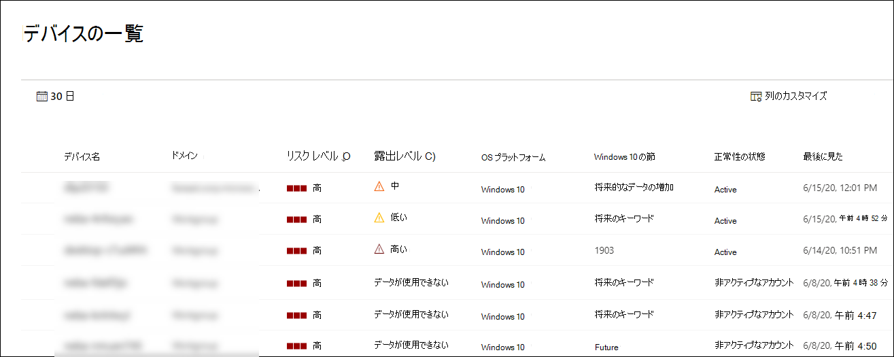

# Microsoft Defender for Endpoint Devices リストの表示と整理View and organize the Microsoft Defender for Endpoint Devices list

[!INCLUDE [Microsoft 365 Defender rebranding](../../includes/microsoft-defender.md)]

**適用対象:****Applies to:**
- [Microsoft Defender for EndpointMicrosoft Defender for Endpoint](https://go.microsoft.com/fwlink/p/?linkid=2154037)
- [Microsoft 365 DefenderMicrosoft 365 Defender](https://go.microsoft.com/fwlink/?linkid=2118804)

> Defender for Endpoint を体験してみませんか?Want to experience Defender for Endpoint? [無料試用版にサインアップします。Sign up for a free trial.](https://www.microsoft.com/microsoft-365/windows/microsoft-defender-atp?ocid=docs-wdatp-machinesview-abovefoldlink)

[ **デバイス] リストには** 、アラートが生成されたネットワーク内のデバイスの一覧が表示されます。The **Devices list** shows a list of the devices in your network where alerts were generated. 既定では、キューには過去 30 日間に表示されたデバイスが表示されます。By default, the queue displays devices seen in the last 30 days.  

ドメイン、リスク レベル、OS プラットフォームなどの情報を一目で確認すると、最も危険にさらされているデバイスを簡単に識別できます。At a glance you'll see information such as domain, risk level, OS platform, and other details for easy identification of devices most at risk.

デバイス リスト ビューをカスタマイズするために選択できるオプションは複数あります。There are several options you can choose from to customize the devices list view. 上部のナビゲーションでは、次の操作を実行できます。On the top navigation you can:

- 列の追加または削除Add or remove columns
- リスト全体を CSV 形式でエクスポートするExport the entire list in CSV format
- ページごとに表示するアイテムの数を選択するSelect the number of items to show per page
- フィルターの適用Apply filters

オンボーディング プロセス中に、[ **デバイス** ] リストには、センサー データの報告を開始するデバイスが徐々に追加されます。During the onboarding process, the **Devices list** is gradually populated with devices as they begin to report sensor data. このビューを使用して、オンボードエンドポイントをオンラインで追跡したり、オフライン分析用の CSV ファイルとして完全なエンドポイント リストをダウンロードしたりします。Use this view to track your onboarded endpoints as they come online, or download the complete endpoint list as a CSV file for offline analysis.

>[!NOTE]
> デバイスリストをエクスポートすると、組織内のすべてのデバイスが含まれる。If you export the device list, it will contain every device in your organization. 組織の規模によっては、ダウンロードにかなりの時間がかかる場合があります。It might take a significant amount of time to download, depending on how large your organization is. リストを CSV 形式でエクスポートすると、フィルター処理されていない方法でデータが表示されます。Exporting the list in CSV format displays the data in an unfiltered manner. CSV ファイルには、ビュー自体に適用されるフィルター処理に関係なく、組織内のすべてのデバイスが含まれます。The CSV file will include all devices in the organization, regardless of any filtering applied in the view itself.

## デバイスリストの並べ替えとフィルター処理Sort and filter the device list

次のフィルターを適用して、アラートの一覧を制限し、より集中したビューを取得できます。You can apply the following filters to limit the list of alerts and get a more focused view.

### リスク レベルRisk level

リスク レベルは、デバイス上のアクティブなアラートの種類と重大度などの要因の組み合わせに基づいて、デバイスの全体的なリスク評価を反映します。The risk level reflects the overall risk assessment of the device based on a combination of factors, including the types and severity of active alerts on the device. アクティブなアラートを解決し、修復アクティビティを承認し、後続のアラートを抑制すると、リスク レベルが低下する可能性があります。Resolving active alerts, approving remediation activities, and suppressing subsequent alerts can lower the risk level.

### 露出レベルExposure level

露出レベルは、保留中のセキュリティ推奨事項の累積的な影響に基づいて、デバイスの現在の露出を反映します。The exposure level reflects the current exposure of the device based on the cumulative impact of its pending security recommendations. 可能なレベルは、低、中、高です。The possible levels are low, medium, and high. 露出が低いということは、デバイスが悪用の影響を受けやすいという意味です。Low exposure means your devices are less vulnerable from exploitation.

露出レベルに 「データが使用できない」と表示される場合は、次の理由が考えられません。If the exposure level says "No data available," there are a few reasons why this may be the case:

- デバイスが 30 日以上レポートを停止しました 。その場合は非アクティブと見なされ、露出は計算されませんDevice stopped reporting for more than 30 days – in that case it is considered inactive, and the exposure isn't computed
- デバイス OS はサポートされていません - Microsoft Defender for Endpoint の最小 [要件を参照してください。](minimum-requirements.md)Device OS not supported - see [minimum requirements for Microsoft Defender for Endpoint](minimum-requirements.md)
- 古いエージェントを持つデバイス (非常に可能性が低い)Device with stale agent (very unlikely)

### OS プラットフォームOS Platform

調査する OS プラットフォームのみを選択します。Select only the OS platforms you're interested in investigating.

### 正常性の状態Health state

次のデバイスの正常性状態でフィルター処理します。Filter by the following device health states:

- **Active** – センサー データをサービスにアクティブに報告しているデバイス。**Active** – Devices that are actively reporting sensor data to the service.
- **非** アクティブ – 7 日間以上信号の送信を完全に停止したデバイス。**Inactive** – Devices that have completely stopped sending signals for more than 7 days.
- **正しく構成されていない** – サービスとの通信に障害が生じ、センサー データを送信できないデバイス。**Misconfigured** – Devices that have impaired communications with service or are unable to send sensor data. 構成が正しく設定されていないデバイスは、さらに次のように分類できます。Misconfigured devices can further be classified to:
  - センサー データなしNo sensor data
  - 通信障害Impaired communications

  構成が正しく設定されていないデバイスの問題に対処する方法の詳細については、「異常なセンサーを修正する」 [を参照してください](fix-unhealthy-sensors.md)。For more information on how to address issues on misconfigured devices see, [Fix unhealthy sensors](fix-unhealthy-sensors.md).

### ウイルス対策の状態Antivirus status

ウイルス対策の状態でデバイスをフィルター処理します。Filter devices by antivirus status. アクティブな Windows 10 デバイスにのみ適用されます。Applies to active Windows 10 devices only.

- **無効** - ウイルス&保護がオフになっています。**Disabled** - Virus & threat protection is turned off.
- **[報告しない** ] - ウイルス&保護が報告されていない場合。**Not reporting** - Virus & threat protection is not reporting.
- **[更新されません** ] - ウイルス&保護が最新ではない場合。**Not updated** - Virus & threat protection is not up to date.

詳細については、「脅威と [脆弱性管理ダッシュボード&を参照してください](tvm-dashboard-insights.md)。For more information, see [View the Threat & Vulnerability Management dashboard](tvm-dashboard-insights.md).

### 脅威の軽減の状態Threat mitigation status

特定の脅威の影響を受ける可能性のあるデバイスを表示するには、ドロップダウン メニューから脅威を選択し、軽減する必要がある脆弱性の側面を選択します。To view devices that may be affected by a certain threat, select the threat from the dropdown menu, and then select what vulnerability aspect needs to be mitigated.

特定の脅威の詳細については、「Threat [analytics」を参照してください](threat-analytics.md)。To learn more about certain threats, see [Threat analytics](threat-analytics.md). 軽減策の詳細については [、「Threat &脆弱性管理」を参照してください](next-gen-threat-and-vuln-mgt.md)。For mitigation information, see [Threat & Vulnerability Management](next-gen-threat-and-vuln-mgt.md).

### Windows 10 バージョンWindows 10 version

調査する Windows 10 バージョンのみを選択します。Select only the Windows 10 versions you're interested in investigating.

### タグ & グループTags & Groups

個々のデバイスに追加したグループ化とタグ付けに基づいてリストをフィルター処理します。Filter the list based on the grouping and tagging that you've added to individual devices. 「デバイス [タグの作成と管理」および「](machine-tags.md) デバイス [グループの作成と管理」を参照してください](machine-groups.md)。See [Create and manage device tags](machine-tags.md) and [Create and manage device groups](machine-groups.md).

## 関連項目Related topics

- [Microsoft Defender for Endpoint Devices リストのデバイスを調査するInvestigate devices in the Microsoft Defender for Endpoint Devices list](investigate-machines.md)
