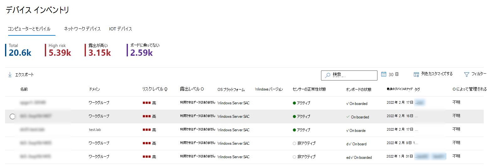
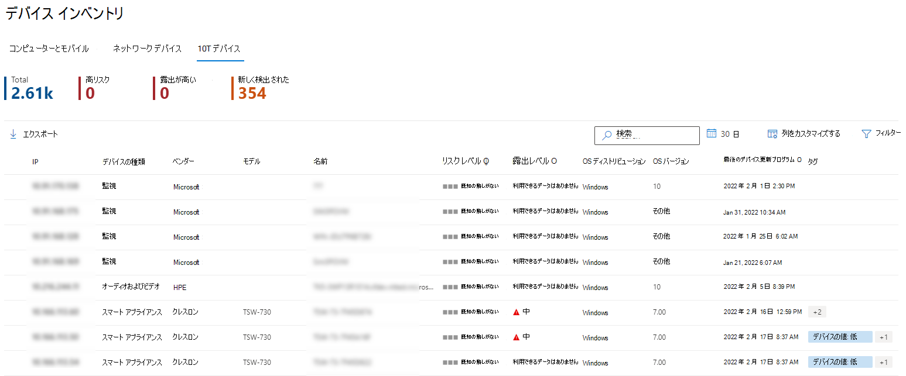
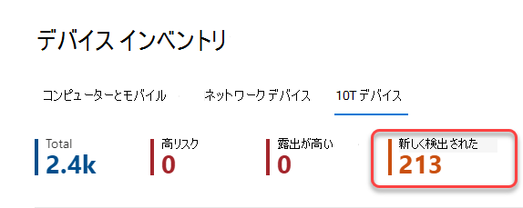
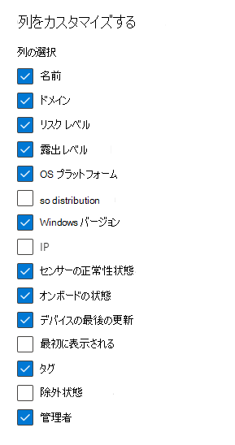
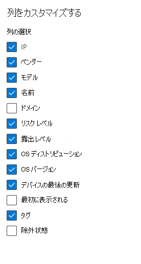
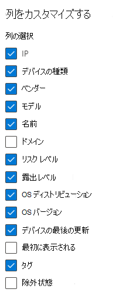

# デバイス一覧

[!INCLUDE [Microsoft 365 Defender rebranding](../../includes/microsoft-defender.md)]

**適用対象:**

- [Microsoft Defender for Endpoint Plan 1](https://go.microsoft.com/fwlink/p/?linkid=2154037)
- [Microsoft Defender for Endpoint Plan 2](https://go.microsoft.com/fwlink/p/?linkid=2154037)
- [Microsoft 365 Defender](https://go.microsoft.com/fwlink/?linkid=2118804)

> Defender for Endpoint を試す場合は、 [無料試用版にサインアップしてください。](https://signup.microsoft.com/create-account/signup?products=7f379fee-c4f9-4278-b0a1-e4c8c2fcdf7e&ru=https://aka.ms/MDEp2OpenTrial?ocid=docs-wdatp-machinesview-abovefoldlink)

デバイス インベントリは、コンピューター、サーバー、モバイル、ネットワーク アプライアンス、IoT デバイスなど、組織内のデバイスを検出、調査、調査するのに役立ちます。 未知のデバイスを検出し、ネットワーク内のデバイス管理のギャップを特定するのに役立ちます。

Microsoft Defender for Endpoint オンボーディング プロセス中、MDE にオンボードされたデバイスは、センサー データの報告を開始する際に、デバイス インベントリに徐々にデータが入力されます。 この後、デバイスインベントリは、デバイス検出プロセスを通じてネットワークで検出されたデバイスによって設定されます。 デバイス インベントリには、次の 3 つのタブでデバイスを一覧表示します。

- **コンピューターとモバイル**: Enterpriseエンドポイント (ワークステーション、サーバー、モバイル デバイス)
- **ネットワーク デバイス**: ルーターやスイッチのようなデバイス
- **IoT デバイス**: プリンターやカメラのようなデバイス

## [デバイス インベントリ] ページに移動する

デバイス インベントリ ページにアクセスするには、ポータルの [エンドポイント]  ナビゲーション メニューから [デバイス インベントリ[] をMicrosoft 365 Defenderします](/defender/microsoft-365-security-center-mde)。

## デバイス インベントリの概要

[コンピューターとモバイル] タブでデバイス **インベントリが開** きます。デバイス名、ドメイン、リスク レベル、露出レベル、OS プラットフォーム、オンボーディング状態、センサーの正常性状態などの情報が一目で確認され、最も危険にさらされているデバイスを簡単に識別できます。

[オン **ボーディングの状態] 列** を使用して、検出されたデバイス、および Microsoft Defender for Endpoint に既にオンボードされているデバイスを並べ替え、フィルター処理します。

[ネットワーク **デバイス] タブ** と **[IoT デバイス** ] タブには、ベンダー、モデル、デバイスの種類などの情報も表示されます。

各デバイス インベントリ タブの上部には、デバイスの総数、まだオンボードされていないデバイスの数、組織のリスクが高いと特定されたデバイスの数が表示されます。 この情報を使用すると、セキュリティポスチャの改善のためにデバイスの優先順位を設定できます。

[ **ネットワーク デバイスと** IoT デバイスの新しく検出されたデバイス数] タブには、過去 7 日間に検出された新しいデバイスの数が現在のビューに表示されます。

## デバイス インベントリを確認する

デバイス インベントリ ビューをカスタマイズするために選択できるオプションは複数あります。 各タブの上部ナビゲーションでは、次の操作を実行できます。

- 名前でデバイスを検索する
- 最近使用した IP アドレスまたは IP アドレスプレフィックスでデバイスを検索する
- 列の追加または削除
- オフライン分析用にリスト全体を CSV 形式でエクスポートする
- 表示する日付範囲を選択する
- フィルターの適用

> [!NOTE]
> デバイスリストをエクスポートすると、組織内のすべてのデバイスが含まれる。 組織の規模によっては、ダウンロードにかなりの時間がかかる場合があります。 リストを CSV 形式でエクスポートすると、フィルター処理されていない方法でデータが表示されます。 CSV ファイルには、ビュー自体に適用されるフィルター処理に関係なく、組織内のすべてのデバイスが含まれます。

各デバイス インベントリ タブで使用できる並べ替えとフィルター機能を使用して、より集中したビューを取得し、組織内のデバイスを評価および管理できます。

各タブの上部にあるカウントは、現在のビューに基づいて更新されます。

## フィルターを使用してデバイス インベントリ ビューをカスタマイズする

フィルター | 説明
:---|:---
**リスク レベル**   | リスク レベルは、デバイス上のアクティブなアラートの種類と重大度などの要因の組み合わせに基づいて、デバイスの全体的なリスク評価を反映します。 アクティブなアラートを解決し、修復アクティビティを承認し、後続のアラートを抑制すると、リスク レベルが低下する可能性があります。
**露出レベル**   | 露出レベルは、保留中のセキュリティ推奨事項の累積的な影響に基づいて、デバイスの現在の露出を反映します。 可能なレベルは、低、中、高です。 露出が低いということは、デバイスが悪用の影響を受けやすいという意味です。     露出レベルに 「データが使用できない」と表示される場合は、次の理由が考えられません。 - デバイスが 30 日間以上レポートを停止しました。 その場合、非アクティブと見なされ、露出は計算されません。 - デバイス OS はサポートされていません - [Microsoft Defender for Endpoint の最小要件を参照してください](https://microsoft-my.sharepoint.com/personal/siosulli_microsoft_com/Documents/Security%20Posture/TVM/minimum-requirements.md)。 - 古いエージェントを持つデバイス (可能性は低い)。
**Tags**   | 個々のデバイスに追加したグループ化とタグ付けに基づいてリストをフィルター処理します。 「 [デバイス タグの作成と管理」を参照してください](machine-tags.md)。
**デバイス値**  | デバイスが高い値または低い値としてマークされているかどうかを基にリストをフィルター処理します。
**除外状態**   | デバイスが除外されたかどうかに基づいてリストをフィルター処理します。 詳細については、「デバイスを除外 [する」を参照してください](exclude-devices.md)。
**OS プラットフォーム**  | 調査する OS プラットフォームでフィルター処理する   (_コンピューターとモバイルおよび IoT デバイスのみ_)
**最初に見た**   | デバイスがネットワークで最初に見られたか、Microsoft Defender for Endpoint センサーによって最初に報告された場合に基づいて、ビューをフィルター処理します。  (_コンピューターとモバイルおよび IoT デバイスのみ_)
**Windows バージョン**   | 調査するWindowsバージョンでフィルター処理します。   (_コンピューターとモバイルのみ_)
**センサーの正常性状態**   | Microsoft Defender for Endpoint にオンボードされているデバイスの場合は、次のセンサーの正常性状態でフィルター処理します。  - **Active**: センサー データをサービスにアクティブに報告しているデバイス。  - **非** アクティブ: 7 日間以上信号の送信を停止したデバイス。   - **正しく構成されていない**: サービスとの通信に障害が生じ、センサー データを送信できないデバイス。   構成が正しく設定されていないデバイスは、さらに次のように分類できます。    - センサー データなし    - 通信障害    構成が誤ったデバイスの問題に対処する方法の詳細については、「異常なセンサーを修正する」 [を参照してください](https://microsoft-my.sharepoint.com/personal/siosulli_microsoft_com/Documents/Security%20Posture/TVM/fix-unhealthy-sensors.md)。   (_コンピューターとモバイルのみ_)
**オンボーディングの状態**   | オンボード状態は、デバイスが現在 Microsoft Defender for Endpoint にオンボードされているかどうかを示します。 次の状態でフィルター処理できます。   - **オンボード:** エンドポイントは Microsoft Defender for Endpoint にオンボードされます。    - **オンボード可能:** エンドポイントは、サポートされているデバイスとしてネットワークで検出されましたが、現在オンボードされていません。 Microsoft では、これらのデバイスのオンボーディングを強くお勧めします。   - **サポートされていません**: エンドポイントはネットワークで検出されましたが、Microsoft Defender for Endpoint ではサポートされていません。   - **不十分** な情報: システムがデバイスのサポート性を判断できなかった。   (_コンピューターとモバイルのみ_)
**ウイルス対策の状態**   | ウイルス対策の状態が無効になっているか、更新されていないか不明かに基づいてビューをフィルター処理します。   (_コンピューターとモバイルのみ_)
**グループ**   | 調査するグループに基づいてリストをフィルター処理します。    (_コンピューターとモバイルのみ_)
**管理方法**   | [管理] は、デバイスの管理方法を示します。 フィルター処理は、次の方法で行います。 - エンドポイント用 Microsoft Defender   - モバイル デバイス管理 (MDM)  - 不明: 古い Windows バージョン、SCCM が実行されている、または他のサード パーティ製 MDM が実行されている可能性があります。   (_コンピューターとモバイルのみ_)
**デバイスの種類**   | 調査するデバイスの種類でフィルター処理します。   (_IoT デバイスのみ_)

## 列を使用してデバイス インベントリ ビューをカスタマイズする

使用可能な列ヘッダーをクリックすると、ビューの列を追加または削除し、エントリを並べ替えます。

[コンピューターと **モバイル] タブで、[** 列のカスタマイズ] **を選択** して使用可能な列を表示します。 既定値は、次の画像でチェックされます。

[ネットワーク デバイス **] タブで** 、[列の **カスタマイズ] を選択** して使用可能な列を表示します。 既定値は、次の画像でチェックされます。

[ **IoT デバイス] タブで** 、[列のカスタマイズ] **を** 選択して使用可能な列を表示します。 既定値は、次の画像でチェックされます。

## 関連記事

[Microsoft Defender for Endpoint Devices リストのデバイスを調査する](investigate-machines.md)
