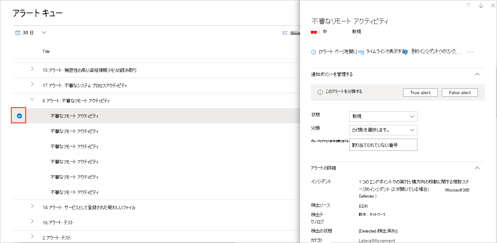

# エンドポイント通知の Microsoft Defender の管理

[!INCLUDE [Microsoft 365 Defender rebranding](../../includes/microsoft-defender.md)]

**適用対象:**
- [Microsoft Defender for Endpoint](https://go.microsoft.com/fwlink/p/?linkid=2154037)
- [Microsoft 365 Defender](https://go.microsoft.com/fwlink/?linkid=2118804)

> Defender for Endpoint を試す場合は、 [無料試用版にサインアップしてください。](https://signup.microsoft.com/create-account/signup?products=7f379fee-c4f9-4278-b0a1-e4c8c2fcdf7e&ru=https://aka.ms/MDEp2OpenTrial?ocid=docs-wdatp-managealerts-abovefoldlink)

Defender for Endpoint は、悪意のあるイベント、属性、コンテキスト情報の可能性を通知します。 新しいアラートの概要がセキュリティ操作ダッシュボードに表示され、アラート キュー内のすべてのアラートに **アクセスできます**。

アラートを管理するには、個別のデバイスの [通知] キューまたは[デバイス] ページの [アラート] タブでアラートを選択します。

いずれかの場所でアラートを選択すると、[アラート管理] **ウィンドウが表示されます**。

## 別のインシデントへのリンク

アラートまたは既存のインシデントへのリンクから新しいインシデントを作成できます。

## アラートの割り当て

アラートがまだ割り当てられていない場合は、[自分に **割** り当てる] を選択して、自分にアラートを割り当てることができます。

## アラートを抑制する

警告が表示されるのを抑制する必要があるシナリオMicrosoft Defender セキュリティ センター。 Defender for Endpoint を使用すると、組織内の既知のツールやプロセスなど、無実と知られている特定のアラートに対して抑制ルールを作成できます。

抑制ルールは、既存のアラートから作成できます。 必要に応じて無効にし、再び有効にできます。

抑制ルールが作成されると、ルールが作成された時点から有効になります。 ルールは、ルールの作成前にキューに既に存在するアラートには影響を与えかねない。 ルールは、ルールの作成後に設定された条件を満たすアラートにのみ適用されます。

抑制ルールには、次の 2 つのコンテキストから選択できます。

- **このデバイスのアラートを抑制する**
- **組織内のアラートを抑制する**

ルールのコンテキストを使用すると、ポータルに表示される情報を調整し、実際のセキュリティアラートだけがポータルに表示されます。

次の表の例を使用して、抑制ルールのコンテキストを選択できます。

|Context|定義|シナリオ例|
|---|---|---|
|**このデバイスのアラートを抑制する**|同じアラート タイトルを持つアラートと、その特定のデバイス上のアラートだけが表示されません。 
 そのデバイス上の他のすべてのアラートは抑制されません。|<ul><li>セキュリティ研究者が、組織内の他のデバイスを攻撃するために使用された悪意のあるスクリプトを調査しています。</li><li>開発者は、チームの PowerShell スクリプトを定期的に作成します。</li></ul>|
|**組織内のアラートを抑制する**|どのデバイスでも同じアラート タイトルを持つアラートは表示されません。|<ul><li>良性の管理ツールは、組織内のすべてのユーザーが使用します。</li></ul>|

### アラートを抑制し、新しい抑制ルールを作成する

カスタム ルールを作成して、アラートを抑制または解決する時間を制御します。 アラートのタイトル、侵害のインジケーター、および条件を指定することで、アラートが抑制される状況のコンテキストを制御できます。 コンテキストを指定すると、アラートのアクションとスコープを構成できます。

1. 非表示にするアラートを選択します。 これにより、[アラート管理] **ウィンドウが表示** されます。

2. [抑制 **ルールの作成] を選択します**。

    これらの属性を使用して抑制条件を作成できます。 AND 演算子は各条件の間に適用され、すべての条件が満たされた場合にのみ抑制が行われます。

    - ファイル SHA1
    - ファイル名 - ワイルドカードがサポートされています
    - フォルダー パス - ワイルドカードがサポートされています
    - IP アドレス
    - URL - ワイルドカードがサポートされています
    - コマンド ライン - ワイルドカードがサポートされています

3. [トリガー **IOC] を選択します**。

4. アラートのアクションとスコープを指定します。

   アラートを自動的に解決するか、ポータルから非表示にできます。 自動的に解決されるアラートは、アラート キュー、アラート ページ、デバイス タイムラインの解決済みセクションに表示され、Defender for Endpoint API 全体で解決済みとして表示されます。

   非表示としてマークされたアラートは、デバイスの関連付けられたアラートとダッシュボードの両方でシステム全体から抑制され、Defender for Endpoint API 全体でストリーミングされません。

5. ルール名とコメントを入力します。

6. **[保存]** をクリックします。

#### 抑制ルールの一覧を表示する

1. ナビゲーション ウィンドウで、[アラートの抑制]**設定** \> **選択します**。

2. 抑制ルールの一覧には、組織内のユーザーが作成したすべてのルールが表示されます。

抑制ルールの管理の詳細については、「抑制ルールの [管理」を参照してください。](manage-suppression-rules.md)

## アラートの状態を変更する

調査の進行に合わせ、アラートの状態を変更することで、アラート (New、In **Progress、** または **Resolved)** を分類できます。 これにより、チームがアラートに応答する方法を整理および管理できます。

たとえば、チーム リーダーは、すべての新しいアラートを確認し、そのアラートを進行中のキューに割り当て、さらに分析を行います。

または、チーム リーダーは、アラートが良性であること、無関係なデバイス (セキュリティ管理者に属するデバイスなど) からのアラート、または以前のアラートを介して処理されている場合に、解決済みキューにアラートを割り当てる場合があります。

## アラートの分類

分類を設定しないか、アラートが真のアラートか誤ったアラートかを指定できます。 真陽性/誤検知の分類を提供することが重要です。 この分類は、アラートの品質を監視し、アラートをより正確にするために使用されます。 "決定" フィールドは、"真の正" 分類に対する追加の忠実度を定義します。

## コメントを追加し、アラートの履歴を表示する

コメントを追加し、アラートに関する履歴イベントを表示して、アラートに加えた以前の変更を確認できます。

通知に対して変更またはコメントが行われた場合は常に、[コメントと履歴] **セクションに記録** されます。

追加されたコメントは直ちにウィンドウに表示されます。

## 関連トピック

- [抑制ルールの管理](manage-suppression-rules.md)
- [Microsoft Defender for Endpoint アラート キューを表示して整理する](alerts-queue.md)
- [Microsoft Defender for Endpoint アラートの調査](investigate-alerts.md)
- [Microsoft Defender for Endpoint アラートに関連付けられたファイルを調査する](investigate-files.md)
- [Microsoft Defender for Endpoint Devices リストのデバイスを調査する](investigate-machines.md)
- [Microsoft Defender for Endpoint アラートに関連付けられている IP アドレスを調査する](investigate-ip.md)
- [Microsoft Defender for Endpoint アラートに関連付けられているドメインを調査する](investigate-domain.md)
- [Microsoft Defender for Endpoint のユーザー アカウントを調査する](investigate-user.md)
