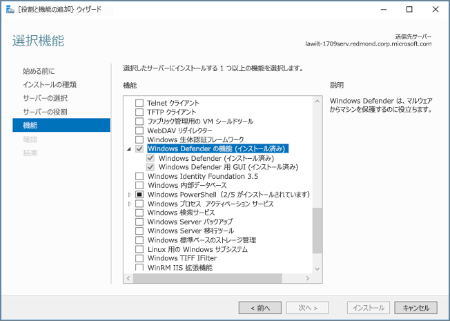

# <a name="microsoft-defender-antivirus-on-windows-server"></a>Windows Server の Microsoft Defender ウイルス対策

[!INCLUDE [Microsoft 365 Defender rebranding](../../includes/microsoft-defender.md)]

**適用対象:**

- [Microsoft Defender for Endpoint](/microsoft-365/security/defender-endpoint/)

Microsoft Defender ウイルス対策は、Windows Server の次のエディション/バージョンで利用できます。
- Windows Server 2019
- Windows Server バージョン 1803 以降
- Windows Server 2016。 

場合によっては、Microsoft Defender ウイルス対策はエンドポイント保護と *呼ばれます*。ただし、保護エンジンは同じです。 [Windows 10](microsoft-defender-antivirus-in-windows-10.md)の Microsoft Defender ウイルス対策の機能、構成、および管理は大きく同じですが、Windows Server にはいくつかの主な違いがあります。

- Windows Server では、定義済 [みのサーバーロール](configure-server-exclusions-microsoft-defender-antivirus.md) に基づいて自動除外が適用されます。
- Windows Server では、別のウイルス対策製品を実行している場合、Microsoft Defender ウイルス対策は自動的に無効にしません。

## <a name="the-process-at-a-glance"></a>プロセスの概要

サーバー プラットフォームで Microsoft Defender Antivirus をセットアップして実行するプロセスには、次のいくつかの手順が含まれます。

1. [インターフェイスを有効にします](#enable-the-user-interface-on-windows-server)。
2. [Microsoft Defender ウイルス対策をインストールします](#install-microsoft-defender-antivirus-on-windows-server)。
3. [Microsoft Defender ウイルス対策が実行されているを確認します](#verify-microsoft-defender-antivirus-is-running)。
4. [マルウェア対策のセキュリティ インテリジェンスを更新します](#update-antimalware-security-intelligence)。
5. (必要に応じて) [サンプルを送信します](#submit-samples)。
6. (必要に応じて) [自動除外を構成します](#configure-automatic-exclusions)。
7. (必要な場合のみ) [Microsoft Defender ウイルス対策をパッシブ モードに設定します](#need-to-set-microsoft-defender-antivirus-to-passive-mode)。

## <a name="enable-the-user-interface-on-windows-server"></a>Windows Server でユーザー インターフェイスを有効にする

既定では、Microsoft Defender ウイルス対策が Windows Server にインストールされ、機能します。 ユーザー インターフェイス (GUI) は既定で一部の SKU にインストールされますが、PowerShell などのメソッドを使用して Microsoft Defender ウイルス対策を管理することができるため、必須ではありません。 GUI がサーバーにインストールされていない場合は、役割と機能の追加ウィザードを使用するか、PowerShell コマンドレットを使用して追加できます。

### <a name="turn-on-the-gui-using-the-add-roles-and-features-wizard"></a>次のコマンドを使用して GUI を有効役割と機能の追加ウィザード

1. 「[役割と機能の追加ウィザードを](/windows-server/administration/server-manager/install-or-uninstall-roles-role-services-or-features#install-roles-role-services-and-features-by-using-the-add-roles-and-features-wizard)使用して役割、役割サービス、および機能をインストールする」を参照し、次の **役割と機能の追加ウィザード。**

2. ウィザードの [機能]**ステップに** 進み、[機能] の下の [Windows Defender] の **[GUI] オプションをWindows Defender** します。

   Windows Server 2016 では **、役割と機能の追加ウィザード次** のように表示されます。

   

   Windows Server 2019 では、役割 **と機能の追加ウィザードは** 似ています。

### <a name="turn-on-the-gui-using-powershell"></a>PowerShell を使用して GUI を有効にする

次の PowerShell コマンドレットを使用すると、インターフェイスが有効になります。 

```PowerShell
Install-WindowsFeature -Name Windows-Defender-GUI
```

## <a name="install-microsoft-defender-antivirus-on-windows-server"></a>Windows Server に Microsoft Defender ウイルス対策をインストールする

Microsoft Defender ウイルス対策をインストール **するには、役割と機能の追加ウィザード** または PowerShell を使用できます。

### <a name="use-the-add-roles-and-features-wizard"></a>次のコマンドを使用役割と機能の追加ウィザード

1. この記事 [を参照し](/windows-server/administration/server-manager/install-or-uninstall-roles-role-services-or-features#install-roles-role-services-and-features-by-using-the-add-roles-and-features-wizard)、次の **役割と機能の追加ウィザード。**

2. ウィザードの [機能] **ステップに** アクセスしたら、[Microsoft Defender ウイルス対策] オプションを選択します。 また、ユーザー設定 **オプションの GUI Windows Defender** します。

### <a name="use-powershell"></a>PowerShell を使う

PowerShell を使用して Microsoft Defender ウイルス対策をインストールするには、次のコマンドレットを実行します。

```PowerShell
Install-WindowsFeature -Name Windows-Defender
```

Microsoft Defender ウイルス対策に含まれるマルウェア対策エンジンのイベント メッセージは [、Microsoft Defender AV イベントで確認できます](troubleshoot-microsoft-defender-antivirus.md)。


## <a name="verify-microsoft-defender-antivirus-is-running"></a>Microsoft Defender ウイルス対策が実行されているを確認する

Microsoft Defender ウイルス対策がサーバーで実行されているのを確認するには、次の PowerShell コマンドレットを実行します。

```PowerShell
Get-Service -Name windefend
```

ファイアウォール保護が有効になっていることを確認するには、次の PowerShell コマンドレットを実行します。

```PowerShell 
Get-Service -Name mpssvc
```

PowerShell の代わりに、コマンド プロンプトを使用して、Microsoft Defender ウイルス対策が実行されているのを確認できます。 これを行うには、コマンド プロンプトから次のコマンドを実行します。 

```console
sc query Windefend
```

この `sc query` コマンドは、Microsoft Defender ウイルス対策サービスに関する情報を返します。 Microsoft Defender ウイルス対策が実行されている場合、値 `STATE` が表示されます `RUNNING` 。

## <a name="update-antimalware-security-intelligence"></a>マルウェア対策セキュリティ インテリジェンスの更新 

更新されたマルウェア対策セキュリティ インテリジェンスを取得するには、Windows Update サービスを実行している必要があります。 Windows Server Update Services (WSUS) などの更新プログラム管理サービスを使用する場合は、管理するコンピューターに対して Microsoft Defender ウイルス対策セキュリティ インテリジェンスの更新プログラムが承認されている必要があります。

既定では、Windows Update は Windows Server 2019 または Windows Server 2016 で更新プログラムを自動的にダウンロードおよびインストールしません。 この構成は、次のいずれかの方法で変更できます。


|メソッド  |説明  |
|---------|---------|
|**コントロール パネルの Windows** Update     |- **更新プログラムをインストールすると** 、セキュリティ インテリジェンスの更新プログラムを含むすべての更新Windows Defender自動的にインストールされます。 <br/>- **更新プログラムをダウンロードします** が、セキュリティ インテリジェンス更新プログラムをWindows Defenderインストールできるかどうかを選択しますが、他の更新プログラムは自動的にインストールされません。       |
|**グループ ポリシー**     | グループ ポリシーで使用できる設定を使用して、管理用テンプレート **\Windows コンポーネント\Windows Update\Configure 自動更新** を使用して、Windows Update を設定および管理できます。         |
|**AUOptions** レジストリ キー     |次の 2 つの値を使用すると、Windows Update はセキュリティ インテリジェンス更新プログラムを自動的にダウンロードしてインストールできます。 <br/>- **4**  - **更新プログラムを自動的にインストールします**。 この値を指定すると、セキュリティ インテリジェンス更新プログラムを含むすべての更新Windows Defender自動的にインストールされます。 <br/>- **3**  - **更新プログラムをダウンロードしますが、インストールするかどうかを選択します**。  この値を使用Windows Defenderセキュリティ インテリジェンス更新プログラムを自動的にダウンロードしてインストールできますが、他の更新プログラムは自動的にインストールされません。         |

マルウェアからの保護を確実に維持するには、次のサービスを有効にすることをお勧めします。

- Windows エラー報告サービス

- Windows Update サービス

次の表に、Microsoft Defender ウイルス対策サービスと依存サービスの一覧を示します。

|サービス名|ファイルの場所|説明|
|--------|---------|--------|
|Windows Defender サービス (WinDefend)|`C:\Program Files\Windows Defender\MsMpEng.exe`|これは、すべての回で実行する必要がある主な Microsoft Defender ウイルス対策サービスです。|
|Windows エラー報告サービス (Wersvc)|`C:\WINDOWS\System32\svchost.exe -k WerSvcGroup`|このサービスは、エラー レポートを Microsoft に返します。|
|Windows Defender ファイアウォール (MpsSvc)|`C:\WINDOWS\system32\svchost.exe -k LocalServiceNoNetwork`|ファイアウォール サービスを有効にWindows Defenderすることをお勧めします。|
|Windows Update (Wuauserv)|`C:\WINDOWS\system32\svchost.exe -k netsvcs`|Windows Update は、セキュリティ インテリジェンスの更新プログラムとマルウェア対策エンジンの更新プログラムを取得するために必要です。|

## <a name="submit-samples"></a>サンプルの送信

サンプル提出により、Microsoft は悪意のある可能性のあるソフトウェアのサンプルを収集できます。 Microsoft の研究者は、継続的で最新の保護を提供するために、これらのサンプルを使用して疑わしいアクティビティを分析し、更新されたマルウェア対策セキュリティ インテリジェンスを生成します。 プログラムの実行可能ファイル (.exe ファイルや .dll ファイルなど) を収集します。 Microsoft Word ドキュメントや PDF ファイルなど、個人データを含むファイルは収集できません。

### <a name="submit-a-file"></a>ファイルを送信する

1. 申請ガイド [を確認します](/windows/security/threat-protection/intelligence/submission-guide)。

2. サンプル提出 [ポータルにアクセスし](https://www.microsoft.com/wdsi/filesubmission)、ファイルを提出します。


### <a name="enable-automatic-sample-submission"></a>自動サンプル申請を有効にする

自動サンプル申請を有効にするには、管理者として Windows PowerShell コンソールを起動し、次のいずれかの設定に従って **SubmitSamplesConsent** 値データを設定します。

|設定  |説明  |
|---------|---------|
|**0**  - **常にプロンプトを表示する**     |Microsoft Defender ウイルス対策サービスでは、必要なすべてのファイルの提出を確認するように求めるメッセージが表示されます。 これは Microsoft Defender ウイルス対策の既定の設定ですが、WINDOWS Server 2016 または 2019 のインストールでは GUI を使用しない場合は推奨されません。         |
|**1**   - **安全なサンプルを自動的に送信する**     |Microsoft Defender ウイルス対策サービスは、"安全" とマークされているすべてのファイルを送信し、残りのファイルを求めるメッセージを表示します。         |
|**2**  - **送信しない**      |Microsoft Defender ウイルス対策サービスはプロンプトを表示しないし、ファイルも送信しない。         |
|**3**  - **すべてのサンプルを自動的に送信する**     |Microsoft Defender ウイルス対策サービスは、確認を求めるメッセージを表示せずにすべてのファイルを送信します。         |

## <a name="configure-automatic-exclusions"></a>自動除外を構成する

セキュリティとパフォーマンスを確保するために、Windows Server 2016 または 2019 で Microsoft Defender ウイルス対策を使用するときにインストールする役割と機能に基づいて、特定の除外が自動的に追加されます。

「Windows [Server の Microsoft Defender ウイルス対策で除外を構成する」を参照してください](configure-server-exclusions-microsoft-defender-antivirus.md)。 

## <a name="need-to-set-microsoft-defender-antivirus-to-passive-mode"></a>Microsoft Defender ウイルス対策をパッシブ モードに設定する必要がありますか?

Microsoft 以外のウイルス対策製品をプライマリ ウイルス対策ソリューションとして使用している場合は、Microsoft Defender Antivirus をパッシブ モードに設定します。  

### <a name="set-microsoft-defender-antivirus-to-passive-mode-using-a-registry-key"></a>レジストリ キーを使用して Microsoft Defender ウイルス対策をパッシブ モードに設定する

Windows Server、バージョン 1803、または Windows Server 2019 を使用している場合は、次のレジストリ キーを設定して Microsoft Defender Antivirus をパッシブ モードに設定できます。
- パス: `HKLM\SOFTWARE\Policies\Microsoft\Windows Advanced Threat Protection`
- 名前: `ForcePassiveMode`
- タイプ: `REG_DWORD`
- 値: `1`

### <a name="disable-microsoft-defender-antivirus-using-the-remove-roles-and-features-wizard"></a>役割と機能の削除ウィザードを使用して Microsoft Defender ウイルス対策を無効にする

1. 「 [役割、役割サービス、または機能のインストール](/windows-server/administration/server-manager/install-or-uninstall-roles-role-services-or-features#remove-roles-role-services-and-features-by-using-the-remove-roles-and-features-wizard)またはアンインストール」を参照し、役割と機能の削除 **ウィザードを使用します**。 

2. ウィザードの [機能] **ステップに** アクセスしたら、[機能] オプションのWindows Defender **解除** します。 

    [Windows Defender機能] セクションでWindows Defenderをオフにすると、インターフェイス オプション **の GUI** を削除するように求めるメッセージが表示Windows Defender。 
    
    Microsoft Defender ウイルス対策は、ユーザー インターフェイスなしでは正常に実行されますが、コア 機能を無効にすると、ユーザー **インターフェイスWindows Defender** できません。

### <a name="turn-off-the-microsoft-defender-antivirus-user-interface-using-powershell"></a>PowerShell を使用して Microsoft Defender ウイルス対策ユーザー インターフェイスをオフにする

Microsoft Defender ウイルス対策 GUI を無効にする場合は、次の PowerShell コマンドレットを使用します。

```PowerShell
Uninstall-WindowsFeature -Name Windows-Defender-GUI
```

### <a name="are-you-using-windows-server-2016"></a>Windows Server 2016 を使用していますか?

Windows Server 2016 および Microsoft によって提供または開発されていないサードパーティのマルウェア対策/ウイルス対策製品を使用している場合は、Microsoft Defender Antivirus を無効またはアンインストールする必要があります。 

> [!NOTE]
> Windows セキュリティ アプリはアンインストールできますが、次の手順でインターフェイスを無効にできます。

次の PowerShell コマンドレットは、Windows Server 2016 で Microsoft Defender ウイルス対策をアンインストールします。

```PowerShell
Uninstall-WindowsFeature -Name Windows-Defender
```

## <a name="see-also"></a>関連項目

- [Windows 10 の Microsoft Defender ウイルス対策](microsoft-defender-antivirus-in-windows-10.md)
- [Microsoft Defender ウイルス対策の互換性](microsoft-defender-antivirus-compatibility.md)