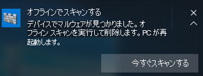

# <a name="run-and-review-the-results-of-a-microsoft-defender-offline-scan"></a>Microsoft Defender オフライン スキャンの結果を実行して確認する

[!INCLUDE [Microsoft 365 Defender rebranding](../../includes/microsoft-defender.md)]


**適用対象:**

- [Microsoft Defender for Endpoint](/microsoft-365/security/defender-endpoint/)

Microsoft Defender Offline は、信頼できる環境からスキャンを起動して実行できるマルウェア対策スキャン ツールです。 スキャンは通常の Windows カーネルの外部から実行され、マスター ブート レコード (MBR) に感染または上書きするウイルスやルートキットなど、Windows シェルをバイパスしようとするマルウェアをターゲットにできます。

マルウェア感染の疑いがある場合、またはマルウェアの発生後にエンドポイントの完全なクリーンを確認する場合は、Microsoft Defender Offline を使用できます。

Windows 10 では、Windows セキュリティ アプリから直接 1 回のクリックで Microsoft Defender [Offline を実行できます](microsoft-defender-security-center-antivirus.md)。 以前のバージョンの Windows では、ユーザーは Microsoft Defender Offline を起動可能なメディアにインストールし、エンドポイントを再起動し、起動可能なメディアを読み込む必要があります。

## <a name="prerequisites-and-requirements"></a>前提条件と要件

Windows 10 の Microsoft Defender Offline には、Windows 10 と同じハードウェア要件があります。 

Windows 10 の要件の詳細については、次のトピックを参照してください。

- [ハードウェアの最小要件](/windows-hardware/design/minimum/minimum-hardware-requirements-overview)

- [ハードウェア コンポーネントのガイドライン](/windows-hardware/design/component-guidelines/components)

> [!NOTE]
> Microsoft Defender Offline は、プロセッサが搭載されたコンピューター、ARM Windows Server Stock Keeping Units ではサポートされていません。

エンドポイントから Microsoft Defender Offline を実行するには、管理者特権でログインする必要があります。
 
## <a name="microsoft-defender-offline-updates"></a>Microsoft Defender オフライン更新プログラム

Microsoft Defender Offline は、エンドポイントで利用可能な最新の保護更新プログラムを使用します。ウイルス対策が更新されるたびにWindows Defender更新されます。 

> [!NOTE]
> オフライン スキャンを実行する前に、Microsoft Defender AV 保護の更新を試みる必要があります。 グループ ポリシーを使用して更新を強制するか、通常はエンドポイントに更新プログラムを展開するか、マイクロソフト マルウェア プロテクション センター から最新の保護更新プログラムを手動でダウンロードして [インストールすることができます](https://www.microsoft.com/security/portal/definitions/adl.aspx)。

詳細については [、「Microsoft Defender ウイルス対策セキュリティ インテリジェンス更新プログラムの管理」](manage-protection-updates-microsoft-defender-antivirus.md) を参照してください。

## <a name="usage-scenarios"></a>使用シナリオ

Windows 10 バージョン 1607 では、手動でオフライン スキャンを強制できます。 または、Microsoft Defender オフラインWindows Defender必要と判断した場合は、エンドポイントでユーザーにメッセージを表示します。 

オフライン スキャンを実行する必要性は、エンドポイントの管理に使用している場合は、Microsoft Endpoint Manager でも表示されます。

このプロンプトは、次のような通知を介して実行できます。



ユーザーには、クライアント内で通知Windows Defenderされます。

Configuration Manager では、[監視> 概要> セキュリティ> エンドポイント保護の状態> System **Center Endpoint Protection Status]** に移動して、エンドポイントの状態を識別できます。 

Microsoft Defender オフライン スキャンは、マルウェア修復状態 **の下に** オフライン スキャン **が必要と示されています**。


## <a name="configure-notifications"></a>通知の構成

Microsoft Defender オフライン通知は、他の Microsoft Defender AV 通知と同じポリシー設定で構成されます。

アプリの通知の詳細については、「Windows Defenderに表示される通知を構成する [」を参照](configure-notifications-microsoft-defender-antivirus.md) してください。

## <a name="run-a-scan"></a>スキャンを実行する 

> [!IMPORTANT]
> Microsoft Defender Offline を使用する前に、ファイルを保存し、実行中のプログラムをシャットダウンしてください。 Microsoft Defender Offline スキャンの実行には約 15 分かかります。 スキャンが完了すると、エンドポイントが再起動します。 スキャンは、通常の Windows オペレーティング環境の外部で実行されます。 ユーザー インターフェイスは、ユーザー インターフェイスによって実行される通常のスキャンとは異Windows Defender。 スキャンが完了すると、エンドポイントが再起動され、Windows が正常に読み込されます。

Microsoft Defender オフライン スキャンを実行するには、次の操作を実行します。

- PowerShell
- Windows Management Instrumentation (WMI)
- Windows セキュリティ アプリ


### <a name="use-powershell-cmdlets-to-run-an-offline-scan"></a>PowerShell コマンドレットを使用してオフライン スキャンを実行する

次のコマンドレットを使用します。

```PowerShell
Start-MpWDOScan
```

[Microsoft Defender ウイルス対策で PowerShell](use-powershell-cmdlets-microsoft-defender-antivirus.md)を使用する方法の詳細については、「Use PowerShell コマンドレットを使用して Microsoft Defender Antivirus コマンドレットと[Defender](/powershell/module/defender/)コマンドレットを構成および実行する」を参照してください。

### <a name="use-windows-management-instruction-wmi-to-run-an-offline-scan"></a>Windows 管理命令 (WMI) を使用してオフライン スキャンを実行する

オフライン スキャンを [**MSFT_MpWDOScan**](/previous-versions/windows/desktop/legacy/dn455323(v=vs.85)) するには、MSFT_MpWDOScan クラスを使用します。

次の WMI スクリプト スニペットは直ちに Microsoft Defender Offline スキャンを実行し、エンドポイントを再起動し、オフライン スキャンを実行し、Windows で再起動して起動します。

```console
wmic /namespace:\\root\Microsoft\Windows\Defender path MSFT_MpWDOScan call Start 
```

詳細については、以下を参照してください。
- [Windows Defender WMIv2 API](/previous-versions/windows/desktop/defender/windows-defender-wmiv2-apis-portal)


### <a name="use-the-windows-defender-security-app-to-run-an-offline-scan"></a>Windows Defender セキュリティ アプリを使用してオフライン スキャンを実行する

1. タスク バーのシールド アイコンをクリックするか、Defender のスタート メニューを検索して、Windows セキュリティ アプリを開 **きます**。

2. [ウイルス **対策] &タイル** (または左側のメニュー バーのシールド アイコン) をクリックし、[高度なスキャン] **ラベルをクリック** します。
    
3. [Microsoft **Defender オフライン スキャン] を選択し** 、[今すぐスキャン **] をクリックします**。

    > [!NOTE]
    > Windows 10 バージョン 1607 では **、Windows Settings** Update & セキュリティ Windows Defender またはクライアントからオフライン スキャン  >    >  をWindows Defenderできます。


## <a name="review-scan-results"></a>スキャン結果の確認

Microsoft Defender オフライン スキャンの結果は、Windows セキュリティ アプリの [スキャン [履歴] セクションに表示されます](microsoft-defender-security-center-antivirus.md)。 


## <a name="related-articles"></a>関連記事

- [スキャンと修復の結果をカスタマイズ、開始、および確認する](customize-run-review-remediate-scans-microsoft-defender-antivirus.md)
- [Windows 10 の Microsoft Defender ウイルス対策](microsoft-defender-antivirus-in-windows-10.md)