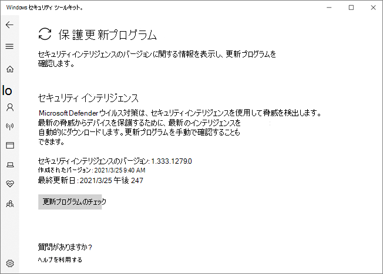

# Microsoft Defender ウイルス対策アプリでWindows セキュリティするMicrosoft Defender Antivirus in the Windows Security app

[!INCLUDE [Microsoft 365 Defender rebranding](../../includes/microsoft-defender.md)]

**適用対象:****Applies to:**

- [Microsoft Defender for EndpointMicrosoft Defender for Endpoint](/microsoft-365/security/defender-endpoint/)

バージョン Windows 10 1703 以降では、Windows Defenderアプリはアプリの一部Windows セキュリティ。In Windows 10, version 1703 and later, the Windows Defender app is part of the Windows Security.

設定 Windows Defender クライアントとメイン Windows 設定 の一部だったアプリが結合され、新しいアプリに移動され、Windows 10 バージョン 1703 の一部として既定でインストールされます。Settings that were previously part of the Windows Defender client and main Windows Settings have been combined and moved to the new app, which is installed by default as part of Windows 10, version 1703.

> [!IMPORTANT]
> センター サービスで Windows セキュリティを無効にしても、Microsoft Defender ウイルス対策[または](/windows/security/threat-protection/windows-firewall/windows-firewall-with-advanced-security)Windows Defender ファイアウォール。Disabling the Windows Security Center service does not disable Microsoft Defender Antivirus or [Windows Defender Firewall](/windows/security/threat-protection/windows-firewall/windows-firewall-with-advanced-security). これらは、サードパーティのウイルス対策製品またはファイアウォール製品がインストールされ、最新の状態に保たれ、自動的に無効になります。These are disabled automatically when a third-party antivirus or firewall product is installed and kept up to date.
>
> Windows セキュリティ Center サービスを無効にするか、関連するグループ ポリシー設定を構成して開始または実行を防ぐ場合、Windows セキュリティ アプリはデバイスにインストールしたウイルス対策製品またはファイアウォール製品に関する古い情報や不正確な情報を表示する可能性があります。If you do disable the Windows Security Center service, or configure its associated Group Policy settings to prevent it from starting or running, the Windows Security app might display stale or inaccurate information about any antivirus or firewall products you have installed on the device.
> また、古いまたは古いサード パーティ製のウイルス対策を使用している場合、または以前にインストールした可能性のあるサードパーティのウイルス対策製品をアンインストールした場合、Microsoft Defender ウイルス対策がそれ自体を有効にしなくなっている可能性もあります。It might also prevent Microsoft Defender Antivirus from enabling itself if you have an old or outdated third-party antivirus, or if you uninstall any third-party antivirus products you might have previously installed.
> これにより、デバイスの保護が大幅に低下し、マルウェアの感染につながる可能性があります。This will significantly lower the protection of your device and could lead to malware infection.

アプリで[Windows セキュリティできる](/windows/threat-protection/windows-defender-security-center/windows-defender-security-center)他のセキュリティ機能Windows詳細については、次の記事を参照してください。See the [Windows Security article](/windows/threat-protection/windows-defender-security-center/windows-defender-security-center) for more information on other Windows security features that can be monitored in the app.

アプリWindows セキュリティは、バージョン 1703 以降Windows 10クライアント インターフェイスです。The Windows Security app is a client interface on Windows 10, version 1703 and later. Microsoft Defender for Endpoint のMicrosoft Defender セキュリティ センター管理するために使用される Web ポータル[の一部ではありません](/microsoft-365/security/defender-endpoint/microsoft-defender-endpoint)。It is not the Microsoft Defender Security Center web portal that is used to review and manage [Microsoft Defender for Endpoint](/microsoft-365/security/defender-endpoint/microsoft-defender-endpoint).

## アプリでウイルスと脅威保護の設定をWindows セキュリティするReview virus and threat protection settings in the Windows Security app

![Windows セキュリティ アプリの [ウイルスと脅威の防止の設定] ラベルのスクリーンショット](images/defender/wdav-protection-settings-wdsc.png)

1. タスク バーのWindows セキュリティをクリックするか、Defender のスタート メニューを検索して、アプリを開 **きます**。Open the Windows Security app by clicking the shield icon in the task bar or searching the start menu for **Defender**.

2. [ウイルス **対策] &タイル** (または左側のメニュー バーのシールド アイコン) を選択します。Select the **Virus & threat protection** tile (or the shield icon on the left menu bar).
   
次のセクションでは、Windows セキュリティ アプリで Microsoft Defender ウイルス対策 によって提供される脅威保護を確認または操作するときに、最も一般的なタスクの一部を実行する方法についてWindows セキュリティします。The following sections describe how to perform some of the most common tasks when reviewing or interacting with the threat protection provided by Microsoft Defender Antivirus in the Windows Security app.

> [!NOTE]
> これらの設定がグループ ポリシーを使用して構成および展開されている場合、このセクションで説明する設定はグレー表示され、個々のエンドポイントで使用できません。If these settings are configured and deployed using Group Policy, the settings described in this section will be greyed-out and unavailable for use on individual endpoints. グループ ポリシーを使った変更は、Windows の設定で設定を更新する前に、最初に個別のエンドポイントに展開する必要があります。Changes made through a Group Policy Object must first be deployed to individual endpoints before the setting will be updated in Windows Settings. 「[ユーザーとエンド ユーザー](configure-end-user-interaction-microsoft-defender-antivirus.md)の対話を構成Microsoft Defender ウイルス対策ローカル ポリシーの上書き設定を構成する方法について説明します。The [Configure end-user interaction with Microsoft Defender Antivirus](configure-end-user-interaction-microsoft-defender-antivirus.md) topic describes how local policy override settings can be configured.

## アプリでスキャンをWindows セキュリティするRun a scan with the Windows Security app

1. [セキュリティ] Windows セキュリティスタート メニューを検索し、[セキュリティ]を選択して、アプリを開 **Windows セキュリティ。**Open the Windows Security app by searching the start menu for **Security**, and then selecting **Windows Security**.

2. [ウイルス **対策] &タイル** (または左側のメニュー バーのシールド アイコン) を選択します。Select the **Virus & threat protection** tile (or the shield icon on the left menu bar).

3. [クイック **スキャン] を選択します**。Select **Quick scan**. または、フル スキャンを実行するには、[スキャン **オプション]** を選択し、[フル スキャン] などのオプション **を選択します**。Or, to run a full scan, select **Scan options**, and then select an option, such as **Full scan**.

## セキュリティ インテリジェンス更新プログラムのバージョンを確認し、最新の更新プログラムをアプリでWindows セキュリティするReview the security intelligence update version and download the latest updates in the Windows Security app

1. [セキュリティ] Windows セキュリティスタート メニューを検索し、[セキュリティ]を選択して、アプリを開 **Windows セキュリティ。**Open the Windows Security app by searching the start menu for *Security*, and then selecting **Windows Security**.

2. [ウイルス **対策] &タイル** (または左側のメニュー バーのシールド アイコン) を選択します。Select the **Virus & threat protection** tile (or the shield icon on the left menu bar).

3. [ウイルス **対策&更新プログラム] を選択します**。Select **Virus & threat protection updates**. 現在インストールされているバージョンが、ダウンロードされた時点に関する情報と共に表示されます。The currently installed version is displayed along with some information about when it was downloaded. 手動でダウンロードできる最新バージョンに対して現在の状態を確認するか、そのバージョンの変更ログを確認できます。You can check your current against the latest version available for manual download, or review the change log for that version. 「[セキュリティ インテリジェンスの更新プログラム」および「Microsoft Defender ウイルス対策 Microsoft マルウェア対策」を参照してください](https://www.microsoft.com/en-us/wdsi/defenderupdates)。See [Security intelligence updates for Microsoft Defender Antivirus and other Microsoft antimalware](https://www.microsoft.com/en-us/wdsi/defenderupdates).

4. [更新 **プログラムの確認] を** 選択して、新しい保護更新プログラムをダウンロードします (ある場合)。Select **Check for updates** to download new protection updates (if there are any).

## アプリMicrosoft Defender ウイルス対策で有効になっているWindows セキュリティするEnsure Microsoft Defender Antivirus is enabled in the Windows Security app

1. [セキュリティ] Windows セキュリティスタート メニューを検索し、[セキュリティ]を選択して、アプリを開 **Windows セキュリティ。**Open the Windows Security app by searching the start menu for *Security*, and then selecting **Windows Security**.

2. [ウイルス **対策] &タイル** (または左側のメニュー バーのシールド アイコン) を選択します。Select the **Virus & threat protection** tile (or the shield icon on the left menu bar).

3. [ウイルス **対策&の設定] を選択します**。Select **Virus & threat protection settings**.

4. [リアルタイム保護 **] スイッチを [オン]** に **切り替えます**。Toggle the **Real-time protection** switch to **On**.

    > [!NOTE]
    > リアルタイム保護を **オフに** した場合、短時間の遅延後に自動的にオンに戻されます。If you switch **Real-time protection** off, it will automatically turn back on after a short delay. これは、マルウェアや脅威から保護されます。This is to ensure you are protected from malware and threats.
    > 別のウイルス対策製品をインストールすると、Microsoft Defender ウイルス対策自動的に無効にされ、アプリ内でWindows セキュリティされます。If you install another antivirus product, Microsoft Defender Antivirus automatically disables itself and is indicated as such in the Windows Security app. 制限された定期的なスキャンを有効にできる [設定が表示されます](limited-periodic-scanning-microsoft-defender-antivirus.md)。A setting will appear that will allow you to enable [limited periodic scanning](limited-periodic-scanning-microsoft-defender-antivirus.md).

## アプリでユーザーのMicrosoft Defender ウイルス対策をWindows セキュリティするAdd exclusions for Microsoft Defender Antivirus in the Windows Security app

1. [セキュリティ] Windows セキュリティスタート メニューを検索し、[セキュリティ]を選択して、アプリを開 **Windows セキュリティ。**Open the Windows Security app by searching the start menu for *Security*, and then selecting **Windows Security**.

2. [ウイルス **対策] &タイル** (または左側のメニュー バーのシールド アイコン) を選択します。Select the **Virus & threat protection** tile (or the shield icon on the left menu bar).

3. [設定の **管理] で**、[ **ウイルス対策の脅威&設定] を選択します**。Under the **Manage settings**, select **Virus & threat protection settings**.

4. [除外 **] 設定で** 、[除外の追加と **削除] を選択します**。Under the **Exclusions** setting, select **Add or remove exclusions**. 

5. プラス アイコン ( ) を **+** 選択して種類を選択し、除外ごとにオプションを設定します。Select the plus icon (**+**) to choose the type and set the options for each exclusion. 

次の表に、除外の種類と実行内容の概要を示します。The following table summarizes exclusion types and what happens:

|除外の種類Exclusion type  |によって定義されるDefined by  |結果What happens  |
|---------|---------|---------|
|**ファイル****File** |場所Location  例: `c:\sample\sample.test`Example: `c:\sample\sample.test` |特定のファイルは、特定のファイルによってMicrosoft Defender ウイルス対策。The specific file is skipped by Microsoft Defender Antivirus. |
|**Folder****Folder**    |場所Location  例: `c:\test\sample`Example: `c:\test\sample`       |指定したフォルダー内のすべてのアイテムは、指定されたフォルダー Microsoft Defender ウイルス対策。All items in the specified folder are skipped by Microsoft Defender Antivirus.         |
|**ファイルの種類****File type**   |ファイル拡張子File extension  例: `.test`Example: `.test` |デバイス上の任意 `.test` の場所に拡張子を持つすべてのファイルは、Microsoft Defender ウイルス対策。All files with the `.test` extension anywhere on your device are skipped by Microsoft Defender Antivirus.         |
|**プロセス****Process**     |実行可能ファイルのパスExecutable file path  例: `c:\test\process.exe`Example: `c:\test\process.exe`         |特定のプロセスと、そのプロセスによって開くファイルは、そのプロセスによってスキップMicrosoft Defender ウイルス対策。The specific process and any files that are opened by that process are skipped by Microsoft Defender Antivirus.         |

詳細については、次のリソースを参照してください。To learn more, see the following resources:
- [ファイル拡張子とフォルダーの場所に基づいて除外を構成および検証するConfigure and validate exclusions based on file extension and folder location](./configure-extension-file-exclusions-microsoft-defender-antivirus.md) 
- [プロセスによって開いたファイルの除外を構成するConfigure exclusions for files opened by processes](./configure-process-opened-file-exclusions-microsoft-defender-antivirus.md)

## セキュリティ センター アプリで脅威検出Windows Defender確認するReview threat detection history in the Windows Defender Security Center app

1. [セキュリティ] Windows セキュリティスタート メニューを検索し、[セキュリティ]を選択して、アプリを開 **Windows セキュリティ。**Open the Windows Security app by searching the start menu for *Security*, and then selecting **Windows Security**.

2. [ウイルス **対策] &タイル** (または左側のメニュー バーのシールド アイコン) を選択します。Select the **Virus & threat protection** tile (or the shield icon on the left menu bar).

3. [保護 **履歴] を選択します**。Select **Protection history**. 最近のアイテムが一覧表示されます。Any recent items are listed.

## ランサムウェアの保護と回復のオプションを設定するSet ransomware protection and recovery options

1. [セキュリティ] Windows セキュリティスタート メニューを検索し、[セキュリティ]を選択して、アプリを開 **Windows セキュリティ。**Open the Windows Security app by searching the start menu for *Security*, and then selecting **Windows Security**.

2. [ウイルス **対策] &タイル** (または左側のメニュー バーのシールド アイコン) を選択します。Select the **Virus & threat protection** tile (or the shield icon on the left menu bar).

3. [ **ランサムウェア保護] で、[** ランサムウェア **保護の管理] を選択します**。Under **Ransomware protection**, select **Manage ransomware protection**.

4. [フォルダー アクセス **の制御] 設定を変更** するには、「フォルダー アクセスの制御を [使用して重要なフォルダーを保護する」を参照してください](/microsoft-365/security/defender-endpoint/controlled-folders)。To change **Controlled folder access** settings, see [Protect important folders with Controlled folder access](/microsoft-365/security/defender-endpoint/controlled-folders).

5. ランサムウェアの回復オプションを設定するには、[ランサムウェア のデータ復旧] で [セットアップ] を選択し、OneDrive アカウントをリンクまたはセットアップする手順に従って、ランサムウェア攻撃から簡単に回復できます。To set up ransomware recovery options, select **Set up** under **Ransomware data recovery** and follow the instructions for linking or setting up your OneDrive account so you can easily recover from a ransomware attack.

## 関連項目See also
- [Microsoft Defender ウイルス対策Microsoft Defender Antivirus](microsoft-defender-antivirus-in-windows-10.md)