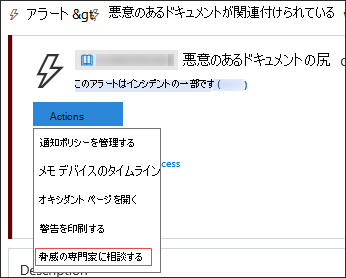
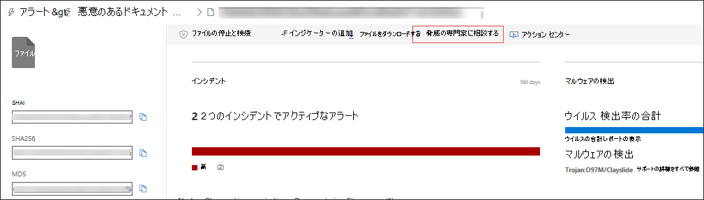

# Microsoft 脅威エキスパート

[!INCLUDE [Microsoft 365 Defender rebranding](../../includes/microsoft-defender.md)]

**適用対象:**
- [Microsoft Defender for Endpoint Plan 2](https://go.microsoft.com/fwlink/p/?linkid=2154037)
- [Microsoft 365 Defender](https://go.microsoft.com/fwlink/?linkid=2118804)

> Microsoft Defender ATP を試してみたいですか? [無料試用版にサインアップしてください。](https://signup.microsoft.com/create-account/signup?products=7f379fee-c4f9-4278-b0a1-e4c8c2fcdf7e&ru=https://aka.ms/MDEp2OpenTrial?ocid=docs-wdatp-exposedapis-abovefoldlink)

Microsoft 脅威エキスパートは、セキュリティ運用センター (SOC) に専門家レベルの監視と分析を提供し、固有の環境における重大な脅威を見逃しなくするための管理された脅威検出サービスです。

この管理された脅威の追求サービスは、標的型攻撃通知とオンデマンドの専門家へのアクセスという 2 つの機能を通じて、エキスパート主導のインサイトとデータを提供します。

## 始める前に

> [!NOTE]
> 管理対象の脅威ハンティング サービスに適用する前に、Microsoft Technical Service プロバイダーおよびアカウント チームと適格性要件について話し合います。

Microsoft Defender for Endpoint のお客様の場合は **、Microsoft 脅威エキスパート -** ターゲット攻撃通知を申請して、環境内で最も重大な脅威を特定し、迅速に対応するために役立つ特別な分析情報と分析を取得する必要があります。

[ターゲット攻撃Microsoft 脅威エキスパート通知] の特典に登録するには、「設定 エンドポイントの一般的な高度な機能Microsoft 脅威エキスパート - ターゲット攻撃通知を適用する」に \>  \>  \>  \> 移動します。 承認されると、標的型攻撃通知の特典が提供されます。

**Microsoft 脅威エキスパート - Experts on Demand** を購読するには、アカウント チームまたは Microsoft 担当者に問い合わせ、組織が直面している関連する検出および敵対者について脅威の専門家と相談してください。

詳細については[、「configure Microsoft 脅威エキスパート機能」](/microsoft-365/security/defender-endpoint/configure-microsoft-threat-experts#before-you-begin)を参照してください。

## Microsoft 脅威エキスパート - ターゲット攻撃通知

Microsoft 脅威エキスパート - 標的型攻撃通知は、人間の敵対的侵入、ハンズオンキーボード攻撃、サイバースパイなどの高度な攻撃など、ネットワークに対する最も重要な脅威を積極的に検出します。 これらの通知は、新しいアラートとして表示されます。 管理されたハンティング サービスには、次の機能が含まれます。

- 脅威の監視と分析、ビジネスの滞留時間とリスクの削減
- 既知の攻撃と未知の攻撃の両方を検出して優先順位を付ける、ハンタートレーニングを受けた人工知能
- 最も重要なリスクを特定し、SOC が時間とエネルギーを最大化するのを支援する
- 迅速な SOC 応答を可能にするために、妥協範囲とコンテキストを迅速に提供できます。

## Microsoft 脅威エキスパート - エキスパート オンデマンド

お客様は、迅速かつ正確な対応のために、Microsoft Defender セキュリティ センターから直接セキュリティ専門家に問い合わせください。 専門家は、アラートの問い合わせ、潜在的に侵害されたデバイス、疑わしいネットワーク接続の根本原因、継続的な高度な永続的な脅威キャンペーンに関する追加の脅威インテリジェンスまで、組織に影響を与える複雑な脅威をより深く理解するために必要な洞察を提供します。 この機能を使用すると、次の機能を使用できます。

- インシデントの根本原因や範囲を含むアラートに関する追加の明確化を取得する
- 高度な攻撃者に直面した場合、疑わしいデバイスの動作と次の手順をわかりやすくする
- 脅威のアクター、キャンペーン、または新しい攻撃者の手法に関するリスクと保護を決定する

脅威の専門家 **に相談** するオプションは、ポータルのいくつかの場所で利用できます。調査のコンテキストで専門家と対話できます。

- ***[ヘルプとサポート] メニュー***

  

- ***[デバイス ページのアクション] メニュー***

  

- ***[アラート ページのアクション] メニュー***

  

- ***[ファイル ページのアクション] メニュー***

  

> [!NOTE]
> Microsoft Services Hub を通じてエキスパート オンデマンド ケースの状態を追跡する場合は、テクニカル アカウント マネージャーに連絡してください。

Microsoft Services Hub の概要については、このビデオをご覧ください。

> [!VIDEO https://www.microsoft.com/videoplayer/embed/RE4pk9f]

## 関連トピック

- [機能Microsoft 脅威エキスパート構成する](configure-microsoft-threat-experts.md)
