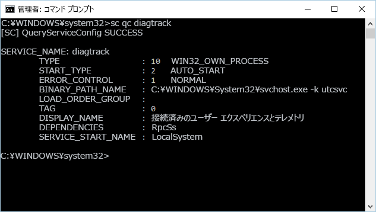

# <a name="minimum-requirements-for-microsoft-defender-for-endpoint"></a>エンドポイント用 Microsoft Defender の最小要件

[!INCLUDE [Microsoft 365 Defender rebranding](../../includes/microsoft-defender.md)]

**適用対象:**

- [Microsoft Defender for Endpoint](https://go.microsoft.com/fwlink/p/?linkid=2154037)
- [Microsoft 365 Defender](https://go.microsoft.com/fwlink/?linkid=2118804)

> Microsoft Defender ATP を試してみたいですか? [無料試用版にサインアップしてください。](https://signup.microsoft.com/create-account/signup?products=7f379fee-c4f9-4278-b0a1-e4c8c2fcdf7e&ru=https://aka.ms/MDEp2OpenTrial?ocid=docs-wdatp-minreqs-abovefoldlink)

サービスへのデバイスのオンボーディングには、いくつかの最小要件があります。 サービスにデバイスをオンボードするライセンス、ハードウェアとソフトウェアの要件、その他の構成設定について説明します。

> [!TIP]
>
> - この記事では、Microsoft Defender for Endpoint Plan 2 の最小要件について説明します。 Defender for Endpoint Plan 1 (プレビュー) に関する情報をお探しの場合は [、「Requirements for Defender for Endpoint Plan 1 (preview)」を参照してください](mde-p1-setup-configuration.md#review-the-requirements)。
> - Defender for Endpoint: Defender for Endpoint Tech Community の最新[の機能強化について説明します](https://techcommunity.microsoft.com/t5/Windows-Defender-Advanced-Threat/ct-p/WindowsDefenderAdvanced)。
> - Defender for Endpoint は、最近の MITRE 評価で業界をリードする光学機能と検出機能を実証しました。 詳細については、「[MITRE ATT&CK ベース評価の分析](https://cloudblogs.microsoft.com/microsoftsecure/2018/12/03/insights-from-the-mitre-attack-based-evaluation-of-windows-defender-atp/)」を参照してください。

## <a name="licensing-requirements"></a>ライセンスの要件

Microsoft Defender for Endpoint を使用するには、次のいずれかの Microsoft ボリューム ライセンス製品が必要です。

- Windows 11 Enterprise E5
- Windows 11 Education A5
- Windows 10 Enterprise E5
- Windows 10 Education A5
- Microsoft 365 E5 E5 または E5 Windows 10 Enterprise 11 をWindowsする Enterprise (M365 E5)
- Microsoft 365 A5 (M365 A5)
- Microsoft 365 E5 Security
- Microsoft 365 A5 Security
- Microsoft Defender for Endpoint

> [!NOTE]
> 対象となるライセンスユーザーは、最大 5 つの同時デバイスで Microsoft Defender for Endpoint を使用できます。
> Microsoft Defender for Endpoint は、ユーザー (CSP) から購入クラウド ソリューション プロバイダー利用できます。
> RDSH VM では、エンドポイント 用の個別の Defender ライセンスは必要とできません。

Microsoft Defender for Endpoint for servers には、次のいずれかのライセンス オプションが必要です。

- [Azure Defender が有効になっている Azure セキュリティ センター](/azure/security-center/security-center-pricing)
- Microsoft Defender for Endpoint for Server (対象サーバーごとに 1 つ)

> [!NOTE]
> お客様は、以下のユーザー ライセンスの 1 つ以上に対して最低 50 ライセンスを合計している場合、Microsoft Defender for Endpoint for Servers のサーバー ライセンス (対象サーバーのオペレーティング システム環境 (OSE) ごとに 1 つ) を取得できます。
>
> - Microsoft Defender for Endpoint
> - WindowsE5/A5
> - Microsoft 365 E5/A5
> - Microsoft 365 E5/A5 セキュリティ

ライセンスの詳細については、「 [製品](https://www.microsoft.com/licensing/terms/) 条項」サイトを参照し、アカウント チームと一緒に使用して、契約条件の詳細について説明します。

各エディションの機能の配列の詳細については、「Windowsエディションの比較」[を参照Windowsしてください](https://www.microsoft.com/windowsforbusiness/compare)。

## <a name="browser-requirements"></a>ブラウザー要件

Defender for Endpoint へのアクセスはブラウザーを介して行われ、次のブラウザーをサポートします。

- Microsoft Edge
- Google Chrome

> [!NOTE]
> 他のブラウザーが動作する場合は、前述のブラウザーがサポートされています。

## <a name="hardware-and-software-requirements"></a>ハードウェア要件とソフトウェア要件

### <a name="supported-windows-versions"></a>サポート対象の Windows バージョン

- Windows 7 SP1 Enterprise ([サポートには ESU が必要です](/troubleshoot/windows-client/windows-7-eos-faq/windows-7-extended-security-updates-faq))。
- Windows 7 SP1 Pro ([サポートには ESU が必要です](/troubleshoot/windows-client/windows-7-eos-faq/windows-7-extended-security-updates-faq))。
- Windows 8.1 Enterprise
- Windows 8.1 Pro
- Windows 11 Enterprise
- Windows 11 Education
- Windows 11 Pro
- Windows 11 Pro Education
- Windows 10 Enterprise
- [Windows 10 EnterpriseLTSC 2016 (以降)](/windows/whats-new/ltsc/)
- Windows 10 Education
- Windows 10 Pro
- Windows 10 Pro Education
- Windows サーバー
  - Windows Server 2008 R2 SP1
  - Windows Server 2012 R2
  - Windows Server 2016
  - Windowsサーバー、バージョン 1803 以降
  - Windows Server 2019
  - Windows Server 2022
- Windows Virtual Desktop

ネットワーク上のデバイスで、これらのエディションのいずれかを実行している必要があります。

デバイス上の Defender for Endpoint のハードウェア要件は、サポートされているエディションで同じです。

> [!NOTE]
> モバイル バージョンのモバイル Windows (Windows CE、Windows 10 Mobileなど) はサポートされていません。
>
> Microsoft 以外のWindows 10 Enterprise 2016 LTSBプラットフォームで実行すると、パフォーマンスの問題が発生する可能性があります。
>
> 仮想環境の場合は、LTSC 2019 以降Windows 10 Enterprise使用することをお勧めします。

### <a name="other-supported-operating-systems"></a>その他のサポートされているオペレーティング システム

- [Android](microsoft-defender-endpoint-android.md)
- [iOS](microsoft-defender-endpoint-ios.md)
- [ Linux ](microsoft-defender-endpoint-linux.md)
- [macOS](microsoft-defender-endpoint-mac.md)

> [!NOTE]
> 統合が機能するには、Android、iOS、および macOS の Linux ディストリビューションとバージョンが Defender for Endpoint と互換性を持つ必要があります。

### <a name="network-and-data-storage-and-configuration-requirements"></a>ネットワークとデータのストレージと構成の要件

オンボーディング ウィザードを初めて実行する場合は、Microsoft Defender for Endpoint 関連情報の保存場所 (欧州連合、英国、または米国のデータセンター) を選択する必要があります。

> [!NOTE]
>
> - 初回セットアップ後にデータストレージの場所を変更することはできません。
> - Microsoft が [データを保存する](data-storage-privacy.md) 場所と方法の詳細については、Microsoft Defender for Endpoint のデータ ストレージとプライバシーを確認してください。

### <a name="diagnostic-data-settings"></a>診断データの設定

> [!NOTE]
> Microsoft Defender for Endpoint は、有効になっている限り、特定の診断レベルを必要としません。

組織内のすべてのデバイスで診断データ サービスが有効になっているか確認します。
既定では、このサービスは有効になっています。 センサー データを取得する方法を確認する方法をお試しください。

#### <a name="use-the-command-line-to-check-the-windows-diagnostic-data-service-startup-type"></a>コマンド ラインを使用して、診断データ サービスWindowsの種類を確認する

1. デバイスで管理者特権のコマンド ライン プロンプトを開きます。
   1. **[スタート]** をクリックし、「**cmd**」と入力します。
   2. **[コマンド プロンプト]** を右クリックして **[管理者として実行]** を選択します。

2. 次のコマンドを入力し、Enter キーを **押します**。

   ```console
   sc qc diagtrack
   ```

   サービスが有効になっている場合、結果は次のスクリーンショットのようになります。

   

サービスが自動的に開始に設定されている場合は、START_TYPEに設定する **必要AUTO_START。**

#### <a name="use-the-command-line-to-set-the-windows-diagnostic-data-service-to-automatically-start"></a>コマンド ラインを使用して、診断データ Windowsを自動的に開始する設定

1. エンドポイントで管理者特権のコマンド ライン プロンプトを開きます。
    1. **[スタート]** をクリックし、「**cmd**」と入力します。
    2. **[コマンド プロンプト]** を右クリックして **[管理者として実行]** を選択します。

2. 次のコマンドを入力し、Enter キーを **押します**。

    ```console
    sc config diagtrack start=auto
    ```

3. 成功メッセージが表示されます。 次のコマンドを入力して変更を確認し、Enter キーを **押します**。

    ```console
    sc qc diagtrack
    ```

#### <a name="internet-connectivity"></a>インターネット接続

デバイス上のインターネット接続は、直接またはプロキシ経由で必要です。

Defender for Endpoint センサーは、1 日の平均帯域幅 5 MB を使用して Defender for Endpoint クラウド サービスと通信し、サイバー データを報告できます。 ファイルのアップロードや調査パッケージ コレクションなどの 1 回限りでのアクティビティは、この 1 日の平均帯域幅には含まれません。

追加のプロキシ構成設定の詳細については、「デバイス プロキシとインターネット接続の設定 [を構成する」を参照してください](configure-proxy-internet.md)。

デバイスをオンボードする前に、診断データ サービスを有効にする必要があります。 このサービスは、既定で 11 の Windows 10およびWindowsされます。

## <a name="microsoft-defender-antivirus-configuration-requirement"></a>Microsoft Defender ウイルス対策構成要件

Defender for Endpoint エージェントは、ファイルをMicrosoft Defender ウイルス対策情報を提供する機能に依存します。

Defender for Endpoint デバイスでセキュリティ インテリジェンスの更新プログラムを構成Microsoft Defender ウイルス対策マルウェア対策が有効かどうかを指定します。 詳細については、「更新プログラムの[管理と基準Microsoft Defender ウイルス対策適用する」を参照してください](/windows/security/threat-protection/microsoft-defender-antivirus/manage-updates-baselines-microsoft-defender-antivirus)。

ユーザー Microsoft Defender ウイルス対策が組織のアクティブなマルウェア対策ではない場合、Defender for Endpoint サービスを使用すると、Microsoft Defender ウイルス対策モードになります。

組織がグループ ポリシーまたは他のMicrosoft Defender ウイルス対策を使用して無効になっている場合は、オンボードされているデバイスをこのグループ ポリシーから除外する必要があります。

サーバーをオンボーディングしている場合、Microsoft Defender ウイルス対策 がサーバー上のアクティブなマルウェア対策ではない場合は、Microsoft Defender ウイルス対策 をパッシブ モードにするかアンインストールするように構成する必要があります。 構成はサーバーのバージョンに依存します。 詳細については、「互換性」[をMicrosoft Defender ウイルス対策してください](microsoft-defender-antivirus-compatibility.md)。

> [!NOTE]
> 通常のグループ ポリシーはタンパープロテクションには適用されません。タンパープロテクションがオンの場合、Microsoft Defender ウイルス対策設定への変更は無視されます。

## <a name="microsoft-defender-antivirus-early-launch-antimalware-elam-driver-is-enabled"></a>Microsoft Defender ウイルス対策早期起動マルウェア対策 (ELAM) ドライバーが有効になっている

デバイスでマルウェア対策Microsoft Defender ウイルス対策として実行している場合、Defender for Endpoint エージェントは正常にオンボードされます。

サードパーティのマルウェア対策クライアントを実行し、モバイル デバイス管理ソリューションまたは Microsoft エンドポイント マネージャー (現在のブランチ) を使用する場合は、Microsoft Defender ウイルス対策 ELAM ドライバーが有効になっている必要があります。 詳細については、「ポリシーによって[無効Microsoft Defender ウイルス対策を確認する」を参照してください](troubleshoot-onboarding.md#ensure-that-microsoft-defender-antivirus-is-not-disabled-by-a-policy)。

## <a name="related-topics"></a>関連トピック

- [Microsoft Defender for Endpoint の展開をセットアップする](production-deployment.md)
- [デバイスのオンボード](onboard-configure.md)
