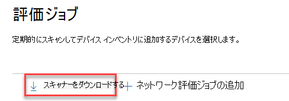
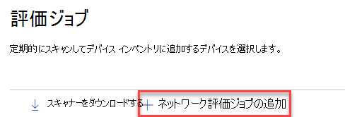
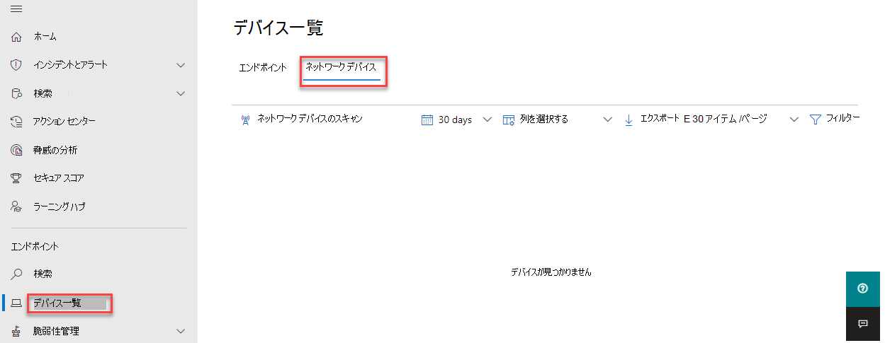

# ネットワーク デバイスの検出と脆弱性の管理Network device discovery and vulnerability management

[!INCLUDE [Microsoft 365 Defender rebranding](../../includes/microsoft-defender.md)]

**適用対象:****Applies to:**

- [Microsoft Defender for EndpointMicrosoft Defender for Endpoint](https://go.microsoft.com/fwlink/?linkid=2154037)
- [脅威と脆弱性の管理Threat and vulnerability management](next-gen-threat-and-vuln-mgt.md)
- [Microsoft 365 DefenderMicrosoft 365 Defender](https://go.microsoft.com/fwlink/?linkid=2118804)

> [!IMPORTANT]
> **ネットワーク デバイスのスキャンと管理が現在パブリック プレビュー中****Scanning and managing network devices is currently in public preview** 
> このプレビュー バージョンはサービス レベル契約なしで提供され、実稼働ワークロードには推奨されません。This preview version is provided without a service level agreement, and it's not recommended for production workloads. 一部の機能はサポートされていないか、制限された機能を持っている可能性があります。Certain features might not be supported or might have constrained capabilities.
> 詳細については [、「Microsoft Defender for Endpoint プレビュー機能」を参照してください](preview.md)。For more information, see [Microsoft Defender for Endpoint preview features](preview.md).

>Microsoft Defender ATP を試してみたいですか?Want to experience Microsoft Defender for Endpoint? [無料試用版にサインアップしてください。Sign up for a free trial.](https://www.microsoft.com/microsoft-365/windows/microsoft-defender-atp?ocid=docs-wdatp-portaloverview-abovefoldlink)

> [!NOTE]  
>  \( 04-13-2021 に公開されたネットワーク デバイスの検出と脆弱性評価ブログでは、Defender for Endpoint の新しいネットワーク デバイス検出機能に関する分析情報を \) 提供します。The [Network device discovery and vulnerability assessments](https://techcommunity.microsoft.com/t5/microsoft-defender-for-endpoint/network-device-discovery-and-vulnerability-assessments/ba-p/2267548) Blog \(published 04-13-2021\) provides insights into the new **Network device discovery** capabilities in Defender for Endpoint. この記事では、ネットワーク デバイスの検出が対処するように設計されている課題の概要と、これらの新機能の使用を開始する方法に関する詳細な情報を提供します。This article provides an overview of the challenge that **Network device discovery** is designed to address, and detailed information about how get started using these new capabilities.

ネットワーク検出機能は、セキュリティ センターとセキュリティ コンソールの [デバイス インベントリ] Microsoft 365セクションMicrosoft Defender セキュリティ センター使用できます。Network discovery capabilities are available in the **Device inventory** section of the Microsoft 365 security center and Microsoft Defender Security Center consoles.  

指定された Microsoft Defender for Endpoint デバイスは、構成済みのネットワーク デバイスの定期的な認証スキャンを実行するために、各ネットワーク セグメントで使用されます。A designated Microsoft Defender for Endpoint device will be used on each network segment to perform periodic authenticated scans of preconfigured network devices. 検出された Defender for Endpoint の 脅威と脆弱性の管理 機能は、検出されたスイッチ、ルーター、WLAN コントローラー、ファイアウォール、VPN ゲートウェイを保護するための統合ワークフローを提供します。Once discovered, Defender for Endpoint’s threat and vulnerability management capabilities provide integrated workflows to secure discovered switches, routers, WLAN controllers, firewalls, and VPN gateways.  

ネットワーク デバイスが検出され、分類された後、セキュリティ管理者は最新のセキュリティ推奨事項を受け取り、組織全体に展開されたネットワーク デバイスで最近検出された脆弱性を確認できます。Once the network devices are discovered and classified, security administrators will be able to receive the latest security recommendations and review recently discovered vulnerabilities on network devices deployed across their organizations.

## 方法Approach

Defender for Endpoint にはネットワーク デバイス自体にセンサーが組み込かされていないので、ネットワーク デバイスは標準エンドポイントとして管理されません。Network devices are not managed as standard endpoints since Defender for Endpoint doesn’t have a sensor built into the network devices themselves. これらの種類のデバイスでは、リモート スキャンがデバイスから必要な情報を取得するエージェントレスアプローチが必要です。These types of devices require an agentless approach where a remote scan will obtain the necessary information from the devices. ネットワーク トポロジと特性に応じて、Microsoft Defender for Endpoint にオンボードされている 1 台のデバイスまたは数台のデバイスで、SNMP (読み取り専用) を使用してネットワーク デバイスの認証スキャンを実行します。Depending on the network topology and characteristics, a single device or a few devices onboarded to Microsoft Defender for Endpoint will perform authenticated scans of network devices using SNMP (read-only).

次の 2 種類のデバイスを念頭に置く必要があります。There will be two types of devices to keep in mind:

- **評価デバイス**: ネットワーク デバイスのスキャンに使用するオンボード済みのデバイス。**Assessment device**: A device that's already onboarded that you'll use to scan the network devices.
- **ネットワーク デバイス**: スキャンとオンボードを計画しているネットワーク デバイス。**Network devices**: The network devices you plan to scan and onboard.

### ネットワーク デバイスの脆弱性管理Vulnerability management for network devices 

ネットワーク デバイスが検出され、分類された後、セキュリティ管理者は最新のセキュリティ推奨事項を受け取り、組織全体に展開されたネットワーク デバイスで最近検出された脆弱性を確認できます。Once the network devices are discovered and classified, security administrators will be able to receive the latest security recommendations and review recently discovered vulnerabilities on network devices deployed across their organizations.  

## サポートされているオペレーティング システムOperating systems that are supported

現在サポートされているオペレーティング システムは次のとおりです。The following operating systems are currently supported:

- Cisco IOS、IOS-XE、NX-OSCisco IOS, IOS-XE, NX-OS
- Juniper JUNOSJuniper JUNOS
- HPE ArubaOS,Procurve Switch SoftwareHPE ArubaOS, Procurve Switch Software
- Palo Alto Networks PAN-OSPalo Alto Networks PAN-OS

顧客の使用状況から収集されたデータに基づいて、時間の間に追加されるネットワーク ベンダーと OS の数が多くなされます。More networking vendors and OS will be added over time, based on data gathered from customer usage. したがって、この一覧で指定されていない場合でも、すべてのネットワーク デバイスを構成してください。Therefore, you are encouraged to configure all your network devices, even if they’re not specified in this list.

## 使用を開始する方法How to get started

最初の手順は、認証されたネットワーク スキャンを実行するデバイスを選択します。Your first step is to select a device that will perform the authenticated network scans.

1. スキャンを計画しているネットワーク デバイスの管理ポートにネットワーク接続を持つ Defender for Endpoint オンボード デバイス (クライアントまたはサーバー) を決定します。Decide on a Defender for Endpoint onboarded device (client or server) that has a network connection to the management port for the network devices you plan on scanning. 

2. Defender for Endpoint 評価デバイスと対象ネットワーク デバイス間の SNMP トラフィックを許可する必要があります (ファイアウォールなど)。SNMP traffic between the Defender for Endpoint assessment device and the targeted network devices must be allowed (for example, by the Firewall).

3. 脆弱性に対して評価されるネットワーク デバイスを決定します (たとえば、Cisco スイッチや Palo Alto Networks ファイアウォール)。Decide which network devices will be assessed for vulnerabilities (for example: a Cisco switch or a Palo Alto Networks firewall).  

4. 構成済みのすべてのネットワーク デバイスで SNMP 読み取り専用が有効になっているので、Defender for Endpoint 評価デバイスが構成済みのネットワーク デバイスに対してクエリを実行できます。Make sure SNMP read-only is enabled on all configured network devices to allow the Defender for Endpoint assessment device to query the configured network devices. この機能の適切な機能には「SNMP 書き込み」は必要とされません。‘SNMP write’ isn't needed for the proper functionality of this feature.

5. スキャンするネットワーク デバイス (またはこれらのデバイスが展開されているサブネット) の IP アドレスを取得します。Obtain the IP addresses of the network devices to be scanned (or the subnets where these devices are deployed).

6. ネットワーク デバイスの SNMP 資格情報を取得します (たとえば、Community String、noAuthNoPriv、authNoPriv、authPriv)。Obtain the SNMP credentials of the network devices (for example: Community String, noAuthNoPriv, authNoPriv, authPriv). 新しい評価ジョブを構成するときに資格情報を指定する必要があります。You’ll be required to provide the credentials when configuring a new assessment job.  

7. プロキシ クライアントの構成: Defender for Endpoint デバイス プロキシの要件以外に、追加の構成は必要ありません。Proxy client configuration: No extra configuration is required other than the Defender for Endpoint device proxy requirements.

8. ネットワーク スキャナーを認証して適切に動作するには、次のドメイン/URL を追加する必要があります。To allow the network scanner to be authenticated and work properly, it's essential that you add the following domains/URLs:

    - login.windows.netlogin.windows.net  
    - \*.securitycenter.windows.com\*.securitycenter.windows.com
    - login.microsoftonline.comlogin.microsoftonline.com
    - \*.blob.core.windows.net/networkscannerstable/ \*\*.blob.core.windows.net/networkscannerstable/ \*

    > [!NOTE]
    > すべての URL が Defender for Endpoint で指定されている場合は、許可されるデータ収集の一覧が文書化されています。Not all URLs are specified in the Defender for Endpoint documented list of allowed data collection.

## 権限Permissions

評価ジョブを構成するには、次のユーザーアクセス許可オプションが必要です。セキュリティ センター **でセキュリティ設定を管理します**。To configure assessment jobs, the following user permission option is required: **Manage security settings in Security Center**. アクセス許可は、ロールにアクセスして **設定**  >  **できます**。You can find the permission by going to **Settings** > **Roles**. 詳細については、「役割ベースの [アクセス制御の役割を作成および管理する」を参照してください](user-roles.md)。For more information, see [Create and manage roles for role-based access control](user-roles.md).

## ネットワーク スキャナーのインストールInstall the network scanner

1. [エンドポイント評価 **Microsoft 365の設定** に移動します  >    >    >  ([**ネットワーク評価] の下**)。Go to **Microsoft 365 security** > **Settings** > **Endpoints** > **Assessment jobs** (under **Network assessments**).
    1. [評価ジョブMicrosoft Defender セキュリティ センター] ページ設定 >移動します。In the Microsoft Defender Security Center, go to Settings > Assessment jobs page.

2. ネットワーク スキャナーをダウンロードし、指定された Defender for Endpoint 評価デバイスにインストールします。Download the network scanner and install it on the designated Defender for Endpoint assessment device.

    > [!div class="mx-imgBorder"]
    > ![[スキャナーのダウンロード] ボタン](images/assessment-jobs-download-scanner.png)

## ネットワーク スキャナーのインストール&登録Network scanner installation & registration

サインイン プロセスは、指定された評価デバイス自体または他のデバイス (個人用クライアント デバイスなど) で完了できます。The signing-in process can be completed on the designated assessment device itself or any other device (for example, your personal client device).

ネットワーク スキャナーの登録プロセスを完了するには、次の手順を実行します。To complete the network scanner registration process:

1. コマンド ラインに表示される URL をコピーしてフォローし、提供されたインストール コードを使用して登録プロセスを完了します。Copy and follow the URL that appears on the command line and use the provided installation code to complete the registration process.

    > [!NOTE]
    > URL をコピーするには、コマンド プロンプトの設定を変更する必要があります。You may need to change Command Prompt settings to be able to copy the URL.

2. コードを入力し、「セキュリティ センターでセキュリティ設定を管理する」と呼ばれる Defender for Endpoint アクセス許可を持つ Microsoft アカウントを使用してサインインします。Enter the code and sign in using a Microsoft account that has the Defender for Endpoint permission called "Manage security settings in Security Center."

3. 完了すると、サインインしたというメッセージが表示されます。When finished, you should see a message confirming you have signed in.

## 新しい評価ジョブを構成するConfigure a new assessment job  

[評価ジョブ] ページ **で、[ネットワーク** 設定ジョブの **追加] を選択します**。In the Assessment jobs page in **Settings**, select **Add network assessment job**. セットアップ プロセスに従って、定期的にスキャンしてデバイス インベントリに追加するネットワーク デバイスを選択します。Follow the set-up process to choose network devices to be scanned regularly and added to the device inventory.

ネットワーク デバイス インベントリでデバイスの重複を防止するには、各 IP アドレスが複数の評価デバイスで 1 回だけ構成されていることを確認します。To prevent device duplication in the network device inventory, make sure each IP address is configured only once across multiple assessment devices.

> [!div class="mx-imgBorder"]
> ![[ネットワーク評価ジョブの追加] ボタン](images/assessment-jobs-add.png)

ネットワーク評価ジョブステップの追加:Adding a network assessment job steps:

1. ネットワーク スキャナーがインストールされた 'Assessment job' 名と 'Assessment device' を選択します。Choose an ‘Assessment job’ name and the ‘Assessment device’ on which the network scanner was installed. このデバイスは、定期的に認証されたスキャンを実行します。This device will perform the periodic authenticated scans.

2. スキャンするターゲット ネットワーク デバイス (またはこれらのデバイスが展開されているサブネット) の IP アドレスを追加します。Add IP addresses of target network devices to be scanned (or the subnets where these devices are deployed). 

3. ターゲット ネットワーク デバイスの必要な SNMP 資格情報を追加します。Add required SNMP credentials of the target network devices. 

4. 新しく構成されたネットワーク評価ジョブを保存して、定期的なネットワーク スキャンを開始します。Save the newly configured network assessment job to start the periodic network scan. 

### ネットワーク デバイスのスキャンと追加Scan and add network devices

セットアップ プロセス中に、1 回のテスト スキャンを実行して、次の処理を確認できます。During the set-up process, you can perform a one time test scan to verify that:

- Defender for Endpoint 評価デバイスと構成済みのターゲット ネットワーク デバイスの間に接続があります。There is connectivity between the Defender for Endpoint assessment device and the configured target network devices.
- 構成済みの SNMP 資格情報が正しい。The configured SNMP credentials are correct.

各評価デバイスは、最大 1,500 の成功した IP アドレス スキャンをサポートできます。Each assessment device can support up to 1,500 successful IP addresses scan. たとえば、10 の異なるサブネットをスキャンすると、100 の IP アドレスだけが成功した結果を返す場合、同じ評価デバイス上の他のサブネットから 1,400 の IP 追加アドレスをスキャンできます。For example, if you scan 10 different subnets where only 100 IP addresses return successful results, you will be able to scan 1,400 IP additional addresses from other subnets on the same assessment device.  

スキャンする IP アドレス範囲/サブネットが複数ある場合、テスト スキャンの結果が表示されるのに数分かかります。If there are multiple IP address ranges/subnets to scan, the test scan results will take several minutes to show up. テスト スキャンは、最大 1,024 アドレスで使用できます。A test scan will be available for up to 1,024 addresses.

結果が表示された後、定期的なスキャンに含めるデバイスを選択できます。Once the results show up, you can choose which devices will be included in the periodic scan. スキャン結果の表示をスキップすると、構成済みのすべての IP アドレスがネットワーク評価ジョブに追加されます (デバイスの応答に関係なく)。If you skip viewing the scan results, all configured IP addresses will be added to the network assessment job (regardless of the device’s response). スキャン結果をエクスポートできます。The scan results can also be exported.

## デバイス一覧Device inventory

新しく検出されたデバイスは、[デバイス インベントリ] ページの [新しい **ネットワーク** デバイス] タブ **に表示** されます。Newly discovered devices will be shown under the new **Network devices** tab in the **Device inventory** page. デバイスが更新されるまで、評価ジョブを追加するまでに最大 2 時間かかる場合があります。It may take up to two hours after adding an assessment job until the devices are updated.

> [!div class="mx-imgBorder"]
> ![[デバイス インベントリ] の [ネットワーク デバイス] セクション](images/assessment-jobs-device-inventory.png)

## トラブルシューティングTroubleshooting

### ネットワーク スキャナーのインストールに失敗しましたNetwork scanner installation has failed

ファイアウォール設定で、許可されているドメインに必要な URL が追加されるのを確認します。Verify that the required URLs are added to the allowed domains in your firewall settings. また、「デバイス プロキシとインターネット接続の設定を構成する」の説明に従ってプロキシ [設定が構成されていることを確認します](configure-proxy-internet.md)。Also, make sure proxy settings are configured as described in [Configure device proxy and Internet connectivity settings](configure-proxy-internet.md).

### Web Microsoft.com/devicelogin が表示されないThe Microsoft.com/devicelogin web page did not show up

必要な URL がファイアウォールで許可されているドメインに追加されるのを確認します。Verify that the required URLs are added to the allowed domains in your firewall. また、「デバイス プロキシとインターネット接続の設定を構成する」の説明に従ってプロキシ [設定が構成されていることを確認します](configure-proxy-internet.md)。Also, make sure proxy settings are configured as described in [Configure device proxy and Internet connectivity settings](configure-proxy-internet.md).

### 数時間後にネットワーク デバイスがデバイス インベントリに表示されないNetwork devices are not shown in the device inventory after several hours

スキャン結果は、評価ジョブの構成が完了した後に行った最初のスキャンの数時間後に更新する必要があります。The scan results should be updated a few hours after the initial scan that took place after completing the assessment job configuration.

デバイスがまだ表示されない場合は、ネットワーク スキャナーをインストールした評価デバイスでサービス 'MdatpNetworkScanService' が実行されていることを確認し、関連する評価ジョブ構成で "スキャンの実行" を実行します。If devices are still not shown, verify that the service ‘MdatpNetworkScanService’ is running on your assessment devices, on which you installed the network scanner, and perform a “Run scan” in the relevant assessment job configuration.  

5 分後に結果が得られた場合は、サービスを再起動します。If you still don’t get results after 5 minutes, restart the service.  

### デバイスの最終表示時間が 24 時間を超えるDevices last seen time is longer than 24 hours

スキャナーが正しく実行されていることを確認します。Validate that the scanner is running properly. 次に、スキャン定義に移動し、[テストの実行] を選択します。Then go to the scan definition and select “Run test.” 関連する IP アドレスから返されるエラー メッセージを確認します。Check what error messages are returning from the relevant IP addresses.

### 必須脅威と脆弱性の管理ユーザーアクセス許可Required threat and vulnerability management user permission

登録が完了し、エラーが発生しました。"新しいエージェントを追加するための十分なアクセス許可がないように見えます。Registration finished with an error: "It looks like you don't have sufficient permissions for adding a new agent. 必要なアクセス許可は、「セキュリティ センターでセキュリティ設定を管理する」です。The required permission is 'Manage security settings in Security Center'."

任意のキーを押して終了します。Press any key to exit.

必要なアクセス許可を割り当てるには、システム管理者に問い合わせてください。Ask your system administrator to assign you the required permissions. または、別の関連メンバーにサインイン コードとリンクを提供してサインイン プロセスを支援します。Alternately, ask another relevant member to help you with the sign-in process by providing them with the sign-in code and link.

### 登録プロセスでコマンド ラインの指定されたリンクを使用して登録プロセスが失敗するRegistration process fails using provided link in the command line in registration process

別のブラウザーを試したり、サインイン リンクとコードを別のデバイスにコピーしたりします。Try a different browser or copy the sign-in link and code to a different device.

### テキストが小さすぎるか、コマンド ラインからテキストをコピーできないText too small or can’t copy text from command line

デバイスのコマンド ライン設定を変更して、テキスト サイズのコピーと変更を許可します。Change command-line settings on your device to allow copying and change text size.

## 関連記事Related articles

- [デバイス一覧Device inventory](machines-view-overview.md)
- [高度な機能を構成するConfigure advanced features](advanced-features.md)
