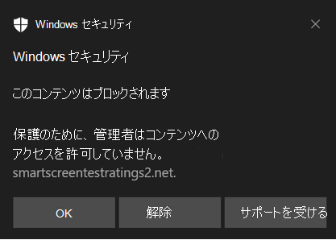

# <a name="protect-your-network"></a>ネットワークを保護する

[!INCLUDE [Microsoft 365 Defender rebranding](../../includes/microsoft-defender.md)]

**適用対象:**

- [Microsoft Defender for Endpoint Plan 2](https://go.microsoft.com/fwlink/p/?linkid=2154037)
- [Microsoft 365 Defender](https://go.microsoft.com/fwlink/?linkid=2118804)
- Microsoft Defender ウイルス対策

**プラットフォーム**
- Windows

Microsoft Defender ATP を試してみたいですか? [無料試用版にサインアップしてください。](https://signup.microsoft.com/create-account/signup?products=7f379fee-c4f9-4278-b0a1-e4c8c2fcdf7e&ru=https://aka.ms/MDEp2OpenTrial?ocid=docs-wdatp-exposedapis-abovefoldlink)

## <a name="overview-of-network-protection"></a>ネットワーク保護の概要

ネットワーク保護は、インターネット ベースのイベントからデバイスを保護するのに役立ちます。 ネットワーク保護は、攻撃面の縮小機能です。 これにより、従業員がアプリケーションを介して危険なドメインにアクセスするのを防ぐことができます。 インターネット上でフィッシング詐欺、悪用、その他の悪意のあるコンテンツをホストするドメインは危険と見なされます。 ネットワーク保護により [、Microsoft Defender SmartScreen](/windows/security/threat-protection/microsoft-defender-smartscreen/microsoft-defender-smartscreen-overview) の範囲が拡大され、(ドメインまたはホスト名に基づいて) 低評価ソースに接続しようとするすべての送信 HTTP トラフィックがブロックされます。

ネットワーク保護は、 [Web 保護](web-protection-overview.md) の保護をオペレーティング システム レベルに拡張します。 Microsoft Edge で見られる Web 保護機能は、サポートされている他のブラウザーやブラウザー以外のアプリケーションに提供されます。 また、ネットワーク保護は、 [エンドポイントの検出と応答](overview-endpoint-detection-response.md)と共に使用した場合の侵害のインジケーター (IOC) の可視性とブロックも提供します。 たとえば、ネットワーク保護は、特定のドメインまたはホスト名をブロックするために使用できる [カスタム インジケーター](manage-indicators.md) と連携します。

> [!TIP]
> ネットワーク保護のしくみについては、 [demo.wd.microsoft.com](https://demo.wd.microsoft.com?ocid=cx-wddocs-testground) の Microsoft Defender for Endpoint testground サイトを参照してください。

> [!NOTE]
> demo.wd.microsoft.com の Defender for Endpoint デモ サイトは非推奨であり、将来削除される予定です。

このビデオでは、ネットワーク保護を使用して、フィッシング詐欺、悪用、その他の悪意のあるコンテンツからデバイスの攻撃面を軽減する方法について説明します。
> [!VIDEO https://www.microsoft.com/en-us/videoplayer/embed/RE4r4yZ]

## <a name="requirements-for-network-protection"></a>ネットワーク保護の要件

ネットワーク保護には、Windows 10 Pro または Enterprise と Microsoft Defender ウイルス対策のリアルタイム保護が必要です。

| Windows バージョン | Microsoft Defender ウイルス対策 |
|:---|:---|
| Windows 10 バージョン 1709 以降 <br> Windows 11 <br> Windows Server 1803 以降 | [Microsoft Defender ウイルス対策リアルタイム保護](configure-real-time-protection-microsoft-defender-antivirus.md) <br> [クラウド配信保護を](enable-cloud-protection-microsoft-defender-antivirus.md)有効にする必要があります (アクティブ)|

## <a name="why-network-protection-is-important"></a>ネットワーク保護が重要な理由

> [!IMPORTANT]
> 一部の情報は、市販される前に大幅に変更される可能性があるプレリリース製品に関するものです。 Microsoft は、ここに記載された情報に関して、明示または黙示を問わず、いかなる保証も行いません。
> 市販されている機能に関する情報は、パブリック プレビューの情報に従います。

ネットワーク保護は、Microsoft Defender for Endpoint のソリューションの攻撃面削減グループの一部です。 ネットワーク保護を使用すると、URL と IP アドレスをブロックするネットワーク 層をレイヤー化できます。 ネットワーク保護は、特定のブラウザーと標準ネットワーク接続を使用して URL にアクセスできないようにブロックできます。

既定では、ネットワーク保護は、SmartScreen フィードを使用して既知の悪意のある URL からコンピューターを保護します。これにより、Microsoft Edge ブラウザーの SmartScreen と同様の方法で悪意のある URL がブロックされます。 ネットワーク保護機能は、次のように拡張できます。

- 独自の Threat Intel から IP/URL をブロックする (インジケーター)
- Microsoft Defender for Cloud Apps (旧称 Microsoft Cloud App Security) から承認されていないサービスをブロックする
- カテゴリに基づいてサイトをブロックする (Web コンテンツ フィルター)

Network Protection は、Microsoft の保護と応答スタックの重要な部分です。

Windows Server、Linux、MacOS、MTD の Network Protection の詳細については、「 [高度な捜索で脅威をプロアクティブに検出する](advanced-hunting-overview.md)」を参照してください。

### <a name="block-command-and-control-c2-attacks"></a>Block Command and Control (C2) 攻撃

C2 サーバー コンピューターは、悪意のあるユーザーがマルウェアによって侵害されたシステムにコマンドを送信し、侵害されたシステムに対して何らかの種類の制御を行うために使用されます。 C2 攻撃は通常、ファイル共有や Web メール サービスなどのクラウドベースのサービスに隠れ、C2 サーバーが一般的なトラフィックとブレンドして検出を回避できるようにします。

C2 サーバーは、次のコマンドを開始するために使用できます。

- データを盗む (フィッシングなど)
- ボットネットで侵害されたコンピューターを制御する
- 正当なアプリケーションを中断する
- ランサムウェアなどのマルウェアを拡散する

Microsoft Defender for Endpoint の Network Protection コンポーネントは、機械学習やインテリジェントな侵害インジケーター (IoC) 識別などの手法を使用して、人間が操作するランサムウェア攻撃で使用される C2 インフラストラクチャへの接続を識別し、ブロックします。

#### <a name="network-protection-new-toast-notifications"></a>ネットワーク保護: 新しいトースト通知

| 新しいマッピング  | 応答カテゴリ  | ソース |
| :--- | :--- | :--- |
| フィッシング詐欺 | フィッシング詐欺 | Smartscreen |
| 悪意 | 悪意がある | Smartscreen |
| コマンドと制御 | C2 | Smartscreen |
| コマンドと制御 | COCO | Smartscreen |
| 悪意 | 信頼 | Smartscreen |
| IT 管理者による | CustomBlockList |   |
| IT 管理者による | CustomPolicy |   |

> [!NOTE]
> **customAllowList** では、エンドポイントに対する通知は生成されません。

### <a name="new-notifications-for-network-protection-determination"></a>ネットワーク保護の決定に関する新しい通知

ネットワーク保護の新しい一般公開機能では、SmartScreen の機能を利用して、悪意のあるコマンド サイトと制御サイトからのフィッシングアクティビティをブロックします。

エンド ユーザーがネットワーク保護が有効になっている環境で Web サイトにアクセスしようとすると、次の 3 つのシナリオが考えられます。

- URL には既知の **評判** があります。この場合、ユーザーはアクセスを妨害することなく許可され、エンドポイントにトースト通知は表示されません。 実際には、ドメインまたは URL は _[許可]_ に設定されます。
- URL には **不明または不確かな評判** があります。ユーザーのアクセスはブロックされますが、ブロックを回避 (ブロック解除) できます。 実際には、ドメインまたは URL は監査に設定 _されます_。
- URL に既知の **悪意のある (悪意のある) 評判** があります。ユーザーはアクセスできません。 実際には、ドメインまたは URL は _[ブロック_] に設定されます。

#### <a name="warn-experience"></a>エクスペリエンスを警告する

ユーザーが Web サイトにアクセスした場合:

- URL に不明または不確かな評価がある場合は、トースト通知によってユーザーに次のオプションが表示されます。

  - **OK** - トースト通知が解放 (削除) され、サイトへのアクセスの試行が終了します。
  - **ブロック解除** - ユーザーは、サイトにアクセスするために Windows Defender セキュリティ インテリジェンス (WDSI) ポータルにアクセスする必要はありません。 ユーザーはサイトに 24 時間アクセスできます。その時点で、ブロックはさらに 24 時間再び有効になります。 管理者がサイトを禁止 (ブロック) するまで、ユーザーは引き続き **ブロック解除** を使用してサイトにアクセスでき、ブロック解除のオプションが削除 **されます**。
  - **フィードバック** - トースト通知では、チケットを送信するためのリンクがユーザーに表示されます。これにより、ユーザーはサイトへのアクセスを正当化するために管理者にフィードバックを送信できます。

  > [!div class="mx-imgBorder"]
  > 

  > [注!]警告エクスペリエンスとブロック エクスペリエンス (下) に示す画像は、両方ともプレースホルダー テキストの例として **"ブロックされた URL" を** 一覧表示します。機能している環境では、実際の URL またはドメインが一覧表示されます。  

#### <a name="block-experience"></a>ブロック エクスペリエンス

ユーザーが Web サイトにアクセスした場合:

- URL の評判が悪い場合は、トースト通知によってユーザーに次のオプションが表示されます。
  - **わかりました** トースト通知が解放 (削除) され、サイトへのアクセスの試行は終了します。
  - **フィードバック** トースト通知では、チケットを送信するためのリンクがユーザーに表示されます。これにより、ユーザーはサイトへのアクセスを正当化するために管理者にフィードバックを送信できます。
  
  > [!div class="mx-imgBorder"]
  > 

### <a name="network-protection-c2-detection-and-remediation"></a>ネットワーク保護: C2 の検出と修復

最初の形式では、ランサムウェアは商品の脅威であり、事前にプログラムされ、限られた特定の結果 (コンピューターの暗号化など) に焦点を当てています。 しかし、ランサムウェアは人間主導の高度な脅威に進化し、適応性があり、より大規模で広範な結果に焦点を当てています。は、組織全体の資産または身代金のデータを保持する場合などです。

コマンドと制御 (C2) のサポートは、このランサムウェアの進化の重要な部分であり、これらの攻撃がターゲットとする環境に適応することを可能にします。 コマンドおよび制御インフラストラクチャへのリンクを解除することは、攻撃の次の段階への進行を停止することを意味します。

#### <a name="detecting-and-remediating-cobaltstrike-public-preview"></a>CobaltStrike の検出と修復 (パブリック プレビュー)

人間が操作するランサムウェア攻撃で使用される最も一般的な悪用後フレームワークの 1 つは、CobaltStrike です。 Microsoft 全体の脅威インテリジェンス チームは、ランサムウェアを展開する複数のアクティビティ グループで _戦術、手法、および手順_ (TMP) を追跡し、悪意のあるアクターが使用する特定の戦略や脅威ベクトルから防御するために使用できる行動パターンを特定します。 これらのランサムウェア アクティビティ グループはすべて、攻撃ライフ サイクルのある時点で、実践的なキーボード アクティビティを有効にするために、CobaltStrike ビーコンを被害者のコンピューターに展開することを含みます。

CobaltStrike を使用すると、さまざまなプロトコルに応答する複数のリスナーをホストする機能から、主要なクライアント側コンポーネント (ビーコン) でコードインジェクションを実行し、悪用後ジョブを実行する方法まで、攻撃の複数の側面をカスタマイズできます。 Microsoft Defender が CobaltStrike を検出すると、侵害の主要な指標 (IoC) をインテリジェントに見つけて収集できます。 キャプチャされると、検出と保護の目的で、これらのインジケーターが Microsoft の製品スタック全体で共有されます。

Microsoft Defender のコマンドと制御の検出は、CobaltStrike に限定されません。 Microsoft Defender は、複数のマルウェア ファミリの主要な IoC をキャプチャできます。 このインジケーターは、お客様を保護し、侵害が発生した場合にアラートを送信するために、Microsoft 保護スタック全体で共有されます。

コマンドと制御の通信をブロックすると、標的型攻撃を大きく妨げる可能性があり、防御者は最初のエントリ ベクトルを見つけて、別の攻撃を試みる前にそれらを閉じる時間を与えます。

<!-- Hide {this intro with no subsequent list items}
[For additional details about Microsoft Defender's command and control detection, see **ADD LINK TO BLOG**.]
-->

## <a name="smart-screen-unblock"></a>スマート 画面のブロック解除

Microsoft Defender for Endpoint Indicators の新機能により、管理者はエンド ユーザーが一部の URL と IP に対して生成された "警告" をバイパスできるようになります。 URL がブロックされた理由によっては、スマート スクリーン ブロックが検出されると、管理者にサイトのブロックを最大 24 時間ブロック解除できる機能が提供される場合があります。 このような場合は、Windows セキュリティ トースト通知が表示され、定義された期間、エンド ユーザーが URL または IP の **ブロックを解除** できるようになります。  

 > [!div class="mx-imgBorder"]
 > 

Microsoft Defender for Endpoint Administrators は、次の構成ツールを使用して [、Microsoft 365 Defender](https://security.microsoft.com/) でスマート スクリーン ブロック解除機能を構成できます。 Microsoft 365 Defender ポータルから、ConfigToolName へのパスに移動します。

<!-- Hide {this intro with no subsequent list items}
[Line 171: Delete the colon and the right angle-brackets. The resulting sentence will be "From the [MS365 Defender] portal, navigate to path to ConfigToolName." Delete "to" and add "the" before path unless a specific description is available. Would a screenshot help? Normally angle brackets or arrows are used in place of certain text rather than in addition.]
-->

 > [!div class="mx-imgBorder"]
 > 

## <a name="using-network-protection"></a>ネットワーク保護の使用

ネットワーク保護は、通常、管理インフラストラクチャを使用して行われるデバイスごとに有効になります。 サポートされている方法については、「 [ネットワーク保護を有効にする」](enable-network-protection.md)を参照してください。

> [!NOTE]
> ネットワーク保護を有効にするには、Microsoft Defender ウイルス対策がアクティブになっている必要があります。

**監査** モードまたは **ブロック** モードで Network Protection を有効にすることができます。 IP または URL をブロックする前に Network Protection を有効にした場合の影響を評価する場合は、一定期間監査モードで有効にして、ブロックされる内容に関するデータを収集できます。 エンド ユーザーがネットワーク保護によってブロックされていたアドレスまたはサイトに接続した場合の監査モード ログ。

## <a name="advanced-hunting"></a>高度なハンティング

Advanced Hunting を使用して監査イベントを識別する場合は、コンソールから最大 30 日間の履歴を使用できます。 [高度なハンティングを](advanced-hunting-overview.md)参照してください。

監査データは、Microsoft Defender for Endpoint ポータルの **高度な捜索** で確認できます。  

イベントは、ExploitGuardNetworkProtectionAudited の ActionType を持つ DeviceEvents にあります。 ブロックは ExploitGuardNetworkProtectionBlocked によって表示されます。  

次の例には、ブロックされたアクションが含まれています。

DeviceEvents

- Where ActionType in ('ExploitGuardNetworkProtectionAudited','ExploitGuardNetworkProtectionBlocked')

 > [!div class="mx-imgBorder"]
 > 

> [!TIP]
> これらのエントリには、アクションに関する優れた情報を提供する AdditionalFields 列にデータが含まれています。AdditionalFields を展開すると、 **IsAudit**、 **ResponseCategory**、 **DisplayName** というフィールドも取得できます。

DeviceEvents:

- ActionType に "ExploitGuardNetworkProtection" が含まれている場所
- extend ParsedFields=parse_json(AdditionalFields)
- project DeviceName、ActionType、Timestamp、RemoteUrl、InitiatingProcessFileName、IsAudit=tostring(ParsedFields.IsAudit)、ResponseCategory=tostring(ParsedFields.ResponseCategory)、DisplayName=tostring(ParsedFields.DisplayName)
- Timestamp desc による並べ替え

応答カテゴリは、次のように、イベントの原因を示します。

| ResponseCategory | イベントを担当する機能 |
|:---|:---|
| CustomPolicy |  WCF  |
| CustomBlockList  |   カスタム インジケーター   |
| CasbPolicy   |   Defender for Cloud Apps   |
| 悪意がある   |   Web の脅威  |
| フィッシング詐欺  |   Web の脅威  |

詳細については、「 [エンドポイント ブロックのトラブルシューティング](web-protection-overview.md#troubleshoot-endpoint-blocks)」を参照してください。

結果として得られる URL と IP の一覧を使用して、デバイスがブロック モードの場合にブロックされた内容と、ブロックされた機能を決定できます。 一覧の各項目を確認して、環境に必要な URL または IP を識別します。 環境にとって重要な監査済みのエントリが見つかる場合は、それらをネットワークで許可するインジケーターを作成します。 許可 URL/IP インジケーターは、任意のブロックよりも優先されます。

インジケーターを作成したら、基になる問題の解決を確認できます。

- スマート画面 - 要求のレビュー
- インジケーター – 既存のインジケーターを変更する
- MCA – 承認されていない APP を確認する
- WCF – 要求の再集計

このデータを使用すると、ブロック モードでネットワーク保護を有効にすることに関する情報に基づいた決定を行うことができます。 [ネットワーク保護ブロックの優先順位を](web-protection-overview.md#order-of-precedence)参照してください。

> [!NOTE]
> これはデバイスごとの設定であるため、ブロック モードに移行できないデバイスがある場合は、チャレンジを修正でき、監査イベントを受け取るまで監査のままにすることができます。

誤検知を報告する方法については、「誤検知を [報告する」](web-protection-overview.md#report-false-positives)を参照してください。

独自の Power BI レポートを作成する方法の詳細については、「Power BI を [使用してカスタム レポートを作成する](api-power-bi.md)」を参照してください。

## <a name="configuring-network-protection"></a>ネットワーク保護の構成

ネットワーク保護を有効にする方法の詳細については、「ネットワーク保護を **[有効にする」を](enable-network-protection.md)** 参照してください。 グループ ポリシー、PowerShell、または MDM CSP を使用して、ネットワーク内のネットワーク保護を有効および管理します。

サービスを有効にした後、サービスとデバイス (エンドポイントとも呼ばれます) 間の接続を許可するようにネットワークまたはファイアウォールを構成することが必要になる場合があります。

- `.smartscreen.microsoft.com`
- `.smartscreen-prod.microsoft.com`

## <a name="viewing-network-protection-events"></a>ネットワーク保護イベントの表示

ネットワーク保護は [Microsoft Defender for Endpoint](microsoft-defender-endpoint.md) で最適に機能します。これにより、 [アラート調査シナリオ](investigate-alerts.md)の一環として、エクスプロイト保護イベントとブロックに関する詳細なレポートが提供されます。

ネットワーク保護によって接続がブロックされると、アクション センターから通知が表示されます。 セキュリティ運用チームは、組織 [の](attack-surface-reduction-rules-deployment-implement.md#customize-attack-surface-reduction-rules) 詳細と連絡先情報を使用して通知をカスタマイズできます。 さらに、監視する特定の手法に合わせて、個々の攻撃面縮小ルールを有効にしたりカスタマイズしたりできます。

[また、監査モード](audit-windows-defender.md)を使用して、ネットワーク保護が有効になっている場合に組織にどのような影響を与えるかを評価することもできます。

## <a name="review-network-protection-events-in-the-microsoft-365-defender-portal"></a>Microsoft 365 Defender ポータルでネットワーク保護イベントを確認する

Microsoft Defender for Endpoint では、 [アラート調査シナリオ](investigate-alerts.md)の一環として、イベントとブロックに関する詳細なレポートが提供されます。 これらの詳細は、[アラート キュー](review-alerts.md)の Microsoft 365 Defender ポータル ([https://security.microsoft.com](https://security.microsoft.com)) で、または[高度な捜索](advanced-hunting-overview.md)を使用して表示できます。 [監査モード](audit-windows-defender.md)を使用している場合は、高度なハンティングを使用して、ネットワーク保護設定が有効になっている場合に環境にどのような影響を与えるかを確認できます。

高度なハンティングのクエリの例を次に示します。

```kusto
DeviceNetworkEvents
|where ActionType in ('ExploitGuardNetworkProtectionAudited','ExploitGuardNetworkProtectionBlocked', 'ConnectionSuccess')
```

## <a name="review-network-protection-events-in-windows-event-viewer"></a>Windows イベント ビューアーでネットワーク保護イベントを確認する

Windows イベント ログを確認して、ネットワーク保護が悪意のある IP またはドメインへのアクセスをブロック (または監査) したときに作成されるイベントを確認できます。

1. [XML を直接コピーします](event-views.md)。

2. **[OK]** を選択します。

この手順では、ネットワーク保護に関連する次のイベントのみを表示するようにフィルター処理するカスタム ビューを作成します。

****

|イベント ID|説明|
|---|---|
|5007|設定が変更された場合のイベント|
|1125|ネットワーク保護が監査モードで起動した場合のイベント|
|1126|ブロック モードでネットワーク保護が発生した場合のイベント|
|

## <a name="network-protection-and-the-tcp-three-way-handshake"></a>ネットワーク保護と TCP の 3 方向ハンドシェイク

ネットワーク保護では、サイトへのアクセスを許可するかブロックするかの決定は、 [TCP/IP 経由の 3 方向ハンドシェイク](/troubleshoot/windows-server/networking/three-way-handshake-via-tcpip)が完了した後に行われます。 そのため、サイトがネットワーク保護によってブロックされると、サイトが実際にブロックされていても、Microsoft 365 Defender ポータルでアクションの`ConnectionSuccess``NetworkConnectionEvents`種類が表示される場合があります。 `NetworkConnectionEvents` は、ネットワーク保護からではなく、TCP レイヤーから報告されます。 3 方向ハンドシェイクが完了すると、サイトへのアクセスがネットワーク保護によって許可またはブロックされます。

そのしくみの例を次に示します。

1. ユーザーがデバイス上の Web サイトにアクセスしようとするとします。 サイトは危険なドメインでホストされ、ネットワーク保護によってブロックされる必要があります。  

2. TCP/IP 経由の 3 方向ハンドシェイクが開始されます。 完了する前に `NetworkConnectionEvents` 、アクションがログに記録され、次 `ActionType` のように `ConnectionSuccess`一覧表示されます。 ただし、3 方向ハンドシェイク プロセスが完了するとすぐに、ネットワーク保護によってサイトへのアクセスがブロックされます。 このすべてが非常に迅速に行われます。 [Microsoft Defender SmartScreen](/windows/security/threat-protection/microsoft-defender-smartscreen/microsoft-defender-smartscreen-overview) でも同様のプロセスが発生します。3 方向ハンドシェイクが完了すると、決定が行われ、サイトへのアクセスがブロックまたは許可されます。

3. Microsoft 365 Defender ポータルでは、アラートが [アラート キュー](alerts-queue.md)に一覧表示されます。 そのアラートの詳細には、 `NetworkConnectionEvents` 両方と `AlertEvents`. ActionType が .. のアイテムも含 `NetworkConnectionEvents` まれている場合でも、サイトがブロックされていることがわかります `ConnectionSuccess`。

## <a name="considerations-for-windows-virtual-desktop-running-windows-10-enterprise-multi-session"></a>Windows 10 Enterprise マルチセッションを実行する Windows 仮想デスクトップに関する考慮事項

Windows 10 Enterprise のマルチユーザーの性質上、次の点に留意してください。

1. ネットワーク保護はデバイス全体の機能であり、特定のユーザー セッションを対象にすることはできません。

2. Web コンテンツ フィルター ポリシーもデバイス全体です。

3. ユーザー グループを区別する必要がある場合は、個別の Windows Virtual Desktop ホスト プールと割り当てを作成することを検討してください。

4. ネットワーク保護を監査モードでテストし、ロールアウトする前にその動作を評価します。

5. 多数のユーザーまたは多数のマルチユーザー セッションがある場合は、デプロイのサイズを変更することを検討してください。

### <a name="alternative-option-for-network-protection"></a>ネットワーク保護の代替オプション

Windows 10 Enterprise Multi-Session 1909 以降では、Azure 上の Windows Virtual Desktop で使用され、Microsoft Edge のネットワーク保護を有効にするには、次の方法を使用します。

1. [[ネットワーク保護を有効にする]](enable-network-protection.md) を使用し、指示に従ってポリシーを適用します。

2. 次の PowerShell コマンドを実行します。
  - `Set-MpPreference -EnableNetworkProtection Enabled`
  - `Set-MpPreference -AllowNetworkProtectionOnWinServer 1`
  - `Set-MpPreference -AllowNetworkProtectionDownLevel 1`
  - `Set-MpPreference -AllowDatagramProcessingOnWinServer 1`

## <a name="network-protection-troubleshooting"></a>ネットワーク保護のトラブルシューティング

ネットワーク保護が実行される環境により、Microsoft はオペレーティング システム プロキシ設定を検出できない可能性があります。 場合によっては、ネットワーク保護クライアントが Cloud Service に到達できない場合があります。 接続の問題を解決するには、E5 ライセンスをお持ちのお客様は、次のいずれかのレジストリ キーを構成する必要があります。

```console
reg add "HKLM\Software\Microsoft\Windows Defender" /v ProxyServer /d "<proxy IP address: Port>" /f
reg add "HKLM\Software\Microsoft\Windows Defender" /v ProxyPacUrl /d "<Proxy PAC url>" /f

```

## <a name="optimizing-network-protection-performance"></a>ネットワーク保護のパフォーマンスの最適化

Network Protection にはパフォーマンスの最適化が用意されています。これにより、SmartScreen によって検証および許可された後、ブロック モードで長い接続の非同期的な検査を開始できるようになりました。これにより、検査の帯域幅に関するコストが削減される可能性があり、アプリの互換性の問題にも役立つ可能性があります。 この最適化機能は既定でオンになっています。 この機能は、次の PowerShell コマンドレットを使用して無効にすることができます。

`Set-MpPreference -AllowSwitchToAsyncInspection $false`

## <a name="see-also"></a>関連項目

- [ネットワーク保護|を評価する](evaluate-network-protection.md) 機能のしくみと、通常作成されるイベントを示す簡単なシナリオを実行します。
- [ネットワーク保護|を有効にする](enable-network-protection.md) グループ ポリシー、PowerShell、または MDM CSP を使用して、ネットワーク内のネットワーク保護を有効および管理します。
- [Microsoft Intune での攻撃面削減機能の構成](/mem/intune/protect/endpoint-security-asr-policy)
