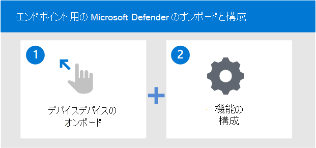

# デバイスにオンボードして、Microsoft Defender for Endpoint 機能 を構成します

[!INCLUDE [Microsoft 365 Defender rebranding](../../includes/microsoft-defender.md)]

**適用対象:**
- [Microsoft Defender for Endpoint Plan 2](https://go.microsoft.com/fwlink/p/?linkid=2154037)
- [Microsoft 365 Defender](https://go.microsoft.com/fwlink/?linkid=2118804)

[!include[Prerelease information](../../includes/prerelease.md)]

> Defender for Endpoint を試す場合は、 [無料試用版にサインアップしてください。](https://signup.microsoft.com/create-account/signup?products=7f379fee-c4f9-4278-b0a1-e4c8c2fcdf7e&ru=https://aka.ms/MDEp2OpenTrial?ocid=docs-wdatp-onboardconfigure-abovefoldlink)

Microsoft Defender for Endpoint の展開は、2 段階のプロセスです。

- デバイスをサービスにオンボードする
- サービスの機能を構成する

## デバイスをサービスにオンボードする
Defender for Endpoint ポータルのオンボーディング セクションに移動して、サポートされているデバイスをオンボードする必要があります。 デバイスに応じて、適切な手順と、デバイスに適した管理および展開ツールのオプションが提供されます。 

一般に、デバイスをサービスにオンボードするには、次の情報を使用します。

- デバイスが最小要件を満 [たしていることを確認する](minimum-requirements.md)
- デバイスに応じて、Defender for Endpoint ポータルのオンボーディング セクションに示されている構成手順に従います。
- デバイスに適切な管理ツールと展開方法を使用する
- 検出テストを実行して、デバイスが適切にオンボードされ、サービスに報告されていることを確認する

## オンボーディングと構成ツールのオプション
次の表に、オンボードする必要があるエンドポイントに基づいて使用可能なツールを示します。

| エンドポイント     | ツール オプション                       |
|--------------|------------------------------------------|
| **Windows**  |  [ローカル スクリプト (最大 10 台のデバイス)](configure-endpoints-script.md)    [グループ ポリシー](configure-endpoints-gp.md)    [Microsoft エンドポイント マネージャー/ モバイル デバイス マネージャー](configure-endpoints-mdm.md)     [Microsoft Endpoint Configuration Manager](configure-endpoints-sccm.md)   [VDI スクリプト](configure-endpoints-vdi.md)   [Microsoft Defender for Cloudとの統合](configure-server-endpoints.md#integration-with-azure-defender)   |
| **macOS**    | [ローカル スクリプト](mac-install-manually.md)   [Microsoft エンドポイント マネージャー](mac-install-with-intune.md)   [JAMF Pro](mac-install-with-jamf.md)   [モバイル デバイス管理](mac-install-with-other-mdm.md) |
| **Linux Server** | [ローカル スクリプト](linux-install-manually.md)   [Puppet](linux-install-with-puppet.md)   [Ansible](linux-install-with-ansible.md)|
| **iOS**      | [Microsoft エンドポイント マネージャー](ios-install.md)               |
| **Android**  | [Microsoft エンドポイント マネージャー](android-intune.md)            | 

次の表に、オンボードする必要があるエンドポイントに基づいて使用可能なツールを示します。

## サービスの機能を構成する
オンボード デバイスは、Micorosft Defender for Endpoint のエンドポイント検出および応答機能を効果的に有効にします。

デバイスのオンボード後、サービスの他の機能を構成する必要があります。 次の表に、環境に最適な保護を取得するために構成できる機能の一覧を示します。

| 機能 | 説明 |
|-|-|
| [脅威の脆弱性&管理 (TVM) の構成](tvm-prerequisites.md) | 脅威&脆弱性管理は、Microsoft Defender for Endpoint のコンポーネントであり、セキュリティ管理者とセキュリティ運用チームの両方に、次の固有の値を提供します。    - リアルタイムのエンドポイント検出と応答 (EDR) の分析情報は、エンドポイントの脆弱性と関連しています。    - インシデント調査中の貴重なデバイスの脆弱性コンテキスト。    - 組み込みの修復プロセスは、Microsoft Intune Microsoft System Center Configuration Manager。  |
| [次世代保護 (NGP) の構成](configure-microsoft-defender-antivirus-features.md) | Microsoft Defender ウイルス対策は、デスクトップ、ポータブル コンピューター、およびサーバーに次世代の保護を提供する組み込みのマルウェア対策ソリューションです。 Microsoft Defender ウイルス対策には、次のものが含まれます。   -クラウドによって提供される、新しい脅威や新しい脅威のほぼ瞬時の検出とブロックに対する保護。 機械学習やインテリジェント セキュリティ グラフに加えて、クラウドによる保護は Microsoft Defender ウイルス対策を強化する次世代テクノロジの一部です。    - 高度なファイルとプロセスの動作監視、その他のヒューリスティック ("リアルタイム保護" とも呼ばれる) を使用した常時スキャン。   - 機械学習、人間および自動化されたビッグ データ分析、および詳細な脅威耐性の調査に基づく専用の保護更新プログラム。 |
| [攻撃表面の縮小を構成する (ASR)](overview-attack-surface-reduction.md) | Microsoft Defender for Endpoint の攻撃表面の縮小機能は、新しい脅威や新たな脅威から組織内のデバイスとアプリケーションを保護するのに役立ちます。 |
| [自動調査と修復& (AIR) 機能の構成](configure-automated-investigations-remediation.md) | Microsoft Defender for Endpoint では、自動調査を使用して、個別に調査する必要があるアラートの量を大幅に削減します。 自動調査機能は、さまざまな検査アルゴリズムと、アナリストが使用するプロセス (プレイブックなど) を活用してアラートを調べ、違反を解決するために直ちに修復アクションを実行します。 これにより、アラート量が大幅に削減され、セキュリティ運用の専門家は、より高度な脅威やその他の価値の高い業務に集中できるようになります。 |
| [[Microsoft 脅威エキスパート (MTE) 機能を構成する](configure-microsoft-threat-experts.md) | Microsoft 脅威エキスパートは、セキュリティ オペレーション センター (SOC) にエキスパート レベルの監視と分析を提供するマネージ ハンティング サービスで、固有の環境における重大な脅威を見逃すのを防いでお手伝いします。      |

## デバイスでサポートされているWindows機能

|オペレーティング システム  |Windows 10 & 11  |Windows Server 2012 R2 [[1](#fn1)]  |Windows Server 2016[[1](#fn1)]   |Windows Server 2019 & 2022|Windows Server 1803+|
|---------|---------|---------|---------|---------|---------|
|**予防**    |         |         |         |         |         |
|攻撃表面の縮小ルール     |    Y     |   Y      |    Y     |    Y     |    Y     |
|デバイス コントロール     |     Y    |    N     |    N     |    N     |    N     |  
|ファイアウォール     |      Y   |    Y     |     Y    |    Y    |    Y   |
|ネットワーク保護     |      Y   |    Y     |     Y    |    Y    |    Y   |
|次世代の保護     |      Y   |    Y     |     Y    |    Y    |    Y   |
|タンパープロテクション     |        Y   |    Y     |     Y    |    Y    |    Y   |
|Web 保護     |       Y   |    Y     |     Y    |    Y    |    Y   |
|||||||
|**検出**     |         |         |         |||
|高度なハンティング     |      Y   |    Y     |     Y    |    Y    |    Y   |
|カスタム ファイル インジケーター     |      Y   |    Y     |     Y    |    Y    |    Y   |
|カスタム ネットワーク インジケーター     |      Y   |    Y     |     Y    |    Y    |    Y   |
|EDR ブロック &パッシブ モード     |      Y   |    Y     |     Y    |    Y    |    Y   |
|検出センサー     |      Y   |    Y     |     Y    |    Y    |    Y   |
|ネットワーク &検出のエンドポイント     |      Y   |    N     |     N    |    N    |    N   |
|||||||
|**応答**     |         |         |         |||
|自動調査&応答 (AIR)    |      Y   |    Y     |     Y    |    Y    |    Y   |
|デバイス応答機能: 分離、調査パッケージの収集、AV スキャンの実行     |      Y   |    Y     |     Y    |    Y    |    Y   |
|ファイル応答機能: ファイルの収集、深い分析、ファイルのブロック、停止、検疫プロセス     |      Y   |    Y     |     Y    |    Y    |    Y   |
|ライブ応答    |      Y   |    Y     |     Y    |    Y    |    Y   |

(<a id="fn1">1</a>) 2016 年と 2016 年の最新の統合ソリューションをWindows Server 2012します。 詳細については、「Defender [for Endpoint サービスへのオンボード Windows サーバー」を参照してください](configure-server-endpoints.md)。

>[!NOTE]
>Windows 7、8.1、Windows Server 2008 R2 には、EDR センサーのサポートと、System Center Endpoint Protection (SCEP) を使用した AV が含まれます。
