# Microsoft エンドポイント マネージャーを使用したオンボーディング

[!INCLUDE [Microsoft 365 Defender rebranding](../../includes/microsoft-defender.md)]

**適用対象:**
- [Microsoft Defender for Endpoint](https://go.microsoft.com/fwlink/p/?linkid=2154037)
- [Microsoft 365 Defender](https://go.microsoft.com/fwlink/?linkid=2118804)

> Microsoft Defender ATP を試してみたいですか? [無料試用版にサインアップしてください。](https://signup.microsoft.com/create-account/signup?products=7f379fee-c4f9-4278-b0a1-e4c8c2fcdf7e&ru=https://aka.ms/MDEp2OpenTrial?ocid=docs-wdatp-exposedapis-abovefoldlink)

この記事は展開ガイドの一部であり、オンボーディング方法の例として機能します。

「計画 [」トピック](deployment-strategy.md) では、デバイスをサービスにオンボードする方法がいくつか用意されています。 このトピックでは、クラウド ネイティブ アーキテクチャについて説明します。

*環境アーキテクチャの図*

Defender for Endpoint はさまざまなエンドポイントとツールのオンボーディングをサポートしますが、この記事ではそれらをカバーしません。 サポートされている他の展開ツールと方法を使用した一般的なオンボーディングの詳細については、「オンボードの概要 [」を参照してください](onboarding.md)。

[Microsoft エンドポイント マネージャー](/mem/endpoint-manager-overview)は、複数のサービスを統合するソリューション プラットフォームです。 これには、クラウドベース[Microsoft Intune](/mem/intune/fundamentals/what-is-intune)管理のための機能が含まれています。

このトピックでは、次のユーザーをガイドします。

- 手順 1: デバイスをサービスにオンボーディングするには、MICROSOFT エンドポイント マネージャー (MEM) で構成を割り当てる
- 手順 2: エンドポイントを使用して Defender for Endpoint の機能を構成Microsoft エンドポイント マネージャー

このオンボーディング ガイダンスでは、次 Microsoft エンドポイント マネージャーの基本的な手順について説明します。

- [ターゲット デバイスまたはユーザーの識別](#identify-target-devices-or-users)
  - ユーザー グループAzure Active Directoryする (ユーザーまたはデバイス)
- [構成プロファイルの作成](#step-2-create-configuration-policies-to-configure-microsoft-defender-for-endpoint-capabilities)
  - このMicrosoft エンドポイント マネージャー、機能ごとに個別のポリシーを作成する方法について説明します。

## リソース

プロセスの残りの部分に必要なリンクを次に示します。

- [MEM ポータル](https://aka.ms/memac)
- [セキュリティ センター](https://securitycenter.windows.com/)
- [Intune セキュリティのベースライン](/mem/intune/protect/security-baseline-settings-defender-atp#microsoft-defender)

詳細については、次のMicrosoft エンドポイント マネージャーを参照してください。

- [Microsoft エンドポイント マネージャーページ](/mem/)
- [Intune と ConfigMgr のコンバージェンスに関するブログ投稿](https://www.microsoft.com/microsoft-365/blog/2019/11/04/use-the-power-of-cloud-intelligence-to-simplify-and-accelerate-it-and-the-move-to-a-modern-workplace/)
- [MEM の概要ビデオ](https://www.microsoft.com/microsoft-365/blog/2019/11/04/use-the-power-of-cloud-intelligence-to-simplify-and-accelerate-it-and-the-move-to-a-modern-workplace)

## 手順 1: MEM で構成を割り当てるグループを作成してデバイスをオンボードする

### ターゲット デバイスまたはユーザーを特定する

このセクションでは、構成を割り当てるテスト グループを作成します。

> [!NOTE]
> Intune では、Azure Active Directory (Azure AD) グループを使用してデバイスとユーザーを管理します。 Intune 管理者は、組織のニーズに合わせてグループを設定できます。
>
> 詳細については、「グループを追加して [ユーザーとデバイスを整理する」を参照してください](/mem/intune/fundamentals/groups-add)。

### グループを作成する

1. MEM ポータルを開きます。

2. [グループ **] を>新しいグループを開きます**。

    > [!div class="mx-imgBorder"]
    > 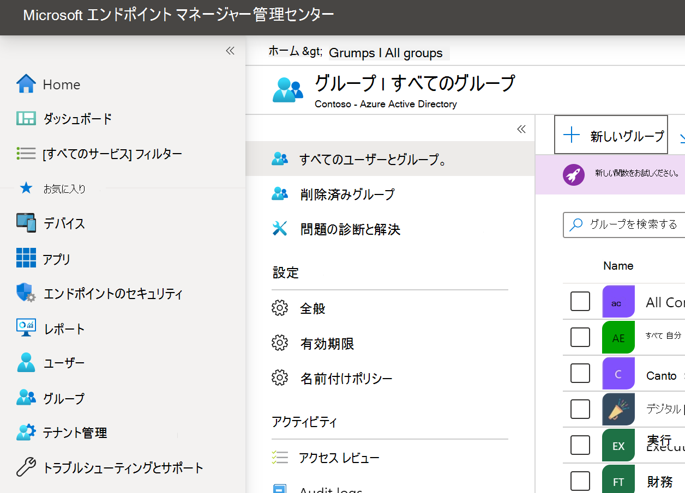

3. 詳細を入力し、新しいグループを作成します。

    > [!div class="mx-imgBorder"]
    > 

4. テスト ユーザーまたはデバイスを追加します。

5. [グループ] **ウィンドウ>新しい** グループを開きます。

6. [メンバー  **] を>メンバーを追加します**。

7. テスト ユーザーまたはデバイスを見つけて選択します。

    > [!div class="mx-imgBorder"]
    > 

8. これで、テストグループにテストするメンバーが追加されました。

## 手順 2: Microsoft Defender for Endpoint の機能を構成する構成ポリシーを作成する

次のセクションでは、多数の構成ポリシーを作成します。

最初に、Defender for Endpoint にオンボードするユーザーまたはデバイスのグループを選択する構成ポリシーを示します。

- [エンドポイントでの検出と対応](#endpoint-detection-and-response)

次に、いくつかの異なる種類のエンドポイント セキュリティ ポリシーを作成します。

- [次世代の保護](#next-generation-protection)
- [攻撃面の減少](#attack-surface-reduction---attack-surface-reduction-rules)

### エンドポイントの検出および応答

1. MEM ポータルを開きます。

2. [エンドポイントの **検出と応答>エンドポイント セキュリティ] に移動します**。 [プロファイルの作成 **] をクリックします**。

    > [!div class="mx-imgBorder"]
    > 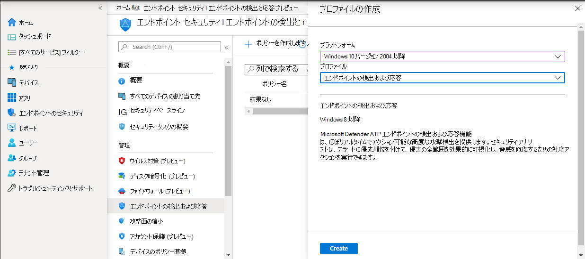

3. [**プラットフォーム] で、[Windows 10]** と [後で] 、[プロファイル - エンドポイントの検出と応答] >選択します。

4. 名前と説明を入力し、[次へ] を  **選択します**。

    > [!div class="mx-imgBorder"]
    > 

5. 必要に応じて設定を選択し、[次へ] を  **選択します**。

    > [!div class="mx-imgBorder"]
    > 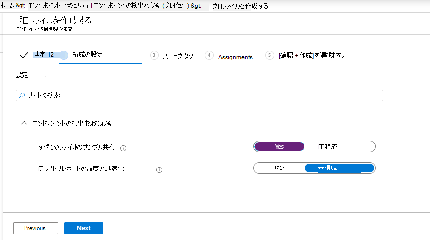

    > [!NOTE]
    > この例では、Defender for Endpoint が Intune に既に統合済みであるとして、これは自動的に設定されています。 統合の詳細については [、「Enable Microsoft Defender for Endpoint in Intune」を参照してください](/mem/intune/protect/advanced-threat-protection-configure#to-enable-microsoft-defender-atp)。
    >
    > 次の図は、Microsoft Defender for Endpoint が Intune と統合されていない場合に表示される例です。
    >
    > 

6. 必要に応じてスコープ タグを追加し、[次へ] を  **選択します**。

    > [!div class="mx-imgBorder"]
    > 

7. [含めるグループを選択して **グループを選択** する] をクリックしてテスト グループを追加し、[次へ] を  **選択します**。

    > [!div class="mx-imgBorder"]
    > 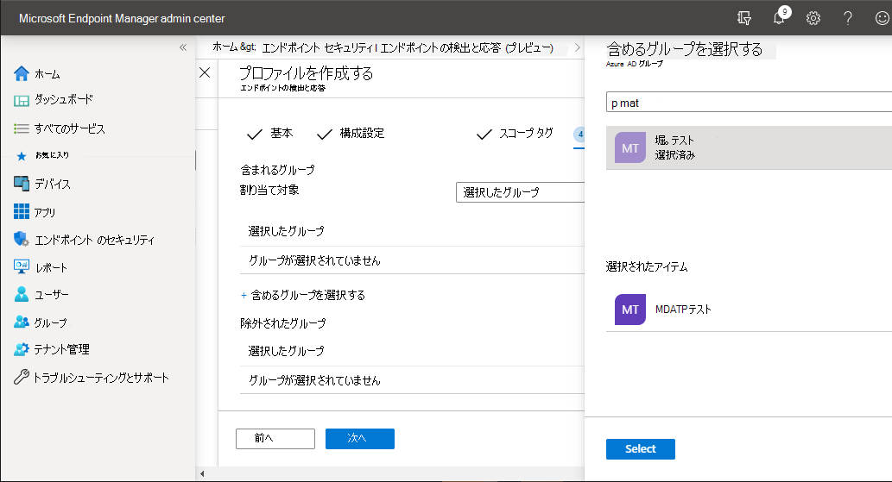

8. 確認して承諾し、[作成] を  **選択します**。

    > [!div class="mx-imgBorder"]
    > 

9. 完了したポリシーを表示できます。

    > [!div class="mx-imgBorder"]
    > 

### 次世代の保護

1. MEM ポータルを開きます。

2. [ウイルス対策の **作成] >エンドポイント >に移動します**。

    > [!div class="mx-imgBorder"]
    > 

3. [**プラットフォーム] - [Windows 10後] - [Windowsとプロファイル] - [Microsoft Defender ウイルス対策] の [作成>選択します**。

4. 名前と説明を入力し、[次へ] を  **選択します**。

    > [!div class="mx-imgBorder"]
    > 

5. [構成 **設定] ページ**: [クラウド保護] (クラウド保護、除外、Microsoft Defender ウイルス対策保護、修復) に必要Real-Time設定します。

    > [!div class="mx-imgBorder"]
    > 

6. 必要に応じてスコープ タグを追加し、[次へ] を  **選択します**。

    > [!div class="mx-imgBorder"]
    > 

7. 含めるグループを選択し、テスト グループに割り当て、[次へ] を  **選択します**。

    > [!div class="mx-imgBorder"]
    > 

8. 確認して作成し、[作成] を  **選択します**。

    > [!div class="mx-imgBorder"]
    > 

9. 作成した構成ポリシーが表示されます。

    > [!div class="mx-imgBorder"]
    > 

### 攻撃表面の縮小 - 攻撃表面の縮小ルール

1. MEM ポータルを開きます。

2. [エンドポイント セキュリティ **] に移動>攻撃の表面を縮小します**。

3. [ポリシー  **の作成] を選択します**。

4. [**プラットフォーム] - [Windows 10] と [後から] - [プロファイル] - [攻撃表面** の縮小ルール] を選択>作成します。

    > [!div class="mx-imgBorder"]
    > 

5. 名前と説明を入力し、[次へ] を  **選択します**。

    > [!div class="mx-imgBorder"]
    > 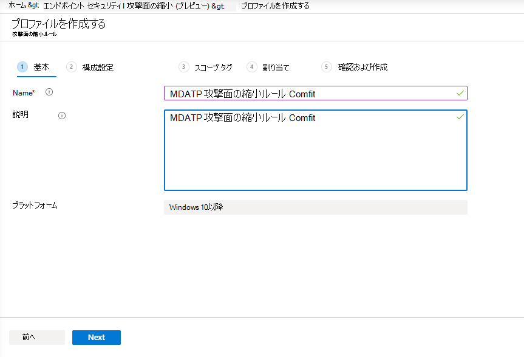

6. [構成設定 **] ページ** で、攻撃表面の縮小ルールに必要な構成を設定し、[次へ] を  **選択します**。

    > [!NOTE]
    > すべての攻撃表面縮小ルールを監査に構成します。
    >
    > 詳細については、「攻撃表面の [縮小ルール」を参照してください](attack-surface-reduction.md)。

    > [!div class="mx-imgBorder"]
    > 

7. 必要に応じてスコープ タグを追加し、[次へ] を  **選択します**。

    > [!div class="mx-imgBorder"]
    > 

8. テスト グループに含めるグループと割り当てるグループを選択し、[次へ] を  **選択します**。

    > [!div class="mx-imgBorder"]
    > 

9. 詳細を確認し、[作成] を  **選択します**。

    > [!div class="mx-imgBorder"]
    > 

10. ポリシーを表示します。

    > [!div class="mx-imgBorder"]
    > 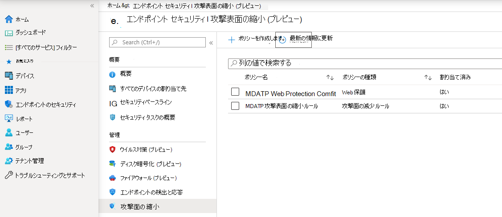

### 攻撃表面の縮小 - Web 保護

1. MEM ポータルを開きます。

2. [エンドポイント セキュリティ **] に移動>攻撃の表面を縮小します**。

3. [ポリシー  **の作成] を選択します**。

4. [作成 **Windows 10後 - Web 保護] を選択>作成します**。

    > [!div class="mx-imgBorder"]
    > 

5. 名前と説明を入力し、[次へ] を  **選択します**。

    > [!div class="mx-imgBorder"]
    > 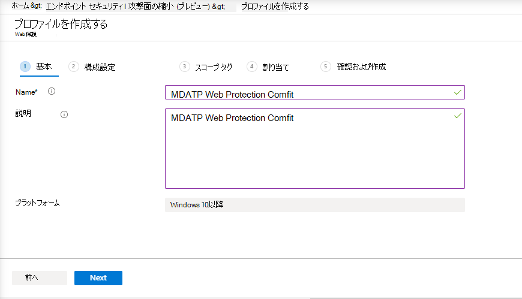

6. [構成 **設定] ページで**、Web 保護に必要な構成を設定し、[次へ] を  **選択します**。

    > [!NOTE]
    > Web Protection をブロックに構成しています。
    >
    > 詳細については [、「Web Protection」を参照してください](web-protection-overview.md)。

    > [!div class="mx-imgBorder"]
    > 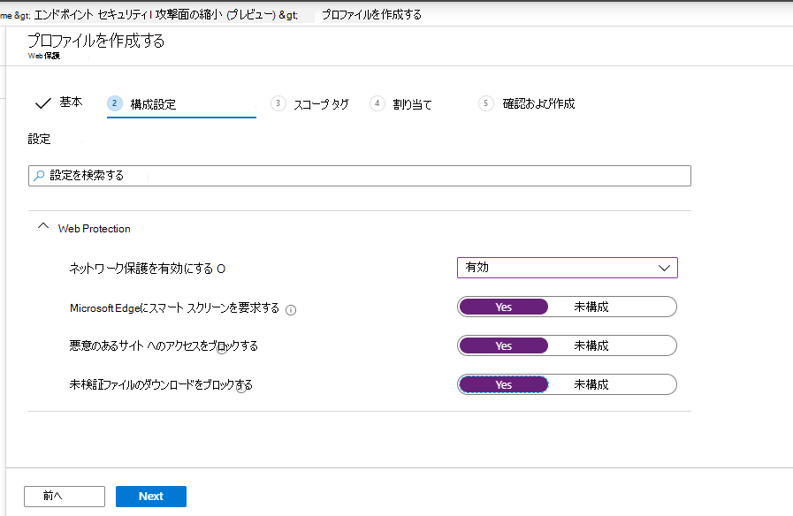

7. [次 **へ] で必要に応じてスコープ タグ>追加します**。

    > [!div class="mx-imgBorder"]
    > 

8. [テスト **グループに割り当てる] を選択し、[次>します**。

    > [!div class="mx-imgBorder"]
    > 

9. [レビュー **と作成] を選択>作成します**。

    > [!div class="mx-imgBorder"]
    > 

10. ポリシーを表示します。

    > [!div class="mx-imgBorder"]
    > 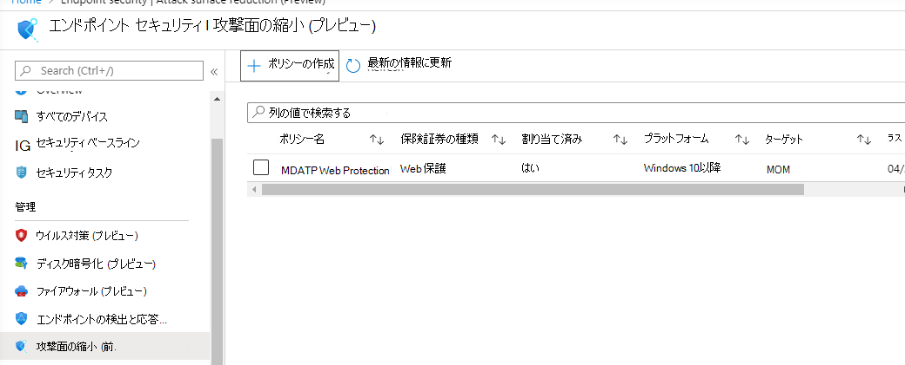

## 構成設定の検証

### ポリシーが適用されたのを確認する

構成ポリシーが割り当てられると、適用に時間がかかる場合があります。

タイミングの詳細については、「Intune 構成情報 [」を参照してください](/mem/intune/configuration/device-profile-troubleshoot#how-long-does-it-take-for-devices-to-get-a-policy-profile-or-app-after-they-are-assigned)。

構成ポリシーがテスト デバイスに適用されたと確認するには、構成ポリシーごとに次のプロセスに従います。

1. 上記の手順に示すように、MEM ポータルを開き、関連するポリシーに移動します。 次の例は、次世代の保護設定を示しています。

    > [!div class="mx-imgBorder"]
    > [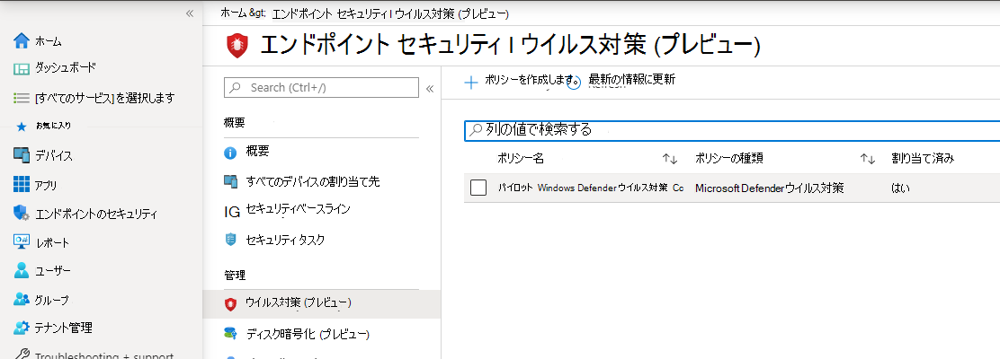](images/43ab6aa74471ee2977e154a4a5ef2d39.png#lightbox)

2. 構成ポリシー **を選択して** 、ポリシーの状態を表示します。

    > [!div class="mx-imgBorder"]
    > [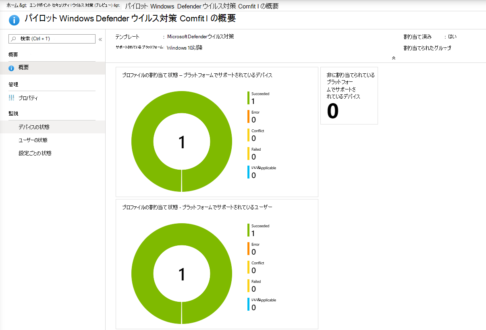](images/55ecaca0e4a022f0e29d45aeed724e6c.png#lightbox)

3. [  **デバイスの状態] を** 選択して、状態を表示します。

    > [!div class="mx-imgBorder"]
    > 

4. [  **ユーザーの状態] を** 選択して、状態を表示します。

    > [!div class="mx-imgBorder"]
    > [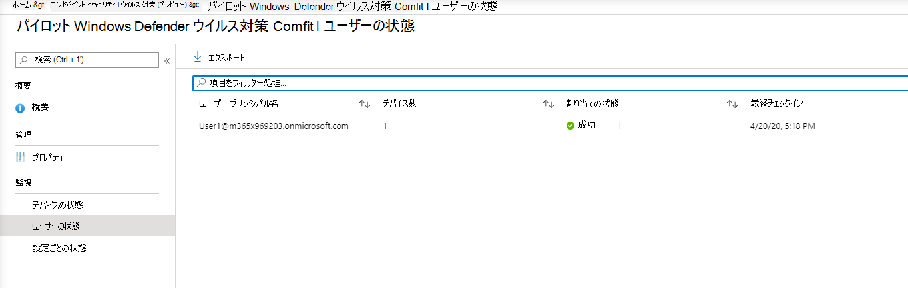](images/4e965749ff71178af8873bc91f9fe525.png#lightbox)

5. [  **設定ごとの状態] を選択** して、状態を表示します。

    > [!TIP]
    > このビューは、別のポリシーと競合する設定を識別するのに非常に便利です。

    > [!div class="mx-imgBorder"]
    > 

### エンドポイントの検出と応答の確認

1. 構成を適用する前に、Defender for Endpoint Protectionサービスを開始する必要があります。

    > [!div class="mx-imgBorder"]
    > [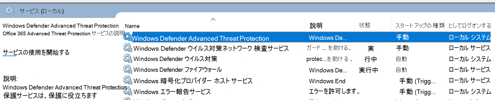](images/b418a232a12b3d0a65fc98248dbb0e31.png#lightbox)

2. 構成が適用された後、Defender for Endpoint Protection Service を開始する必要があります。

    > [!div class="mx-imgBorder"]
    > [![[サービスのイメージ] パネル 2。](images/a621b699899f1b41db211170074ea59e.png)](images/a621b699899f1b41db211170074ea59e.png#lightbox)

3. サービスがデバイスで実行された後、デバイスは Microsoft Defender セキュリティ センターに表示されます。

    > [!div class="mx-imgBorder"]
    > 

### 次世代の保護を確認する

1. テスト デバイスにポリシーを適用する前に、以下に示すように手動で設定を管理できる必要があります。

    > [!div class="mx-imgBorder"]
    > 

2. ポリシーを適用した後、手動で設定を管理することはできません。

    > [!NOTE]
    > 次の図では **、クラウドによる保護を有効** に **し、[リアルタイム** 保護を有効にする] が管理として表示されています。

    > [!div class="mx-imgBorder"]
    > 

### 攻撃表面の縮小を確認する - 攻撃表面の縮小ルール

1. テスト デバイスにポリシーを適用する前に、PowerShell ウィンドウをペンで入力します `Get-MpPreference` 。

2. これは、コンテンツを含めずに次の行で応答する必要があります。

    > AttackSurfaceReductionOnlyExclusions:
    >
    > AttackSurfaceReductionRules_Actions:
    >
    > AttackSurfaceReductionRules_Ids:

    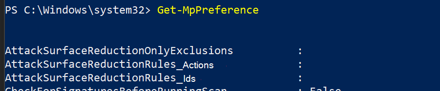

3. テスト デバイスにポリシーを適用した後、PowerShell ファイルを開きWindows入力します `Get-MpPreference` 。

4. これは、次に示すように、コンテンツを含む次の行で応答する必要があります。

    

### 攻撃表面の縮小を確認する - Web 保護

1. テスト デバイスで、PowerShell ファイルを開きWindows入力します `(Get-MpPreference).EnableNetworkProtection` 。

2. これは、次に示すように 0 で応答する必要があります。

    

3. ポリシーを適用した後、PowerShell ファイルを開Windows入力します `(Get-MpPreference).EnableNetworkProtection` 。

4. これは、次に示すように 1 で応答する必要があります。

    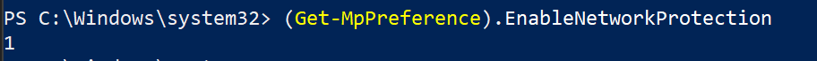
