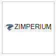

# Microsoft Defender for Endpoint のパートナー アプリケーション

[!INCLUDE [Microsoft 365 Defender rebranding](../../includes/microsoft-defender.md)]

**適用対象:**
- [Microsoft Defender for Endpoint](https://go.microsoft.com/fwlink/p/?linkid=2154037)
- [Microsoft 365 Defender](https://go.microsoft.com/fwlink/?linkid=2118804)

> Microsoft Defender ATP を試してみたいですか? [無料試用版にサインアップしてください。](https://signup.microsoft.com/create-account/signup?products=7f379fee-c4f9-4278-b0a1-e4c8c2fcdf7e&ru=https://aka.ms/MDEp2OpenTrial?ocid=docs-wdatp-exposedapis-abovefoldlink)

Defender for Endpoint は、プラットフォームの検出、調査、および脅威インテリジェンス機能の強化に役立つサード パーティ製アプリケーションをサポートします。

サード パーティ製ソリューションのサポートは、Microsoft Defender for Endpoint を使用して、他のベンダーからの防御をさらに合理化、統合、および調整するのに役立ちます。セキュリティ チームが最新の脅威に効果的に対応できます。

Microsoft Defender for Endpoint は、既存のセキュリティ ソリューションとシームレスに統合されます。 統合は、次のようなソリューションとの統合を提供します。

- SIEM
- チケットおよび IT サービス管理ソリューション
- マネージド セキュリティ サービス プロバイダー (MSSP)
- IoC インジケーターの取り込みと照合
- 外部アラートに基づくデバイスの自動調査と修復
- セキュリティ オーケストレーションとオートメーション応答 (SOAR) システムとの統合

## サポートされているアプリケーション

### セキュリティ情報と分析

ロゴ|パートナー名|説明
:---|:---|:---
|[AttackIQ プラットフォーム](https://go.microsoft.com/fwlink/?linkid=2103502)|AttackIQ プラットフォームは、運用資産に対する継続的な攻撃を安全に起動することにより、Defender for Endpoint が適切に構成されていることを検証します。
|[AzureSentinel](https://go.microsoft.com/fwlink/?linkid=2135705)|Microsoft Defender for Endpoint から Azure Sentinel へのアラートのストリーミング
|[Cymulate](https://go.microsoft.com/fwlink/?linkid=2135574)|Defender for Endpoint の結果とシミュレートされた攻撃を関連付けて、正確な検出と効果的な対応アクションを検証する
|[Elastic Security](https://go.microsoft.com/fwlink/?linkid=2139303)|Elastic Security は、脅威を防止、検出、および対応するための無料でオープンなソリューションです。
|[IBM QRadar](https://go.microsoft.com/fwlink/?linkid=2113903)|Defender for Endpoint から検出を収集する IBM QRadar を構成する
|[Micro Focus ArcSight](https://go.microsoft.com/fwlink/?linkid=2113548)|Micro Focus ArcSight を使用して Defender for Endpoint の検出を取得する
|[RSA NetWitness](https://go.microsoft.com/fwlink/?linkid=2118566)|Microsoft Graph セキュリティ API を使用してエンドポイントアラートの Defender を RSA NetWitness にストリーミングする
|[SafeBreach](https://go.microsoft.com/fwlink/?linkid=2114114)|SafeBreach シミュレーションと自動的に関連付ける Defender for Endpoint セキュリティ イベントを可視化する
|[Skybox の脆弱性制御](https://go.microsoft.com/fwlink/?linkid=2127467)|Skybox の脆弱性管理は、脆弱性の管理、ネットワーク、脅威のコンテキストを関連付け、最もリスクの高い脆弱性を明らかにします。
|[Splunk](https://go.microsoft.com/fwlink/?linkid=2129805)|Defender for Endpoint アドオンを使用すると、Splunk ユーザーは、すべてのアラートとサポート情報を Splunk に取り込む
|[XM Cyber](https://go.microsoft.com/fwlink/?linkid=2136700)|リスク要因と価値の高い資産に基づいてアラートへの応答の優先順位を設定する

### オーケストレーションと自動化

ロゴ|パートナー名|説明
:---|:---|:---
|[CyberSponse CyOps](https://go.microsoft.com/fwlink/?linkid=2115943)|CyOps は Defender for Endpoint と統合し、お客様の高速インシデント対応プレイブックを自動化します
|[デルタ リスク ActiveEye](https://go.microsoft.com/fwlink/?linkid=2127468)|サービスとしての SOC およびセキュリティ サービスのリーディング プロバイダーであるデルタ リスクは、Defender for Endpoint とクラウドネイティブの SOAR プラットフォーム ActiveEye を統合します。
|[Demisto、Palo Alto Networks Company](https://go.microsoft.com/fwlink/?linkid=2108414)|Demisto は Defender for Endpoint と統合し、セキュリティ チームがエンドポイントのセキュリティ監視、強化、および応答を調整および自動化できます。
|[Microsoft Flow & Azure 関数](https://go.microsoft.com/fwlink/?linkid=2114300)|セキュリティ手順の自動化を行うAzure Logic Apps & Microsoft Flow Defender for Endpoint コネクタを使用する
|[Rapid7 InsightConnect](https://go.microsoft.com/fwlink/?linkid=2116040)|InsightConnect は Defender for Endpoint と統合し、時間のかかるセキュリティ プロセスを加速、合理化、統合します。
|[ServiceNow](https://go.microsoft.com/fwlink/?linkid=2135621)|Microsoft サービス API 統合に基づいて ServiceNow セキュリティ操作ソリューションGraph取り込む
|[Swimlane](https://go.microsoft.com/fwlink/?linkid=2113902)|Swimlane と Defender for Endpoint を組み合わせて利用してインシデント対応機能を最大化する

### 脅威インテリジェンス

ロゴ|パートナー名|説明
:---|:---|:---
|[MISP (マルウェア情報共有プラットフォーム)](https://go.microsoft.com/fwlink/?linkid=2127543)|オープンソースの脅威インテリジェンス共有プラットフォームからの脅威インジケーターを Defender for Endpoint 環境に統合する
|[Palo Alto Networks](https://go.microsoft.com/fwlink/?linkid=2099582)|MineMeld を使用して、Autofocus などの脅威フィードを Defender for Endpoint に拡張することで、エンドポイント保護を強化する
|[ThreatConnect](https://go.microsoft.com/fwlink/?linkid=2114115)|Defender for Endpoint インジケーターを使用した ThreatConnect プレイブックからのカスタム脅威インテリジェンスのアラートやブロック

### ネットワーク セキュリティ

ロゴ|パートナー名|説明
:---|:---|:---
|[Aruba ClearPass ポリシー マネージャー](https://go.microsoft.com/fwlink/?linkid=2127544)|ネットワークへのアクセスを許可する前に、Defender for Endpoint が各エンドポイントにインストールされ、更新されていることを確認する
|[ネットワーク用青い六角形](https://go.microsoft.com/fwlink/?linkid=2104613)|Blue Hexagon は、ネットワーク脅威保護のための業界初のリアルタイムディープ ラーニング プラットフォームを構築しました
|[CyberMDX](https://go.microsoft.com/fwlink/?linkid=2135620)|Cyber MDX は、包括的な医療資産の可視性、脅威防止、およびリプスを Defender for Endpoint 環境に統合します。
|[HYAS Protect](https://go.microsoft.com/fwlink/?linkid=2156763)|HYAS Protect は、攻撃者インフラストラクチャの権限のある知識を利用して、Microsoft Defender for Endpoint エンドポイントをサイバー攻撃からプロアクティブに保護します。
|[Vectra ネットワーク検出と応答 (NDR)](https://go.microsoft.com/fwlink/?linkid=866934)|Vectra は、AI &セキュリティ調査を適用して、サイバー攻撃をリアルタイムで検出して対応します

### クロス プラットフォーム

ロゴ|パートナー名|説明
:---|:---|:---
|[Bitdefender](https://go.microsoft.com/fwlink/?linkid=860032)|Bitdefender GravityZone は、高度なサイバー脅威の全範囲に対する包括的な保護を提供する、層構造の次世代エンドポイント保護プラットフォームです。
|[より良いモバイル](https://go.microsoft.com/fwlink/?linkid=2086214)|AI ベースの MTD ソリューションを使用して、フィッシングに対するモバイル&を阻止します。 ユーザーのプライバシーを保護するためのプライベート インターネット閲覧
|[Corrata](https://go.microsoft.com/fwlink/?linkid=2081148)|モバイル ソリューション - Corrata から詳細な可視性と制御でモバイル デバイスを保護する
|[ルックアウト](https://go.microsoft.com/fwlink/?linkid=866935)|Android および iOS モバイル デバイス用の Lookout Mobile Threat Protection テレメトリを取得する
|[Symantec Endpoint Protection Mobile](https://go.microsoft.com/fwlink/?linkid=2090992)|SEP Mobile は、企業がモバイル デバイスのセキュリティの脅威と脆弱性を予測、検出、および防止するのに役立ちます
|[Zimperium](https://go.microsoft.com/fwlink/?linkid=2118044)|モバイル ベースのモバイル脅威防御機能を使用して、エンドポイントの Defender を iOS と Android に拡張Machine Learningを拡張する

## その他の統合

ロゴ|パートナー名|説明
:---|:---|:---
|[Cyren Web Filter](https://go.microsoft.com/fwlink/?linkid=2108221)|高度な Web フィルタリングを使用して Defender for Endpoint を強化する
|[Morphisec](https://go.microsoft.com/fwlink/?linkid=2086215)|移動ターゲットの防御機能を備えた高度な脅威防止を提供します。 forensics データを WD Security Center ダッシュボードに直接統合して、アラートの優先順位付け、デバイスの危険度スコアの決定、内部メモリ情報を含む完全な攻撃タイムラインの可視化に役立ちます。
|[THOR クラウド](https://go.microsoft.com/fwlink/?linkid=862988)|永続的な脅威に焦点を当てた署名ベースを使用して、オンデマンドのライブ forensics スキャンを提供します

## SIEM 統合

Defender for Endpoint では、さまざまなメソッドによる SIEM 統合がサポートされています。 これには、箱から出たコネクタを備えた専用の SIEM システム インターフェイス、カスタム実装を有効にする汎用アラート API、アラートの状態管理を可能にするアクション API が含まれます。  詳細については [、「Enable SIEM integration 」を参照してください](enable-siem-integration.md)。

## チケットと IT サービスの管理

チケットソリューションの統合は、手動および自動応答プロセスの実装に役立ちます。 Defender for Endpoint は、アラートが生成されると自動的にチケットを作成し、アラート API を使用してチケットが閉じたときにアラートを解決するのに役立ちます。

## セキュリティ オーケストレーションとオートメーション応答 (SOAR) の統合

オーケストレーション ソリューションは、プレイブックを構築し、Defender for Endpoint API が公開するリッチ データ モデルとアクションを統合して、デバイス データのクエリ、デバイス分離のトリガー、ブロック/許可、アラートの解決など、応答の調整に役立ちます。

## 外部アラートの相関関係と自動調査と修復

Defender for Endpoint は、インシデント対応を大規模に駆動する独自の自動調査および修復機能を提供します。

自動調査と応答機能を IDS やファイアウォールなどの他のソリューションと統合すると、アラートに対処し、ネットワークとデバイス信号の相関関係を取り巻く複雑さを最小限に抑え、デバイスの調査と脅威の修復アクションを効率的に合理化できます。

外部アラートは Defender for Endpoint にプッシュできます。 これらのアラートは、Defender for Endpoint からの追加のデバイス ベースのアラートと並べて表示されます。 このビューは、アラートの完全なコンテキストを提供し、攻撃の完全なストーリーを明らかにできます。

## インジケーターの照合

プロバイダーやアグリゲーターの脅威インテリジェンスを使用して、侵害の指標 (IOC) を維持および使用できます。

Defender for Endpoint を使用すると、これらのソリューションと統合し、豊富なテレメトリを関連付け、アラートを作成することで IoC に対応できます。  また、予防機能と自動応答機能を使用して、一致した場合に実行をブロックし、修復アクションを実行することもできます。

Defender for Endpoint は現在、ファイルインジケーターとネットワーク インジケーターの IOC 照合と修復をサポートしています。 ブロックは、ファイル インジケーターでサポートされています。

## 非プラットフォームのWindowsサポート

Defender for Endpoint は、モバイル デバイスを含む、Windowsおよび非Windowsプラットフォームに対して一元的なセキュリティ操作エクスペリエンスを提供します。 サポートされているさまざまなオペレーティング システム (OS) からのアラートをポータルで確認し、組織のネットワークをよりよく保護することができます。
