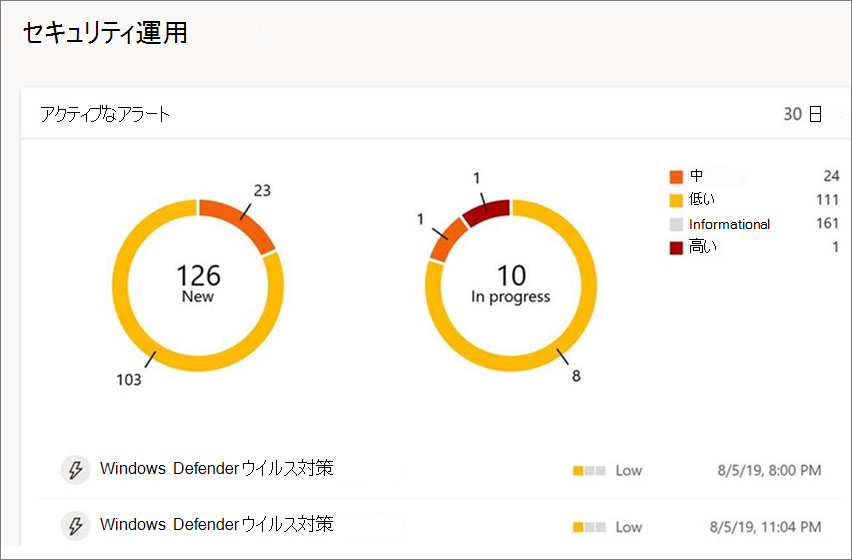
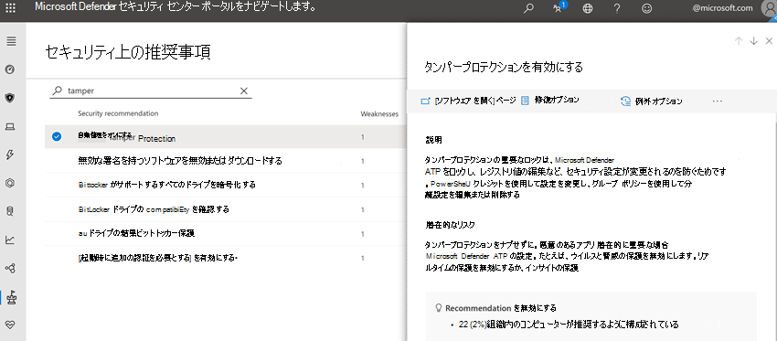

# 改ざん防止機能を使用してセキュリティ設定を保護する

**適用対象:**

- [Microsoft Defender for Endpoint Plan 1](https://go.microsoft.com/fwlink/p/?linkid=2154037)
- [Microsoft Defender for Endpoint Plan 2](https://go.microsoft.com/fwlink/p/?linkid=2154037)

タンパープロテクションは、次のバージョンのデバイスを実行しているデバイスWindows。

- Windows 10
- Windows 11
- Windows 10 Enterprise マルチセッション
- Windows 11 Enterprise セッション 
- Windows Server 2019
- Windows Server 2022
- Windows Server バージョン 1803 以降
- Windows Server 2016
- Windows Server 2012 R2

> [!NOTE]
> 最新の統合ソリューション Windows Server 2012を使用してオンボードされたデバイスでは、R2 のタンパープロテクションを使用できます。 詳細については、「[R2 および 2016 Preview](/microsoft-365/security/defender-endpoint/configure-server-endpoints#new-functionality-in-the-modern-unified-solution-for-windows-server-2012-r2-and-2016-preview) の最新の統合ソリューションのWindows Server 2012」を参照してください。

## 概要

一部の種類のサイバー攻撃では、悪いアクターがコンピューターでウイルス対策保護などのセキュリティ機能を無効にしようとします。 悪いアクターは、データに簡単にアクセスしたり、マルウェアをインストールしたり、データ、ID、デバイスを悪用したりするために、セキュリティ機能を無効にしています。 タンパープロテクションは、このような事態が発生するのを防ぐのに役立ちます。

タンパープロテクションを使用すると、悪意のあるアプリは次のようなアクションを実行できます。

- ウイルスおよび脅威の保護の無効化
- リアルタイム保護の無効化
- 動作の監視の無効化
- ウイルス対策(IOfficeAntivirus (IOAV) など) の無効化
- クラウド配信の保護の無効化
- セキュリティ インテリジェンスの更新プログラムの削除
- 検出された脅威に対する自動アクションの無効化

### 仕組み

タンパープロテクションMicrosoft Defender ウイルス対策セキュリティで保護された既定値にロックされ、次のようなアプリやメソッドを介してセキュリティ設定が変更されるのを防ぐ。

- デバイスのレジストリ エディターで設定Windowsする
- PowerShell コマンドレットによる設定の変更
- グループ ポリシーによるセキュリティ設定の編集または削除

改ざん防止では、セキュリティ設定を表示できない場合があります。 また、改ざん防止は、Microsoft 以外のウイルス対策アプリがアプリに登録する方法Windows セキュリティではありません。 組織が E5 Windows 10 Enterpriseを使用している場合、個々のユーザーは改ざん防止の設定を変更できます。そのような場合、改ざん防止はセキュリティ チームによって管理されます。

### 目的に合ったトピックをクリックしてください

  

|このタスクを実行するには...|このセクションを参照してください。|
|---|---|
|テナント全体の改ざん防止を管理する 
 改ざん防止Microsoft 365 Defenderオンまたはオフにする場合は、ポータルポータルを使用します。|[管理者を使用して組織の改ざん防止を管理Microsoft 365 Defender](#manage-tamper-protection-for-your-organization-using-the-microsoft-365-defender-portal)|
|組織内の改ざん防止設定を微調整する 
 Intune (Microsoft エンドポイント マネージャー) を使用して、タンパープロテクションのオンとオフを切り替えます。 この方法では、一部またはすべてのユーザーに対して改ざん防止を構成できます。|[管理者を使用して組織の改ざん防止をMicrosoft エンドポイント マネージャー](#manage-tamper-protection-for-your-organization-using-microsoft-endpoint-manager)|
|Configuration Manager を使用して組織の改ざん防止を有効 (または無効にする)|[Configuration Manager バージョン 2006 でテナント接続を使用して組織の改ざん防止を管理する](#manage-tamper-protection-for-your-organization-with-configuration-manager-version-2006)|
|個々のデバイスのタンパープロテクションをオン (またはオフ) にする|[個々のデバイスで改ざん防止を管理する](#manage-tamper-protection-on-an-individual-device)|
|デバイスでの改ざんの試みについての詳細を表示する|[改ざんの試行に関する情報を表示する](#view-information-about-tampering-attempts)|
|セキュリティに関する推奨事項を確認する|[セキュリティに関する推奨事項を確認する](#review-your-security-recommendations)|
|よく寄せられる質問 (FAQ) の一覧を確認する|[FAQ を参照する](#view-information-about-tampering-attempts)|

タンパープロテクションを有効にするために使用する方法や管理ツールによっては、クラウドによる保護に依存している可能性があります。

次の表に、メソッド、ツール、依存関係の詳細を示します。

  

|タンパープロテクションを有効にする方法|クラウドによる保護への依存 (MAPS)|
|---|---|
|Microsoft Intune|いいえ|
|Microsoft Endpoint Configuration Manager + テナント接続|いいえ|
|Microsoft 365 Defender ポータル ([https://security.microsoft.com](https://security.microsoft.com))|はい|

## ポータルを使用して組織の改ざん防止をMicrosoft 365 Defenderする

タンパープロテクションは、ポータル () を使用してテナントMicrosoft 365 Defenderオフにできます[https://security.microsoft.com](https://security.microsoft.com)。 以下に注意点を示します。

- 現時点では、新しい展開では、Microsoft 365 Defenderでタンパープロテクションを管理するオプションがオンになっています。 既存の展開では、改ざん防止はオプトインベースで利用できます。 オプトインするには、Microsoft 365 Defender <a href="https://go.microsoft.com/fwlink/p/?linkid=2077139" target="_blank">ポータル</a>で、[エンドポイント **の** \>  \>高度設定 **保護] を** \> **選択します**。

- 改ざん防止を管理Microsoft 365 Defenderポータルを使用する場合は、Intune またはテナント接続方法を使用する必要があります。

- Microsoft 365 Defender ポータルでタンパープロテクションを管理する場合、この設定はテナント全体に適用され、Windows 10、Windows 10 Enterprise マルチ セッション、Windows 11、Windows 11 を実行しているすべてのデバイスEnterprise マルチ セッション、Windows Server 2012 R2、Windows Server 2016、Windows Server 2019、Windows Server 2022。 タンパープロテクションを微調整するには (一部のデバイスではタンパープロテクションをオンにし、他のデバイスではオフにするなど)、テナント接続を使用して Microsoft エンドポイント マネージャー または [Configuration Manager を使用します](#manage-tamper-protection-for-your-organization-with-configuration-manager-version-2006)。

- ハイブリッド環境がある場合、Intune で構成されたタンパープロテクション設定は、ポータルで構成された設定よりも優先Microsoft 365 Defenderされます。

### ポータルでの改ざん防止の管理Microsoft 365 Defender要件

- グローバル管理者、セキュリティ [管理者、](/microsoft-365/security/defender-endpoint/assign-portal-access) セキュリティ操作など、適切なアクセス許可が割り当てられている必要があります。

- デバイスWindows次のいずれかのバージョンのデバイスを実行している必要Windows。
  
  - Windows 10
  - Windows 11
  - Windows 10 Enterprise マルチセッション
  - Windows 11 Enterprise セッション 
  - Windows Server 2019
  - Windows Server 2022
  - Windows Server バージョン 1803 以降
  - Windows Server 2016
  - Windows Server 2012 R2

リリースの詳細については、「リリース情報Windows 10[参照してください](/windows/release-health/release-information)。

- デバイスは、 [Microsoft Defender for Endpoint にオンボードされている必要があります](/microsoft-365/security/defender-endpoint/onboarding)。

- デバイスでマルウェア対策プラットフォーム バージョン `4.18.2010.7` (または上記) とマルウェア対策エンジンバージョン (または上記) `1.1.17600.5` を使用している必要があります。 ([更新プログラムMicrosoft Defender ウイルス対策管理し、基準計画を適用](manage-updates-baselines-microsoft-defender-antivirus.md)します。

- [クラウドによる保護を](enable-cloud-protection-microsoft-defender-antivirus.md) 有効にする必要があります。

### タンパープロテクションをオンまたはオフにする (または無効にする) Microsoft 365 Defenderポータル

:::image type="content" source="../../media/mde-turn-tamperprotectionon.png" alt-text="ポータルで改ざん防止を有効Microsoft 365 Defenderします。":::

1. ポータル () にMicrosoft 365 Defenderサインイン[https://security.microsoft.com](https://security.microsoft.com)します。

2. [**エンドポイント設定** \> **選択します**。

3. [全般高度 **な機能]** \> **に移動** し、タンパープロテクションを有効にしてください。

## 管理者を使用して組織の改ざん防止をMicrosoft エンドポイント マネージャー

組織でセキュリティ Microsoft エンドポイント マネージャー (MEM) を使用している場合は、管理者センター () で組織の改ざん防止をオン (またはオフ) Microsoft エンドポイント マネージャーできます[https://endpoint.microsoft.com](https://endpoint.microsoft.com)。 タンパープロテクションの設定を微調整する場合は、Intune を使用します。 たとえば、一部のデバイスでタンパープロテクションを有効にするが、すべてではない場合は、Intune を使用します。

### ユーザーの改ざん防止を管理するための要件エンドポイント マネージャー

- デバイスは、 [Microsoft Defender for Endpoint にオンボードされている必要があります](/microsoft-365/security/defender-endpoint/onboarding)。

- グローバル管理者、セキュリティ [管理者、](/microsoft-365/security/defender-endpoint/assign-portal-access) セキュリティ操作など、適切なアクセス許可が割り当てられている必要があります。

- 組織は、デバイス[Microsoft エンドポイント マネージャーに使用します](/mem/endpoint-manager-getting-started)。 (Microsoft エンドポイント マネージャー (MEM) ライセンスが必要です。MEM は、Microsoft 365 E3/E5、Enterprise Mobility + Security E3/E5、Microsoft 365 Business Premium、Microsoft 365 F1/F3、Microsoft 365 政府機関の G3/G5、および対応する教育ライセンス)。

- デバイスWindows 11 または Windows [1709、1803](/windows/release-health/status-windows-10-1709)、[1809](/windows/release-health/status-windows-10-1809-and-windows-server-2019) 以降Windows 10実行している必要があります。 (リリースの詳細については、「リリース情報Windows 10[参照してください](/windows/release-health/release-information)。

- セキュリティ インテリジェンスがバージョン 1.287.60.0 (以上) に更新された場合は、Windowsセキュリティを使用している必要があります。

- デバイスでマルウェア対策プラットフォーム バージョン 4.18.1906.3 (または上記) とマルウェア対策エンジンバージョン (以上) `1.1.15500.X` を使用している必要があります。 ([更新プログラムMicrosoft Defender ウイルス対策管理し、基準計画を適用](manage-updates-baselines-microsoft-defender-antivirus.md)します。

### タンパープロテクションをオン (またはオフ) にMicrosoft エンドポイント マネージャー

1. 管理センター [Microsoft エンドポイント マネージャーエンドポイント セキュリティ  \> ウイルス対策] に移動 **し、[+** ポリシーの作成 **] を選択します**。

   - [プラットフォーム **] ボックスの** 一覧で、[Windows 10 **] を選択します**。
   - [プロファイル] **ボックスの** 一覧で、[ユーザー エクスペリエンス **Windows セキュリティ選択します**。

2. 次の設定を含むプロファイルを作成します。

    - **改ざん防止を有効にして Microsoft Defender が無効にされるのを防ぐ: 有効にする**

3. プロファイルを 1 つ以上のグループに割り当てる。
 
### Configuration Manager バージョン 2006 で組織の改ざん防止を管理する

[Configuration Manager のバージョン 2006](/mem/configmgr/core/plan-design/changes/whats-new-in-version-2006) を使用している場合は、Windows 10、Windows 10 Enterprise マルチ セッション、Windows 11、Windows 11 Enterprise マルチ セッションのタンパープロテクション設定を管理できます。Windows Server 2012と呼ばれるメソッドを使用して、R2、Windows Server 2016、Windows Server 2019、Windows Server 2022 を *使用します*。 テナント接続を使用すると、オンプレミス専用の Configuration Manager デバイスを Microsoft エンドポイント マネージャー 管理センターに同期し、エンドポイント セキュリティ構成ポリシーを & デバイスのオンプレミス コレクションに配信できます。

> [!NOTE]
> この手順を使用すると、Windows 10、Windows 10 Enterprise マルチセッション、Windows 11、Windows 11 Enterprise マルチセッション、Windows Server 2019、Windows Server 2022 を実行しているデバイスに改ざん防止を拡張できます。 この手順で説明されているリソースの前提条件と他の情報を必ず確認してください。

1. テナント接続を設定します。 詳細については、「スタートガイド: 管理センターからエンドポイント セキュリティ ポリシーを作成して展開 [する」を参照してください](/mem/configmgr/tenant-attach/endpoint-security-get-started)。

2. 管理センター [Microsoft エンドポイント マネージャーエンドポイント セキュリティ  \> ウイルス対策] に移動 **し、[+** ポリシーの作成 **] を選択します**。

   - [プラットフォーム **] ボックスの** 一覧でWindows 10 **、Windows 11、および Windows サーバー (ConfigMgr)) を選択します**。
   - [プロファイル **] ボックスの** 一覧で、[Windows セキュリティ **エクスペリエンス (プレビュー) を選択します**。

3. デバイス コレクションにポリシーを展開します。

#### このメソッドのヘルプが必要ですか?

以下のリソースを参照してください。

- [設定のWindows セキュリティエクスペリエンス プロファイルのMicrosoft Intune](/mem/intune/protect/antivirus-security-experience-windows-settings)
- [Tech Community ブログ: Configuration Manager テナント接続クライアントのタンパープロテクションの発表](https://techcommunity.microsoft.com/t5/microsoft-endpoint-manager-blog/announcing-tamper-protection-for-configuration-manager-tenant/ba-p/1700246#.X3QLR5Ziqq8.linkedin)

## 個々のデバイスで改ざん防止を管理する

> [!NOTE]
> タンパープロテクション ブロックは、レジストリMicrosoft Defender ウイルス対策設定を変更します。
>
> 改ざん防止が Microsoft 以外のセキュリティ製品や、これらの設定を変更するエンタープライズ インストール スクリプトと干渉しないようにするには、**Windows セキュリティ** に移動し、セキュリティ インテリジェンスをバージョン  1.287.60.0 以降に更新します。 (「 [セキュリティ インテリジェンスの更新プログラム」を参照](https://www.microsoft.com/wdsi/definitions)してください)。
>
> この更新プログラムを作成すると、改ざん防止はレジストリ設定を保護し続け、ログはエラーを返さずに変更を試みる。

ホーム ユーザーである場合、またはセキュリティ チームが管理する設定の対象ではない場合は、Windows セキュリティ アプリを使用して改ざん防止を管理できます。 改ざん防止などのセキュリティ設定を変更するには、デバイスに適切な管理者アクセス許可が必要です。

アプリに表示されるWindows セキュリティします。

1. [スタート **] を選択** し、[セキュリティ] の入力 *を開始します*。 検索結果で、[検索] **をWindows セキュリティ**。

2. [ **ウイルス対策&ウイルス対策] を選択** \> **&の設定を選択します**。

3. [ **タンパープロテクション] を** **[オン] または [オフ** ] に **設定します**。

## バージョン 1709 Windows Server 2016 1803、または 1809 Windowsバージョンを使用していますか?

Windows Server 2016、Windows 10 バージョン 1709、1803、[または 1809](/windows/release-health/status-windows-10-1809-and-windows-server-2019) を使用している場合は、Windows セキュリティ アプリにタンパープロテクションが表示されます。 代わりに、PowerShell を使用して、改ざん防止が有効になっているかどうかを判断できます。

このWindows Server 2016、設定保護が有効になっていると、リアルタイム保護の状態が正確に反映されません。

#### PowerShell を使用して、タンパープロテクションとリアルタイム保護が有効になっているかどうかを判断する

1. アプリを開Windows PowerShellします。

2. [Get-MpComputerStatus](/powershell/module/defender/get-mpcomputerstatus?preserve-view=true&view=win10-ps) PowerShell コマンドレットを使用します。

3. 結果の一覧で、またはを探 `IsTamperProtected` します `RealTimeProtectionEnabled`。 (true の値は *、改* ざん防止が有効になっているという意味です。

## 改ざんの試行に関する情報を表示する

改ざんの試みは、通常、より大きなサイバー攻撃を示します。 悪いアクターは、セキュリティ設定を変更して、検出されない状態を維持します。 組織のセキュリティ チームの一員である場合は、そのような試みについての情報を表示し、脅威を軽減するために適切なアクションを実行できます。

改ざんの試行が検出されると、ポータル () のMicrosoft 365 Defender[されます](/microsoft-365/security/defender-endpoint/portal-overview)[https://security.microsoft.com](https://security.microsoft.com)。

[Microsoft Defender](overview-endpoint-detection-response.md) for Endpoint のエンドポイント検出および応答機能と高度なハンティング機能を使用して、セキュリティ運用チームはそのような試みを調査し、対処できます。

## セキュリティに関する推奨事項を確認する

タンパープロテクションは [、脅威&管理機能と](next-gen-threat-and-vuln-mgt.md) 統合されます。 [セキュリティに関する推奨事項には](tvm-security-recommendation.md) 、改ざん防止が有効になっていることを確認する方法が含まれます。 たとえば、改ざん時に検索 *できます*。 結果では、[タンパープロテクションを **有効** にする] を選択して詳細を確認し、有効にできます。

Threat &脆弱性管理の詳細については、「ダッシュボードの分析情報 - 脅威と脆弱性の管理」 [を参照してください](tvm-dashboard-insights.md#dashboard-insights---threat-and-vulnerability-management)。

## よく寄せられる質問

### タンパープロテクションWindows構成できるバージョン

Windows 10 Microsoft [Defender for Endpoint](/microsoft-365/security/defender-endpoint) と共に OS [1709](/windows/release-health/status-windows-10-1709)、[1803](/windows/release-health/status-windows-10-1803)、[1809](/windows/release-health/status-windows-10-1809-and-windows-server-2019) 以降をサポートします。
  
Windows 10 Enterprise マルチセッション

Windows 11

Windows 11 Enterprise セッション
  
Configuration Manager バージョン 2006 をテナント接続で使用している場合、タンパープロテクションを Windows Server 2012 R2、Windows Server 2016、Windows Server 2019、Windows Server 2022 に拡張できます。 「 [Tenant attach: Create and deploy endpoint security Antivirus policy from the admin center (preview)」を参照してください](/mem/configmgr/tenant-attach/deploy-antivirus-policy)。

### 改ざん防止は、Microsoft 以外のウイルス対策アプリの登録Windows セキュリティしますか?

いいえ。 Microsoft 以外のウイルス対策製品は、引き続きアプリケーションにWindows セキュリティされます。

### デバイスでMicrosoft Defender ウイルス対策がアクティブではない場合は、どうなるでしょうか。

Microsoft Defender for Endpoint にオンボードされているデバイスには、パッシブ Microsoft Defender ウイルス対策が実行されます。 このような場合、改ざん防止はサービスとその機能を引き続き保護します。

### 改ざん防止を有効または無効にする方法

ホーム ユーザーの場合は、「個々のデバイスで [タンパープロテクションを管理する」を参照してください](#manage-tamper-protection-on-an-individual-device)。

[Microsoft Defender for Endpoint](/microsoft-365/security/defender-endpoint) を使用している組織の場合、他のエンドポイント保護機能を管理する方法と同様に、Intune でタンパープロテクションを管理できる必要があります。 この記事の以下のセクションを参照してください。

- [データを使用して改ざん防止をMicrosoft エンドポイント マネージャー](#manage-tamper-protection-for-your-organization-using-microsoft-endpoint-manager)
- [ポータルを使用して改ざん防止をMicrosoft 365 Defenderする](#manage-tamper-protection-for-your-organization-using-the-microsoft-365-defender-portal)

### Intune でタンパープロテクションを構成すると、グループ ポリシーを使用Microsoft Defender ウイルス対策方法に影響しますか?

グループ ポリシーは、改ざん防止には適用されません。 改ざん防止がオンMicrosoft Defender ウイルス対策設定に加えた変更は無視されます。

### 改ざん防止をMicrosoft Intuneに使用する場合、組織全体にのみ適用されますか?

Intune でタンパープロテクションを構成する柔軟性があります。 組織全体をターゲットにするか、特定のデバイスとユーザー グループを選択できます。

### タンパープロテクションを構成Microsoft Endpoint Configuration Manager?

テナント接続を使用している場合は、テナント接続Microsoft Endpoint Configuration Manager。 以下のリソースを参照してください。

- [Configuration Manager バージョン 2006 で組織の改ざん防止を管理する](#manage-tamper-protection-for-your-organization-with-configuration-manager-version-2006)
- [Tech Communityブログ: Configuration Manager テナント接続クライアントのタンパープロテクションの発表](https://techcommunity.microsoft.com/t5/microsoft-endpoint-manager-blog/announcing-tamper-protection-for-configuration-manager-tenant/ba-p/1700246#.X3QLR5Ziqq8.linkedin)

### E3 登録Windowsがあります。 Intune でタンパープロテクションの構成を使用できますか?

現在、Intune でタンパープロテクションを構成できるのは、 [Microsoft Defender for Endpoint をお持ちのお客様のみです](/microsoft-365/security/defender-endpoint)。

### デバイスでタンパープロテクションが有効になっているときに Intune、Microsoft Endpoint Configuration Manager、および Windows 管理インストルメンテーションで Microsoft Defender for Endpoint の設定を変更すると、どうなるでしょうか。

改ざん防止によって保護されている機能を変更できない。このような変更要求は無視されます。

### エンタープライズ顧客です。 ローカル管理者は、デバイスの改ざん防止を変更できますか?

いいえ。 ローカル管理者は、改ざん防止の設定を変更または変更できません。

### デバイスが Microsoft Defender for Endpoint にオンボードされ、オフボード状態に入った場合は、どうなるでしょうか。

デバイスが Microsoft Defender for Endpoint からオフボードされている場合、タンパープロテクションが有効になります。これは管理されていないデバイスの既定の状態です。

### 改ざん防止の状態が変更された場合、アラートはポータルにMicrosoft 365 Defenderされますか?

はい。 アラートは [アラート] の下に [https://security.microsoft.com](https://security.microsoft.com)**表示されます**。

セキュリティ運用チームは、次の例のような検索クエリも使用できます。

`AlertInfo|where Title == "Tamper Protection bypass"`

[改ざんの試行に関する情報を表示します](#view-information-about-tampering-attempts)。

## 関連項目

[デバイスを使用Windows PC のセキュリティをEndpoint ProtectionするMicrosoft Intune](/intune/help-secure-windows-pcs-with-endpoint-protection-for-microsoft-intune)

[Microsoft Defender for Endpoint の概要を確認する](/microsoft-365/security/defender-endpoint)

[ベストな組み合わせ: Microsoft Defender Antivirus および Microsoft Defender for Endpoint](why-use-microsoft-defender-antivirus.md)
