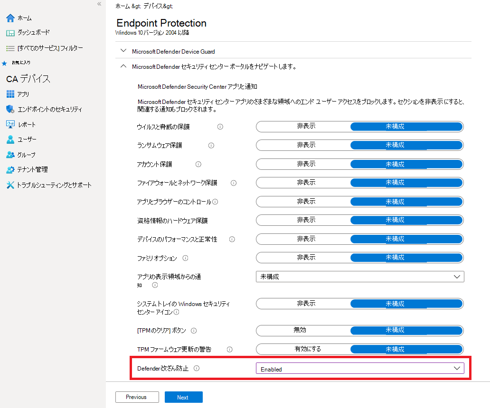

# 改ざん防止機能を使用してセキュリティ設定を保護するProtect security settings with tamper protection

[!INCLUDE [Microsoft 365 Defender rebranding](../../includes/microsoft-defender.md)]

**適用対象:****Applies to:**

- [Microsoft Defender for EndpointMicrosoft Defender for Endpoint](/microsoft-365/security/defender-endpoint/)

タンパープロテクションは、次のバージョンのデバイスを実行しているデバイスWindows。Tamper protection is available for devices that are running one of the following versions of Windows:

- Windows 10Windows 10
- Windows Server 2019Windows Server 2019
- Windowsサーバー、バージョン 1803 以降Windows Server, version 1803 or later
- Windows Server 2016Windows Server 2016

## 概要Overview

一部の種類のサイバー攻撃では、悪いアクターがコンピューターでウイルス対策保護などのセキュリティ機能を無効にしようとします。During some kinds of cyber attacks, bad actors try to disable security features, such as anti-virus protection, on your machines. 悪いアクターは、データに簡単にアクセスしたり、マルウェアをインストールしたり、データ、ID、デバイスを悪用したりするために、セキュリティ機能を無効にしています。Bad actors like to disable your security features to get easier access to your data, to install malware, or to otherwise exploit your data, identity, and devices. タンパープロテクションは、このような事態が発生するのを防ぐのに役立ちます。Tamper protection helps prevent these kinds of things from occurring.

タンパープロテクションを使用すると、悪意のあるアプリは次のようなアクションを実行できます。With tamper protection, malicious apps are prevented from taking actions such as:

- ウイルスおよび脅威の保護の無効化Disabling virus and threat protection
- リアルタイム保護の無効化Disabling real-time protection
- 動作の監視の無効化Turning off behavior monitoring
- ウイルス対策(IOfficeAntivirus (IOAV) など) の無効化Disabling antivirus (such as IOfficeAntivirus (IOAV))
- クラウド配信の保護の無効化Disabling cloud-delivered protection
- セキュリティ インテリジェンスの更新プログラムの削除Removing security intelligence updates

### メカニズムHow it works

タンパープロテクションは基本的Microsoft Defender ウイルス対策ロックし、次のようなアプリやメソッドを介してセキュリティ設定が変更されるのを防ぐ。Tamper protection essentially locks Microsoft Defender Antivirus and prevents your security settings from being changed through apps and methods such as:

- デバイスのレジストリ エディターで設定WindowsするConfiguring settings in Registry Editor on your Windows device
- PowerShell コマンドレットによる設定の変更Changing settings through PowerShell cmdlets
- グループ ポリシーによるセキュリティ設定の編集または削除Editing or removing security settings through group policies

改ざん防止では、セキュリティ設定を表示できない場合があります。Tamper protection doesn't prevent you from viewing your security settings. また、改ざん防止は、サードパーティのウイルス対策アプリがアプリに登録する方法Windows セキュリティではありません。And, tamper protection doesn't affect how third-party antivirus apps register with the Windows Security app. 組織が E5 のWindows 10 Enterprise場合、個々のユーザーは改ざん防止の設定を変更できます。このような場合、改ざん防止はセキュリティ チームによって管理されます。If your organization is using Windows 10 Enterprise E5, individual users can't change the tamper protection setting; in those cases, tamper protection is managed by your security team.

### 目的に合ったトピックをクリックしてくださいWhat do you want to do?

| このタスクを実行するには...To perform this task... | このセクションを参照してください。See this section... |
|:---|:---|
| タンパープロテクションをオン (またはオフ) にMicrosoft Defender セキュリティ センターTurn tamper protection on (or off) in the Microsoft Defender Security Center 
テナント全体の改ざん防止を管理するManage tamper protection across your tenant | [サーバーを使用して組織の改ざん防止を管理Microsoft Defender セキュリティ センターManage tamper protection for your organization using the Microsoft Defender Security Center](#manage-tamper-protection-for-your-organization-using-the-microsoft-defender-security-center) |
| Intune を使用して組織のすべてまたは一部のタンパープロテクションをオン (またはオフ) にするTurn tamper protection on (or off) for all or part of your organization using Intune 
組織内の改ざん防止設定を微調整するFine-tune tamper protection settings in your organization | [Intune を使用して組織の改ざん防止を管理するManage tamper protection for your organization using Intune](#manage-tamper-protection-for-your-organization-using-intune) |
| Configuration Manager を使用して組織の改ざん防止を有効 (または無効にする)Turn tamper protection on (or off) for your organization with Configuration Manager | [Configuration Manager バージョン 2006 でテナント接続を使用して組織の改ざん防止を管理するManage tamper protection for your organization using tenant attach with Configuration Manager, version 2006](#manage-tamper-protection-for-your-organization-with-configuration-manager-version-2006) |
| 個々のデバイスのタンパープロテクションをオン (またはオフ) にするTurn tamper protection on (or off) for an individual device | [個々のデバイスで改ざん防止を管理するManage tamper protection on an individual device](#manage-tamper-protection-on-an-individual-device) |
| デバイスでの改ざんの試みについての詳細を表示するView details about tampering attempts on devices | [改ざんの試行に関する情報を表示するView information about tampering attempts](#view-information-about-tampering-attempts) |
| セキュリティに関する推奨事項を確認するReview your security recommendations | [セキュリティに関する推奨事項を確認するReview security recommendations](#review-your-security-recommendations) |
| よく寄せられる質問 (FAQ) の一覧を確認するReview the list of frequently asked questions (FAQs) | [FAQ を参照するBrowse the FAQs](#view-information-about-tampering-attempts) |

タンパープロテクションを有効にするために使用する方法や管理ツールによっては、MAPS (クラウド配信保護) に依存している可能性があります。Depending on the method or management tool you use to enable Tamper protection, there may be a dependency on MAPS (cloud-delivered protection). 

次の表に、メソッド、ツール、依存関係の詳細を示します。The following table provides details on the methods, tools, and dependencies.

|     タンパープロテクションを有効にする方法How Tamper protection is enabled                                         |     MAPS への依存 (クラウドによる保護)Dependency on MAPS (cloud-delivered protection)    |
|------------------------------------------------------------------------------|--------------------------------------------------------|
|     Microsoft IntuneMicrosoft Intune                                                         |     いいえNo                                                 |
| Microsoft Endpoint Configuration Manager + テナント接続Microsoft Endpoint Configuration Manager + Tenant Attach                     |     いいえNo                                                 |
|     Microsoft Defender for Endpoint portal (securitycenter.microsoft.com)Microsoft Defender for Endpoint portal (securitycenter.microsoft.com)    |     はいYes                                                |
|     Microsoft 365Defender ポータル (security.microsoft.com)Microsoft 365 Defender portal (security.microsoft.com)                   |     はいYes                                                |

## サーバーを使用して組織の改ざん防止を管理Microsoft Defender セキュリティ センターManage tamper protection for your organization using the Microsoft Defender Security Center

タンパープロテクションは、テナントのパスワード () を使用してオンまたはMicrosoft Defender セキュリティ センターできます [https://securitycenter.windows.com](https://securitycenter.windows.com) 。Tamper protection can be turned on or off for your tenant using the Microsoft Defender Security Center ([https://securitycenter.windows.com](https://securitycenter.windows.com)). 以下に注意点を示します。Here are a few points to keep in mind:

- 現時点では、新しい展開では、Microsoft Defender セキュリティ センターでタンパープロテクションを管理するオプションがオンになっています。Currently, the option to manage tamper protection in the Microsoft Defender Security Center is on by default for new deployments. 既存の展開では、改ざん防止はオプトインベースで利用できます。近い将来、この方法を既定の方法にする予定です。For existing deployments, tamper protection is available on an opt-in basis, with plans to make this the default method in the near future. (オプトインするには、Microsoft Defender セキュリティ センターを選択 **設定**  > **高度な機能**  > **タンパープロテクション**.)(To opt in, in the Microsoft Defender Security Center, choose **Settings** > **Advanced features** > **Tamper protection**.) 

- 改ざん防止を管理Microsoft Defender セキュリティ センター、Intune またはテナント接続方法を使用する必要があります。When you use the Microsoft Defender Security Center to manage tamper protection, you do not have to use Intune or the tenant attach method.

- Microsoft Defender セキュリティ センター でタンパープロテクションを管理すると、この設定はテナント全体に適用され、Windows 10、Windows Server 2016、または Windows Server 2019 を実行しているすべてのデバイスに影響します。When you manage tamper protection in the Microsoft Defender Security Center, the setting is applied tenant wide, affecting all of your devices that are running Windows 10, Windows Server 2016, or Windows Server 2019. タンパープロテクションを微調整するには (一部のデバイスではタンパープロテクションをオンにし、他のデバイスではオフにするなど [)、Intune](#manage-tamper-protection-for-your-organization-using-intune) または Configuration Manager をテナント接続で [使用します](#manage-tamper-protection-for-your-organization-with-configuration-manager-version-2006)。To fine-tune tamper protection (such as having tamper protection on for some devices but off for others), use either [Intune](#manage-tamper-protection-for-your-organization-using-intune) or [Configuration Manager with tenant attach](#manage-tamper-protection-for-your-organization-with-configuration-manager-version-2006).

- ハイブリッド環境がある場合、Intune で構成されたタンパープロテクション設定は、Intune で構成された設定よりも優先Microsoft Defender セキュリティ センター。If you have a hybrid environment, tamper protection settings configured in Intune take precedence over settings configured in the Microsoft Defender Security Center. 

### ユーザーの改ざん防止を管理するための要件Microsoft Defender セキュリティ センターRequirements for managing tamper protection in the Microsoft Defender Security Center

- グローバル管理者、セキュリティ [管理者、](/microsoft-365/security/defender-endpoint/assign-portal-access)セキュリティ操作など、適切なアクセス許可が必要です。You must have appropriate [permissions](/microsoft-365/security/defender-endpoint/assign-portal-access), such as global admin, security admin, or security operations.

- デバイスWindows次のいずれかのバージョンのデバイスを実行している必要Windows。Your Windows devices must be running one of the following versions of Windows:
   - Windows 10Windows 10
   - [Windows Server 2019Windows Server 2019](/windows-server/get-started-19/whats-new-19)
   - Windowsサーバー、バージョン[1803](/windows/release-health/status-windows-10-1803)以降Windows Server, version [1803](/windows/release-health/status-windows-10-1803) or later
   - [Windows Server 2016Windows Server 2016](/windows-server/get-started/whats-new-in-windows-server-2016)
   - リリースの詳細については、「リリース情報Windows 10[参照してください](/windows/release-health/release-information)。For more information about releases, see [Windows 10 release information](/windows/release-health/release-information).

- デバイスは、Microsoft [Defender for Endpoint にオンボードされている必要があります](/microsoft-365/security/defender-endpoint/onboarding)。Your devices must be [onboarded to Microsoft Defender for Endpoint](/microsoft-365/security/defender-endpoint/onboarding).

- デバイスでマルウェア対策プラットフォーム バージョン 4.18.2010.7 (以上) とマルウェア対策エンジン バージョン 1.1.17600.5 (以上) を使用している必要があります。Your devices must be using anti-malware platform version 4.18.2010.7 (or above) and anti-malware engine version 1.1.17600.5 (or above). ([更新プログラムMicrosoft Defender ウイルス対策管理し、基準計画を適用](manage-updates-baselines-microsoft-defender-antivirus.md)します。)([Manage Microsoft Defender Antivirus updates and apply baselines](manage-updates-baselines-microsoft-defender-antivirus.md).)

- [クラウドによる保護を](enable-cloud-protection-microsoft-defender-antivirus.md) 有効にする必要があります。[Cloud-delivered protection](enable-cloud-protection-microsoft-defender-antivirus.md) must be turned on.

### タンパープロテクションをオン (またはオフ) にMicrosoft Defender セキュリティ センターTurn tamper protection on (or off) in the Microsoft Defender Security Center 

1. [パスワード] ( ) にMicrosoft Defender セキュリティ センター [https://securitycenter.windows.com](https://securitycenter.windows.com) し、サインインします。Go to the Microsoft Defender Security Center ([https://securitycenter.windows.com](https://securitycenter.windows.com)) and sign in.

2. [設定]**を選択します**。Choose **Settings**.

3. [全般高度 **な**  >  **機能] に移動** し、タンパープロテクションを有効にしてください。Go to **General** > **Advanced features**, and then turn tamper protection on.

## Intune を使用して組織の改ざん防止を管理するManage tamper protection for your organization using Intune

組織のセキュリティ チームの一員であり、サブスクリプションに[Intune](/intune/fundamentals/what-is-intune)が含まれる場合は、Microsoft エンドポイント マネージャー 管理センター ポータルで組織の改ざん防止を有効または[無効](https://endpoint.microsoft.com)にできます。If you are part of your organization's security team, and your subscription includes [Intune](/intune/fundamentals/what-is-intune), you can turn tamper protection on (or off) for your organization in the [Microsoft Endpoint Manager admin center](https://endpoint.microsoft.com) portal. タンパープロテクションの設定を微調整する場合は、Intune を使用します。Use Intune when you want to fine-tune tamper protection settings. たとえば、一部のデバイスでタンパープロテクションを有効にするが、すべてではない場合は、Intune を使用します。For example, if you want to enable tamper protection on some devices, but not all, use Intune.

### Intune でタンパープロテクションを管理するための要件Requirements for managing tamper protection in Intune

- グローバル管理者、セキュリティ [管理者、](/microsoft-365/security/defender-endpoint/assign-portal-access)セキュリティ操作など、適切なアクセス許可が必要です。You must have appropriate [permissions](/microsoft-365/security/defender-endpoint/assign-portal-access), such as global admin, security admin, or security operations.

- 組織は Intune を [使用してデバイスを管理します](/intune/fundamentals/what-is-device-management)。Your organization uses [Intune to manage devices](/intune/fundamentals/what-is-device-management). ([Intune ライセンスが](/intune/fundamentals/licenses)必要です。Intune は、次のMicrosoft 365 E5)に含まれます。([Intune licenses](/intune/fundamentals/licenses) are required; Intune is included in Microsoft 365 E5.)

- デバイスWindows OS [1709、1803、1809](/windows/release-health/status-windows-10-1709)以降Windows 10実行している必要があります。 Your Windows devices must be running Windows 10 OS [1709](/windows/release-health/status-windows-10-1709), [1803](/windows/release-health/status-windows-10-1803), [1809](/windows/release-health/status-windows-10-1809-and-windows-server-2019) or later. (リリースの詳細については、「リリース情報Windows 10[参照してください](/windows/release-health/release-information)。)(For more information about releases, see [Windows 10 release information](/windows/release-health/release-information).)

- セキュリティ インテリジェンスがバージョン 1.287.60.0 (または上記) に更新された場合は、Windowsセキュリティを使用している必要があります。 You must be using Windows security with [security intelligence](https://www.microsoft.com/wdsi/definitions) updated to version 1.287.60.0 (or above).

- デバイスでマルウェア対策プラットフォーム バージョン 4.18.1906.3 (以上) とマルウェア対策エンジン バージョン 1.1.15500.X (以上) を使用している必要があります。Your devices must be using anti-malware platform version 4.18.1906.3 (or above) and anti-malware engine version 1.1.15500.X (or above). ([更新プログラムMicrosoft Defender ウイルス対策管理し、基準計画を適用](manage-updates-baselines-microsoft-defender-antivirus.md)します。)([Manage Microsoft Defender Antivirus updates and apply baselines](manage-updates-baselines-microsoft-defender-antivirus.md).)

### Intune でタンパープロテクションをオン (またはオフ) にするTurn tamper protection on (or off) in Intune

1. 管理センターの[Microsoft エンドポイント マネージャーに移動し](https://endpoint.microsoft.com)、仕事または学校のアカウントでサインインします。Go to the [Microsoft Endpoint Manager admin center](https://endpoint.microsoft.com) and sign in with your work or school account.

2. [**デバイス**  >  **構成プロファイル] を選択します**。Select **Devices** > **Configuration Profiles**.

3. 次の設定を含むプロファイルを作成します。Create a profile that includes the following settings:
    - **プラットフォーム: Windows 10以降****Platform: Windows 10 and later**
    - **プロファイルの種類: エンドポイント保護****Profile type: Endpoint protection**
    - **カテゴリ: Microsoft Defender セキュリティ センター****Category: Microsoft Defender Security Center**
    - **タンパープロテクション: 有効****Tamper Protection: Enabled**

4. プロファイルを 1 つ以上のグループに割り当てる。Assign the profile to one or more groups.

### OS 1709 Windows 1803、または 1809 を使用していますか?Are you using Windows OS 1709, 1803, or 1809?

WINDOWS 10 OS  [1709、1803、](/windows/release-health/status-windows-10-1709)または[1809](/windows/release-health/status-windows-10-1803)を使用している場合は、Windows セキュリティ アプリにタンパー プロテクションが表示されます。 If you are using Windows 10 OS [1709](/windows/release-health/status-windows-10-1709), [1803](/windows/release-health/status-windows-10-1803), or [1809](/windows/release-health/status-windows-10-1809-and-windows-server-2019), you won't see **Tamper Protection** in the Windows Security app. 代わりに、PowerShell を使用して、改ざん防止が有効になっているかどうかを判断できます。Instead, you can use PowerShell to determine whether tamper protection is enabled.

#### PowerShell を使用して、改ざん防止が有効になっているかどうかを判断するUse PowerShell to determine whether tamper protection is turned on

1. アプリを開Windows PowerShellします。Open the Windows PowerShell app.

2. [Get-MpComputerStatus](/powershell/module/defender/get-mpcomputerstatus?preserve-view=true&view=win10-ps) PowerShell コマンドレットを使用します。Use the [Get-MpComputerStatus](/powershell/module/defender/get-mpcomputerstatus?preserve-view=true&view=win10-ps) PowerShell cmdlet.

3. 結果の一覧で、 を探します `IsTamperProtected` 。In the list of results, look for `IsTamperProtected`. (true の値は *、改* ざん防止が有効になっているという意味です。(A value of *true* means tamper protection is enabled.)

## Configuration Manager バージョン 2006 で組織の改ざん防止を管理するManage tamper protection for your organization with Configuration Manager, version 2006

Configuration Manager のバージョン [2006](/mem/configmgr/core/plan-design/changes/whats-new-in-version-2006)を使用している場合は、テナント接続というメソッドを使用して、Windows 10、Windows Server 2016、および Windows Server 2019 のタンパープロテクション設定を *管理できます*。If you're using [version 2006 of Configuration Manager](/mem/configmgr/core/plan-design/changes/whats-new-in-version-2006), you can manage tamper protection settings on Windows 10, Windows Server 2016, and Windows Server 2019 by using a method called *tenant attach*. テナント接続を使用すると、オンプレミス専用の Configuration Manager デバイスを Microsoft エンドポイント マネージャー 管理センターに同期し、エンドポイント セキュリティ構成ポリシーを & デバイスのオンプレミス コレクションに配信できます。Tenant attach enables you to sync your on-premises-only Configuration Manager devices into the Microsoft Endpoint Manager admin center, and then deliver endpoint security configuration policies to on-premises collections & devices.

> [!NOTE]
> この手順を使用して、サーバー 2019 で実行されているデバイスWindows 10、Windowsを拡張できます。The procedure can be used to extend tamper protection to devices running Windows 10 and Windows Server 2019. この手順で説明されているリソースの前提条件と他の情報を必ず確認してください。Make sure to review the prerequisites and other information in the resources mentioned in this procedure.

1. テナント接続を設定します。Set up tenant attach. このヘルプについては、「テナント接続: [Microsoft エンドポイント マネージャー同期とデバイスアクション」を参照してください](/mem/configmgr/tenant-attach/device-sync-actions)。To get help with this, see [Microsoft Endpoint Manager tenant attach: Device sync and device actions](/mem/configmgr/tenant-attach/device-sync-actions).

2. 管理センター [でMicrosoft エンドポイント マネージャー**エンドポイント** セキュリティ ウイルス対策] に移動し、[+ ポリシーの作成  >  **] を選択します**。In the [Microsoft Endpoint Manager admin center](https://go.microsoft.com/fwlink/?linkid=2109431), go to **Endpoint security** > **Antivirus**, and then choose **+ Create Policy**.  
   - [プラットフォーム **] ボックスの** 一覧で、[Windows 10] **Windows (ConfigMgr) を選択します**。In the **Platform** list, select **Windows 10 and Windows Server (ConfigMgr)**.  
   - [プロファイル]**ボックスの** 一覧で、[Windows セキュリティ **エクスペリエンス (プレビュー) を選択します**。In the **Profile** list, select **Windows Security experience (preview)**.  

3. デバイス コレクションにポリシーを展開します。Deploy the policy to your device collection.

### このメソッドのヘルプが必要ですか?Need help with this method? 

以下のリソースを参照してください。See the following resources:

- [設定のWindows セキュリティエクスペリエンス プロファイルのMicrosoft IntuneSettings for the Windows Security experience profile in Microsoft Intune](/mem/intune/protect/antivirus-security-experience-windows-settings)
- [Tech Community ブログ: Configuration Manager テナント接続クライアントのタンパープロテクションの発表Tech Community Blog: Announcing Tamper Protection for Configuration Manager Tenant Attach clients](https://techcommunity.microsoft.com/t5/microsoft-endpoint-manager-blog/announcing-tamper-protection-for-configuration-manager-tenant/ba-p/1700246#.X3QLR5Ziqq8.linkedin)

## 個々のデバイスで改ざん防止を管理するManage tamper protection on an individual device

> [!NOTE]
> タンパープロテクション ブロックは、レジストリMicrosoft Defender ウイルス対策設定を変更します。Tamper protection blocks attempts to modify Microsoft Defender Antivirus settings through the registry.
>
> 改ざん防止がサード パーティのセキュリティ製品や、これらの設定を変更するエンタープライズ インストール スクリプトを妨げないよう **、Windows セキュリティ** に移動し、セキュリティ インテリジェンスをバージョン 1.287.60.0 以降に更新します。To help ensure that tamper protection doesn’t interfere with third-party security products or enterprise installation scripts that modify these settings, go to **Windows Security** and update **Security intelligence** to version 1.287.60.0 or later. (「セキュリティ [インテリジェンスの更新プログラム」を参照](https://www.microsoft.com/wdsi/definitions)してください。(See [Security intelligence updates](https://www.microsoft.com/wdsi/definitions).)
>
> この更新プログラムを作成すると、改ざん防止はレジストリ設定を保護し続け、ログはエラーを返さずに変更を試みる。Once you’ve made this update, tamper protection continues to protect your registry settings, and logs attempts to modify them without returning errors.

ホーム ユーザーである場合、またはセキュリティ チームが管理する設定の対象ではない場合は、Windows セキュリティ アプリを使用して改ざん防止を管理できます。If you are a home user, or you are not subject to settings managed by a security team, you can use the Windows Security app to manage tamper protection. 改ざん防止などのセキュリティ設定を変更するには、デバイスに適切な管理者アクセス許可が必要です。You must have appropriate admin permissions on your device to do change security settings, such as tamper protection.

アプリに表示されるWindows セキュリティします。Here's what you see in the Windows Security app:

1. [スタート **] を選択** し、[セキュリティ] の入力 *を開始します*。Select **Start**, and start typing *Security*. 検索結果で、[検索] を **Windows セキュリティ** します。In the search results, select **Windows Security**.

2. [**ウイルス対策&ウイルス**  >  **対策] を選択&の設定を選択します**。Select **Virus & threat protection** > **Virus & threat protection settings**.

3. タン **パープロテクションを** **On または** Off に **設定します**。Set **Tamper Protection** to **On** or **Off**.

## 改ざんの試行に関する情報を表示するView information about tampering attempts

改ざんの試みは、通常、より大きなサイバー攻撃を示します。Tampering attempts typically indicate bigger cyberattacks. 悪いアクターは、セキュリティ設定を変更して、検出されない状態を維持します。Bad actors try to change security settings as a way to persist and stay undetected. 組織のセキュリティ チームの一員である場合は、そのような試みについての情報を表示し、脅威を軽減するために適切なアクションを実行できます。If you're part of your organization's security team, you can view information about such attempts, and then take appropriate actions to mitigate threats.

改ざんの試行が検出されると、警告がメッセージ () で[Microsoft Defender セキュリティ センター](/microsoft-365/security/defender-endpoint/portal-overview)されます [https://securitycenter.windows.com](https://securitycenter.windows.com) 。When a tampering attempt is detected, an alert is raised in the [Microsoft Defender Security Center](/microsoft-365/security/defender-endpoint/portal-overview) ([https://securitycenter.windows.com](https://securitycenter.windows.com)).

Microsoft  Defender for  Endpoint のエンドポイント検出および応答機能と高度なハンティング機能を使用して、セキュリティ運用チームはそのような試みを調査し、対処できます。Using [endpoint detection and response](/microsoft-365/security/defender-endpoint/overview-endpoint-detection-response) and [advanced hunting](/microsoft-365/security/defender-endpoint/advanced-hunting-overview) capabilities in Microsoft Defender for Endpoint, your security operations team can investigate and address such attempts.

## セキュリティに関する推奨事項を確認するReview your security recommendations

タンパープロテクションは [、脅威&管理機能と](/microsoft-365/security/defender-endpoint/next-gen-threat-and-vuln-mgt) 統合されます。Tamper protection integrates with [Threat & Vulnerability Management](/microsoft-365/security/defender-endpoint/next-gen-threat-and-vuln-mgt) capabilities. [セキュリティに関する推奨事項には](/microsoft-365/security/defender-endpoint/tvm-security-recommendation) 、改ざん防止が有効になっていることを確認する方法が含まれます。[Security recommendations](/microsoft-365/security/defender-endpoint/tvm-security-recommendation) include making sure tamper protection is turned on. たとえば、次の図に示 *すように*、改ざん時に検索できます。For example, you can search on *tamper*, as shown in the following image:

結果では、[タンパープロテクションを **有効** にする] を選択して詳細を確認し、有効にできます。In the results, you can select **Turn on Tamper Protection** to learn more and turn it on.

脅威の脆弱性管理の詳細については&の「脅威の脆弱性&[管理」を参照Microsoft Defender セキュリティ センター。](/microsoft-365/security/defender-endpoint/tvm-dashboard-insights#threat--vulnerability-management-in-microsoft-defender-security-center)To learn more about Threat & Vulnerability Management, see [Threat & Vulnerability Management in Microsoft Defender Security Center](/microsoft-365/security/defender-endpoint/tvm-dashboard-insights#threat--vulnerability-management-in-microsoft-defender-security-center).

## よく寄せられる質問Frequently asked questions

### 改ざんWindows構成している OS のバージョンは、どのバージョンに適用されますか?To which Windows OS versions is configuring tamper protection is applicable?

Windows 10OS [1709](/windows/release-health/status-windows-10-1709)、 [1803](/windows/release-health/status-windows-10-1803)、 [1809](/windows/release-health/status-windows-10-1809-and-windows-server-2019)以降と[Microsoft Defender for Endpoint](/microsoft-365/security/defender-endpoint).Windows 10 OS [1709](/windows/release-health/status-windows-10-1709), [1803](/windows/release-health/status-windows-10-1803), [1809](/windows/release-health/status-windows-10-1809-and-windows-server-2019), or later together with [Microsoft Defender for Endpoint](/microsoft-365/security/defender-endpoint).

Configuration Manager バージョン 2006 をテナント接続で使用している場合は、改ざん防止をサーバー 2019 Windowsできます。If you are using Configuration Manager, version 2006, with tenant attach, tamper protection can be extended to Windows Server 2019. 「 [テナント接続: 管理センターからエンドポイント セキュリティ](/mem/configmgr/tenant-attach/deploy-antivirus-policy)ウイルス対策ポリシーを作成して展開する (プレビュー)」を参照してください。See [Tenant attach: Create and deploy endpoint security Antivirus policy from the admin center (preview)](/mem/configmgr/tenant-attach/deploy-antivirus-policy).

### 改ざん防止はサードパーティのウイルス対策登録に影響しますか?Will tamper protection have any impact on third-party antivirus registration?

いいえ。No. サードパーティのウイルス対策製品は、引き続きアプリケーションにWindows セキュリティされます。Third-party antivirus offerings will continue to register with the Windows Security application.

### デバイスでMicrosoft Defender ウイルス対策がアクティブではない場合は、どうなるでしょうか。What happens if Microsoft Defender Antivirus is not active on a device?

Microsoft Defender for Endpoint にオンボードされているデバイスには、パッシブ Microsoft Defender ウイルス対策が実行されます。Devices that are onboarded to Microsoft Defender for Endpoint will have Microsoft Defender Antivirus running in passive mode. 改ざん防止は、サービスとその機能を引き続き保護します。Tamper protection will continue to protect the service and its features. 

### 改ざん防止のオン/オフを切り替えますか?How can I turn tamper protection on/off?

ホーム ユーザーの場合は、「個々のデバイスで [タンパープロテクションを管理する」を参照してください](#manage-tamper-protection-on-an-individual-device)。If you are a home user, see [Manage tamper protection on an individual device](#manage-tamper-protection-on-an-individual-device).

Microsoft Defender for [Endpoint](/microsoft-365/security/defender-endpoint)を使用している組織の場合は、他のエンドポイント保護機能を管理する方法と同様に、Intune でタンパープロテクションを管理できる必要があります。If you are an organization using [Microsoft Defender for Endpoint](/microsoft-365/security/defender-endpoint), you should be able to manage tamper protection in Intune similar to how you manage other endpoint protection features. この記事の以下のセクションを参照してください。See the following sections of this article: 

- [Intune を使用して改ざん防止を管理するManage tamper protection using Intune](#manage-tamper-protection-for-your-organization-using-intune)
- [Configuration Manager バージョン 2006 を使用して改ざん防止を管理するManage tamper protection using Configuration Manager, version 2006](#manage-tamper-protection-for-your-organization-with-configuration-manager-version-2006)
- [アプリを使用して改ざんMicrosoft Defender セキュリティ センター](#manage-tamper-protection-for-your-organization-using-the-microsoft-defender-security-center)管理する (現在プレビュー中)[Manage tamper protection using the Microsoft Defender Security Center](#manage-tamper-protection-for-your-organization-using-the-microsoft-defender-security-center) (currently in preview)

### Intune でタンパープロテクションを構成すると、グループ ポリシーを通Microsoft Defender ウイルス対策管理する方法にどのような影響がありますか?How does configuring tamper protection in Intune affect how I manage Microsoft Defender Antivirus through my group policy?

通常のグループ ポリシーはタンパープロテクションには適用されません。タンパープロテクションがオンの場合、Microsoft Defender ウイルス対策設定への変更は無視されます。Your regular group policy doesn’t apply to tamper protection, and changes to Microsoft Defender Antivirus settings are ignored when tamper protection is on. 

### Microsoft Defender for Endpoint の場合、Intune でタンパープロテクションを組織全体のみを対象に構成していますか?For Microsoft Defender for Endpoint, is configuring tamper protection in Intune targeted to the entire organization only?

Intune またはアプリでタンパー Microsoft エンドポイント マネージャーを構成するには、組織全体と特定のデバイスとユーザー グループを対象とすることができます。Configuring tamper protection in Intune or Microsoft Endpoint Manager can be targeted to your entire organization and to specific devices and user groups.

### タンパープロテクションを構成Microsoft Endpoint Configuration Manager?Can I configure Tamper Protection in Microsoft Endpoint Configuration Manager?

テナント接続を使用している場合は、テナント接続Microsoft Endpoint Configuration Manager。If you are using tenant attach, you can use Microsoft Endpoint Configuration Manager. 以下のリソースを参照してください。See the following resources:
- [Configuration Manager バージョン 2006 で組織の改ざん防止を管理するManage tamper protection for your organization with Configuration Manager, version 2006](#manage-tamper-protection-for-your-organization-with-configuration-manager-version-2006)
- [Tech Communityブログ: Configuration Manager テナント接続クライアントのタンパープロテクションの発表Tech Community blog: Announcing Tamper Protection for Configuration Manager Tenant Attach clients](https://techcommunity.microsoft.com/t5/microsoft-endpoint-manager-blog/announcing-tamper-protection-for-configuration-manager-tenant/ba-p/1700246#.X3QLR5Ziqq8.linkedin)

### E3 登録Windowsがあります。I have the Windows E3 enrollment. Intune でタンパープロテクションの構成を使用できますか?Can I use configuring tamper protection in Intune?

現在、Intune でタンパープロテクションを構成できるのは [、Microsoft Defender for Endpoint をお持ちのお客様のみです](/microsoft-365/security/defender-endpoint)。Currently, configuring tamper protection in Intune is only available for customers who have [Microsoft Defender for Endpoint](/microsoft-365/security/defender-endpoint).

### デバイスでタンパープロテクションが有効になっているときに Intune、Microsoft Endpoint Configuration Manager、および Windows 管理インストルメンテーションで Microsoft Defender for Endpoint の設定を変更すると、どうなるでしょうか。What happens if I try to change Microsoft Defender for Endpoint settings in Intune, Microsoft Endpoint Configuration Manager, and Windows Management Instrumentation when Tamper Protection is enabled on a device?

改ざん防止によって保護されている機能を変更できない。このような変更要求は無視されます。You won’t be able to change the features that are protected by tamper protection; such change requests are ignored.

### エンタープライズ顧客です。I’m an enterprise customer. ローカル管理者は、デバイスの改ざん防止を変更できますか?Can local admins change tamper protection on their devices?

いいえ。No. ローカル管理者は、改ざん防止の設定を変更または変更できません。Local admins cannot change or modify tamper protection settings.

### デバイスが Microsoft Defender for Endpoint にオンボードされ、オフボード状態に入った場合は、どうなるでしょうか。What happens if my device is onboarded with Microsoft Defender for Endpoint and then goes into an off-boarded state?

デバイスが Microsoft Defender for Endpoint からオフボードされている場合、タンパープロテクションが有効になります。これは管理されていないデバイスの既定の状態です。If a device is off-boarded from Microsoft Defender for Endpoint, tamper protection is turned on, which is the default state for unmanaged devices. 

### 改ざん防止の状態が変更された場合、改ざん防止の状態に関する警告が表示Microsoft Defender セキュリティ センター。Will there be an alert about tamper protection status changing in the Microsoft Defender Security Center?

はい。Yes. アラートは [アラート] の下 [https://securitycenter.microsoft.com](https://securitycenter.microsoft.com) に **表示されます**。The alert is shown in [https://securitycenter.microsoft.com](https://securitycenter.microsoft.com) under **Alerts**.

セキュリティ運用チームは、次の例のような検索クエリも使用できます。Your security operations team can also use hunting queries, such as the following example:

`DeviceAlertEvents | where Title == "Tamper Protection bypass"`

[改ざんの試行に関する情報を表示します](#view-information-about-tampering-attempts)。[View information about tampering attempts](#view-information-about-tampering-attempts).

## 関連項目See also

[デバイスを使用Windows PC のセキュリティをEndpoint ProtectionするMicrosoft IntuneHelp secure Windows PCs with Endpoint Protection for Microsoft Intune](/intune/help-secure-windows-pcs-with-endpoint-protection-for-microsoft-intune)

[Microsoft Defender for Endpoint の概要を確認するGet an overview of Microsoft Defender for Endpoint](/microsoft-365/security/defender-endpoint)

[ベストな組み合わせ: Microsoft Defender Antivirus および Microsoft Defender for EndpointBetter together: Microsoft Defender Antivirus and Microsoft Defender for Endpoint](why-use-microsoft-defender-antivirus.md)