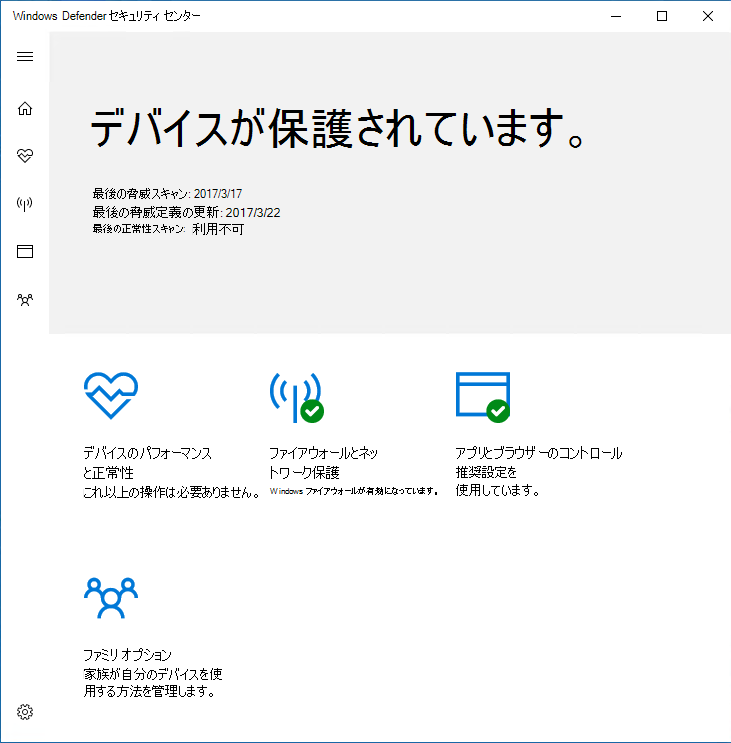
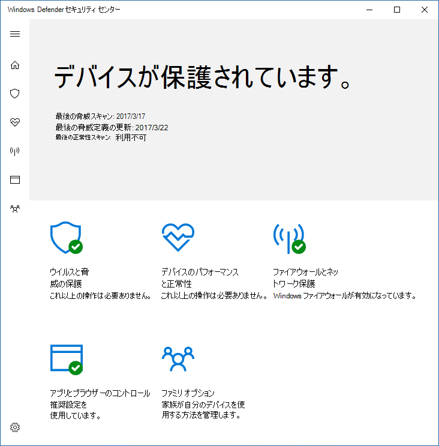
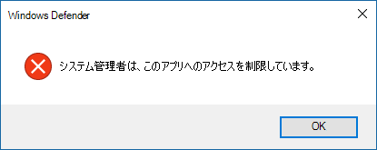

# ユーザーが Microsoft Defender ウイルス対策ユーザー インターフェイスを表示または操作するのを防ぐ

[!INCLUDE [Microsoft 365 Defender rebranding](../../includes/microsoft-defender.md)]

**適用対象:**

- [Microsoft Defender for Endpoint](/microsoft-365/security/defender-endpoint/)

グループ ポリシーを使用すると、エンドポイント上のユーザーに Microsoft Defender ウイルス対策インターフェイスが表示されるのを防ぐことが可能です。 また、スキャンの一時停止を防止することもできます。

## Microsoft Defender ウイルス対策インターフェイスを非表示にする

Windows 10 バージョン 1703 では、インターフェイスを非表示にすると、Microsoft Defender ウイルス対策通知が非表示にされ、Windows セキュリティ アプリにウイルス& 脅威保護タイルが表示されるのを防ぐ。

設定を [有効] に **設定します**。

設定が [無効] または **[** 構成されていない] に設定されている場合:

>[!NOTE]
>インターフェイスを非表示にすることで、Microsoft Defender ウイルス対策の通知がエンドポイントに表示されるのも防ぐことになります。 Microsoft Defender for Endpoint 通知は引き続き表示されます。 エンドポイントに表示 [される通知を個別に構成することもできます](configure-notifications-microsoft-defender-antivirus.md)

以前のバージョンの Windows 10 では、この設定によってクライアント インターフェイスWindows Defender非表示になります。 ユーザーが開くしようとすると、「システム管理者は、このアプリへのアクセスを制限しました」という警告が表示されます。

## グループ ポリシーを使用して Microsoft Defender AV インターフェイスをユーザーから非表示にする

1. グループ ポリシー管理マシンで、グループ ポリシー [管理](/previous-versions/windows/desktop/gpmc/group-policy-management-console-portal)コンソールを開き、構成するグループ ポリシー オブジェクトを右クリックし、[編集] をクリック **します**。

2. グループ ポリシー管理 **エディターを使用して、[コンピューター** の構成] **に移動します**。

3. [管理 **用テンプレート] をクリックします**。

4. Microsoft Defender Antivirus > **クライアント インターフェイス>ツリーを展開します**。

5. [ヘッドレス UI モードを有効にする] **設定を** ダブルクリックし、オプションを [有効] に **設定します**。 **[OK]** をクリックします。 

ユーザー [が PC の保護を](configure-local-policy-overrides-microsoft-defender-antivirus.md) 変更する方法の詳細については、「ユーザーがポリシー設定をローカルで変更するのを防ぐ」を参照してください。

## ユーザーによるスキャンの一時停止を防止する

ユーザーがスキャンを一時停止するのを防ぐと、スケジュールされたスキャンまたはオンデマンド スキャンがユーザーによって中断されないのに役立ちます。

> [!NOTE]
> この設定は、Windows 10 ではサポートされていません。

### グループ ポリシーを使用して、ユーザーによるスキャンの一時停止を防止する

1. グループ ポリシー管理マシンで、グループ ポリシー [管理](/previous-versions/windows/desktop/gpmc/group-policy-management-console-portal)コンソールを開き、構成するグループ ポリシー オブジェクトを右クリックし、[編集] をクリック **します**。

2. グループ ポリシー管理 **エディターを使用して、[コンピューター** の構成] **に移動します**。

3. [管理 **用テンプレート] をクリックします**。

4. ツリーを Windows コンポーネントの Microsoft Defender ウイルス **対策**  >  **スキャンに展開**  >  **します**。

5. [ユーザーにスキャンの **一時停止を許可する** ] 設定をダブルクリックし、オプションを [無効] に **設定します**。 **[OK]** をクリックします。 

## 関連記事

- [エンドポイントに表示される通知を構成する](configure-notifications-microsoft-defender-antivirus.md)

- [Microsoft Defender ウイルス対策とのエンド ユーザー操作を構成する](configure-end-user-interaction-microsoft-defender-antivirus.md)

- [Windows 10 の Microsoft Defender ウイルス対策](microsoft-defender-antivirus-in-windows-10.md)