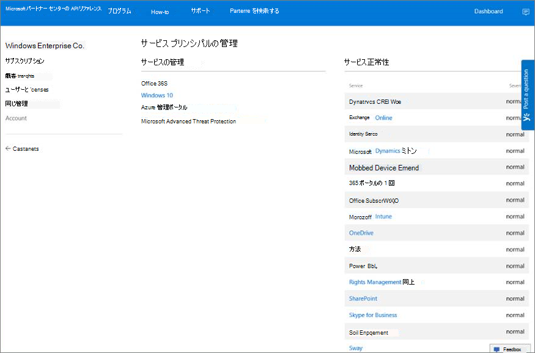
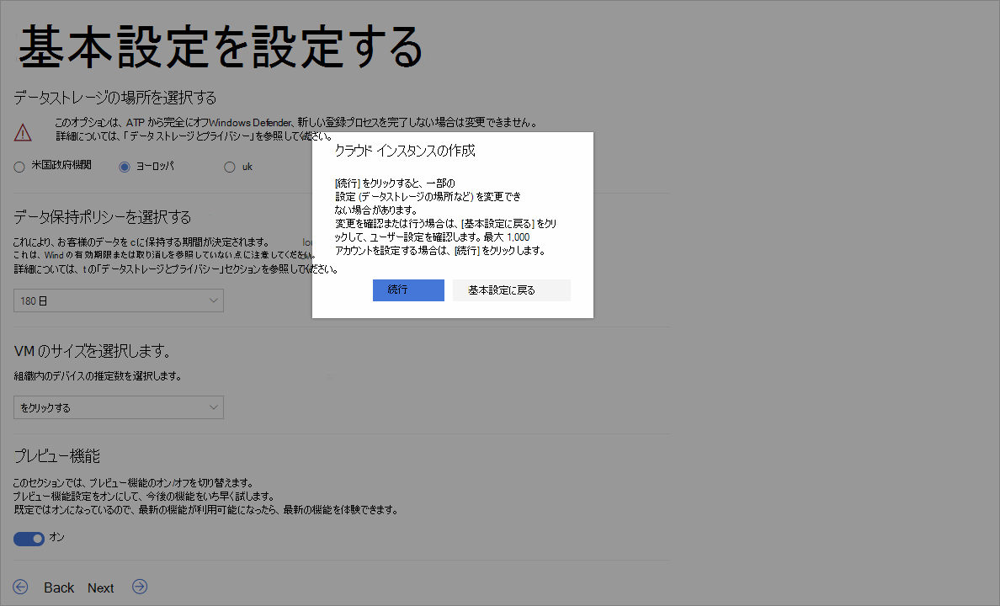

# <a name="set-up-microsoft-defender-for-endpoint-deployment"></a><span data-ttu-id="dcbd2-104">Microsoft Defender for Endpoint の展開をセットアップする</span><span class="sxs-lookup"><span data-stu-id="dcbd2-104">Set up Microsoft Defender for Endpoint deployment</span></span>

[!INCLUDE [Microsoft 365 Defender rebranding](../../includes/microsoft-defender.md)]


<span data-ttu-id="dcbd2-105">**適用対象:**</span><span class="sxs-lookup"><span data-stu-id="dcbd2-105">**Applies to:**</span></span>
- [<span data-ttu-id="dcbd2-106">Microsoft Defender for Endpoint</span><span class="sxs-lookup"><span data-stu-id="dcbd2-106">Microsoft Defender for Endpoint</span></span>](https://go.microsoft.com/fwlink/p/?linkid=2146631)
- [<span data-ttu-id="dcbd2-107">Microsoft 365 Defender</span><span class="sxs-lookup"><span data-stu-id="dcbd2-107">Microsoft 365 Defender</span></span>](https://go.microsoft.com/fwlink/?linkid=2118804)

> <span data-ttu-id="dcbd2-108">Microsoft Defender for Endpoint を体験してみませんか?</span><span class="sxs-lookup"><span data-stu-id="dcbd2-108">Want to experience Microsoft Defender for Endpoint?</span></span> [<span data-ttu-id="dcbd2-109">無料試用版にサインアップします。</span><span class="sxs-lookup"><span data-stu-id="dcbd2-109">Sign up for a free trial.</span></span>](https://www.microsoft.com/microsoft-365/windows/microsoft-defender-atp?ocid=docs-wdatp-exposedapis-abovefoldlink)

<span data-ttu-id="dcbd2-110">Defender for Endpoint の展開は、次の 3 フェーズプロセスです。</span><span class="sxs-lookup"><span data-stu-id="dcbd2-110">Deploying Defender for Endpoint is a three-phase process:</span></span>

| <span data-ttu-id="dcbd2-111">[](prepare-deployment.md)</span><span class="sxs-lookup"><span data-stu-id="dcbd2-111">[](prepare-deployment.md)</span></span><br>[<span data-ttu-id="dcbd2-112">フェーズ 1: 準備</span><span class="sxs-lookup"><span data-stu-id="dcbd2-112">Phase 1: Prepare</span></span>](prepare-deployment.md) | <br><span data-ttu-id="dcbd2-114">フェーズ 2: セットアップ</span><span class="sxs-lookup"><span data-stu-id="dcbd2-114">Phase 2: Setup</span></span> | <span data-ttu-id="dcbd2-115">[](onboarding.md)</span><span class="sxs-lookup"><span data-stu-id="dcbd2-115">[](onboarding.md)</span></span><br>[<span data-ttu-id="dcbd2-116">フェーズ 3: オンボード</span><span class="sxs-lookup"><span data-stu-id="dcbd2-116">Phase 3: Onboard</span></span>](onboarding.md) |
| ----- | ----- | ----- |
| | <span data-ttu-id="dcbd2-117">*お前はここにいる!*</span><span class="sxs-lookup"><span data-stu-id="dcbd2-117">*You are here!*</span></span>||

<span data-ttu-id="dcbd2-118">現在、セットアップ フェーズに入っている。</span><span class="sxs-lookup"><span data-stu-id="dcbd2-118">You are currently in the set-up phase.</span></span>

<span data-ttu-id="dcbd2-119">この展開シナリオでは、次の手順について説明します。</span><span class="sxs-lookup"><span data-stu-id="dcbd2-119">In this deployment scenario, you'll be guided through the steps on:</span></span>
- <span data-ttu-id="dcbd2-120">ライセンスの検証</span><span class="sxs-lookup"><span data-stu-id="dcbd2-120">Licensing validation</span></span>
- <span data-ttu-id="dcbd2-121">テナント構成</span><span class="sxs-lookup"><span data-stu-id="dcbd2-121">Tenant configuration</span></span>
- <span data-ttu-id="dcbd2-122">ネットワーク構成</span><span class="sxs-lookup"><span data-stu-id="dcbd2-122">Network configuration</span></span>


>[!NOTE]
><span data-ttu-id="dcbd2-123">一般的な展開を案内する目的で、このシナリオでは Microsoft Endpoint Configuration Manager の使用のみを説明します。</span><span class="sxs-lookup"><span data-stu-id="dcbd2-123">For the purpose of guiding you through a typical deployment, this scenario will only cover the use of Microsoft Endpoint Configuration Manager.</span></span> <span data-ttu-id="dcbd2-124">Defender for Endpoint は、他のオンボーディング ツールの使用をサポートしていますが、展開ガイドではこれらのシナリオについては説明しません。</span><span class="sxs-lookup"><span data-stu-id="dcbd2-124">Defender for Endpoint supports the use of other onboarding tools but will not cover those scenarios in the deployment guide.</span></span> <span data-ttu-id="dcbd2-125">詳細については、「デバイスを [Microsoft Defender for Endpoint にオンボードする」を参照してください](onboard-configure.md)。</span><span class="sxs-lookup"><span data-stu-id="dcbd2-125">For more information, see [Onboard devices to Microsoft Defender for Endpoint](onboard-configure.md).</span></span>

## <a name="check-license-state"></a><span data-ttu-id="dcbd2-126">ライセンスの状態を確認する</span><span class="sxs-lookup"><span data-stu-id="dcbd2-126">Check license state</span></span>

<span data-ttu-id="dcbd2-127">ライセンスの状態を確認し、適切にプロビジョニングされたかどうかを確認するには、管理センターまたは **Microsoft Azure portal を使用します**。</span><span class="sxs-lookup"><span data-stu-id="dcbd2-127">Checking for the license state and whether it got properly provisioned, can be done through the admin center or through the **Microsoft Azure portal**.</span></span>

1. <span data-ttu-id="dcbd2-128">ライセンスを表示するには **、Microsoft Azure ポータル** に移動し、[Microsoft Azure portal ライセンス] セクション [に移動します](https://portal.azure.com/#blade/Microsoft_AAD_IAM/LicensesMenuBlade/Products)。</span><span class="sxs-lookup"><span data-stu-id="dcbd2-128">To view your licenses, go to the **Microsoft Azure portal** and navigate to the [Microsoft Azure portal license section](https://portal.azure.com/#blade/Microsoft_AAD_IAM/LicensesMenuBlade/Products).</span></span>

   ![[Azure ライセンス] ページのイメージ](images/atp-licensing-azure-portal.png)

1. <span data-ttu-id="dcbd2-130">または、管理センターで [課金サブスクリプション]   >  **に移動します**。</span><span class="sxs-lookup"><span data-stu-id="dcbd2-130">Alternately, in the admin center, navigate to **Billing** > **Subscriptions**.</span></span>

    <span data-ttu-id="dcbd2-131">画面に、すべてのプロビジョニング済みライセンスと現在の状態が表示 **されます**。</span><span class="sxs-lookup"><span data-stu-id="dcbd2-131">On the screen, you will see all the provisioned licenses and their current **Status**.</span></span>

    


## <a name="cloud-service-provider-validation"></a><span data-ttu-id="dcbd2-133">クラウド サービス プロバイダーの検証</span><span class="sxs-lookup"><span data-stu-id="dcbd2-133">Cloud Service Provider validation</span></span>

<span data-ttu-id="dcbd2-134">会社にプロビジョニングされるライセンスにアクセスし、ライセンスの状態を確認するには、管理センターに移動します。</span><span class="sxs-lookup"><span data-stu-id="dcbd2-134">To gain access into which licenses are provisioned to your company, and to check the state of the licenses, go to the admin center.</span></span>

1. <span data-ttu-id="dcbd2-135">パートナー ポータル **で、[サービス** の管理 **] を選択> Office 365.**</span><span class="sxs-lookup"><span data-stu-id="dcbd2-135">From the **Partner portal**, select **Administer services > Office 365**.</span></span>

2. <span data-ttu-id="dcbd2-136">[パートナー ポータル]**リンクをクリック** すると、[代理として管理者] オプションが開き、顧客管理センターにアクセスできます。</span><span class="sxs-lookup"><span data-stu-id="dcbd2-136">Clicking on the **Partner portal** link will open the **Admin on behalf** option and will give you access to the customer admin center.</span></span>

   


## <a name="tenant-configuration"></a><span data-ttu-id="dcbd2-138">テナント構成</span><span class="sxs-lookup"><span data-stu-id="dcbd2-138">Tenant Configuration</span></span>

<span data-ttu-id="dcbd2-139">Microsoft Defender Security Center に初めてアクセスする場合は、最初の手順を説明するウィザードを使用します。</span><span class="sxs-lookup"><span data-stu-id="dcbd2-139">When accessing Microsoft Defender Security Center for the first time, a wizard that will guide you through some initial steps.</span></span> <span data-ttu-id="dcbd2-140">セットアップ ウィザードの最後に、Defender for Endpoint の専用クラウド インスタンスが作成されます。</span><span class="sxs-lookup"><span data-stu-id="dcbd2-140">At the end of the setup wizard, there will be a dedicated cloud instance of Defender for Endpoint created.</span></span> <span data-ttu-id="dcbd2-141">最も簡単な方法は、Windows 10 クライアント デバイスからこれらの手順を実行することです。</span><span class="sxs-lookup"><span data-stu-id="dcbd2-141">The easiest method is to perform these steps from a Windows 10 client device.</span></span>

1. <span data-ttu-id="dcbd2-142">Web ブラウザーからに移動します <https://securitycenter.windows.com> 。</span><span class="sxs-lookup"><span data-stu-id="dcbd2-142">From a web browser, navigate to <https://securitycenter.windows.com>.</span></span>

    

2. <span data-ttu-id="dcbd2-144">試用版ライセンスを使用する場合は、リンク ( ) に移動 <https://signup.microsoft.com/Signup?OfferId=6033e4b5-c320-4008-a936-909c2825d83c&dl=WIN_DEF_ATP&pc=xxxxxxx-xxxxxx-xxx-x> します。</span><span class="sxs-lookup"><span data-stu-id="dcbd2-144">If going through a TRIAL license, go to the link (<https://signup.microsoft.com/Signup?OfferId=6033e4b5-c320-4008-a936-909c2825d83c&dl=WIN_DEF_ATP&pc=xxxxxxx-xxxxxx-xxx-x>)</span></span>

    <span data-ttu-id="dcbd2-145">承認手順が完了すると、[ようこそ] **画面** が表示されます。</span><span class="sxs-lookup"><span data-stu-id="dcbd2-145">Once the authorization step is completed, the **Welcome** screen will be displayed.</span></span>
3. <span data-ttu-id="dcbd2-146">認証手順を実行します。</span><span class="sxs-lookup"><span data-stu-id="dcbd2-146">Go through the authorization steps.</span></span>

    

4. <span data-ttu-id="dcbd2-148">基本設定を設定します。</span><span class="sxs-lookup"><span data-stu-id="dcbd2-148">Set up preferences.</span></span>

   <span data-ttu-id="dcbd2-149">**データストレージの場所** - これを正しく設定することが重要です。</span><span class="sxs-lookup"><span data-stu-id="dcbd2-149">**Data storage location** - It's important to set this up correctly.</span></span> <span data-ttu-id="dcbd2-150">顧客が主にホストする場所 (米国、EU、英国) を決定します。</span><span class="sxs-lookup"><span data-stu-id="dcbd2-150">Determine where the customer wants to be primarily hosted: US, EU, or UK.</span></span> <span data-ttu-id="dcbd2-151">この設定後に場所を変更することはできません。また、Microsoft は指定した位置情報からデータを転送できません。</span><span class="sxs-lookup"><span data-stu-id="dcbd2-151">You cannot change the location after this set up and Microsoft will not transfer the data from the specified geolocation.</span></span> 

    <span data-ttu-id="dcbd2-152">**データ保持** - 既定値は 6 か月です。</span><span class="sxs-lookup"><span data-stu-id="dcbd2-152">**Data retention** - The default is six months.</span></span>

    <span data-ttu-id="dcbd2-153">**プレビュー機能を有効** にする - 既定値はオンで、後で変更できます。</span><span class="sxs-lookup"><span data-stu-id="dcbd2-153">**Enable preview features** - The default is on, can be changed later.</span></span>

    

5. <span data-ttu-id="dcbd2-155">**[次へ]** を選択します。</span><span class="sxs-lookup"><span data-stu-id="dcbd2-155">Select **Next**.</span></span>

     

6. <span data-ttu-id="dcbd2-157">[続行 **] を選択します**。</span><span class="sxs-lookup"><span data-stu-id="dcbd2-157">Select **Continue**.</span></span>


## <a name="network-configuration"></a><span data-ttu-id="dcbd2-158">ネットワーク構成</span><span class="sxs-lookup"><span data-stu-id="dcbd2-158">Network configuration</span></span>
<span data-ttu-id="dcbd2-159">組織がプロキシを使用してインターネットにアクセスするためにエンドポイントを必要としない場合は、このセクションをスキップします。</span><span class="sxs-lookup"><span data-stu-id="dcbd2-159">If the organization does not require the endpoints to use a Proxy to access the Internet, skip this section.</span></span>

<span data-ttu-id="dcbd2-160">Microsoft Defender ATP センサーでは、センサー データをレポートし、Microsoft Defender for Endpoint service サービスと通信するために、Microsoft Windows HTTP (WinHTTP) が必要になります。</span><span class="sxs-lookup"><span data-stu-id="dcbd2-160">The Microsoft Defender for Endpoint sensor requires Microsoft Windows HTTP (WinHTTP) to report sensor data and communicate with the Microsoft Defender for Endpoint service.</span></span> <span data-ttu-id="dcbd2-161">埋め込まれた Microsoft Defender for Endpoint センサーは、LocalSystem アカウントを使用してシステム コンテキストで実行されます。</span><span class="sxs-lookup"><span data-stu-id="dcbd2-161">The embedded Microsoft Defender for Endpoint sensor runs in the system context using the LocalSystem account.</span></span> <span data-ttu-id="dcbd2-162">センサーは Microsoft Windows HTTP サービス (WinHTTP) を使用して、Microsoft Defender for Endpoint クラウド サービスとの通信を有効にします。</span><span class="sxs-lookup"><span data-stu-id="dcbd2-162">The sensor uses Microsoft Windows HTTP Services (WinHTTP) to enable communication with the Microsoft Defender for Endpoint cloud service.</span></span> <span data-ttu-id="dcbd2-163">WinHTTP 構成設定は、Windows インターネット (WinINet) インターネットブラウズ プロキシ設定とは独立しています。次の検出方法を使用してのみプロキシ サーバーを検出できます。</span><span class="sxs-lookup"><span data-stu-id="dcbd2-163">The WinHTTP configuration setting is independent of the Windows Internet (WinINet) internet browsing proxy settings and can only discover a proxy server by using the following discovery methods:</span></span>

<span data-ttu-id="dcbd2-164">**自動検出メソッド:**</span><span class="sxs-lookup"><span data-stu-id="dcbd2-164">**Autodiscovery methods:**</span></span>

-   <span data-ttu-id="dcbd2-165">透過プロキシ</span><span class="sxs-lookup"><span data-stu-id="dcbd2-165">Transparent proxy</span></span>

-   <span data-ttu-id="dcbd2-166">Web プロキシ自動検出プロトコル (WPAD)</span><span class="sxs-lookup"><span data-stu-id="dcbd2-166">Web Proxy Autodiscovery Protocol (WPAD)</span></span>

<span data-ttu-id="dcbd2-167">透過プロキシまたは WPAD がネットワーク トポロジに実装されている場合、特別な構成設定は不要です。</span><span class="sxs-lookup"><span data-stu-id="dcbd2-167">If a Transparent proxy or WPAD has been implemented in the network topology, there is no need for special configuration settings.</span></span> <span data-ttu-id="dcbd2-168">プロキシ内の Microsoft Defender for Endpoint URL 除外の詳細については、このドキュメントの「URL 許可リストまたは Microsoft Docs の付録」セクションを [参照してください](https://docs.microsoft.com/windows/security/threat-protection/windows-defender-atp/configure-proxy-internet-windows-defender-advanced-threat-protection#enable-access-to-windows-defender-atp-service-urls-in-the-proxy-server)。</span><span class="sxs-lookup"><span data-stu-id="dcbd2-168">For more information on Microsoft Defender for Endpoint URL exclusions in the proxy, see the Appendix section in this document for the URLs allow list or on [Microsoft Docs](https://docs.microsoft.com/windows/security/threat-protection/windows-defender-atp/configure-proxy-internet-windows-defender-advanced-threat-protection#enable-access-to-windows-defender-atp-service-urls-in-the-proxy-server).</span></span>

> [!NOTE]
> <span data-ttu-id="dcbd2-169">許可する必要がある URL の詳細な一覧については、この記事を [参照してください](https://docs.microsoft.com/windows/security/threat-protection/microsoft-defender-antivirus/configure-network-connections-microsoft-defender-antivirus)。</span><span class="sxs-lookup"><span data-stu-id="dcbd2-169">For a detailed list of URLs that need to be allowed, please see [this article](https://docs.microsoft.com/windows/security/threat-protection/microsoft-defender-antivirus/configure-network-connections-microsoft-defender-antivirus).</span></span>

<span data-ttu-id="dcbd2-170">**手動の静的プロキシの構成:**</span><span class="sxs-lookup"><span data-stu-id="dcbd2-170">**Manual static proxy configuration:**</span></span>

-   <span data-ttu-id="dcbd2-171">レジストリ ベースの構成</span><span class="sxs-lookup"><span data-stu-id="dcbd2-171">Registry-based configuration</span></span>

-   <span data-ttu-id="dcbd2-172">netsh コマンドを使用して構成された WinHTTP</span><span class="sxs-lookup"><span data-stu-id="dcbd2-172">WinHTTP configured using netsh command</span></span> <br> <span data-ttu-id="dcbd2-173">安定したトポロジのデスクトップにのみ適しています (たとえば、同じプロキシの背後にある企業ネットワーク内のデスクトップ)</span><span class="sxs-lookup"><span data-stu-id="dcbd2-173">Suitable only for desktops in a stable topology (for example: a desktop in a corporate network behind the same proxy)</span></span>

### <a name="configure-the-proxy-server-manually-using-a-registry-based-static-proxy"></a><span data-ttu-id="dcbd2-174">レジストリ ベースの静的プロキシを使用して、プロキシ サーバーを手動で構成します。</span><span class="sxs-lookup"><span data-stu-id="dcbd2-174">Configure the proxy server manually using a registry-based static proxy</span></span>

<span data-ttu-id="dcbd2-175">コンピューターがインターネットへの接続を許可されていない場合、Microsoft Defender for Endpoint センサーだけが診断データを報告し、Microsoft Defender for Endpoint サービスと通信できるレジストリ ベースの静的プロキシを構成します。</span><span class="sxs-lookup"><span data-stu-id="dcbd2-175">Configure a registry-based static proxy to allow only Microsoft Defender for Endpoint sensor to report diagnostic data and communicate with Microsoft Defender for Endpoint services if a computer is not permitted to connect to the Internet.</span></span> <span data-ttu-id="dcbd2-176">静的プロキシは、グループ ポリシー (GP) を使用して構成できます。</span><span class="sxs-lookup"><span data-stu-id="dcbd2-176">The static proxy is configurable through Group Policy (GP).</span></span> <span data-ttu-id="dcbd2-177">グループ ポリシーは次の場所にあります。</span><span class="sxs-lookup"><span data-stu-id="dcbd2-177">The group policy can be found under:</span></span>

 - <span data-ttu-id="dcbd2-178">管理用テンプレート Windows コンポーネント のデータ収集とプレビュー ビルド 接続されたユーザー エクスペリエンスとテレメトリ サービスの認証プロキシの使用 \> \> \> を構成する</span><span class="sxs-lookup"><span data-stu-id="dcbd2-178">Administrative Templates \> Windows Components \> Data Collection and Preview Builds \> Configure Authenticated Proxy usage for the Connected User Experience and Telemetry Service</span></span>
     - <span data-ttu-id="dcbd2-179">[有効] に **設定し、[** 認証された **プロキシの使用を無効にする] を選択します。**</span><span class="sxs-lookup"><span data-stu-id="dcbd2-179">Set it to **Enabled** and select **Disable Authenticated Proxy usage**</span></span>

1. <span data-ttu-id="dcbd2-180">グループ ポリシー管理コンソールを開きます。</span><span class="sxs-lookup"><span data-stu-id="dcbd2-180">Open the Group Policy Management Console.</span></span>
2. <span data-ttu-id="dcbd2-181">組織のプラクティスに基づいてポリシーを作成するか、既存のポリシーを編集します。</span><span class="sxs-lookup"><span data-stu-id="dcbd2-181">Create a policy or edit an existing policy based off the organizational practices.</span></span>
3. <span data-ttu-id="dcbd2-182">グループ ポリシーを編集し、[管理用テンプレート] [Windows コンポーネント データコレクション] および [プレビュー ビルド] [接続されたユーザー エクスペリエンスとテレメトリ サービスの認証プロキシの使用を構成する] **\> \> \> に移動します**。</span><span class="sxs-lookup"><span data-stu-id="dcbd2-182">Edit the Group Policy and navigate to **Administrative Templates \> Windows Components \> Data Collection and Preview Builds \> Configure Authenticated Proxy usage for the Connected User Experience and Telemetry Service**.</span></span> 
    <span data-ttu-id="dcbd2-183"></span><span class="sxs-lookup"><span data-stu-id="dcbd2-183"></span></span>

4. <span data-ttu-id="dcbd2-184">**[有効]** を選択します。</span><span class="sxs-lookup"><span data-stu-id="dcbd2-184">Select **Enabled**.</span></span>
5. <span data-ttu-id="dcbd2-185">[認証 **されたプロキシの使用を無効にする] を選択します**。</span><span class="sxs-lookup"><span data-stu-id="dcbd2-185">Select **Disable Authenticated Proxy usage**.</span></span>
   
6. <span data-ttu-id="dcbd2-186">[管理用テンプレート] [Windows コンポーネント データコレクション] および [プレビュー ビルド] [接続されたユーザー エクスペリエンスと利用統計情報を **\> 構成する] \> \> に移動します**。</span><span class="sxs-lookup"><span data-stu-id="dcbd2-186">Navigate to **Administrative Templates \> Windows Components \> Data Collection and Preview Builds \> Configure connected user experiences and telemetry**.</span></span>
    <span data-ttu-id="dcbd2-187"></span><span class="sxs-lookup"><span data-stu-id="dcbd2-187"></span></span>
7. <span data-ttu-id="dcbd2-188">**[有効]** を選択します。</span><span class="sxs-lookup"><span data-stu-id="dcbd2-188">Select **Enabled**.</span></span>
8. <span data-ttu-id="dcbd2-189">プロキシ サーバー **名を入力します**。</span><span class="sxs-lookup"><span data-stu-id="dcbd2-189">Enter the **Proxy Server Name**.</span></span>

<span data-ttu-id="dcbd2-190">このポリシーは、レジストリ キー `HKLM\Software\Policies\Microsoft\Windows\DataCollection` の下に 2 つのレジストリ値 `TelemetryProxyServer` を REG_SZ として、`DisableEnterpriseAuthProxy` を REG_DWORD として設定します。</span><span class="sxs-lookup"><span data-stu-id="dcbd2-190">The policy sets two registry values `TelemetryProxyServer` as REG_SZ and `DisableEnterpriseAuthProxy` as REG_DWORD under the registry key `HKLM\Software\Policies\Microsoft\Windows\DataCollection`.</span></span>

<span data-ttu-id="dcbd2-191">レジストリ値は、 `TelemetryProxyServer` 次の文字列形式を取ります。</span><span class="sxs-lookup"><span data-stu-id="dcbd2-191">The registry value `TelemetryProxyServer` takes the following string format:</span></span>

```text
<server name or ip>:<port>
```

<span data-ttu-id="dcbd2-192">例: 10.0.0.6:8080</span><span class="sxs-lookup"><span data-stu-id="dcbd2-192">For example: 10.0.0.6:8080</span></span>

<span data-ttu-id="dcbd2-193">レジストリ値 `DisableEnterpriseAuthProxy` を 1に設定する必要があります。</span><span class="sxs-lookup"><span data-stu-id="dcbd2-193">The registry value `DisableEnterpriseAuthProxy` should be set to 1.</span></span>

###  <a name="configure-the-proxy-server-manually-using-netsh-command"></a><span data-ttu-id="dcbd2-194">netsh コマンドを使用してプロキシ サーバーを手動で構成する</span><span class="sxs-lookup"><span data-stu-id="dcbd2-194">Configure the proxy server manually using netsh command</span></span>

<span data-ttu-id="dcbd2-195">netsh を使用して、システム全体の静的プロキシを構成します。</span><span class="sxs-lookup"><span data-stu-id="dcbd2-195">Use netsh to configure a system-wide static proxy.</span></span>

> [!NOTE]
> - <span data-ttu-id="dcbd2-196">これは、既定のプロキシで WinHTTP を使用する Windows サービスを含むすべてのアプリケーションに影響します。</span><span class="sxs-lookup"><span data-stu-id="dcbd2-196">This will affect all applications including Windows services which use WinHTTP with default proxy.</span></span></br>
> - <span data-ttu-id="dcbd2-197">トポロジを変更しているラップトップ (たとえば、オフィスから自宅) は netsh に誤動作します。</span><span class="sxs-lookup"><span data-stu-id="dcbd2-197">Laptops that are changing topology (for example: from office to home) will malfunction with netsh.</span></span> <span data-ttu-id="dcbd2-198">レジストリ ベースの静的プロキシの構成を使用します。</span><span class="sxs-lookup"><span data-stu-id="dcbd2-198">Use the registry-based static proxy configuration.</span></span>

1. <span data-ttu-id="dcbd2-199">管理者特権のコマンド ラインを開きます。</span><span class="sxs-lookup"><span data-stu-id="dcbd2-199">Open an elevated command line:</span></span>

    1. <span data-ttu-id="dcbd2-200">**[スタート]** をクリックし、「**cmd**」と入力します。</span><span class="sxs-lookup"><span data-stu-id="dcbd2-200">Go to **Start** and type **cmd**.</span></span>

    1. <span data-ttu-id="dcbd2-201">**[コマンド プロンプト]** を右クリックして **[管理者として実行]** を選択します。</span><span class="sxs-lookup"><span data-stu-id="dcbd2-201">Right-click **Command prompt** and select **Run as administrator**.</span></span>

2. <span data-ttu-id="dcbd2-202">次のコマンドを入力して、**Enter** キーを押します。</span><span class="sxs-lookup"><span data-stu-id="dcbd2-202">Enter the following command and press **Enter**:</span></span>

   ```PowerShell
   netsh winhttp set proxy <proxy>:<port>
   ```

   <span data-ttu-id="dcbd2-203">例: netsh winhttp set proxy 10.0.0.6:8080</span><span class="sxs-lookup"><span data-stu-id="dcbd2-203">For example: netsh winhttp set proxy 10.0.0.6:8080</span></span>


###  <a name="proxy-configuration-for-down-level-devices"></a><span data-ttu-id="dcbd2-204">ダウンレベル デバイスのプロキシ構成</span><span class="sxs-lookup"><span data-stu-id="dcbd2-204">Proxy Configuration for down-level devices</span></span>

<span data-ttu-id="dcbd2-205">Down-Levelには、Windows 7 SP1 および Windows 8.1 ワークステーション、Windows Server 2008 R2、Windows Server 2012、Windows Server 2012 R2、Windows Server CB 1803 より前の Windows Server 2016 のバージョンが含まれます。</span><span class="sxs-lookup"><span data-stu-id="dcbd2-205">Down-Level devices include Windows 7 SP1 and Windows 8.1 workstations as well as Windows Server 2008 R2, Windows Server 2012, Windows Server 2012 R2, and versions of Windows Server 2016 prior to Windows Server CB 1803.</span></span> <span data-ttu-id="dcbd2-206">これらのオペレーティング システムでは、エンドポイントから Azure への通信を処理するために、Microsoft 管理エージェントの一部としてプロキシが構成されます。</span><span class="sxs-lookup"><span data-stu-id="dcbd2-206">These operating systems will have the proxy configured as part of the Microsoft Management Agent to handle communication from the endpoint to Azure.</span></span> <span data-ttu-id="dcbd2-207">これらのデバイスでのプロキシの構成方法については、「Microsoft Management Agent Fast Deployment Guide」を参照してください。</span><span class="sxs-lookup"><span data-stu-id="dcbd2-207">Refer to the Microsoft Management Agent Fast Deployment Guide for information on how a proxy is configured on these devices.</span></span>

### <a name="proxy-service-urls"></a><span data-ttu-id="dcbd2-208">プロキシ サービスの URL</span><span class="sxs-lookup"><span data-stu-id="dcbd2-208">Proxy Service URLs</span></span>
<span data-ttu-id="dcbd2-209">v20 を含む URL は、Windows 10 バージョン 1803 以降のデバイスがある場合にのみ必要です。</span><span class="sxs-lookup"><span data-stu-id="dcbd2-209">URLs that include v20 in them are only needed if you have Windows 10, version 1803 or later devices.</span></span> <span data-ttu-id="dcbd2-210">たとえば、 ```us-v20.events.data.microsoft.com``` デバイスが Windows 10 バージョン 1803 以降の場合にのみ必要です。</span><span class="sxs-lookup"><span data-stu-id="dcbd2-210">For example, ```us-v20.events.data.microsoft.com``` is only needed if the device is on Windows 10, version 1803 or later.</span></span>
 

<span data-ttu-id="dcbd2-211">プロキシまたはファイアウォールが匿名トラフィックをブロックしている場合、Microsoft Defender for Endpoint センサーがシステム コンテキストから接続している場合は、一覧の URL で匿名トラフィックが許可されている必要があります。</span><span class="sxs-lookup"><span data-stu-id="dcbd2-211">If a proxy or firewall is blocking anonymous traffic, as Microsoft Defender for Endpoint sensor is connecting from system context, make sure anonymous traffic is permitted in the listed URLs.</span></span>

<span data-ttu-id="dcbd2-212">次のダウンロード可能なスプレッドシートには、ネットワークが接続できる必要があるサービスと関連付けられている URL が一覧表示されます。</span><span class="sxs-lookup"><span data-stu-id="dcbd2-212">The following downloadable spreadsheet lists the services and their associated URLs that your network must be able to connect to.</span></span> <span data-ttu-id="dcbd2-213">これらの URL へのアクセスを拒否するファイアウォールまたはネットワーク フィルター ルールが存在しないか、許可ルールを作成する必要がある場合があります。</span><span class="sxs-lookup"><span data-stu-id="dcbd2-213">Ensure that there are no firewall or network filtering rules that would deny access to these URLs, or you may need to create an *allow* rule specifically for them.</span></span>

|<span data-ttu-id="dcbd2-214">**ドメインリストのスプレッドシート**</span><span class="sxs-lookup"><span data-stu-id="dcbd2-214">**Spreadsheet of domains list**</span></span>|<span data-ttu-id="dcbd2-215">**説明**</span><span class="sxs-lookup"><span data-stu-id="dcbd2-215">**Description**</span></span>|
|:-----|:-----|
|<br/>  | <span data-ttu-id="dcbd2-217">サービスの場所、地理的な場所、および OS の特定の DNS レコードのスプレッドシート。</span><span class="sxs-lookup"><span data-stu-id="dcbd2-217">Spreadsheet of specific DNS records for service locations, geographic locations, and OS.</span></span> <br><br>[<span data-ttu-id="dcbd2-218">ここにスプレッドシートをダウンロードします。</span><span class="sxs-lookup"><span data-stu-id="dcbd2-218">Download the spreadsheet here.</span></span>](https://download.microsoft.com/download/8/a/5/8a51eee5-cd02-431c-9d78-a58b7f77c070/mde-urls.xlsx) 


###  <a name="microsoft-defender-for-endpoint-service-backend-ip-range"></a><span data-ttu-id="dcbd2-219">Microsoft Defender for Endpoint Service バックエンド IP 範囲</span><span class="sxs-lookup"><span data-stu-id="dcbd2-219">Microsoft Defender for Endpoint service backend IP range</span></span>

<span data-ttu-id="dcbd2-220">ネットワーク デバイスが前のセクションに記載されている URL をサポートしない場合は、次の情報を使用できます。</span><span class="sxs-lookup"><span data-stu-id="dcbd2-220">If you network devices don't support the URLs listed in the prior section, you can use the following information.</span></span>

<span data-ttu-id="dcbd2-221">Defender for Endpoint は Azure クラウド上に構築され、次の地域に展開されます。</span><span class="sxs-lookup"><span data-stu-id="dcbd2-221">Defender for Endpoint is built on Azure cloud, deployed in the following regions:</span></span>

- \+\<Region Name="uswestcentral">
- \+\<Region Name="useast2">
- \+\<Region Name="useast">
- \+\<Region Name="europenorth">
- \+\<Region Name="europewest">
- \+\<Region Name="uksouth">
- \+\<Region Name="ukwest">

<span data-ttu-id="dcbd2-222">Azure IP 範囲は、Microsoft [Azure データセンター IP 範囲で確認できます](https://www.microsoft.com/en-us/download/details.aspx?id=41653)。</span><span class="sxs-lookup"><span data-stu-id="dcbd2-222">You can find the Azure IP range on [Microsoft Azure Datacenter IP Ranges](https://www.microsoft.com/en-us/download/details.aspx?id=41653).</span></span>

> [!NOTE]
> <span data-ttu-id="dcbd2-223">クラウドベースのソリューションとして、IP アドレス範囲が変更される可能性があります。</span><span class="sxs-lookup"><span data-stu-id="dcbd2-223">As a cloud-based solution, the IP address range can change.</span></span> <span data-ttu-id="dcbd2-224">DNS 解決設定に移動する必要があります。</span><span class="sxs-lookup"><span data-stu-id="dcbd2-224">It's recommended you move to DNS resolving setting.</span></span>

## <a name="next-step"></a><span data-ttu-id="dcbd2-225">次の手順</span><span class="sxs-lookup"><span data-stu-id="dcbd2-225">Next step</span></span>

<span data-ttu-id="dcbd2-226"></span><span class="sxs-lookup"><span data-stu-id="dcbd2-226"></span></span> <br><span data-ttu-id="dcbd2-227">[フェーズ 3: オンボード](onboarding.md): Microsoft Defender for Endpoint サービスがセンサー データを取得できるよう、デバイスをサービスにオンボードします。</span><span class="sxs-lookup"><span data-stu-id="dcbd2-227">[Phase 3: Onboard](onboarding.md): Onboard devices to the service so that the Microsoft Defender for Endpoint service can get sensor data from them.</span></span> 
