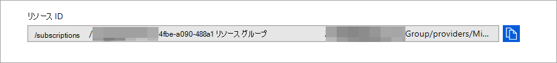

# <a name="configure-microsoft-defender-for-endpoint-to-stream-advanced-hunting-events-to-your-azure-event-hubs"></a>Azure イベント ハブに高度なハンティング イベントをストリーミングするように Microsoft Defender for Endpoint を構成する

[!INCLUDE [Microsoft 365 Defender rebranding](../../includes/microsoft-defender.md)]


**適用対象:**

- [Microsoft Defender for Endpoint](https://go.microsoft.com/fwlink/?linkid=2154037)

> Defender for Endpoint を体験してみませんか? [無料試用版にサインアップしてください。](https://www.microsoft.com/microsoft-365/windows/microsoft-defender-atp?ocid=docs-wdatp-configuresiem-abovefoldlink)

## <a name="before-you-begin"></a>はじめに

1. テナントに [イベント ハブ](/azure/event-hubs/) を作成します。

2. Azure テナントに [ログイン](https://ms.portal.azure.com/)し、[**Subscriptions > サブスクリプション > リソース プロバイダー> **Microsoft.insights**** に登録します。

## <a name="enable-raw-data-streaming"></a>生データ ストリーミングを有効にする

1. * Global **Administrator** _ [または](https://securitycenter.windows.com)_* セキュリティ管理者 **として、Microsoft Defender セキュリティ センターに _ログイン_ します。

2. [データのエクスポート[設定] ページに移動Microsoft Defender セキュリティ センター。](https://securitycenter.windows.com/interoperability/dataexport)

3. [データエクスポート **設定の追加] をクリックします**。

4. 新しい設定の名前を選択します。

5. [ **イベントを Azure イベント ハブに転送する] を選択します**。

6. イベント ハブ **名とイベント** ハブ **リソース ID を入力します**。

   Event Hubs リソース ID を取得するには、Azure の [プロパティ] タブの [[Azure](https://ms.portal.azure.com/) Event **Hubs** 名前空間] ページ>[リソース ID] の下のテキストを \> **コピーします**。

   

7. ストリーミングするイベントを選択し、[保存] を **クリックします**。

## <a name="the-schema-of-the-events-in-azure-event-hubs"></a>Azure Event Hubs のイベントのスキーマ

```text
{
    "records": [
                    {
                        "time": "<The time WDATP received the event>"
                        "tenantId": "<The Id of the tenant that the event belongs to>"
                        "category": "<The Advanced Hunting table name with 'AdvancedHunting-' prefix>"
                        "properties": { <WDATP Advanced Hunting event as Json> }
                    }
                    ...
                ]
}
```

- Azure Event Hubs の各イベント ハブ メッセージには、レコードの一覧が含まれます。

- 各レコードには、イベント名、Microsoft Defender for Endpoint がイベントを受信した時刻、そのイベントが属するテナント (テナントからのみイベントを取得する)、および JSON 形式のイベントが **"properties"** というプロパティで含まれる。

- Microsoft Defender for Endpoint イベントのスキーマの詳細については、「Advanced Hunting [overview」を参照してください](advanced-hunting-overview.md)。

- Advanced Hunting では **、DeviceInfo** テーブルに **MachineGroup** という名前の列が含まれるので、デバイスのグループが含まれる。 ここでは、すべてのイベントもこの列で装飾されます。 詳細については [、「デバイス グループ](machine-groups.md) 」を参照してください。

## <a name="data-types-mapping"></a>データ型マッピング

イベント プロパティのデータ型を取得するには、次の操作を行います。

1. ログイン[して[詳細](https://securitycenter.windows.com)Microsoft Defender セキュリティ センター]ページ[に移動します](https://securitycenter.windows.com/hunting-package)。

2. 次のクエリを実行して、各イベントのデータ型マッピングを取得します。

   ```text
   {EventType}
   | getschema
   | project ColumnName, ColumnType 
   ```

- デバイス情報イベントの例を次に示します。

  

## <a name="related-topics"></a>関連項目

- [高度なハンティングの概要](advanced-hunting-overview.md)
- [エンドポイント ストリーミング API 用 Microsoft Defender](raw-data-export.md)
- [Microsoft Defender for Endpoint イベントを Azure ストレージ アカウントにストリーミングする](raw-data-export-storage.md)
- [Azure Event Hubs のドキュメント](/azure/event-hubs/)
- [接続の問題のトラブルシューティング - Azure Event Hubs](/azure/event-hubs/troubleshooting-guide)
