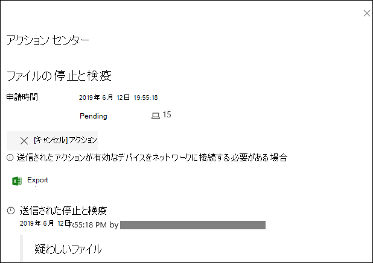
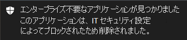

# <a name="take-response-actions-on-a-file"></a>ファイルの対応措置を講じる

[!INCLUDE [Microsoft 365 Defender rebranding](../../includes/microsoft-defender.md)]


**適用対象:**
- [Microsoft Defender for Endpoint](https://go.microsoft.com/fwlink/?linkid=2154037)

[!include[Prerelease information](../../includes/prerelease.md)]

> Defender for Endpoint を試す場合は、 [無料試用版にサインアップしてください。](https://signup.microsoft.com/create-account/signup?products=7f379fee-c4f9-4278-b0a1-e4c8c2fcdf7e&ru=https://aka.ms/MDEp2OpenTrial?ocid=docs-wdatp-responddile-abovefoldlink)

検出された攻撃に迅速に対応するには、ファイルを停止および検出するか、ファイルをブロックします。 ファイルに対してアクションを実行した後、アクション センターでアクティビティの詳細を確認できます。

応答アクションは、ファイルの詳細なプロファイル ページで使用できます。 このページに移動すると、新しい [ファイル] ページを切り替えて、新しいページ レイアウトと古いページ レイアウト **を切り替えることができます**。 この記事の残りの部分では、新しいページ レイアウトについて説明します。

応答アクションは、ファイル ページの上部に沿って実行され、次のものが含まれます。

- ファイルの停止と検疫
- インジケーターの追加
- ファイルをダウンロードする
- 脅威のエキスパートに相談する
- アクション センター

ファイルを詳細分析用に送信して、セキュリティで保護されたクラウド サンドボックスでファイルを実行することもできます。 分析が完了すると、ファイルの動作に関する情報を提供する詳細なレポートが表示されます。 [詳細分析] タブを選択すると、詳細分析用のファイルを送信し、過去のレポート **を読み取** ることもできます。ファイル情報カードの下に位置します。

一部のアクションでは、特定のアクセス許可が必要です。 次の表では、ポータブル実行可能ファイル (PE) および非 PE ファイルに対して特定のアクセス許可が実行できるアクションについて説明します。

<br>

****

|アクセス許可|PE ファイル|PE 以外のファイル|
|---|:---:|:---:|
|データを表示|X|X|
|アラートの調査|&#x2611;|X|
|ライブ応答の基本|X|X|
|ライブ応答の詳細設定|&#x2611;|&#x2611;|
|

役割の詳細については、「役割ベースのアクセス制御の役割の作成と管理 [」を参照してください](user-roles.md)。

## <a name="stop-and-quarantine-files-in-your-network"></a>ネットワーク内のファイルを停止して検疫する

悪意のあるプロセスを停止し、検出されたファイルを quarantining することで、組織内に攻撃を含めできます。

> [!IMPORTANT]
> このアクションは、次の場合にのみ実行できます。
>
> - アクションを実行しているデバイスがバージョン 1703 以降Windows 10を実行している
> - ファイルが信頼できるサード パーティの発行元に属していないか、Microsoft によって署名されていない
> - Microsoft Defender ウイルス対策パッシブ モードで実行している必要があります。 詳細については、「互換性」[をMicrosoft Defender ウイルス対策してください](/windows/security/threat-protection/microsoft-defender-antivirus/microsoft-defender-antivirus-compatibility)。

[ **ファイルの停止と検疫]** アクションには、実行中のプロセスの停止、ファイルの検疫、レジストリ キーなどの永続的なデータの削除が含まれます。

このアクションは、過去 30 日間Windows 10バージョン 1703 以降のデバイスで有効になります。

> [!NOTE]
> いつでも検疫からファイルを復元できます。

### <a name="stop-and-quarantine-files"></a>ファイルの停止と検疫

1. 停止して検疫するファイルを選択します。 次のビューからファイルを選択するか、[検索] ボックスを使用します。

   - **アラート** - アラート ストーリー タイムラインの [説明] または [詳細] から対応するリンクをクリックします。
   - **[検索]** ボックス - **ドロップダウン** メニューから [ファイル] を選択し、ファイル名を入力します。

   > [!NOTE]
   > [ファイルの停止と検疫] アクションは、最大 1000 台のデバイスに制限されます。 より多くのデバイスでファイルを停止するには、「ファイルをブロックまたは許可する [インジケーターを追加する」を参照してください](#add-indicator-to-block-or-allow-a-file)。

2. トップ バーに移動し、[ファイルの停止 **と検疫] を選択します**。

   

3. 理由を指定し、[確認] を **選択します**。

   

   アクション センターには、申請情報が表示されます。

   

   - **申請時間** - アクションが送信された時刻を示します。
   - **成功** - ファイルが停止して検疫されているデバイスの数を示します。
   - **Failed** - アクションが失敗したデバイスの数と、エラーに関する詳細を表示します。
   - **Pending** - ファイルがまだ停止および検疫されていないデバイスの数を示します。 これは、デバイスがオフラインまたはネットワークに接続されていない場合に時間がかかる場合があります。

4. アクションの詳細を表示するには、状態インジケーターを選択します。 たとえば、[失敗] **を選択して** 、アクションが失敗した場所を確認します。

#### <a name="notification-on-device-user"></a>デバイス ユーザーの通知

ファイルがデバイスから削除されると、次の通知が表示されます。



デバイスタイムラインでは、ファイルが停止して検疫されたデバイスごとに新しいイベントが追加されます。

組織全体で広く使用されているファイルに対してアクションが実装される前に警告が表示されます。 操作が意図されているのを検証します。

## <a name="restore-file-from-quarantine"></a>検疫からファイルを復元する

調査後にファイルがクリーンだと判断した場合は、ファイルをロールバックして検疫から削除できます。 ファイルが検疫された各デバイスで次のコマンドを実行します。

1. デバイスで管理者特権のコマンド ライン プロンプトを開きます。

   1. **[スタート]** をクリックし、「_cmd_」と入力します。

   1. **[コマンド プロンプト]** を右クリックして **[管理者として実行]** を選択します。

2. 次のコマンドを入力し、Enter キーを **押します**。

   ```dos
   "%ProgramFiles%\Windows Defender\MpCmdRun.exe" -Restore -Name EUS:Win32/CustomEnterpriseBlock -All
   ```

   > [!NOTE]
   > シナリオによっては **、ThreatName は** EUS:Win32/CustomEnterpriseBlock!cl のように表示される場合があります。
   >
   > Defender for Endpoint は、過去 30 日間にこのデバイスで検疫されたカスタム ブロックされたファイルを復元します。

> [!IMPORTANT]
> 潜在的なネットワーク脅威として検疫されたファイルは、回復できない可能性があります。 検疫後にユーザーがファイルを復元しようとすると、そのファイルにアクセスできない可能性があります。 これは、システムがファイルにアクセスするためのネットワーク資格情報を持たなくなった場合に発生する可能性があります。 通常、これはシステムまたは共有フォルダーに一時的にログオンし、アクセス トークンの有効期限が切れた結果です。

## <a name="download-or-collect-file"></a>ファイルをダウンロードまたは収集する

応答アクション **から [ファイル** のダウンロード] を選択すると、ファイルを含むローカルのパスワードで保護された.zipをダウンロードできます。 ファイルをダウンロードする理由を記録し、パスワードを設定できるフライアウトが表示されます。

既定では、検疫中のファイルをダウンロードできる必要があります。


### <a name="download-quarantined-files"></a>検疫済みファイルのダウンロード

ユーザーまたはセキュリティ チームMicrosoft Defender ウイルス対策検疫されたファイルは、サンプル申請の構成に従って準拠[した方法で保存されます](enable-cloud-protection-microsoft-defender-antivirus.md)。 セキュリティ チームは、[ファイルのダウンロード] ボタンを使用してファイルの詳細ページから直接ファイルをダウンロードできます。 **このプレビュー機能は既定で 'On' になっています**。

場所は、組織の地域設定 (EU、英国、または米国) によって異なります。 検疫済みファイルは、組織ごとに 1 回のみ収集されます。 サービス信頼ポータルからの Microsoft のデータ保護の詳細については、 を参照してください https://aka.ms/STP 。

この設定を有効にすると、セキュリティ チームが潜在的に悪いファイルを調べ、インシデントを迅速かつリスクの低い方法で調査するのに役立ちます。 ただし、この設定をオフにする必要がある場合は、[エンドポイントの詳細設定] 設定[検疫済みファイルのダウンロード] に移動して設定 \>  \>  \> を調整します。 [高度な機能の詳細](advanced-features.md)

#### <a name="backing-up-quarantined-files"></a>検疫済みファイルのバックアップ

ユーザーは、サンプル申請の構成に応じて、検疫済みファイルをバックアップする前に明示的な同意 [を求めるメッセージが表示される場合があります](enable-cloud-protection-microsoft-defender-antivirus.md#use-group-policy-to-turn-on-cloud-protection)。

この機能は、サンプル申請がオフになっている場合は機能しません。 自動サンプル申請がユーザーからのアクセス許可を要求するために設定されている場合、ユーザーが送信に同意したサンプルだけが収集されます。

> [!IMPORTANT]
> 検疫済みファイルの要件をダウンロードします。
>
> - 組織がアクティブ モードMicrosoft Defender ウイルス対策を使用する
> - ウイルス対策エンジンのバージョンは 1.1.17300.4 以降です。 「 [月次プラットフォームとエンジンのバージョン」を参照してください。](manage-updates-baselines-microsoft-defender-antivirus.md#monthly-platform-and-engine-versions)
> - クラウドベースの保護が有効になっています。 「 [クラウドによる保護を有効にする」を参照してください。](enable-cloud-protection-microsoft-defender-antivirus.md)
> - サンプル提出が有効になっている
> - デバイスのWindows 10バージョン 1703 以降、または Windows サーバー 2016 または 2019、または Windows Server 2022

### <a name="collect-files"></a>ファイルの収集

ファイルが Microsoft Defender for Endpoint によってまだ保存されていない場合は、ダウンロードできません。 代わりに、同じ場所に **[ファイル** の収集] ボタンが表示されます。 過去 30 日間に組織でファイルが表示されていない場合、ファイルの収集 **は** 無効になります。
> [!Important]
> 潜在的なネットワーク脅威として検疫されたファイルは、回復できない可能性があります。 検疫後にユーザーがファイルを復元しようとすると、そのファイルにアクセスできない可能性があります。 これは、システムがファイルにアクセスするためのネットワーク資格情報を持たなくなった場合に発生する可能性があります。 通常、これはシステムまたは共有フォルダーに一時的にログオンし、アクセス トークンの有効期限が切れた結果です。

## <a name="add-indicator-to-block-or-allow-a-file"></a>ファイルをブロックまたは許可するインジケーターを追加する

悪意のある可能性のあるファイルやマルウェアの疑いを禁止することで、組織での攻撃の伝播をさらに防ぐ。 悪意のある可能性のあるポータブル実行可能ファイル (PE) ファイルが分かっている場合は、そのファイルをブロックできます。 この操作によって、組織内のデバイスで読み取り、書き込み、または実行されるのを防ぐ。

> [!IMPORTANT]
>
> - この機能は、組織でクラウド配信Microsoft Defender ウイルス対策が有効になっている場合に使用できます。 詳細については、「クラウド配信保護 [の管理」を参照してください](/windows/security/threat-protection/microsoft-defender-antivirus/deploy-manage-report-microsoft-defender-antivirus)。
>
> - マルウェア対策クライアントのバージョンは、4.18.1901.x 以降である必要があります。
> - この機能は、疑わしいマルウェア (または悪意のある可能性のあるファイル) が Web からダウンロードされるのを防ぐために設計されています。 現在、ポータブル実行可能ファイル (PE) ファイルがサポートされています 。このファイルには、.exe _ファイル.dll__があります。_ 対象範囲は時間の長い期間延長されます。
> - この応答アクションは、バージョン 1703 以降Windows 10デバイスで使用できます。
> - 許可またはブロックアクションの前にファイルの分類がデバイスのキャッシュに存在する場合、許可またはブロック関数をファイルに対して実行することはできません。

> [!NOTE]
> このアクションを実行するには、PE ファイルがデバイスのタイムラインに含まれる必要があります。
>
> アクションが実行され、実際のファイルがブロックされる時間の間に、数分間の待機時間が発生する可能性があります。

### <a name="enable-the-block-file-feature"></a>ブロック ファイル機能を有効にする

ファイルのブロックを開始するには、最初に[](advanced-features.md)ブロックまたは許可機能を有効にする必要設定。

### <a name="allow-or-block-file"></a>ファイルを許可またはブロックする

ファイルのインジケーター ハッシュを追加すると、組織内のデバイスがファイルの実行を試みるたびに、アラートを発生してファイルをブロックできます。

インジケーターによって自動的にブロックされたファイルは、ファイルのアクション センターには表示されませんが、アラートはアラート キューに表示されます。

ファイルの [ブロックとアラートの](manage-indicators.md) 発生の詳細については、「インジケーターの管理」を参照してください。

ファイルのブロックを停止するには、インジケーターを削除します。 これを行うには、ファイルの **プロファイル ページの** [インジケーターの編集] アクションを使用します。 このアクションは、インジケーターを追加する前に、[インジケーターの追加] アクションと同じ位置に表示されます。

[ルールインジケーター] の **[設定ページから** インジケーター **を編集** \> **することもできます**。 インジケーターは、ファイルのハッシュによってこの領域に一覧表示されます。

## <a name="consult-a-threat-expert"></a>脅威のエキスパートに相談する

潜在的に侵害されたデバイス、または既に侵害されているデバイスに関する詳細な分析情報については、Microsoft の脅威の専門家に問い合してください。 Microsoft 脅威エキスパート、迅速かつ正確な対応のために、Microsoft 365 Defenderポータル内から直接取り組む必要があります。 専門家は、侵害される可能性のあるデバイスに関する分析情報を提供し、複雑な脅威や標的型攻撃通知を理解するのに役立ちます。 また、ポータル ダッシュボードに表示されるアラートや脅威インテリジェンス コンテキストに関する情報を提供することもできます。

詳細 [については、「Microsoft Threat Expert」を](/microsoft-365/security/defender-endpoint/configure-microsoft-threat-experts#consult-a-microsoft-threat-expert-about-suspicious-cybersecurity-activities-in-your-organization) 参照してください。

## <a name="check-activity-details-in-action-center"></a>アクション センターでアクティビティの詳細を確認する

アクション **センターは、** デバイスまたはファイルで実行されたアクションに関する情報を提供します。 次の詳細を表示できます。

- 調査パッケージ コレクション
- ウイルス対策スキャン
- アプリの制限
- デバイスの分離

送信日時、ユーザーの送信、アクションが成功または失敗した場合など、他のすべての関連する詳細も表示されます。


## <a name="deep-analysis"></a>詳細分析

通常、サイバーセキュリティの調査はアラートによってトリガーされます。 アラートは、多くの場合、新しいファイルまたは不明な 1 つ以上の監視ファイルに関連しています。 ファイルを選択すると、ファイル ビューにアクセスして、ファイルのメタデータを確認できます。 ファイルに関連するデータを強化するには、ファイルを送信して詳細な分析を行います。

ディープ分析機能は、セキュリティで保護された完全にインストルメント化されたクラウド環境でファイルを実行します。 詳細な分析結果は、ファイルのアクティビティ、観察された動作、およびドロップされたファイル、レジストリの変更、および AP との通信など、関連する成果物を示します。
現在、詳細な分析では、ポータブル実行可能ファイル (PE) ファイル (ファイルの _.exe、.dll__サポートしています_。

ファイルの詳細な分析には数分かかります。 ファイル分析が完了すると、[詳細分析] タブが更新され、利用可能な最新の結果の概要と日時が表示されます。

詳細な分析の概要には、観察された動作の一覧が含まれます。その一部は悪意のあるアクティビティを示し、監視可能な情報 (接続された IPs やディスク上に作成されたファイルを含む) を示します。 何も見つからなかった場合、これらのセクションには簡単なメッセージが表示されます。

詳細な分析の結果は脅威インテリジェンスと一致し、一致すると適切なアラートが生成されます。

ディープ分析機能を使用して、通常、アラートの調査中、または悪意のある動作が疑われるその他の理由で、ファイルの詳細を調査します。 この機能は、ファイルのプロファイル **ページ** の [詳細分析] タブで使用できます。

> [!VIDEO https://www.microsoft.com/videoplayer/embed/RE4aAYy?rel=0]

**詳細分析用** の送信は、Defender for Endpoint バックエンド サンプル コレクションでファイルが使用できる場合、またはディープ分析への送信をサポートする Windows 10 デバイスでファイルが観察された場合に有効になります。

> [!NOTE]
> 自動的に収集できるのはWindows 10のファイルのみです。

ファイルが Windows 10 デバイスで観察されなかった場合は[、Microsoft セキュリティ](https://www.microsoft.com/security/portal/submission/submit.aspx)センター ポータルからサンプルを送信し、[詳細な分析]ボタンが使用可能になるのを待ちます。

> [!NOTE]
> Microsoft Security Center Portal のバックエンド処理フローにより、Defender for Endpoint のディープ分析機能のファイル送信と可用性の間に最大 10 分の待機時間が発生する可能性があります。

### <a name="submit-files-for-deep-analysis"></a>詳細分析用にファイルを送信する

1. 詳細分析のために提出するファイルを選択します。 次のビューからファイルを選択または検索できます。

    - **アラート**- アラート ストーリー タイムラインの [説明]**または [****詳細]** からファイル リンクを選択します。
    - **[デバイス]** リスト - [組織のデバイス] セクションの **[説明** ] または **[詳細** ] **からファイル リンクを選択** します。
    - **[検索]** ボックス - **ドロップダウン** メニューから [ファイル] を選択し、ファイル名を入力します。

2. ファイル ビューの **[深い分析** ] タブで、[送信] を **選択します**。

   ![PE ファイルは、[ファイルの詳細] セクションでのみ送信できます。](images/submit-file.png)

   > [!NOTE]
   > PE ファイルのみをサポートします。このファイルには、.exeファイル _.dll_ があります。

   進行状況バーが表示され、分析の異なるステージに関する情報が提供されます。 分析が完了したら、レポートを表示できます。

> [!NOTE]
> デバイスの可用性に応じて、サンプルの収集時間は異なる場合があります。 サンプル コレクションには 3 時間のタイムアウトがあります。 コレクションは失敗し、その時点でデバイスレポートにオンライン のWindows 10操作が中止されます。 詳細な分析のためにファイルを再送信して、ファイルに新しいデータを取得できます。

### <a name="view-deep-analysis-reports"></a>詳細な分析レポートの表示

提供された詳細分析レポートを表示して、提出したファイルに関する詳細な分析情報を表示します。 この機能は、ファイル ビュー コンテキストで使用できます。

次のセクションの詳細を示す包括的なレポートを表示できます。

- Behaviors
- オブザーブル

提供される詳細は、潜在的な攻撃の兆候がある場合の調査に役立ちます。

1. 詳細分析のために提出したファイルを選択します。
2. [詳細分析 **] タブを選択** します。以前のレポートがある場合は、レポートの概要がこのタブに表示されます。

    

#### <a name="troubleshoot-deep-analysis"></a>詳細な分析のトラブルシューティング

ファイルを送信しようとするときに問題が発生した場合は、次のトラブルシューティングの各手順を試してください。

1. 問題のファイルが PE ファイルである必要があります。 PE ファイルには、 _通常_ 、.exeまたは _.dll_ (実行可能プログラムまたはアプリケーション) があります。

2. サービスがファイルへのアクセス権を持ち、ファイルがまだ存在し、破損または変更されていないか確認します。

3. しばらく待って、もう一度ファイルを送信してみてください。 キューが満たされている可能性があります。または一時的な接続または通信エラーが発生しました。

4. サンプル コレクション ポリシーが構成されていない場合、既定の動作はサンプル コレクションを許可します。 構成されている場合は、ファイルを再度送信する前に、ポリシー設定でサンプル コレクションが許可されていることを確認します。 サンプル コレクションが構成されている場合は、次のレジストリ値を確認します。

    ```text
    Path: HKLM\SOFTWARE\Policies\Microsoft\Windows Advanced Threat Protection
    Name: AllowSampleCollection
    Type: DWORD
    Hexadecimal value :
      Value = 0 - block sample collection
      Value = 1 - allow sample collection
    ```

5. グループ ポリシーを使用して組織単位を変更します。 詳細については、「グループ ポリシーで [構成する」を参照してください](configure-endpoints-gp.md)。

6. これらの手順で問題が解決しない場合は、 [次の](mailto:winatp@microsoft.com)winatp@microsoft.com。

## <a name="related-topics"></a>関連トピック

- [デバイスの対応措置を講じる](respond-machine-alerts.md)
- [ファイルの調査](investigate-files.md)
- [Microsoft Defender for Endpoint Plan 1 の手動応答アクション (プレビュー)](defender-endpoint-plan-1.md#manual-response-actions)
