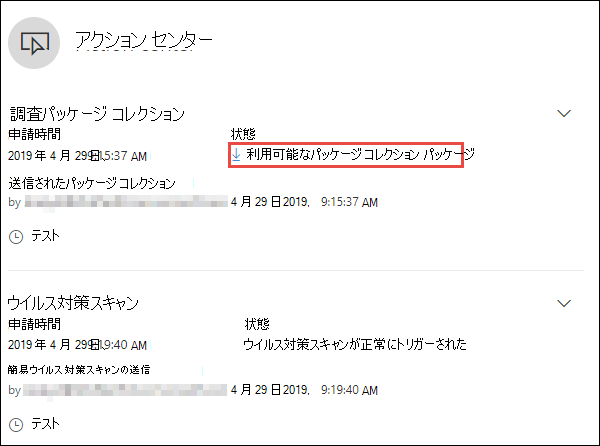

# デバイスの対応措置を講じる

[!INCLUDE [Microsoft 365 Defender rebranding](../../includes/microsoft-defender.md)]

**適用対象:**
- [Microsoft Defender for Endpoint](https://go.microsoft.com/fwlink/?linkid=2154037)

>エンドポイントのディフェンダーを体験したいですか? [無料試用版にサインアップしてください。](https://www.microsoft.com/microsoft-365/windows/microsoft-defender-atp?ocid=docs-wdatp-respondmachine-abovefoldlink) 

デバイスを分離したり、調査パッケージを収集したりして、検出された攻撃にすばやく対応します。 デバイスに対するアクションを実行した後、アクション センターでアクティビティの詳細を確認できます。

応答アクションは、特定のデバイス ページの上部に沿って実行され、次の項目が含まれます。

- タグの管理
- 自動調査の開始
- ライブ応答セッションの開始
- 調査パッケージの収集
- ウイルス対策スキャンを実行する
- アプリの実行を制限する
- デバイスを分離する
- 脅威のエキスパートに相談する
- アクション センター

[ のイメージ](images/response-actions.png#lightbox)

 デバイス ページは、次のいずれかのビューから見つけることができます。

- **セキュリティ操作ダッシュボード** - [リスクのあるデバイス] カードからデバイス名を選択します。
- **アラート キュー** - アラート キューからデバイス アイコンの横にあるデバイス名を選択します。
- **[デバイス] リスト** - デバイスの一覧からデバイス名の見出しを選択します。
- **検索ボックス** - ドロップダウンメニューからデバイスを選択し、デバイス名を入力します。

>[!IMPORTANT]
> - これらの応答アクションは、バージョン 1703 以降のWindows 10デバイスでのみ使用できます。 
> - 非Windowsプラットフォームの場合、応答機能 (デバイスの分離など) は、サード パーティの機能に依存します。

## タグの管理

論理グループ所属を作成するタグを追加または管理します。 デバイス タグはネットワークの適切なマッピングをサポートするため、コンテキストをキャプチャするためにさまざまなタグをアタッチし、インシデントの一部として動的なリスト作成を有効にできます。

デバイスタグの詳細については、「デバイス タグの [作成と管理](machine-tags.md)」を参照してください。

## 自動調査の開始

必要に応じて、デバイス上で新しい汎用自動調査を開始できます。 調査の実行中、デバイスから生成されたその他のアラートは、その調査が完了するまで、進行中の自動調査に追加されます。 また、他のデバイスで同じ脅威が見られる場合は、それらのデバイスが調査に追加されます。

自動調査の詳細については、 [自動調査の概要を](automated-investigations.md)参照してください。

## ライブ応答セッションの開始

ライブ応答は、リモートシェル接続を使用してデバイスに瞬時にアクセスできる機能です。 これにより、詳細な調査作業を行い、迅速に特定された脅威(リアルタイム)を封じ込める迅速な対応アクションを実行できます。

ライブレスポンスは、フォレンジックデータの収集、スクリプトの実行、分析のための不審なエンティティの送信、脅威の修復、新たな脅威の積極的な検索を可能にすることで、調査を強化するように設計されています。

ライブ応答の詳細については、「ライブ応答 [を使用してデバイス上のエンティティを調査する](live-response.md)」を参照してください。

## デバイスから調査パッケージを収集する

調査または応答プロセスの一部として、デバイスから調査パッケージを収集できます。 調査パッケージを収集することにより、デバイスの現在の状態を特定し、攻撃者が使用するツールと手法をさらに理解できます。

パッケージ (Zip ファイル) をダウンロードして、デバイスで発生したイベントを調査するには

1. デバイス ページの上部にある応答アクションの行から [ **調査パッケージの収集** ] を選択します。
2. この操作を実行する理由をテキスト ボックスに指定します。 **[確認]** を選択します。
3. zip ファイルがダウンロードされます

別の方法:

1. デバイス ページの [応答アクション] セクションから [アクション **センター** ] を選択します。

    

3. アクション センターのフライアウトで、[ **パッケージ コレクション パッケージ]** を選択して zip ファイルをダウンロードします。
  
    

パッケージには、次のフォルダーが含まれています。

| Folder | 説明 |
|:---|:---------|
|自動実行 | デバイス上での攻撃者の持続性を識別するために、既知の自動開始エントリ ポイント (ASEP) のレジストリの内容を表すファイルのセットが含まれています。    
<b>注:</b> レジストリ キーが見つからない場合、ファイルには次のメッセージが含まれています: "ERROR: 指定されたレジストリ キーまたは値が見つかりませんでした。
                                                                                                                                |
|インストールされているプログラム | この.CSVファイルには、デバイスに現在インストールされている内容を識別するのに役立つインストール済みプログラムの一覧が含まれています。 詳細については [、「Win32_Product クラス](https://go.microsoft.com/fwlink/?linkid=841509)」を参照してください。                                                                                  |
|ネットワーク接続 | このフォルダには、不審な URL への接続、攻撃者のコマンドと制御 (C&C) インフラストラクチャ、横移動、リモート接続の識別に役立つ接続情報に関連する一連のデータ ポイントが含まれています。   - ActiveNetConnections.txt - プロトコルの統計情報と現在の TCP/IP ネットワーク接続を表示します。 プロセスによって作成された疑わしい接続を検索する機能を提供します。    - Arp.txt – すべてのインターフェイスの現在のアドレス解決プロトコル (ARP) キャッシュ テーブルを表示します。    ARP キャッシュは、ネットワーク上の、内部攻撃の実行に使用された可能性のある、侵害されたシステムや疑わしいシステムをネットワーク上で追加のホストを明らかにすることができます。   - DnsCache.txt - DNS クライアント リゾルバ キャッシュの内容を表示します。 これは、疑わしい接続を識別するのに役立ちます。    - IpConfig.txt – すべてのアダプタの完全な TCP/IP 構成を表示します。 アダプターは、インストールされているネットワーク アダプターなどの物理インターフェイス、またはダイヤルアップ接続などの論理インターフェイスを表すことができます。    - FirewallExecutionLog.txtとpファイアウォール.log                                                                                  |
| ファイルのプリフェッチ| Windowsプリフェッチ ファイルは、アプリケーションの起動プロセスを高速化するように設計されています。 このファイルを使用して、システムで最近使用されたすべてのファイルを追跡し、削除された可能性があるが、プリフェッチ・ファイル・リストにまだ見つかったアプリケーションのトレースを検出できます。    - プリフェッチ フォルダ - からプリフェッチ ファイルのコピーが格納されます `%SystemRoot%\Prefetch` 。 注: プリフェッチ ファイル を表示するには、プリフェッチ ファイル ビューアをダウンロードすることをお勧めします。    - PrefetchFilesList.txt – プリフェッチ フォルダへのコピーエラーが発生したかどうかを追跡するために使用できる、コピーされたすべてのファイルの一覧が含まれます。                                                                                                      |
| プロセス| 実行中のプロセスを一覧表示する.CSVファイルが含まれています。 これは、疑わしいプロセスとその状態を識別する場合に役立ちます。                                                                                                                                                                                                       |
| スケジュールされたタスク| スケジュールされたタスクを一覧表示する.CSVファイルが含まれており、選択したデバイスで自動的に実行されるルーチンを識別して、自動的に実行されるように設定された疑わしいコードを探すことができます。                                                                                                                                                                                                      |
| セキュリティ イベント ログ| ログインまたはログアウトのアクティビティのレコード、またはシステムの監査ポリシーで指定されたその他のセキュリティ関連イベントを含むセキュリティ イベント ログが含まれています。   
<b>注:</b> イベント ビューアを使用してイベント ログ ファイルを開きます。
                                                                                    |
| サービス| サービスとその状態を一覧表示する.CSV ファイルが保存されています。                                                                                      |
| Windowsサーバー メッセージ ブロック (SMB) セッション | ネットワーク上のノード間のファイル、プリンタ、シリアル ポートへの共有アクセス、および各種通信を一覧表示します。 これは、データの流出や横の動きを識別するのに役立ちます。    SMBInboundセッションと SMB アウトバウンドセッションのファイルが含まれています。    
<b>注:</b> セッションが存在しない場合 (受信または送信)、SMB セッションが見つからないことを示すテキスト ファイルが表示されます。
                                                                                                                          |
| システム情報| OS のバージョンやネットワーク カードなどのシステム情報を一覧表示するSystemInformation.txtファイルが保存されています。                                                                                     |
| 一時ディレクトリ| システム内のすべてのユーザーの %Temp% にあるファイルを一覧表示するテキスト ファイルのセットが含まれています。    これにより、攻撃者がシステムにドロップした疑わしいファイルを追跡できます。    
<b>注:</b> ファイルに次のメッセージが含まれている場合:"指定されたパスが見つかりません" というメッセージは、このユーザーの一時ディレクトリが存在せず、ユーザーがシステムにログインしなかったことが原因である可能性があります。
                                                                                                                                         |
| ユーザーとグループ| グループとそのメンバーを表すファイルの一覧を提供します。                                                                                                                   |
|サポートログ| MpCmdRunLog.txtとMPSupportFiles.cabを提供します。     
<b>注:</b>このフォルダは、2020 年 2 月の更新プログラム ロールアップまたはそれ以降のインストールで、Windows 10バージョン 1709 以降でのみ作成されます。  Win10 1709 (RS3) ビルド 16299.1717 : [KB4537816](https://support.microsoft.com/en-us/help/4537816/windows-10-update-kb4537816)   Win10 1803 (RS4) ビルド 17134.1345 : [KB4537795](https://support.microsoft.com/en-us/help/4537795/windows-10-update-kb4537795)   Win10 1809 (RS5) ビルド 17763.1075 : [KB4537818](https://support.microsoft.com/en-us/help/4537818/windows-10-update-kb4537818)   Win10 1903/1909 (19h1/19h2) ビルド 18362.693 および 18363.693 : [KB4535996](https://support.microsoft.com/en-us/help/4535996/windows-10-update-kb4535996) 
                                                                                                                    |
| CollectionSummaryReport.xls| このファイルは、調査パッケージの収集の要約であり、データ・ポイントのリスト、データの抽出に使用されるコマンド、実行状況、および障害発生時のエラー・コードが含まれています。 このレポートを使用して、パッケージに必要なすべてのデータが含まれているかどうかを追跡し、エラーがあったかどうかを確認できます。 |

## デバイスMicrosoft Defender ウイルス対策スキャンを実行する

調査または対応プロセスの一環として、ウイルス対策スキャンをリモートで開始して、侵害されたデバイスに存在する可能性のあるマルウェアを特定して修復することができます。

>[!IMPORTANT]
>- このアクションは、Windows 10バージョン 1709 以降のデバイスで使用できます。
>- Microsoft Defender ウイルス対策 (Microsoft Defender AV) スキャンは、Microsoft Defender AV がアクティブなウイルス対策ソリューションであるかどうかに関係なく、他のウイルス対策ソリューションと一緒に実行できます。 マイクロソフトディフェンダーAVは、パッシブモードにすることができます. 詳細については、「[互換性Microsoft Defender ウイルス対策](https://docs.microsoft.com/windows/security/threat-protection/microsoft-defender-antivirus/microsoft-defender-antivirus-compatibility.md)」を参照してください。

[ **ウイルス対策スキャンの実行**] を選択し、実行するスキャンの種類 (クイックまたはフル) を選択し、スキャンを確認する前にコメントを追加します。

アクション センターにはスキャン情報が表示され、デバイスのタイムラインには、スキャン アクションがデバイスに送信されたことを反映した新しいイベントが含まれます。 マイクロソフトのディフェンダー AV アラートは、スキャン中に表面化した検出を反映します。

>[!NOTE]
>エンドポイントの応答アクションの Defender を使用してスキャンをトリガーする場合、Microsoft Defender ウイルス対策 'ScanAvgCPULoadFactor' 値は引き続き適用され、スキャンによる CPU の影響が制限されます。  ScanAvgCPULoadFactor が設定されていない場合、デフォルト値はスキャン中の CPU 負荷の上限の 50% です。 
>詳細については、「 [高度なスキャンの種類を構成する - マイクロソフトディフェンダー- ウイルス対策](https://docs.microsoft.com/windows/security/threat-protection/microsoft-defender-antivirus/configure-advanced-scan-types-microsoft-defender-antivirus)」を参照してください。

## アプリの実行を制限する

悪意のあるプロセスを阻止して攻撃を阻止するだけでなく、デバイスをロックダウンして、悪意のある可能性のあるプログラムの後続の実行を防ぐこともできます。

>[!IMPORTANT]
> - このアクションは、Windows 10バージョン 1709 以降のデバイスで使用できます。
> - この機能は、組織でMicrosoft Defender ウイルス対策を使用している場合に使用できます。
> - このアクションは、アプリケーション制御コード整合性ポリシーの形式と署名要件Windows Defender満たす必要があります。 詳細については、「 [コード整合性ポリシーの形式と署名](https://docs.microsoft.com/windows/device-security/device-guard/requirements-and-deployment-planning-guidelines-for-device-guard#code-integrity-policy-formats-and-signing)」を参照してください。

アプリケーションの実行を制限するために、Microsoft が発行した証明書によって署名されたファイルのみを実行できるコード整合性ポリシーが適用されます。 この制限方法は、攻撃者が侵害されたデバイスを制御し、さらに悪意のある操作を実行するのを防ぐのに役立ちます。

>[!NOTE]
>アプリケーションの実行制限をいつでも元に戻すことができます。 デバイス ページのボタンが [ **アプリの制限を削除]** と表示され、アプリの実行を制限する手順と同じ手順を実行します。

[デバイス] ページで [ **アプリの実行を制限** する] を選択したら、コメントを入力して **[確認**] を選択します。 アクション センターにスキャン情報が表示され、デバイスのタイムラインに新しいイベントが含まれます。

**デバイスユーザーの通知**: 
アプリが制限されている場合、アプリの実行が制限されていることをユーザーに通知する次の通知が表示されます。

## ネットワークからデバイスを分離する

攻撃の重大度とデバイスの機密性によっては、デバイスをネットワークから分離する必要がある場合があります。 この操作は、攻撃者が侵害されたデバイスを制御し、データの流出や横移動などの追加の操作を実行するのを防ぐのに役立ちます。

>[!IMPORTANT]
>- 完全分離は、バージョン 1703 のWindows 10デバイスで使用できます。
>- バージョン 1709 以降のWindows 10デバイスでは、選択的分離を使用できます。
>- デバイスを分離する場合、特定のプロセスと宛先のみが許可されます。 したがって、完全な VPN トンネルの背後にあるデバイスは、デバイスが分離された後、エンドポイント の Microsoft Defender クラウド サービスに到達できません。 エンドポイントとクラウド ベースの保護関連のトラフィックをMicrosoft Defender ウイルス対策 Microsoft Defender の分割トンネリング VPN を使用することをお勧めします。

このデバイス分離機能は、デバイスの監視を継続する Defender for Endpoint サービスへの接続を維持しながら、侵害されたデバイスをネットワークから切断します。

Windows 10バージョン 1709 以降では、ネットワーク分離レベルを制御できます。 また、Outlook接続、Microsoft Teams接続、およびSkype for Business接続を有効にすることもできます (別名'選択的分離')。

>[!NOTE]
>いつでもデバイスをネットワークに再接続できます。 デバイス ページのボタンが [ **分離から解放]** と表示され、デバイスを分離する手順と同じ手順を実行します。

デバイス ページで **[デバイスの分離]** を選択したら、コメントを入力して **[確認**] を選択します。 アクション センターにスキャン情報が表示され、デバイスのタイムラインに新しいイベントが含まれます。

>[!NOTE]
>デバイスは、ネットワークから分離されている場合でも、Endpoint サービスの Defender に接続されたままになります。 OutlookとSkype for Business通信を有効にすることを選択した場合は、デバイスが分離されている間にユーザーと通信できるようになります。

**デバイスユーザーの通知**: 
デバイスが分離されている場合、デバイスがネットワークから分離されていることをユーザーに通知する次の通知が表示されます。

## 脅威のエキスパートに相談する

侵害された可能性があるデバイスや既に侵害されているデバイスに関する詳細な情報については、Microsoft の脅威の専門家に問い合わせることができます。 Microsoft 脅威エキスパートは、タイムリーかつ正確な応答のためにMicrosoft Defender セキュリティ センター内から直接関与することができます。 専門家は、侵害された可能性のあるデバイスだけでなく、複雑な脅威、ユーザーが受け取る標的型攻撃通知、アラートに関する詳細情報、またはポータル ダッシュボードに表示される脅威インテリジェンス コンテキストについて、より深い理解を深めるために、洞察を提供します。

詳細については、「 [マイクロソフト脅威エキスパートに相談](https://docs.microsoft.com/microsoft-365/security/defender-endpoint/configure-microsoft-threat-experts#consult-a-microsoft-threat-expert-about-suspicious-cybersecurity-activities-in-your-organization) する」を参照してください。

## アクション センターでアクティビティの詳細を確認する

**アクション センター** は、デバイスまたはファイルで実行されたアクションに関する情報を提供します。 次の詳細を表示できます。

- 調査パッケージの収集
- ウイルス対策スキャン
- アプリの制限
- デバイスの分離

その他の関連する詳細も、送信日時、ユーザーの送信、アクションの成功または失敗などの情報も表示されます。

## 関連トピック
- [ファイルの対応措置を講じる](respond-file-alerts.md)
- [レポートの不正確さ](https://docs.microsoft.com/microsoft-365/security/defender-endpoint/tvm-security-recommendation#report-inaccuracy)
