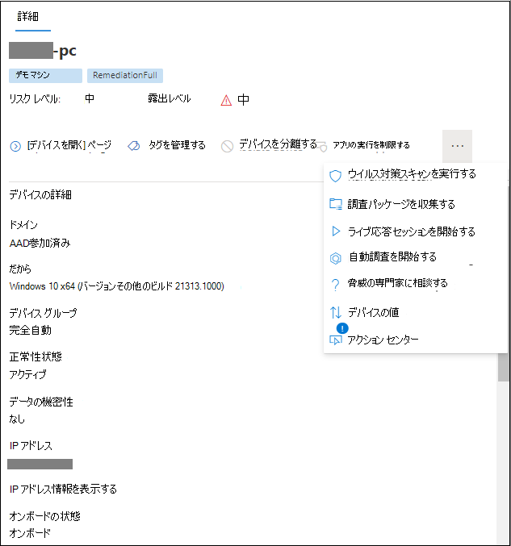

# Microsoft Defender for Endpoint のアラートを確認する

[!INCLUDE [Microsoft 365 Defender rebranding](../../includes/microsoft-defender.md)]

**適用対象:**
- [Microsoft Defender for Endpoint](https://go.microsoft.com/fwlink/?linkid=2154037)

> Defender for Endpoint を試す場合は、 [無料試用版にサインアップしてください。](https://signup.microsoft.com/create-account/signup?products=7f379fee-c4f9-4278-b0a1-e4c8c2fcdf7e&ru=https://aka.ms/MDEp2OpenTrial?ocid=docs-wdatp-managealerts-abovefoldlink)

Microsoft Defender for Endpoint のアラート ページは、選択したアラートに関連する攻撃信号とアラートを組み合わせて、詳細なアラート ストーリーを作成することで、アラートに対する完全なコンテキストを提供します。

組織に影響を与えるアラートに対して、迅速にトリアージ、調査、効果的なアクションを実行します。 トリガーされた理由と、1 つの場所からの影響を理解します。 詳細については、この概要をご覧ください。

> [!VIDEO https://www.microsoft.com/videoplayer/embed/RE4yiO5]

## アラートの使用を開始する

Defender for Endpoint でアラートの名前を選択すると、アラート ページに表示されます。 アラート ページでは、すべての情報が選択したアラートのコンテキストで表示されます。 各アラート ページは、次の 4 つのセクションで構成されます。

1. **アラート タイトルには** アラートの名前が表示され、ページで選択した情報に関係なく、現在の調査を開始したアラートを通知します。
2. [**影響を受けるアセット**](#review-affected-assets) には、このアラートの影響を受けるデバイスとユーザーのカードが一覧表示され、詳細とアクションをクリックできます。
3. アラート **ストーリーには、** ツリー ビューによって相互接続されたアラートに関連するエンティティすべてが表示されます。 タイトル内のアラートは、選択したアラートのページに最初に移動するときにフォーカスが入ったアラートです。 アラート ストーリー内のエンティティは展開可能でクリック可能で、アラート ページのコンテキストでアクションを実行することで、追加情報を提供し、応答を迅速に行うことができます。 アラート ストーリーを使用して調査を開始します。 詳細については [、「Microsoft Defender for Endpoint のアラートを調査する」を参照してください](/microsoft-365/security/defender-endpoint/investigate-alerts)。
4. 詳細 **ウィンドウには、** 最初に選択したアラートの詳細が表示され、このアラートに関連する詳細とアクションが表示されます。 アラート ストーリーで影響を受けるアセットまたはエンティティを選択すると、詳細ウィンドウが変更され、選択したオブジェクトのコンテキスト情報とアクションが提供されます。

アラートの検出状態に注意してください。

- [防止] : 不審なアクションが回避されました。 たとえば、ファイルがディスクに書き込まれたり、実行された場合などです。

  

- ブロック: 疑わしい動作が実行され、ブロックされました。 たとえば、プロセスは実行されましたが、その後疑わしい動作が発生したため、プロセスは終了しました。

  

- 検出: 攻撃が検出され、現在もアクティブである可能性があります。

  

その後、アラートの詳細ウィンドウで自動調査の詳細を確認し、既に実行されたアクションを確認し、推奨されるアクションに関するアラートの説明を読み取ります。

アラートが開いた場合に詳細ウィンドウで使用できるその他の情報には、MITRE の手法、ソース、その他のコンテキストの詳細が含まれます。

## 影響を受けるアセットを確認する

影響を受けるアセット セクションでデバイスまたはユーザー カードを選択すると、詳細ウィンドウでデバイスまたはユーザーの詳細に切り替えられます。

- **デバイスの** 場合、詳細ウィンドウには、ドメイン、オペレーティング システム、IP など、デバイス自体に関する情報が表示されます。 アクティブな通知と、そのデバイス上のログオンしているユーザーも利用できます。 デバイスを分離したり、アプリの実行を制限したり、ウイルス対策スキャンを実行したりすることで、すぐにアクションを実行できます。 または、調査パッケージを収集したり、自動調査を開始したり、デバイス ページに移動してデバイスの観点から調査することもできます。

   

- **ユーザーの** 場合、詳細ウィンドウには、ユーザーの SAM 名や SID などの詳細なユーザー情報と、このユーザーが実行するログオンの種類、およびユーザーに関連するアラートとインシデントが表示されます。 [ユーザー ページを *開く]* を選択すると、そのユーザーの視点から調査を続行できます。

   

## 関連トピック

- [インシデント キューの表示と整理](view-incidents-queue.md)
- [インシデントの調査](investigate-incidents.md)
- [インシデントの管理](manage-incidents.md)
