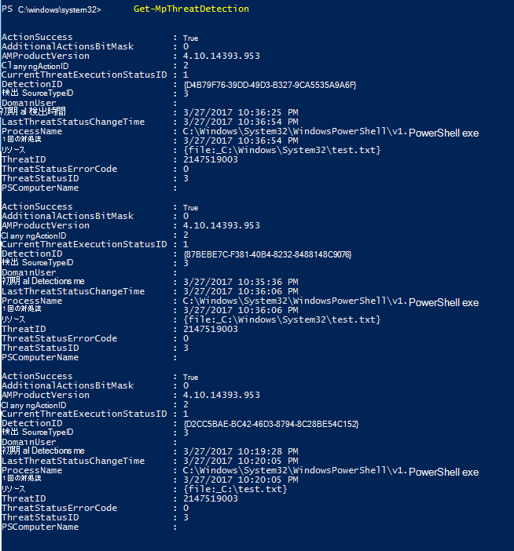
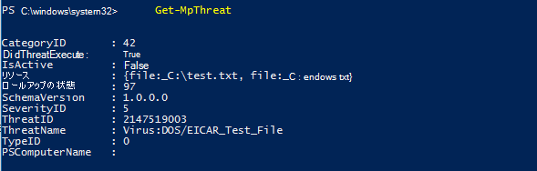

# <a name="review-microsoft-defender-antivirus-scan-results"></a><span data-ttu-id="410e5-104">Microsoft Defender ウイルス対策スキャンの結果を確認する</span><span class="sxs-lookup"><span data-stu-id="410e5-104">Review Microsoft Defender Antivirus scan results</span></span>

[!INCLUDE [Microsoft 365 Defender rebranding](../../includes/microsoft-defender.md)]


<span data-ttu-id="410e5-105">**適用対象:**</span><span class="sxs-lookup"><span data-stu-id="410e5-105">**Applies to:**</span></span>

- [<span data-ttu-id="410e5-106">Microsoft Defender for Endpoint</span><span class="sxs-lookup"><span data-stu-id="410e5-106">Microsoft Defender for Endpoint</span></span>](/microsoft-365/security/defender-endpoint/)

<span data-ttu-id="410e5-107">Microsoft Defender ウイルス対策スキャンが完了すると、オンデマンド スキャン[](run-scan-microsoft-defender-antivirus.md)でもスケジュールスキャンでも[](scheduled-catch-up-scans-microsoft-defender-antivirus.md)、結果が記録され、結果を表示できます。</span><span class="sxs-lookup"><span data-stu-id="410e5-107">After a Microsoft Defender Antivirus scan completes, whether it is an [on-demand](run-scan-microsoft-defender-antivirus.md) or [scheduled scan](scheduled-catch-up-scans-microsoft-defender-antivirus.md), the results are recorded and you can view the results.</span></span> 


## <a name="use-configuration-manager-to-review-scan-results"></a><span data-ttu-id="410e5-108">Configuration Manager を使用してスキャン結果を確認する</span><span class="sxs-lookup"><span data-stu-id="410e5-108">Use Configuration Manager to review scan results</span></span>

<span data-ttu-id="410e5-109">「 [エンドポイント保護の状態を監視する方法」を参照してください](/configmgr/protect/deploy-use/monitor-endpoint-protection)。</span><span class="sxs-lookup"><span data-stu-id="410e5-109">See [How to monitor Endpoint Protection status](/configmgr/protect/deploy-use/monitor-endpoint-protection).</span></span>

## <a name="use-powershell-cmdlets-to-review-scan-results"></a><span data-ttu-id="410e5-110">PowerShell コマンドレットを使用してスキャン結果を確認する</span><span class="sxs-lookup"><span data-stu-id="410e5-110">Use PowerShell cmdlets to review scan results</span></span>

<span data-ttu-id="410e5-111">次のコマンドレットは、エンドポイント上の各検出を返します。</span><span class="sxs-lookup"><span data-stu-id="410e5-111">The following cmdlet will return each detection on the endpoint.</span></span> <span data-ttu-id="410e5-112">同じ脅威の複数の検出がある場合、各検出は、各検出の時間に基づいて個別に一覧表示されます。</span><span class="sxs-lookup"><span data-stu-id="410e5-112">If there are multiple detections of the same threat, each detection will be listed separately, based on the time of each detection:</span></span>

```PowerShell
Get-MpThreatDetection
```



<span data-ttu-id="410e5-114">特定の `-ThreatID` 脅威に対する検出のみを表示する出力を制限する場合に指定できます。</span><span class="sxs-lookup"><span data-stu-id="410e5-114">You can specify `-ThreatID` to limit the output to only show the detections for a specific threat.</span></span>

<span data-ttu-id="410e5-115">脅威検出を一覧表示するが、同じ脅威の検出を 1 つのアイテムに結合する場合は、次のコマンドレットを使用できます。</span><span class="sxs-lookup"><span data-stu-id="410e5-115">If you want to list threat detections, but combine detections of the same threat into a single item, you can use the following cmdlet:</span></span>

```PowerShell
Get-MpThreat
```



<span data-ttu-id="410e5-117">[Microsoft Defender ウイルス対策で PowerShell](use-powershell-cmdlets-microsoft-defender-antivirus.md)を使用する方法の詳細については、「Use PowerShell コマンドレットを使用して Microsoft Defender Antivirus コマンドレットと[Defender](/powershell/module/defender/)コマンドレットを構成および実行する」を参照してください。</span><span class="sxs-lookup"><span data-stu-id="410e5-117">See [Use PowerShell cmdlets to configure and run Microsoft Defender Antivirus](use-powershell-cmdlets-microsoft-defender-antivirus.md) and [Defender cmdlets](/powershell/module/defender/) for more information on how to use PowerShell with Microsoft Defender Antivirus.</span></span>

## <a name="use-windows-management-instruction-wmi-to-review-scan-results"></a><span data-ttu-id="410e5-118">Windows 管理命令 (WMI) を使用してスキャン結果を確認する</span><span class="sxs-lookup"><span data-stu-id="410e5-118">Use Windows Management Instruction (WMI) to review scan results</span></span>

<span data-ttu-id="410e5-119">クラスと [**クラス** の Get **メソッド** MSFT_MpThreat使用MSFT_MpThreatDetection](/previous-versions/windows/desktop/defender/windows-defender-wmiv2-apis-portal)します。</span><span class="sxs-lookup"><span data-stu-id="410e5-119">Use the [**Get** method of the **MSFT_MpThreat** and **MSFT_MpThreatDetection**](/previous-versions/windows/desktop/defender/windows-defender-wmiv2-apis-portal) classes.</span></span>


## <a name="related-articles"></a><span data-ttu-id="410e5-120">関連記事</span><span class="sxs-lookup"><span data-stu-id="410e5-120">Related articles</span></span>

- [<span data-ttu-id="410e5-121">Microsoft Defender ウイルス対策スキャンと修復の結果をカスタマイズ、開始、および確認する</span><span class="sxs-lookup"><span data-stu-id="410e5-121">Customize, initiate, and review the results of Microsoft Defender Antivirus scans and remediation</span></span>](customize-run-review-remediate-scans-microsoft-defender-antivirus.md)
- [<span data-ttu-id="410e5-122">Windows 10 の Microsoft Defender ウイルス対策</span><span class="sxs-lookup"><span data-stu-id="410e5-122">Microsoft Defender Antivirus in Windows 10</span></span>](microsoft-defender-antivirus-in-windows-10.md)