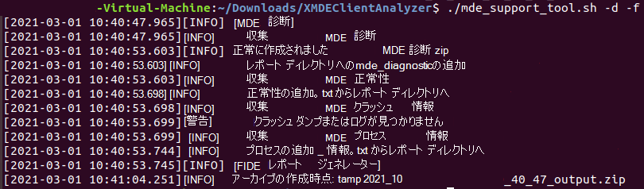

# macOS または Linux でクライアント アナライザーを実行する

**適用対象:**
- [Microsoft Defender for Endpoint](https://go.microsoft.com/fwlink/p/?linkid=2146631)

## GUI シナリオによるアナライザーの実行

1. 調査する [必要がある macOS](https://aka.ms/XMDEClientAnalyzer) または Linux コンピューターに XMDE クライアント アナライザー ツールをダウンロードします。

   > [!NOTE]
   > 上記のリンクからダウンロードされた 'XMDEClientAnalyzer.zip' の現在の SHA256 ハッシュは、'ECD2E7518EDC803E2FC2D9919531A22FD61375BED85A73EF64B74A97C7CBD9E3'です。

2. コンピューター上のXMDEClientAnalyzer.zipを抽出します。

3. ターミナル セッションを開き、ディレクトリを抽出した場所に変更し、次のコマンドを実行します。

   `./mde_support_tool.sh -d`

   > [!NOTE]
   > Linux では、スクリプトに実行するアクセス許可が付与されていない場合は、最初に次のコマンドを実行する必要があります。
   >
   > `chmod a+x mde_support_tool.sh`

## ターミナルまたは SSH シナリオを使用してアナライザーを実行する

ターミナルまたは SSH を関連するコンピューターに開き、次のコマンドを実行します。

1. `wget --quiet -O XMDEClientAnalyzer.zip https://aka.ms/XMDEClientAnalyzer`

2. `unzip -q XMDEClientAnalyzer.zip`

3. `cd XMDEClientAnalyzer`

4. `chmod +x mde_support_tool.sh`

3. ルート以外の使用として実行して、必要なピップと lxml をインストールします。 `./mde_support_tool.sh`

4. 実際の診断パッケージを収集し、結果アーカイブ ファイルを生成するには、ルートとして再度実行します。 `./mde_support_tool.sh -d`

> [!NOTE]
> - Linux の場合、アナライザーは結果出力を生成するために 'lxml' を必要とします。 インストールされていない場合、アナライザーは以下の Python パッケージの公式リポジトリから取得します。 <https://files.pythonhosted.org/packages/\*/lxml\*.whl>
> 
> - また、現在、ツールのインストールには Python バージョン 3 以降が必要です。
>
> - Python 3 を使用できないマシンまたは lxml コンポーネントをフェッチできないコンピューターで実行している場合は、要件を満たしていないバイナリ ベースのバージョンのアナライザー [(XMDE Client Analyzer Binary)](https://aka.ms/XMDEClientAnalyzerBinary)をダウンロードできます。
>
> - デバイスがプロキシの背後にある場合は、プロキシ サーバーを環境変数として mde_support_tool.sh スクリプトに渡す必要があります。 例: `https_proxy=https://myproxy.contoso.com:8080 ./mde_support_tool.sh"`

例:

その他の構文ヘルプ:

**-h** \# ヘルプ 
\# ヘルプ メッセージを表示する

**パフォーマンス** \# パフォーマンス 
\# オンデマンドで再現できるパフォーマンスの問題を分析するために、広範なトレースを収集します。 ベンチマーク `--length=<seconds>` の期間を指定する場合に使用します。

**-o** \# 出力 
\# 結果ファイルの宛先パスを指定する

**-nz** \# No-Zip 
\# 設定すると、結果のアーカイブ ファイルの代わりにディレクトリが作成されます

**-f** \# Force 
\# 出力が宛先パスに既に存在する場合は上書きする

## macOS および Linux の結果パッケージの内容

- report.html

  説明: アナライザー スクリプトがコンピューターで実行できる結果とガイダンスを含むメインの HTML 出力ファイル。

- mde_diagnostic.zip

  説明: いずれかの macOS で *mdatp* 診断作成を実行するときに生成される診断出力 [と同じ](/windows/security/threat-protection/microsoft-defender-atp/mac-resources#collecting-diagnostic-information)

  または

  [ Linux ](/windows/security/threat-protection/microsoft-defender-atp/linux-resources#collect-diagnostic-information)

- mde.xml

  説明: 実行中に生成され、HTML レポート ファイルのビルドに使用される XML 出力。

- Processes_information.txt

  説明: システムで実行中の Microsoft Defender for Endpoint 関連プロセスの詳細が含まれる。

- Log.txt

  説明: データ収集中に画面に書き込まれた同じログ メッセージが含まれます。

- Health.txt

  説明: mdatp health コマンドを実行するときに表示されるのと同じ基本的 *な正常性出力* 。

- Events.xml

  説明: HTML レポートの作成時にアナライザーによって使用される追加の XML ファイル。

- Auditd_info.txt

  説明: Linux OS の監査されたサービスと関連コンポーネント [の](/windows/security/threat-protection/microsoft-defender-atp/linux-support-events) 詳細

- perf_benchmark.tar.gz

  説明: パフォーマンス テストレポート。 これは、performance パラメーターを使用している場合にのみ表示されます。
