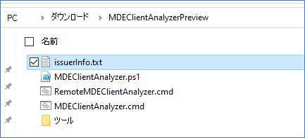
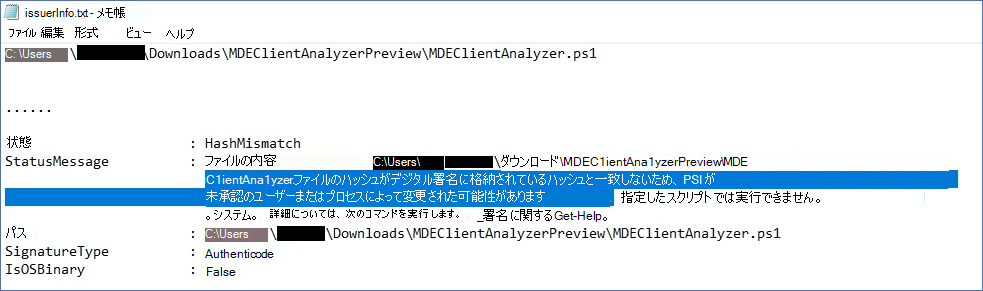

# <a name="run-the-client-analyzer-on-windows"></a>Windows でクライアント アナライザーを実行する

**適用対象:**
- [Microsoft Defender for Endpoint Plan 2](https://go.microsoft.com/fwlink/p/?linkid=2154037)

1. [MDE クライアント アナライザー ツールを、](https://aka.ms/mdatpanalyzer)調査Windowsコンピューターにダウンロードします。

2. コンピューター上のMDEClientAnalyzer.zipを抽出します。

3. 管理者特権でコマンド プロンプトを開きます。
    1. **[スタート]** をクリックし、「**cmd**」と入力します。
    2. **[コマンド プロンプト]** を右クリックして **[管理者として実行]** を選択します。

4. 次のコマンドを入力して、**Enter** キーを押します。

   ```dos
   HardDrivePath\MDEClientAnalyzer.cmd
   ```

   **HardDrivePath を、ツールが抽出されたパスに置き換える例を次に示します。**

   ```dos
   C:\Work\tools\MDEClientAnalyzer\MDEClientAnalyzer.cmd
   ```

上記に加えて、ライブ応答を使用してアナライザー サポート ログ[を収集するオプションも用意されています。](troubleshoot-collect-support-log.md)

> [!NOTE]
> Windows 10/11、Windows Server 2019/2022、または最新の統合ソリューションがインストールされた Windows Server 2012R2/2016[](configure-server-endpoints.md#new-functionality-in-the-modern-unified-solution-for-windows-server-2012-r2-and-2016-preview)では、クライアント アナライザー スクリプトは、クラウド サービス URL への接続テストを実行するために呼び出される実行可能ファイルを呼び出します。 `MDEClientAnalyzer.exe`
>
> Windows 8.1、Windows Server 2016、または Microsoft Monitoring Agent (MMA) をオンボーディングに使用する以前の OS エディションでは、クライアント アナライザー スクリプトは、コマンドとコントロール (CnC) URL の接続テストを実行するために呼び出される実行可能ファイルを呼び出します。 `MDEClientAnalyzerPreviousVersion.exe`Microsoft Monitoring Agentデータ チャネル URL `TestCloudConnection.exe` の接続ツールを使用します。


アナライザーに含まれるすべての PowerShell スクリプトとモジュールは Microsoft 署名済みです。
ファイルが何か変更されている場合、アナライザーは次のエラーで終了する必要があります。


このエラーが表示された場合、issuerInfo.txt出力には、その原因と影響を受けたファイルに関する詳細情報が含まれる。




変更後のMDEClientAnalyzer.ps1例:




## <a name="result-package-contents-on-windows"></a>結果パッケージの内容がWindows

> [!NOTE]
> キャプチャされる正確なファイルは、次のような要因によって変わる場合があります。
>
> - アナライザーが実行されるウィンドウのバージョン。
> - コンピューター上のイベント ログ チャネルの可用性。
> - センサーの開始状態 (EDRまだオンボードされていない場合、センサーは停止します)。
> - アナライザー コマンドで高度なトラブルシューティング パラメーターが使用されている場合。

既定では、開梱されたMDEClientAnalyzerResult.zipには、次の項目が含まれます。

- MDEClientAnalyzer.htm

  これはメインの HTML 出力ファイルであり、コンピューター上でアナライザー スクリプトが実行できる結果とガイダンスが含まれる。

- SystemInfoLogs \[ フォルダー\]
  - AddRemovePrograms.csv

    説明: レジストリから収集された x64 OS ソフトウェアにインストールされている x86 ソフトウェアの一覧。

  - AddRemoveProgramsWOW64.csv

    説明: レジストリから収集された x64 OS ソフトウェアにインストールされている x86 ソフトウェアの一覧。

    - CertValidate.log

      説明: [CertUtil](/windows-server/administration/windows-commands/certutil)を呼び出して実行される証明書失効の詳細な結果です。

    - dsregcmd.txt

      説明: [dsregcmd の実行からの出力](/azure/active-directory/devices/troubleshoot-device-dsregcmd)。 これにより、コンピューターの状態Azure AD詳細が表示されます。

    - IFEO.txt

      説明: コンピューターで [構成されているイメージ ファイル実行オプション](/previous-versions/windows/desktop/xperf/image-file-execution-options) の出力

    - MDEClientAnalyzer.txt

      説明: アナライザー スクリプトの実行の詳細を示す詳細なテキスト ファイルです。

    - MDEClientAnalyzer.xml

      説明: アナライザー スクリプトの結果を含む XML 形式。

    - RegOnboardedInfoCurrent.Json

      説明: レジストリから JSON 形式で収集されたオンボード コンピューター情報。

  - RegOnboardingInfoPolicy.Json

    説明: レジストリから JSON 形式で収集されたオンボーディング ポリシー構成。

    - SCHANNEL.txt

      説明: レジストリから [収集されたコンピューター](/windows-server/security/tls/manage-tls) に適用される SCHANNEL 構成の詳細。

    - SessionManager.txt

      説明: セッション マネージャー固有の設定はレジストリから収集されます。

    - SSL_00010002.txt

      説明: レジストリから [収集された](/windows-server/security/tls/manage-tls) コンピューターに適用される SSL 構成の詳細。

- EventLogs [フォルダー]

  - utc.evtx

    説明: DiagTrack イベント ログのエクスポート

  - senseIR.evtx

    説明: 自動調査イベント ログのエクスポート

  - sense.evtx

    説明: Sensor メイン イベント ログのエクスポート

  - OperationsManager.evtx

    説明: イベント ログMicrosoft Monitoring Agentエクスポートする


## <a name="see-also"></a>関連項目

- [クライアント アナライザーの概要](overview-client-analyzer.md)
- [クライアント アナライザーのダウンロードと実行](download-client-analyzer.md)
- [Windows で高度なトラブルシューティングを行うためのデータ収集](data-collection-analyzer.md)
- [アナライザー HTML レポートの理解](analyzer-report.md)
