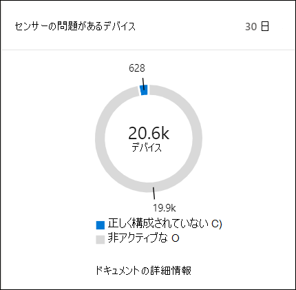

# Microsoft Defender セキュリティ センターセキュリティ操作ダッシュボード

[!INCLUDE [Microsoft 365 Defender rebranding](../../includes/microsoft-defender.md)]

**適用対象:**
- [Microsoft Defender for Endpoint](https://go.microsoft.com/fwlink/?linkid=2154037)

> Microsoft Defender ATP を試してみたいですか? [無料試用版にサインアップしてください。](https://signup.microsoft.com/create-account/signup?products=7f379fee-c4f9-4278-b0a1-e4c8c2fcdf7e&ru=https://aka.ms/MDEp2OpenTrial?ocid=docs-wdatp-secopsdashboard-abovefoldlink)

セキュリティ **操作ダッシュボードでは** 、エンドポイントの検出および応答機能が表示されます。 検出がどこで見られたかの概要と、応答アクションが必要な場所を強調表示します。

ダッシュボードには、次のスナップショットが表示されます。

- アクティブなアラート
- 危険にさらされているデバイス
- センサーの正常性
- サービス正常性
- 毎日のデバイスレポート
- アクティブな自動調査
- 自動調査の統計
- リスクにさらされているユーザー
- 疑わしいアクティビティ

アラートとデバイスを調査して調査し、ネットワーク内で疑わしいアクティビティが発生したかどうかを迅速に判断し、それが表示されたコンテキストを理解するのに役立ちます。

セキュリティ操作 **ダッシュボードには、** デバイス上の重要なイベントや動作を識別するための集約イベントが表示されます。 詳細なイベントと低レベルインジケーターをドリルダウンすることもできます。

また、クリック可能なタイルを使用して、組織の全体的な正常性状態に視覚的な手がかりを与えます。 各タイルは、対応する概要の詳細なビューを開きます。

## アクティブなアラート

ネットワーク内の過去 30 日間のアクティブなアラートの全体数をタイルから表示できます。 アラートは、[新規] と **[進行中] に****グループ化されます**。

各グループは、対応するアラートの重大度レベルにさらにサブ分類されます。 各アラート リング内のアラートの数をクリックすると、そのカテゴリのキュー (**新規** または進行中) の並べ替えビュー **が表示されます**。

詳細については、「アラートの概要 [」を参照してください](alerts-queue.md)。

各行には、アラートの重大度カテゴリと、アラートの簡単な説明が含まれます。 アラートをクリックすると、その詳細なビューが表示されます。 詳細については[、「Microsoft Defender for Endpoint アラートとアラートの概要を調査する」](investigate-alerts.md)[を参照してください](alerts-queue.md)。

## 危険にさらされているデバイス

このタイルには、アクティブなアラートの数が最も多いデバイスの一覧が表示されます。 各デバイスのアラートの総数は、デバイス名の横の円に表示され、さらにタイルの端にある重大度レベル別に分類されます (各重大度バーにカーソルを合わせると、ラベルが表示されます)。

![[危険なデバイス] タイルには、アラートの数が最も多いデバイスの一覧と、アラートの重大度の内訳が表示されます。](images/devices-at-risk-tile.png)

デバイスの名前をクリックすると、そのデバイスの詳細が表示されます。 詳細については、「Microsoft Defender for Endpoint Devices リストのデバイスを [調査する」を参照してください](investigate-machines.md)。

タイルの上部にある **[デバイス一** 覧] をクリックして、[デバイス]リストに直接移動し、アクティブなアラートの数で並べ替えすることもできます。 詳細については、「Microsoft Defender for Endpoint Devices リストのデバイスを [調査する」を参照してください](investigate-machines.md)。

## センサーの問題があるデバイス

[ **センサーの問題があるデバイス]** タイルは、Microsoft Defender for Endpoint サービスにセンサー データを提供する個々のデバイスの機能に関する情報を提供します。 注意が必要なデバイスの数を報告し、問題のあるデバイスを特定するのに役立ちます。

サービスに適切に報告されていないデバイスの数に関する情報を提供する 2 つの状態インジケーターがあります。

- **正しく構成されていない**: これらのデバイスは、部分的にセンサー データを Microsoft Defender for Endpoint サービスに報告している可能性があります。また、修正が必要な構成エラーが発生している可能性があります。
- **非** アクティブ : 過去 1 か月で 7 日間以上 Microsoft Defender for Endpoint サービスへの報告を停止したデバイス。

グループをクリックすると、選択に応じてフィルター処理されたデバイスの一覧が表示されます。 詳細については、「センサーの状態を [確認する」および「デバイスの](check-sensor-status.md) 調査 [」を参照してください](investigate-machines.md)。

## サービス正常性

[ **サービス正常性]** タイルは、サービスがアクティブか、または問題が発生した場合に通知します。

![[サービスの正常性] タイルには、サービスの全体的なインジケーターが表示されます。](images/status-tile.png)

サービス正常性の詳細については [、「Check the Microsoft Defender for Endpoint service health」を参照してください](service-status.md)。

## 毎日のデバイスレポート

[ **日次デバイスのレポート** ] タイルには、過去 30 日間の毎日のデバイスレポートの数を表す棒グラフが表示されます。 グラフ上の個々のバーにカーソルを合わせると、1 日にレポートするデバイスの正確な数が表示されます。

## アクティブな自動調査

[アクティブな自動調査] タイルから、ネットワーク内の過去 30 日間の自動調査の全体数 **を表示** できます。 調査は、保留中のアクション **、** デバイスの待機、および実行中 **に** グループ **化されます**。

## 自動調査の統計

このタイルには、過去 7 日間の自動調査に関連する統計が表示されます。 完了した調査の数、正常に修復された調査の数、調査の開始に要する平均保留中の時間、アラートの修復にかかる平均時間、調査したアラートの数、および一般的な手動調査から保存された自動化の時間数を示します。 

[自動調査]、[修復された調査]、および [調査されたアラート] をクリックして、[調査] ページに移動し、適切なカテゴリでフィルター処理できます。   これにより、状況に合った調査の詳細な内訳を確認できます。

## リスクにさらされているユーザー

タイルには、最もアクティブなアラートを含むユーザー アカウントの一覧と、高、中、低のアラートに表示されるアラートの数が表示されます。 

![[危険度のあるユーザー アカウント] タイルには、アラートの数が最も多いユーザー アカウントの一覧と、アラートの重大度の内訳が表示されます。](images/atp-users-at-risk.png)

ユーザー アカウントをクリックすると、ユーザー アカウントの詳細が表示されます。 詳細については、「ユーザー アカウント [の調査」を参照してください](investigate-user.md)。

> Microsoft Defender ATP を試してみたいですか? [無料試用版にサインアップしてください。](https://signup.microsoft.com/create-account/signup?products=7f379fee-c4f9-4278-b0a1-e4c8c2fcdf7e&ru=https://aka.ms/MDEp2OpenTrial?ocid=docs-wdatp-secopsdashboard-belowfoldlink)

## 関連項目

- [Microsoft Defender for Endpoint ポータルについて](use.md)
- [ポータルの概要](portal-overview.md)
- [[脅威の管理] &のダッシュボードを表示する](tvm-dashboard-insights.md)
- [脅威分析ダッシュボードを表示し、推奨される軽減アクションを実行する](threat-analytics.md)
