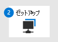

# エンドポイント向け Microsoft Defender への切り替え - フェーズ 3: オンボード

**適用対象:**
- [Microsoft Defender for Endpoint](https://go.microsoft.com/fwlink/p/?linkid=2154037)
- [Microsoft 365 Defender](https://go.microsoft.com/fwlink/?linkid=2118804)

|  [フェーズ 1: 準備](switch-to-microsoft-defender-prepare.md) |  [フェーズ 2: 設定](switch-to-microsoft-defender-setup.md) |  フェーズ 3: オンボード |
|--|--|--|
|| |*お前はここにいる!* |

**エンドポイントの Defender への切り [替えのフェーズ](switch-to-microsoft-defender-migration.md#the-migration-process)3 へようこそ**。 この移行フェーズには、次の手順が含まれます。

1. [デバイスを Defender for Endpoint にオンボードします](#onboard-devices-to-microsoft-defender-for-endpoint)。
2. [検出テストを実行します](#run-a-detection-test)。
3. [エンドポイントでMicrosoft Defender ウイルス対策パッシブ モードに設定されている必要があります](#confirm-that-microsoft-defender-antivirus-is-in-passive-mode-on-your-endpoints)。
4. [ユーザーの更新プログラムを取得Microsoft Defender ウイルス対策。](#get-updates-for-microsoft-defender-antivirus)
5. [Microsoft 以外のソリューションをアンインストールします](#uninstall-your-non-microsoft-solution)。 
6. [Defender for Endpoint が正しく動作するようにします](#make-sure-defender-for-endpoint-is-working-correctly)。

## デバイスを Microsoft Defender for Endpoint にオンボードする

1. ポータル ( ) にMicrosoft 365 Defenderサインイン [https://security.microsoft.com](https://security.microsoft.com) します。

2. **[設定**  >  **オンボーディング]**  >  **を選択します**([デバイス **管理] の下)。** 

3. [オンボード **プロセスを開始するオペレーティング システムの選択] ボックスの一覧で** 、オペレーティング システムを選択します。 

4. [ **展開方法] で**、オプションを選択します。 リンクとプロンプトに従って、組織のデバイスをオンボードします。 サポートが必要な場合 [「Onboarding メソッド (この](#onboarding-methods)記事)」を参照してください。

> [!NOTE]
> オンボーディング中に問題が発生した場合は、「Microsoft Defender for Endpoint オンボーディングの問題のトラブルシューティング [」を参照してください](troubleshoot-onboarding.md)。 この記事では、オンボーディングの問題とエンドポイントの一般的なエラーを解決する方法について説明します。

### オンボーディングメソッド
 
展開方法は、オペレーティング システムと優先する方法によって異なります。 次の表に、Defender for Endpoint へのオンボードに役立つリソースの一覧を示します。

|オペレーティング システム  |メソッド  |
|---------|---------|
| Windows 10     | [グループ ポリシー](configure-endpoints-gp.md) [構成マネージャー](configure-endpoints-sccm.md) [モバイル デバイス管理 (Intune)](configure-endpoints-mdm.md) [ローカル スクリプト](configure-endpoints-script.md)  **注**: ローカル スクリプトは概念実証に適していますが、実稼働環境での展開には使用できません。 実稼働展開の場合は、グループ ポリシー、グループ ポリシー、Microsoft Endpoint Configuration Manager Intune を使用することをお勧めします。         |
| Windows 8.1 Enterprise  Windows 8.1 Pro  Windows 7 SP1 Enterprise  Windows 7 SP1 Pro     | [Microsoft Monitoring Agent](onboard-downlevel.md)  **注**: Microsoft Monitoring Agent Azure Log Analytics エージェントです。 詳細については [、「Log Analytics エージェントの概要」を参照してください](/azure/azure-monitor/platform/log-analytics-agent)。        |
| Windows Server 2019 以降  Windows Server 2019 Core Edition  Windowsサーバー バージョン 1803 以降 | [ローカル スクリプト](configure-endpoints-script.md)  [グループ ポリシー](configure-endpoints-gp.md)  [構成マネージャー](configure-endpoints-sccm.md)  [System Center Configuration Manager](configure-endpoints-sccm.md)  [永続的でないデバイスの VDI オンボーディング スクリプト](configure-endpoints-vdi.md)   **注**: ローカル スクリプトは概念実証に適していますが、実稼働環境での展開には使用できません。 実稼働展開の場合は、グループ ポリシー、グループ ポリシー、Microsoft Endpoint Configuration Manager Intune を使用することをお勧めします。    |
| Windows Server 2016  Windows Server 2012 R2  Windows Server 2008 R2 SP1  | [Microsoft 365 Defender ポータル](configure-server-endpoints.md) [Azure Defender](/azure/security-center/security-center-wdatp) |
| macOS: 11.3.1 (Big Sur);10.15 (Catalina);10.14 (Mojave) | [Windows 以外のデバイスをオンボードする](configure-endpoints-non-windows.md)  |
| iOS | [Windows 以外のデバイスをオンボードする](configure-endpoints-non-windows.md)  |
| Linux: RHEL 7.2+;CentOS Linux 7.2+;Ubuntu 16 LTS 以上の LTS。SLES 12+;Debian 9+;Oracle Linux 7.2 | [Windows 以外のデバイスをオンボードする](configure-endpoints-non-windows.md)  |

## 検出テストを実行する

オンボードデバイスが Defender for Endpoint に正しく接続されていることを確認するには、検出テストを実行できます。

|オペレーティング システム  |ガイダンス  |
|---------|---------|
| Windows 10   Windows Server 2019  Windowsサーバー、バージョン 1803 以降  Windows Server 2016  Windows Server 2012 R2  | 「 [検出テストを実行する」を参照してください](run-detection-test.md)。   Defender for Endpoint デモ シナリオ サイト ( ) にアクセス [https://demo.wd.microsoft.com](https://demo.wd.microsoft.com) し、1 つ以上のシナリオを試してください。 たとえば、クラウド配信の **保護デモ シナリオを** 試してみてください。    |
| macOS: 11.3.1 (Big Sur);10.15 (Catalina);10.14 (Mojave)    | で DIY アプリをダウンロードして使用します [https://aka.ms/mdatpmacosdiy](https://aka.ms/mdatpmacosdiy) 。   詳細については [、「Defender for Endpoint on macOS」を参照してください](microsoft-defender-endpoint-mac.md)。        |
| Linux: RHEL 7.2+;CentOS Linux 7.2+;Ubuntu 16 LTS 以上の LTS。SLES 12+;Debian 9+;Oracle Linux 7.2 | 1. 次のコマンドを実行し、1 の結果 **を探します**。  `mdatp health --field real_time_protection_enabled`.   2. ターミナル ウィンドウを開き、次のコマンドを実行します。  `curl -o ~/Downloads/eicar.com.txt https://www.eicar.org/download/eicar.com.txt`.   3. 次のコマンドを実行して、検出された脅威を一覧表示します。  `mdatp threat list`.   詳細については [、「Defender for Endpoint on Linux」を参照してください](microsoft-defender-endpoint-linux.md)。 |

## エンドポイントでMicrosoft Defender ウイルス対策パッシブ モードの状態を確認する

エンドポイントが Defender for Endpoint にオンボードされたので、次の手順では、パッシブ モードでMicrosoft Defender ウイルス対策確認します。 次の表で説明するように、いくつかの方法のいずれかを使用できます。

| メソッド  | 操作  |
|:-------|:-------|
|コマンド プロンプト     | 1. デバイスで、Windowsを開きます。   2. と `sc query windefend` 入力し、Enter キーを押します。   3. 結果を確認して、Microsoft Defender ウイルス対策モードで実行されている状態を確認します。         |
| PowerShell     | 1. デバイスでWindows管理者としてWindows PowerShell開きます。   2. 次の PowerShell コマンドレットを実行します `Get-MpComputerStatus | select AMRunningMode` 。   結果を確認します。 パッシブ モードが **表示されます**。  |
| Windows セキュリティアプリ | 1. デバイスでWindowsアプリをWindows セキュリティします。  2. [ **ウイルス対策] &を選択します**。 3. [プロバイダー **Who保護しますか?** [プロバイダーの管理 **] を選択します**。  4. [セキュリティ **プロバイダー] ページ** の [ウイルス対策]**の下** に、[セキュリティ プロバイダー **Microsoft Defender ウイルス対策がオンになっている必要があります**。 |
| タスク マネージャー | 1. デバイスWindowsタスク マネージャー アプリを開きます。  2. [詳細] タブ **を選択** します。 3. リストで **MsMpEng.exe** を探します。 |

> [!NOTE]
> 一部の *バージョンWindows Defender ウイルス対策* では、Microsoft Defender ウイルス対策の *代* わりにWindows。
> パッシブ モードとアクティブ モードの詳細については、「パッシブ モードとアクティブ モードの詳細[Microsoft Defender ウイルス対策参照してください](microsoft-defender-antivirus-compatibility.md#more-details-about-microsoft-defender-antivirus-states)。

### サーバー Microsoft Defender ウイルス対策をWindowsパッシブ モードに手動で設定する

Microsoft Defender ウイルス対策 サーバー、Windows 1803 以降、または Windows Server 2019 でパッシブ モードに設定するには、次の手順を実行します。

1. レジストリ エディターを開き、次に移動します。  
   `Computer\HKEY_LOCAL_MACHINE\SOFTWARE\Policies\Microsoft\Windows Advanced Threat Protection`.

2. **ForceDefenderPassiveMode** という DWORD エントリを編集 (または作成) し、次の設定を指定します。
   - DWORD の値を **1 に設定します**。
   - [基本 **] で**、[16 進数] **を選択します**。

> [!NOTE]
> 他のメソッドを使用して、次のようなレジストリ キーを設定できます。
>- [グループ ポリシーの基本設定](/previous-versions/windows/it-pro/windows-server-2012-R2-and-2012/dn581922(v=ws.11))
>- [ローカル グループ ポリシー オブジェクト ツール](/windows/security/threat-protection/security-compliance-toolkit-10#what-is-the-local-group-policy-object-lgpo-tool)
>- [Configuration Manager のパッケージ](/mem/configmgr/apps/deploy-use/packages-and-programs)

### [Microsoft Defender ウイルス対策からWindows Server 2016

ユーザー設定を使用しているWindows Server 2016、手動で開始する必要Microsoft Defender ウイルス対策があります。 このタスクは、デバイスで PowerShell コマンドレットを使用 `mpcmdrun.exe -wdenable` して実行できます。

## ユーザーの更新プログラムを取得Microsoft Defender ウイルス対策

Microsoft Defender ウイルス対策モードで実行されている場合でも、新しいマルウェアや攻撃の手法から保護するために必要な最新のテクノロジと機能をデバイスに提供するには、最新のMicrosoft Defender ウイルス対策を維持する必要があります。 (「互換性[Microsoft Defender ウイルス対策」を参照](microsoft-defender-antivirus-compatibility.md)してください。

更新プログラムには、最新の状態を維持Microsoft Defender ウイルス対策 2 種類があります。

- セキュリティ インテリジェンスの更新プログラム
- 製品の更新

更新プログラムを取得するには、「更新プログラムの管理」のガイダンス[にMicrosoft Defender ウイルス対策ベースラインを適用します](manage-updates-baselines-microsoft-defender-antivirus.md)。

## Microsoft 以外のソリューションをアンインストールする

この時点で、次の情報を使用できます。

- 組織のデバイスを Defender for Endpoint にオンボードし、 
- Microsoft Defender ウイルス対策がインストールされ、有効になっている場合 

次に、Microsoft 以外のウイルス対策、マルウェア対策、エンドポイント保護ソリューションをアンインストールします。 Microsoft 以外のソリューションをアンインストールすると、Microsoft Defender ウイルス対策モードからアクティブ モードに切り替わります。 ほとんどの場合、これは自動的に行われます。

Microsoft 以外のソリューションのアンインストールに関するヘルプを入手するには、テクニカル サポート チームにお問い合わせください。 

## Defender for Endpoint が正しく動作するようにする

Defender for Endpoint にオンボードし、以前の Microsoft 以外のソリューションをアンインストールしたので、次の手順では、Defender for Endpoint が正しく動作することを確認します。 このタスクを実行する優れた方法の 1 つは、Defender for Endpoint デモ シナリオ サイト () にアクセスすることです [https://demo.wd.microsoft.com](https://demo.wd.microsoft.com) 。 少なくとも次を含む、そのページで 1 つ以上のデモ シナリオを試してみてください。

- クラウドによる保護
- 望ましくない可能性のあるアプリケーション (PUA)
- ネットワーク保護 (NP)

## 次の手順

**おめでとう** ございます! Defender for Endpoint への [移行が完了しました](switch-to-microsoft-defender-migration.md#the-migration-process)。 

- [ポータル () のセキュリティ](security-operations-dashboard.md)操作ダッシュボードにMicrosoft 365 Defenderします [https://security.microsoft.com](https://security.microsoft.com) 。 
- [エンドポイントの Defender の管理、移行後](manage-atp-post-migration.md)。
