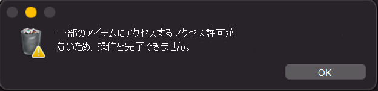

# <a name="protect-macos-security-settings-with-tamper-protection"></a>改ざん防止macOSセキュリティ設定を保護する 

[!INCLUDE [Microsoft 365 Defender rebranding](../../includes/microsoft-defender.md)]

**適用対象:**
- [Microsoft 365 Defender](https://go.microsoft.com/fwlink/?linkid=2118804)

> Defender for Endpoint を試す場合は、 [無料試用版にサインアップしてください。](https://signup.microsoft.com/create-account/signup?products=7f379fee-c4f9-4278-b0a1-e4c8c2fcdf7e&ru=https://aka.ms/MDEp2OpenTrial?ocid=docs-wdatp-rbac-abovefoldlink)

macOSの改ざん防止は、セキュリティ設定に対する不要な変更が承認されていないユーザーによって行われるのを防ぐのに役立ちます。 改ざん防止は、macOSでのMicrosoft Defender for Endpointの不正な削除を防ぐのに役立ちます。 この機能は、重要なセキュリティ ファイル、プロセス、および構成設定が改ざんされるのにも役立ちます。 


改ざん防止は、次のモードで設定できます。 
                    

 トピック | 説明 
:---|:---
無効  | 改ざん防止は完全にオフです (これはインストール後の既定のモードです)  
監査     | 改ざん操作はログに記録されますが、ブロックされません                                   
ブロック     | 改ざん防止が有効になっている、改ざん操作がブロックされる 

改ざん防止が監査モードまたはブロック モードに設定されている場合、次の結果が期待できます。

**監査モード** 
- Defender for Endpoint エージェントをアンインストールするアクションがログに記録されます (監査済み)  
- Defender for Endpoint ファイルの編集/変更がログに記録されます (監査済み) 
- Defender for Endpoint の場所の下での新しいファイルの作成がログに記録されます (監査済み) 
- Defender for Endpoint ファイルの削除がログに記録されます (監査済み) 
- Defender for Endpoint ファイルの名前変更がログに記録されます (監査済み) 
- エージェントを停止するコマンドが失敗する 

**ブロック モード**
- Defender for Endpoint エージェントをアンインストールするアクションがブロックされる  
- Defender for Endpoint ファイルの編集/変更がブロックされる 
- Defender for Endpoint の場所で新しいファイルの作成がブロックされている 
- Defender for Endpoint ファイルの削除がブロックされている 
- Defender for Endpoint ファイルの名前がブロックされている 
- エージェントを停止するコマンドが失敗する 

ブロックされたアクションに応答するシステム メッセージの例を次に示します。 



モード名を強制レベルとして指定することで、改ざん防止モードを構成できます。 


>[!NOTE]
>- モードの変更はすぐに適用されます。 機能フラグを変更したり、Microsoft Defender for Endpointを再起動したりする必要はありません。 
>- 初期構成中に JAMF を使用した場合は、JAMF も使用して構成を更新する必要があります。

## <a name="before-you-begin"></a>はじめに
-   サポートされているmacOS バージョン: Lake (12)、Big Sur (11)、Catalina (10.15 以降) 
-   Defender for Endpoint に必要な最小バージョン: 101.49.25 


**強くお勧めする設定:** 

1. システム整合性保護 (SIP) が有効になっています。 詳細については、「 [システム整合性保護の無効化と有効化」を](https://developer.apple.com/documentation/security/disabling_and_enabling_system_integrity_protection)参照してください。
1. モバイル デバイス管理 (MDM) ツールを使用してMicrosoft Defender for Endpointを構成します。

 

## <a name="configure-tamper-protection-on-macos-devices"></a>macOS デバイスで改ざん防止を構成する


改ざん防止を構成するには、いくつかの方法があります。 

-   [手動構成](#manual-configuration)
-   [JAMF](#jamf) 
-   [Intune](#intune)

 

### <a name="before-you-begin"></a>はじめに

"tamper_protection" が "無効" に設定されていることを確認します。  


### <a name="manual-configuration"></a>手動構成

1. 次のコマンドを使用します。 

    ``` 
    sudo mdatp config tamper-protection enforcement-level --value block
    ```


    


    >[!NOTE]
    > 手動構成を使用して改ざん防止を有効にする場合は、いつでも手動で改ざん防止を無効にすることもできます。 たとえば、システム環境設定で Defender からフル ディスク アクセスを手動で取り消すことができます。 ローカル管理者がこれを行わないようにするには、手動構成の代わりに MDM を使用する必要があります。

2. 結果を確認します。 

    


"tamper_protection" が "ブロック" に設定されていることに注目してください。 

### <a name="jamf"></a>JAMF

次の設定を追加して、Microsoft Defender for Endpoint[構成プロファイル](mac-jamfpro-policies.md)で改ざん防止モードを構成します。


```xml
<?xml version="1.0" encoding="UTF-8"?>
<!DOCTYPE plist PUBLIC "-//Apple//DTD PLIST 1.0//EN" "http://www.apple.com/DTDs/PropertyList-1.0.dtd">
<plist version="1.0">
  <dict>
    <key>tamperProtection</key>
    <dict>
      <key>enforcementLevel</key>
      <string>block</string>
    </dict>
  </dict>
</plist>
```
 

>[!NOTE]
>Microsoft Defender for Endpoint用の構成プロファイルが既にある場合は、設定を *追加* する必要があります。 2 つ目の構成プロファイルを作成する必要はありません。 

 

### <a name="intune"></a>Intune

ドキュメントに記載されているIntune プロファイルの例に従って、Intuneを使用して改ざん防止を構成します。 詳細については、「[macOSのMicrosoft Defender for Endpointの基本設定を設定する](mac-preferences.md)」を参照してください。 

Intune プロファイルに次の構成を追加します。

>[!NOTE]
>Intune構成の場合は、改ざん防止構成を追加する新しいプロファイル構成ファイルを作成するか、既存のプロファイル構成ファイルにこれらのパラメーターを追加できます。

                 
```xml
?xml version="1.0" encoding="utf-8"?>
<!DOCTYPE plist PUBLIC "-//Apple//DTD PLIST 1.0//EN" "http://www.apple.com/DTDs/PropertyList-1.0.dtd">
<plist version="1">
    <dict>
        <key>PayloadUUID</key>
        <string>C4E6A782-0C8D-44AB-A025-EB893987A295</string>
        <key>PayloadType</key>
        <string>Configuration</string>
        <key>PayloadOrganization</key>
        <string>Microsoft</string>
        <key>PayloadIdentifier</key>
        <string>com.microsoft.wdav</string>
        <key>PayloadDisplayName</key>
        <string>Microsoft Defender for Endpoint settings</string>
        <key>PayloadDescription</key>
        <string>Microsoft Defender for Endpoint configuration settings</string>
        <key>PayloadVersion</key>
        <integer>1</integer>
        <key>PayloadEnabled</key>
        <true/>
        <key>PayloadRemovalDisallowed</key>
        <true/>
        <key>PayloadScope</key>
        <string>System</string>
        <key>PayloadContent</key>
        <array>
            <dict>
                <key>PayloadUUID</key>
                <string>99DBC2BC-3B3A-46A2-A413-C8F9BB9A7295</string>
                <key>PayloadType</key>
                <string>com.microsoft.wdav</string>
                <key>PayloadOrganization</key>
                <string>Microsoft</string>
                <key>PayloadIdentifier</key>
                <string>com.microsoft.wdav</string>
                <key>PayloadDisplayName</key>
                <string>Microsoft Defender for Endpoint configuration settings</string>
                <key>PayloadDescription</key>
                <string/>
                <key>PayloadVersion</key>
                <integer>1</integer>
                <key>PayloadEnabled</key>
                <true/>
                <key>tamperProtection</key>
                <dict>
                             <key>enforcementLevel</key>
                             <string>block</string>
                </dict>
            </dict>
        </array>
    </dict>
</plist>
```


次のコマンドを実行して、改ざん防止の状態を確認します。 
 

`mdatp health --field tamper_protection`

 
改ざん防止がオンの場合、結果は "ブロック" と表示されます。 


完全に `mdatp health` 実行し、出力で "tamper_protection" を探すこともできます。 


## <a name="verify-tamper-protection-preventive-capabilities"></a>改ざん防止の予防機能を確認する  
改ざん防止がさまざまな方法で有効になっていることを確認できます。
 

### <a name="verify-block-mode"></a>ブロック モードを確認する

改ざんアラートがMicrosoft 365 Defender ポータルで発生する


 
 
### <a name="verify-block-mode-and-audit-modes"></a>ブロック モードと監査モードを確認する 

-   高度なハンティングを使用すると、改ざんアラートが表示されます  
-   改ざんイベントは、ローカル デバイス ログにあります。 `sudo grep -F '\[{tamperProtection}\]' /Library/Logs/Microsoft/mdatp/microsoft_defender_core.log`


 
### <a name="diy-scenarios"></a>DIY のシナリオ 

- 改ざん防止が "ブロック" に設定されている場合は、さまざまな方法で Defender for Endpoint をアンインストールします。 たとえば、アプリ タイルをごみ箱にドラッグするか、コマンド ラインを使用して改ざん防止をアンインストールします。 
- Defender for Endpoint プロセス (kill) を停止してみてください。 
- 次のように、Defender for Endpoint ファイルの削除、名前変更、変更、移動を試みます (悪意のあるユーザーが行う操作と同様)。 

  - /Applications/Microsoft Defender ATP.app/ 
  - /Library/LaunchDaemons/com.microsoft.fresno.plist 
  - /Library/LaunchDaemons/com.microsoft.fresno.uninstall.plist 
  - /Library/LaunchAgents/com.microsoft.wdav.tray.plist 
  - /Library/Managed Preferences/com.microsoft.wdav.ext.plist 
  - /Library/Managed Preferences/mdatp_managed.json 
  - /Library/Managed Preferences/com.microsoft.wdav.atp.plist 
  - /Library/Managed Preferences/com.microsoft.wdav.atp.offboarding.plist 
  - /usr/local/bin/mdatp 

 
## <a name="turning-off-tamper-protection"></a>改ざん防止を無効にする 

次のいずれかの方法を使用して、改ざん防止を無効にすることができます。  

### <a name="manual-configuration"></a>手動構成

次のコマンドを使用します。

`sudo mdatp config tamper-protection enforcement-level – –value disabled`

 

## <a name="jamf"></a>JAMF
構成プロファイルの `enforcementLevel` 値を "無効" に変更し、コンピューターにプッシュします。


```console
<?xml version="1.0" encoding="UTF-8"?>
<!DOCTYPE plist PUBLIC "-//Apple//DTD PLIST 1.0//EN" "http://www.apple.com/DTDs/PropertyList-1.0.dtd">
<plist version="1.0">
  <dict>
    <key>tamperProtection</key>
    <dict>
      <key>enforcementLevel</key>
      <string>disabled</string>
    </dict>
  </dict>
</plist>

```


### <a name="intune"></a>Intune 
Intune プロファイルに次の構成を追加します。

```
<?xml version="1.0" encoding="utf-8"?>
<!DOCTYPE plist PUBLIC "-//Apple//DTD PLIST 1.0//EN" "http://www.apple.com/DTDs/PropertyList-1.0.dtd">
<plist version="1">
    <dict>
        <key>PayloadUUID</key>
        <string>C4E6A782-0C8D-44AB-A025-EB893987A295</string>
        <key>PayloadType</key>
        <string>Configuration</string>
        <key>PayloadOrganization</key>
        <string>Microsoft</string>
        <key>PayloadIdentifier</key>
        <string>com.microsoft.wdav</string>
        <key>PayloadDisplayName</key>
        <string>Microsoft Defender for Endpoint settings</string>
        <key>PayloadDescription</key>
        <string>Microsoft Defender for Endpoint configuration settings</string>
        <key>PayloadVersion</key>
        <integer>1</integer>
        <key>PayloadEnabled</key>
        <true/>
        <key>PayloadRemovalDisallowed</key>
        <true/>
        <key>PayloadScope</key>
        <string>System</string>
        <key>PayloadContent</key>
        <array>
            <dict>
                <key>PayloadUUID</key>
                <string>99DBC2BC-3B3A-46A2-A413-C8F9BB9A7295</string>
                <key>PayloadType</key>
                <string>com.microsoft.wdav</string>
                <key>PayloadOrganization</key>
                <string>Microsoft</string>
                <key>PayloadIdentifier</key>
                <string>com.microsoft.wdav</string>
                <key>PayloadDisplayName</key>
                <string>Microsoft Defender for Endpoint configuration settings</string>
                <key>PayloadDescription</key>
                <string/>
                <key>PayloadVersion</key>
                <integer>1</integer>
                <key>PayloadEnabled</key>
                <true/>
                <key>tamperProtection</key>
                <dict>
                             <key>enforcementLevel</key>
                             <string>disabled</string>
                </dict>
            </dict>
        </array>
    </dict>
</plist>
```

## <a name="troubleshooting-configuration-issues"></a>構成の問題のトラブルシューティング


### <a name="issue-tamper-protection-is-reported-as-disabled"></a>問題: 改ざん防止が無効として報告される 

コマンド `mdatp health` を実行すると、改ざん防止が無効であることが報告されます。オンボーディングから 1 時間以上が経過した場合でも、次のコマンドを実行して適切な構成があるかどうかを確認できます。 

 
```console
$ sudo grep -F '\[{tamperProtection}\]: Feature state:' /Library/Logs/Microsoftmdatpmicrosoft_defender_core.log \| tail -n 1 

\[85246\]\[2021-12-08 15:45:34.184781 UTC\]\[info\]: \[{tamperProtection}\]: Feature state: enabledmode: "block" 
```
 

モードは "ブロック" (または "監査") である必要があります。 そうでない場合は、コマンドまたはIntuneを使用して`mdatp config`改ざん防止モードを設定していません。 

 

